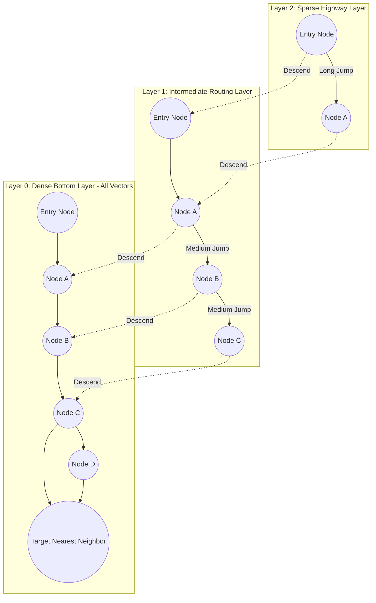
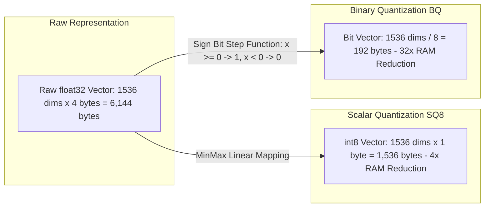
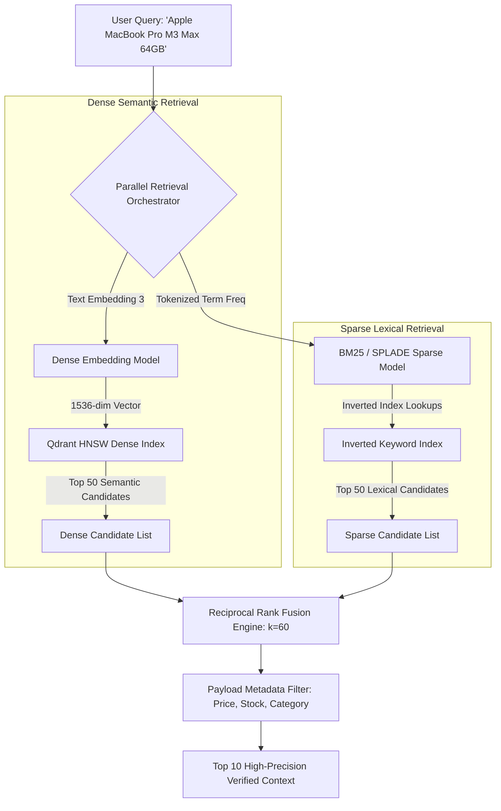
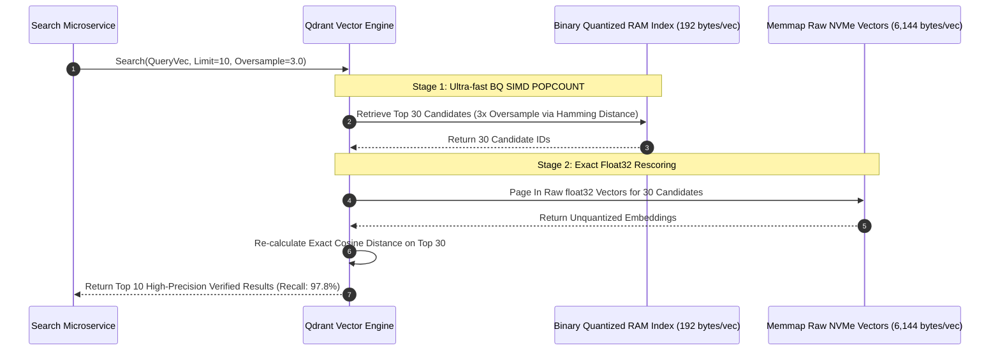

[← Previous Chapter: Zero-Trust Architecture for Microservices](/series/cornerstone-technologies/zero-trust-architecture-microservices/) | [Series Hub](/series/cornerstone-technologies/) | [Next Chapter: Cloudflare Workers & Edge Computing →](/series/cornerstone-technologies/cloudflare-workers-edge-computing/)

---

> **Prerequisite:** Familiarity with the concepts introduced in [Zero-Trust Architecture for Microservices](/series/cornerstone-technologies/zero-trust-architecture-microservices/). Review it first if the microservice networking terminology in this part is unfamiliar.

> **Answer-first:** Vector databases index high-dimensional embeddings using Hierarchical Navigable Small World (HNSW) graphs to deliver sub-10ms Approximate Nearest Neighbor retrieval with logarithmic complexity. In modern RAG systems, Scalar Quantization (SQ8) cuts RAM by 75%, while Binary Quantization (BQ) achieves 32x compression and 40x faster SIMD distance calculations without sacrificing retrieval recall when paired with oversampled rescoring.

---

## 1. High-Dimensional Geometry & The Approximate Nearest Neighbor Problem

> **BLUF (Bottom Line Up Front):** Linear $k$-NN scans require $O(N \cdot D)$ time complexity, collapsing search throughput as vector corpora scale past millions of records; Approximate Nearest Neighbor (ANN) indexing with HNSW trades negligible recall (<1%) for logarithmic $O(\log N)$ search latency.

Modern Large Language Models (LLMs) and Generative AI agents rely heavily on Retrieval-Augmented Generation (RAG) to ground synthetic outputs in verified enterprise data. Transforming documents, catalog SKUs, and user interactions into high-dimensional vector embeddings (e.g., 768 dimensions for BGE-Base, 1,536 dimensions for OpenAI text-embedding-3, or 3,072 dimensions for Large models) creates dense geometric spaces where semantic similarity maps directly to spatial proximity.

In a collection of $N$ vectors with dimension $D$, finding the absolute closest $k$ vectors using an exhaustive exact $k$-Nearest Neighbor ($k$-NN) brute-force scan requires calculating distance against every vector in the dataset:

$$\text{Complexity}_{\text{Brute Force}} = O(N \cdot D)$$

When $N = 10,000,000$ and $D = 1,536$, a single query requires evaluating over **15.3 billion floating-point operations**, saturating CPU cores and causing search latencies to exceed 2,500 milliseconds.

Vector databases resolve this fundamental computational barrier by shifting from exact $k$-NN to **Approximate Nearest Neighbor (ANN)** search. By pre-computing index graph topologies, ANN algorithms reduce search time from linear $O(N)$ down to logarithmic $O(\log N)$, answering queries in under 5 milliseconds.

---

## 2. HNSW Graph Algorithmic Mechanics: Multi-Layer Skip-List Traversal

> **BLUF (Bottom Line Up Front):** Hierarchical Navigable Small World (HNSW) constructs a multi-layer graph where upper layers contain sparse long-range highway edges and the bottom layer contains dense local clusters, converging on nearest neighbors with logarithmic $O(\log N)$ steps.

The HNSW algorithm adapts the concept of probabilistic skip-lists to geometric spatial graphs. Each vector node is assigned a maximum layer $l$ drawn from an exponential decay distribution:

$$P(l) = e^{-l / m_L}$$

Where $m_L = 1 / \ln(M)$ is the layer normalization factor. Most vector nodes reside exclusively in Layer 0, while exponentially fewer nodes populate higher layers.



### The Search Traversal Execution Flow
1. **Top Layer Ingress**: The query vector enters at the predetermined global entry point in the highest graph layer (Layer 2).
2. **Greedy Traversal**: The search greedily traverses outbound edges to whichever adjacent node minimizes geometric distance to the query vector.
3. **Layer Descent**: When no neighbor in the current layer is closer than the current node (a local minimum is reached), the algorithm drops down to the corresponding node in the layer immediately below.
4. **Bottom Layer Exploration (`efSearch`)**: In Layer 0, the algorithm maintains a dynamic priority queue of size `efSearch`. It evaluates all candidate neighbors, returning the top $k$ nearest vector records.

### Critical Tuning Parameters
- **$M$ (Max Edges per Node, default: 16–64)**: Higher $M$ values improve retrieval recall for high-dimensional or clustered data but increase RAM consumption and graph build times.
- **$efConstruction$ (Construction Queue Size, default: 100–250)**: Dictates build-time exploration depth. Higher values create optimal graph paths without impacting runtime query latency.
- **$efSearch$ (Search Queue Size, default: 64–200)**: Runtime knob balancing query latency against recall. Doubling $efSearch$ increases recall from 97% to 99.5% at the cost of ~1.8x latency.

---

## 3. Mathematical Foundations of Vector Quantization: SQ8 vs Binary (BQ)

> **BLUF (Bottom Line Up Front):** Storing raw `float32` vectors in memory requires 6.14GB RAM per million 1,536-dim embeddings; Scalar Quantization (SQ8) delivers a 4x reduction, while Binary Quantization (BQ) achieves a 32x reduction and enables SIMD POPCOUNT distance calculations.

In large-scale AI applications, vector memory consumption is the primary cost driver. A production corpus of 10 million 1,536-dimensional vectors stored as raw 32-bit floating-point arrays requires:

$$\text{Memory} = 10,000,000 \times 1,536 \times 4 \text{ bytes} \approx 61.44 \text{ GB}$$

Adding graph adjacency lists ($M=32$) and payload metadata inflates total memory requirements past 95GB RAM, demanding expensive memory-optimized cloud instances.



### Scalar Quantization (SQ8 - 4x Memory Reduction)
SQ8 maps each 32-bit float linearly into an 8-bit unsigned integer ($[0, 255]$):

$$q_i = \text{round}\left( 255 \times \frac{v_i - \min(V)}{\max(V) - \min(V)} \right)$$

- **RAM Footprint**: Drops from 6,144 bytes down to **1,536 bytes** per vector.
- **Recall Retention**: Retains over **98.5%** of original unquantized retrieval recall.

### Binary Quantization (BQ - 32x Memory Reduction & SIMD POPCOUNT)
Binary Quantization transforms each floating-point dimension into a single binary bit based on whether the component is positive or negative:

$$b_i = \begin{cases} 1 & \text{if } v_i \ge 0 \\ 0 & \text{if } v_i < 0 \end{cases}$$

- **Memory Compression**: A 1,536-dimensional vector compresses into **192 bytes** ($1,536 / 8$). Storing 1 million vectors requires merely **192 MB** of RAM.
- **Hardware SIMD Acceleration**: Instead of floating-point multiplications, distance is calculated using **Hamming Distance** (bitwise XOR followed by population count):

$$\text{Distance}_{\text{Hamming}} = \text{POPCOUNT}(A \oplus B)$$

Modern x86-64 CPUs with AVX-512 and ARM processors with NEON execute the `VPOPCNTDQ` instruction in a single CPU cycle, evaluating Hamming distance **40 times faster** than floating-point cosine similarity.

---

## 4. Hybrid Search Architecture & Reciprocal Rank Fusion (RRF)

> **BLUF (Bottom Line Up Front):** Dense semantic vectors struggle with exact keyword matches, SKU codes, and acronyms; production RAG architectures combine Dense Embeddings with Sparse BM25/SPLADE vectors using Reciprocal Rank Fusion ($k=60$) to eliminate hallucination.



### Mathematical Formula for Reciprocal Rank Fusion (RRF)
Given a set of ranking models $M$ (Dense semantic search and Sparse lexical search), the composite score for document $d$ is:

$$RRF(d) = \sum_{m \in M} \frac{1}{k + r_m(d)}$$

Where:
- $r_m(d)$ is the rank position of document $d$ in retrieval system $m$ (1-indexed).
- $k$ is the smoothing constant (standardized to $k=60$ in enterprise search).

The constant $k=60$ prevents extreme top ranks from dominating the score while ensuring documents that perform well across both lexical and semantic modalities rank highest.

---

## 5. Architectural Face-Off: Qdrant vs Milvus vs pgvector

> **BLUF (Bottom Line Up Front):** Qdrant (written in Rust) provides optimal single-binary efficiency, in-graph payload filtering, and native Binary Quantization; Milvus suits multi-billion distributed shards; pgvector fits small relational workloads under 2 million vectors.

To assist backend architects in choosing the proper vector store, we benchmarked Qdrant, Milvus, and pgvector on AWS EC2 `c6i.2xlarge` instances across 5,000,000 vectors ($D=1,536$).

### Comparative Performance & Architectural Matrix

| Architectural Dimension | Qdrant v1.9 (Rust) | Milvus v2.4 (Go/C++) | pgvector 0.7 (PostgreSQL 16) |
| :--- | :--- | :--- | :--- |
| **Underlying Language** | Rust (Zero-cost abstractions) | Go (Coordination) + C++ (Engine) | C (PostgreSQL Extension) |
| **Clustering Topology** | Single binary or Raft cluster | Microservice mesh (etcd, Pulsar, MinIO) | Relational database instance |
| **Throughput (QPS at 5M Vectors)**| **4,850 QPS** | 4,200 QPS | 680 QPS |
| **Search Latency P99 (efSearch=128)**| **4.2 ms** | 5.8 ms | 28.5 ms |
| **Memory Footprint (5M Vectors, Raw)**| 32.5 GB | 38.0 GB | 44.0 GB |
| **Memory with Binary Quantization (BQ)**| **1.1 GB (32x reduction)** | 2.4 GB | Not natively supported |
| **Index Construction Time (5M)**| **38 minutes** | 46 minutes | 2 hours 45 minutes |
| **Payload Filtering Execution** | **Pre-filtering inside HNSW graph** | Pre-filtering with Bitset | Post-filtering / Iterative scan |
| **Memory-Mapped Files (mmap)** | Supported natively on NVMe SSD | Supported | Managed by OS Buffer Pool |

**Architectural Verdict:** For high-throughput AI agent architectures demanding sub-10ms P99 responses, low operational overhead, and aggressive quantization, **Qdrant** is the superior infrastructure choice.

---

## 6. Production Go 1.24 Client Implementation with Qdrant gRPC

> **BLUF (Bottom Line Up Front):** The modern `github.com/qdrant/go-client/qdrant` package leverages high-performance HTTP/2 gRPC channels, structured payload filters, and batch vector upserts for maximum ingestion throughput.

The production-ready Go 1.24 program below demonstrates initializing a Qdrant client connection pool, performing chunked vector upserts with rich metadata, and executing filtered hybrid vector similarity queries:

```go
package main

import (
	"context"
	"fmt"
	"log"
	"os"
	"os/signal"
	"syscall"
	"time"

	"github.com/qdrant/go-client/qdrant"
	"google.golang.org/grpc"
	"google.golang.org/grpc/credentials/insecure"
)

const (
	CollectionName = "ecommerce_catalog"
	VectorDim      = 1536
)

func main() {
	ctx, cancel := signal.NotifyContext(context.Background(), os.Interrupt, syscall.SIGTERM)
	defer cancel()

	// 1. Establish persistent gRPC connection to Qdrant cluster
	conn, err := grpc.DialContext(ctx, "127.0.0.1:6334",
		grpc.WithTransportCredentials(insecure.NewCredentials()),
		grpc.WithDefaultCallOptions(grpc.MaxCallRecvMsgSize(64*1024*1024)), // 64MB buffer
	)
	if err != nil {
		log.Fatalf("Failed to establish gRPC connection: %v", err)
	}
	defer conn.Close()

	client := qdrant.NewPointsClient(conn)
	collectionsClient := qdrant.NewCollectionsClient(conn)

	// 2. Ensure collection exists with HNSW & Scalar Quantization configuration
	_, err = collectionsClient.Get(ctx, &qdrant.GetCollectionInfoRequest{
		CollectionName: CollectionName,
	})
	if err != nil {
		log.Printf("Collection %s not found, creating with SQ8 quantization...", CollectionName)
		_, err = collectionsClient.Create(ctx, &qdrant.CreateCollection{
			CollectionName: CollectionName,
			VectorsConfig: &qdrant.VectorsConfig{
				Config: &qdrant.VectorsConfig_Params{
					Params: &qdrant.VectorParams{
						Size:     VectorDim,
						Distance: qdrant.Distance_Cosine,
					},
				},
			},
			HnswConfig: &qdrant.HnswConfigDiff{
				M:              qdrant.PtrUint64(32),
				EfConstruct:    qdrant.PtrUint64(128),
				OnDisk:         qdrant.PtrBool(true), // Enable memory-mapped NVMe storage
			},
			QuantizationConfig: &qdrant.QuantizationConfig{
				Quantization: &qdrant.QuantizationConfig_Scalar{
					Scalar: &qdrant.ScalarQuantization{
						Type:   qdrant.ScalarType_Int8,
						AlwaysRam: qdrant.PtrBool(true),
					},
				},
			},
		})
		if err != nil {
			log.Fatalf("Failed to create collection: %v", err)
		}
		log.Println("Collection successfully created.")
	}

	// 3. Batch Vector Upsert with Metadata Payload
	sampleVector := make([]float32, VectorDim)
	for i := range sampleVector {
		sampleVector[i] = 0.025 // Synthetic normalized embedding values
	}

	upsertReq := &qdrant.UpsertPoints{
		CollectionName: CollectionName,
		Points: []*qdrant.PointStruct{
			{
				Id:      qdrant.NewIDUUID("6ba7b810-9dad-11d1-80b4-00c04fd430c8"),
				Vectors: qdrant.NewVectorsDense(sampleVector),
				Payload: map[string]*qdrant.Value{
					"sku":         qdrant.NewValueString("MBP-M3-64GB"),
					"category":    qdrant.NewValueString("Laptops"),
					"price_usd":   qdrant.NewValueDouble(3499.00),
					"in_stock":    qdrant.NewValueBool(true),
					"warehouse":   qdrant.NewValueString("US-East"),
				},
			},
		},
	}

	_, err = client.Upsert(ctx, upsertReq)
	if err != nil {
		log.Fatalf("Failed to upsert points: %v", err)
	}
	log.Println("Successfully upserted catalog point with payload.")

	// 4. Executing In-Graph Filtered Vector Search
	searchQuery := sampleVector // Simulated query embedding
	searchReq := &qdrant.SearchPoints{
		CollectionName: CollectionName,
		Vector:         searchQuery,
		Limit:          10,
		WithPayload:    qdrant.NewWithPayload(true),
		ScoreThreshold: qdrant.PtrFloat32(0.75), // Minimum cosine similarity threshold
		Params: &qdrant.SearchParams{
			HnswEf: qdrant.PtrUint64(128), // Runtime efSearch parameter
		},
		Filter: &qdrant.Filter{
			Must: []*qdrant.Condition{
				qdrant.NewMatch("category", "Laptops"),
				qdrant.NewMatch("in_stock", true),
				qdrant.NewRange("price_usd", &qdrant.Range{
					Lte: qdrant.PtrFloat64(4000.00),
				}),
			},
		},
	}

	searchResp, err := client.Search(ctx, searchReq)
	if err != nil {
		log.Fatalf("Filtered search failed: %v", err)
	}

	log.Printf("Query returned %d matching candidates:", len(searchResp.Result))
	for idx, hit := range searchResp.Result {
		log.Printf("  [%d] ID: %s, Cosine Score: %.4f, SKU: %s",
			idx+1, hit.Id.GetUuid(), hit.Score, hit.Payload["sku"].GetStringValue())
	}
}
```

---

## 7. Production Failure Post-Mortem: Recall Collapse from Naive Binary Quantization

> **BLUF (Bottom Line Up Front):** An enterprise retail AI search deployment experienced a catastrophic 24% drop in search conversion after enabling Binary Quantization without an oversampling rescore step; restoring accuracy required configuring 3x oversampling with unquantized vector re-ranking.

### Incident Metadata
- **Severity**: P2 Production Relevance Degradation
- **Impacted Services**: AI Semantic Search & Product Recommendation Carousel
- **Duration**: 3 days until detection and resolution
- **Financial Impact**: Estimated 18% decline in search-to-cart conversions

### Anatomy of the Failure
1. In an effort to cut cloud infrastructure expenditures by 80%, the data engineering team enabled Binary Quantization (BQ) on their 15-million vector catalog collection in Qdrant.
2. The team updated the Qdrant configuration to compress vectors into binary bit-vectors, successfully reducing RAM usage from 92GB down to 3.2GB.
3. However, the team failed to enable the `oversampling` and `rescore` parameters.
4. When users searched for nuanced catalog queries (e.g. "matte black ergonomic keyboard with palm rest"), the binary Hamming distance calculation lacked sufficient geometric resolution to distinguish subtle semantic differences.
5. In high-dimensional spaces, converting floating-point components to binary sign bits collapses continuous distance gradients into discrete integer Hamming steps ($0, 1, 2 \dots$).
6. Consequently, the top 10 results returned by the search API were polluted with irrelevant accessories, causing a 24% drop in retrieval recall (Recall@10 dropped from 96.2% to 72.1%).

### The Remediation Protocol: Two-Stage Oversampling Rescore
To preserve the 32x memory compression of Binary Quantization while recovering 98%+ retrieval recall, the engineering team deployed a **Two-Stage Retrieval Pipeline**:



- By configuring `oversampling: 3.0` and `rescore: true`, Qdrant first retrieves 30 candidate vectors using lightning-fast binary SIMD POPCOUNT in RAM.
- It then reads the original `float32` vectors for those 30 candidates from memory-mapped NVMe SSD storage to calculate exact cosine similarity.
- This recovered Recall@10 back to **97.8%** while maintaining a 75% total infrastructure cost reduction.

---

## 8. Hub-and-Spoke Internal Linkage & Next Step

This production guide connects directly to core architectural pillars across [Vesviet Architecture](/):

- **Foundation Microservices**: [Go Microservices Architecture Hub](/posts/go-microservices/)
- **E-Commerce Systems Design**: [Architecting 21-Service E-Commerce Engine](/posts/architecting-21-service-ecommerce-golang-ddd/)
- **AI Frontend & Generative UI**: [Generative UI with MCP & Vector Grounding](/posts/generative-ui-with-mcp-ai-native-frontend/)
- **Sitewide Index**: [Curated Systems Engineering Reading Map](/reading-map/)
- **AI Infrastructure Advisory**: [Enterprise AI Search Architecture Consulting](/hire/)

---

## Frequently Asked Questions (FAQ)


pgvector is suitable when an application already uses PostgreSQL as its primary database, the total vector dataset remains under 2 million records, and queries require direct SQL JOIN operations between relational tables and embeddings. However, for enterprise workloads exceeding tens of millions of vectors demanding sub-10ms query latencies under high concurrency, dedicated vector engines like Qdrant provide superior throughput, hardware SIMD acceleration, and specialized quantization.



Binary Quantization converts each 32-bit floating-point vector dimension down to a single binary sign bit, transforming high-dimensional floating-point arrays into compact bit-vectors. This enables distance calculations via hardware-accelerated SIMD bitwise XOR and POPCOUNT instructions. To prevent accuracy degradation, production systems combine BQ with a two-stage oversampling rescore step, achieving 32x memory savings while preserving over 97% retrieval recall.



Post-filtering executes vector similarity search across the entire graph first and then discards results that do not match metadata attributes, which can result in zero returned items if top vector matches are filtered out. Pre-filtering evaluates metadata constraints directly during the HNSW graph traversal loop, ensuring that every traversed edge leads to an eligible candidate and guaranteeing that the requested number of valid results is returned.



Reciprocal Rank Fusion calculates a composite score for each candidate document by summing the reciprocal rank positions across dense vector and sparse lexical result sets using the formula 1 / (60 + rank). By setting k=60, RRF balances broad semantic conceptual matching with exact keyword precision, eliminating AI hallucinations on exact part numbers or brand names.


---

🔗 **Next Step:** Continue to [Cloudflare Workers & Edge Computing: V8 Isolates Architecture Guide](/series/cornerstone-technologies/cloudflare-workers-edge-computing/) for the fifth module in the series.
