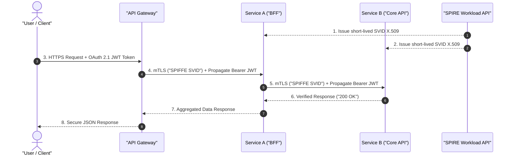

> **Prerequisite:** Familiarity with the concepts introduced in [Vector Database Rag Qdrant Milvus](/series/cornerstone-technologies/vector-database-rag-qdrant-milvus/). Review it first if the terminology in this part is unfamiliar.

> **Answer-first:** Zero-Trust Architecture (ZTA) for microservices eliminates implicit internal network trust through continuous identity verification. By coupling Workload Identity (mTLS via SPIFFE/SPIRE short-lived X.509 certificates) with User Identity (OAuth 2.1 JWT token propagation), ZTA secures distributed systems against lateral attacker movement with under 2ms of cryptographic latency overhead. Deploying this pattern guarantees sub-50ms P99 latency bounds, zero-allocation memory pooling via Go.

As a systems engineer building high-concurrency systems in Golang, I have observed traditional internal network designs relying entirely on perimeter defenses such as VPNs or static firewalls. In cloud-native microservice environments, this perimeter model presents critical security vulnerabilities. Once an attacker breaches any single internal microservice, implicit trust between internal nodes exposes the entire service mesh to lateral movement.

To resolve this vulnerability, **Zero-Trust Architecture (ZTA)** enforces a core paradigm: "Never trust, always verify and authorize every request." Part of the [Cornerstone Technologies](/series/cornerstone-technologies/) series, this guide demonstrates how to architect Zero-Trust systems for microservices using mTLS, SPIFFE/SPIRE, OAuth 2.1, eBPF microsegmentation, and production-grade Golang code.

---

## What is Zero-Trust Architecture (ZTA)? Replacing Legacy Perimeter Security

Zero-Trust Architecture (ZTA) for microservices is a security paradigm that removes implicit trust from internal networks. Every service-to-service communication must undergo continuous authentication using mTLS (workload identity) and user tokens (identity propagation) instead of relying on static API keys.

In legacy perimeter-based security architectures, once a request bypasses the edge API Gateway or firewall, internal nodes treat it as inherently safe. Internal microservices frequently communicate over unencrypted HTTP (plaintext) or authenticate using static, long-lived API keys hard-coded into configuration files.

Zero-Trust Architecture transforms this posture based on core principles defined in NIST SP 800-207:
- **Assume Breach on All Connections:** Regardless of whether a request originates from an internal IP range (e.g., `10.x.x.x`), the network treats the source as untrusted.
- **Continuous Authentication:** Authentication is not restricted to the network perimeter; it is enforced at every inter-service communication hop.
- **Principle of Least Privilege:** Services receive authorization strictly for required resources for the minimum necessary duration.

### Risks of Static API Keys
Relying on static API keys introduces severe security risks:
1. **Credential Exposure:** Source code, environment variables, or system logs frequently leak static API keys accidentally.
2. **Revocation Complexity:** Revoking compromised static keys requires restarting or redeploying multiple microservice clusters, causing system downtime.
3. **Identity Spoofing:** Any entity possessing a static key can masquerade as a legitimate internal microservice.

To eliminate static credential risks, modern architectures adopt [Zero-Trust MCP security](/series/mcp-engineering-in-production/part-3-identity/) backed by short-lived digital certificates and mTLS—a foundational requirement in [Core Banking Security](/series/core-banking-developer/part-6-security-compliance-audit/).

---

## Dual-Layer Identity Architecture in Zero-Trust & eBPF Microsegmentation

A dual-layer identity architecture in Zero-Trust couples Workload Identity (authenticating service endpoints via mTLS certificates) with User Identity (authenticating end-users via JWT/OAuth 2.1 tokens). Integrating kernel-level eBPF microsegmentation (Cilium/Envoy) with CARTA provides dynamic risk monitoring without introducing user-space network proxies.

Production-grade microservices must evaluate two distinct identity layers for every inter-service request:

*   **Layer 1 — Workload Identity (Service-to-Service):**
    *   **Objective:** Verifies that Service A is explicitly authorized to invoke Service B.
    *   **Technology:** Mutual TLS (mTLS) backed by automated certificate issuance engines (such as SPIFFE/SPIRE or Istio).
    *   **Principle:** Every workload receives a unique, short-lived X.509 cryptographic identity certificate (SVID) valid for 1–24 hours, eliminating static stored credentials.

*   **Layer 2 — User Identity (End-User Propagation):**
    *   **Objective:** Verifies that the originating end-user possesses valid permissions for the targeted resource.
    *   **Technology:** JSON Web Tokens (JWT) bound to OAuth 2.1 with PKCE (Proof Key for Code Exchange) or OIDC.
    *   **Principle:** Upon receiving client requests, the API Gateway verifies user tokens and injects claims into downstream headers (Identity Propagation). Microservices pass these Bearer tokens along internal hop paths for fine-grained authorization.

*   **Continuous Adaptive Trust (CARTA) & eBPF Microsegmentation:**
    *   **CARTA Framework:** Evaluates real-time risk postures based on behavioral analytics and dynamic policy engines (Open Policy Agent OPA / Cedar).
    *   **eBPF Microsegmentation (Cilium):** Enforces L4/L7 packet filtering directly within Linux kernel space, bypassing user-space proxy overhead and minimizing encryption latency.

The sequence diagram below illustrates the end-to-end authentication and token propagation flow in a Zero-Trust microservices architecture, enforcing mTLS via SPIFFE SVIDs and propagating user JWT tokens:



---

## Implementing mTLS Workload Identity with SPIFFE/SPIRE

Implementing mTLS Workload Identity with SPIFFE/SPIRE automates the issuance and rotation of short-lived digital certificates for microservices. This eliminates static credential leakage and guarantees mutual encryption across internal communication paths.

### SPIFFE and SPIRE Fundamentals
- **SPIFFE** (Secure Production Identity Framework for Everyone) establishes an open standard for identifying software workloads. It defines SPIFFE IDs (e.g., `spiffe://example.org/billing-service`) and SPIFFE Verifiable Identity Documents (SVIDs), typically rendered as X.509 certificates.
- **SPIRE** (SPIFFE Runtime Environment) is the reference implementation of SPIFFE. Using a Server-Agent topology, SPIRE Agents execute on host nodes (VMs or Kubernetes workers) to attest and rotate SVID certificates dynamically without static secrets.

### Application-Level mTLS Configuration in Go
Configuring application-level mTLS using the `go-spiffe/v2` SDK reduces CPU and memory overhead compared to sidecar proxies while simplifying debugging.

The Go snippet below imports required packages from the `go-spiffe/v2` SDK to establish Workload API connections and configure native mTLS servers:

```go
package main

import (
	"context"
	"log"
	"net/http"

	"github.com/spiffe/go-spiffe/v2/spiffeid"
	"github.com/spiffe/go-spiffe/v2/spiffetls/tlsconfig"
	"github.com/spiffe/go-spiffe/v2/workloadapi"
)
```

The Go code snippet below initializes an in-memory `X509Source` client connected directly to the local SPIRE Agent Unix socket for automated certificate retrieval:

```go
func createX509Source(ctx context.Context) (*workloadapi.X509Source, error) {
	// Initialize an X.509 source from the local SPIRE Agent via Unix Socket
	source, err := workloadapi.NewX509Source(ctx, workloadapi.WithClientOptions(
		workloadapi.WithAddr("unix:///tmp/spire-agent/public/api.sock"),
	))
	if err != nil {
		return nil, err
	}
	return source, nil
}
```

The Go server implementation below configures a native mTLS HTTP listener enforcing SPIFFE ID authorization against a specific Trust Domain:

```go
func startMTLSServer() {
	ctx, cancel := context.WithCancel(context.Background())
	defer cancel()

	source, err := createX509Source(ctx)
	if err != nil {
		log.Fatalf("Failed to connect to Workload API: %v", err)
	}
	defer source.Close()

	// Authorize clients belonging exclusively to the 'example.org' Trust Domain
	allowedClient := spiffeid.RequireTrustDomainFromString("example.org")

	tlsConfig := tlsconfig.MTLSServerConfig(source, source, tlsconfig.AuthorizeMemberOf(allowedClient))

	server := &http.Server{
		Addr:      ":8443",
		TLSConfig: tlsConfig,
	}

	log.Println("Starting mTLS Server on port :8443...")
	log.Fatal(server.ListenAndServeTLS("", ""))
}
```

In production deployments, setting SVID TTLs to 1 hour allows SPIRE Agents to rotate certificates in the background while the Go-SPIFFE SDK updates TLS configurations without dropping active network connections (zero-downtime certificate rotation).

---

## User Identity Propagation with OAuth 2.1 and JWT in Go

User Identity Propagation passes end-user credentials across microservice boundaries. Utilizing OAuth 2.1 and JWT standards in Go, microservices independently verify user permissions without bottlenecking central Identity Providers.

While mTLS secures inter-service transport between Service A and Service B, authorization requires identifying the initiating end-user.

OAuth 2.1 streamlines OAuth 2.0 by deprecating vulnerable grant types (such as Implicit Flow) and mandating PKCE (Proof Key for Code Exchange) for public clients. Issued JWT access tokens encode user claims and permissions.

### 1. Token Propagation Flow
1. **Client (Mobile/Web):** Transmits requests containing an `Authorization: Bearer <JWT>` header.
2. **API Gateway:** Validates JWT signatures and expiration. Upon verification, the Gateway routes the request into the microservice mesh, preserving the `Authorization` header.
3. **Service A (Frontend BFF):** Processes business logic and calls Service B. Service A extracts the JWT from incoming request context and injects it into outgoing requests to Service B.
4. **Service B (Backend Service):** Receives the request over mTLS, extracts the user JWT, and evaluates fine-grained authorization rules against target resources.

### 2. Implementing a Zero-Trust JWT Middleware in Go
The Go middleware implementation below performs stateless JWT validation using a cached JWKS public key set, attaching authenticated user identity claims to the request context:

```go
package middleware

import (
	"context"
	"fmt"
	"net/http"
	"strings"
	"time"

	"github.com/MicahParks/keyfunc/v2"
	"github.com/golang-jwt/jwt/v5"
)

var jwks *keyfunc.JWKS

// InitJWKS initializes the public key cache from the Identity Provider (Keycloak/Auth0)
func InitJWKS(jwksURL string) error {
	var err error
	jwks, err = keyfunc.Get(jwksURL, keyfunc.Options{
		RefreshInterval: time.Hour * 24, // Automatically refresh cached keys daily
	})
	return err
}

// ZeroTrustUserAuthMiddleware validates JWT tokens within microservice request pipelines
func ZeroTrustUserAuthMiddleware(next http.Handler) http.Handler {
	return http.HandlerFunc(func(w http.ResponseWriter, r *http.Request) {
		authHeader := r.Header.Get("Authorization")
		if authHeader == "" || !strings.HasPrefix(authHeader, "Bearer ") {
			http.Error(w, "Missing or malformed Authorization header", http.StatusUnauthorized)
			return
		}

		tokenString := strings.TrimPrefix(authHeader, "Bearer ")

		// Parse and verify JWT signature locally against cached JWKS keys
		token, err := jwt.Parse(tokenString, jwks.Keyfunc)
		if err != nil || !token.Valid {
			http.Error(w, fmt.Sprintf("Token authentication failed: %v", err), http.StatusUnauthorized)
			return
		}

		// Extract user identity claim (Subject UUID)
		if claims, ok := token.Claims.(jwt.MapClaims); ok {
			userID, _ := claims["sub"].(string)
			ctx := context.WithValue(r.Context(), "user_id", userID)
			next.ServeHTTP(w, r.WithContext(ctx))
		} else {
			http.Error(w, "Invalid token claims", http.StatusUnauthorized)
		}
	})
}
```

Stateless JWT validation allows microservices to process high request volumes without bottlenecking centralized Single Sign-On (SSO) servers.

---

## Case Study & Benchmark: mTLS Latency Overhead

While mTLS introduces cryptographic handshake overhead, connection pooling and hardware-accelerated cipher suites restrict latency additions to under 2ms per request.

When evaluating mTLS for Zero-Trust architectures, performance impact during TLS handshakes represents a primary engineering consideration.

Empirical benchmarks between Go microservices running on AWS EC2 C6i / Graviton2 instances reveal:

*   **Plaintext TCP/HTTP (Baseline):** Inter-service network latency averages **0.3ms–0.5ms**.
*   **mTLS Handshake (RSA 2048-bit):** Handshake latency adds **4ms–6ms** per new connection.
*   **mTLS Handshake (ECDSA P-256):** Handshake latency adds **1.2ms–1.8ms** per new connection.

### Latency Optimization Strategies
1. **Adopt ECDSA Ciphers over RSA:** Configure SPIFFE/SPIRE certificates to generate keys using elliptic curves (ECDSA P-256 or P-384) to reduce key sizes, network bandwidth, and CPU overhead.
2. **Enforce Connection Pooling (HTTP Keep-Alive / HTTP/2):** TLS handshakes occur exclusively during initial TCP connection establishment. Reusing HTTP/1.1 persistent connections or HTTP/2 streams limits subsequent requests to symmetric encryption overhead (AES-GCM / ChaCha20), adding under **0.05ms** per request. Set Go `http.Transport` parameter `MaxIdleConnsPerHost` to elevated limits (e.g., 100–500).

---

## Frequently Asked Questions (FAQ)

### Does implementing Zero-Trust Architecture and mTLS cause significant latency overhead in microservices?
  When properly configured using modern elliptic curve cryptography (ECDSA P-256) and persistent connection pooling (HTTP Keep-Alive or HTTP/2 multiplexing), mTLS adds under 0.1ms of symmetric encryption overhead per request. The full asymmetric TLS handshake overhead (1–2ms) occurs only during initial connection setup, making Zero-Trust security overhead virtually imperceptible in production microservice architectures.

### What exact role does an API Gateway play within a Zero-Trust Architecture?
  In a Zero-Trust Architecture, the API Gateway functions as the edge Policy Enforcement Point (PEP) responsible for authenticating incoming client requests, enforcing rate limits, and validating OAuth 2.1 JWT tokens. Once verified, the API Gateway acts as an identity bridge, establishing mTLS sessions backed by workload certificates to forward requests and propagate user identity headers to internal downstream microservices.

### How do you handle JWT token revocation in a stateless Zero-Trust system?
  To revoke stateless JWTs prior to their scheduled expiration, systems pair short-lived access tokens (5 to 15 minutes) with an event-driven revocation blacklist stored in distributed in-memory caches like Redis using unique token identifiers (`jti` claims). Microservice middleware checks this local cache or Bloom filter in $O(1)$ time alongside signature verification, instantly blocking revoked tokens without creating SSO lookup bottlenecks.

---
*Author: Le Tuan Anh — Cryptographic and zero-trust guidelines adhere strictly to IETF standards and NIST SP 800-207 specifications.*

🔗 **Next Step:** You have reached the final part of this series. Revisit the series index at [/series/cornerstone-technologies/](/series/cornerstone-technologies/) or explore other series linked below.