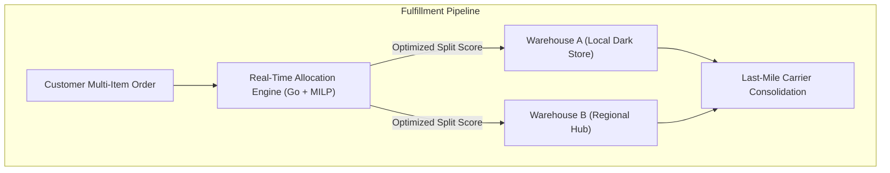

> **Answer-first:** High-volume e-commerce fulfillment requires solving the NP-hard **Order Allocation & Split-Shipment Minimization Problem** in sub-100ms latencies. This 10-part masterclass covers real-time inventory reservation, Mixed-Integer Linear Programming (MILP), Amazon CONDOR anticipatory shipping, Distance Matrix routing, and warehouse picker path algorithms.

---
## 🎯 Series Overview & Problem Space

In multi-node omnichannel retail networks (10+ regional fulfillment centers, 50+ dark stores):
1. **The Split-Shipment Penalty:** Fulfilling a single 4-item basket from 3 different warehouses triples last-mile shipping costs and degrades customer satisfaction.
2. **Inventory Stockout Waves:** High-concurrency flash sales trigger race conditions that cause overselling across channels.
3. **Picker Travel Waste:** Warehouse staff spend 60% of their shifts walking suboptimal picker paths.

---

## 🗺️ Masterclass Chapters

- **[Executive Summary: The Mathematical Landscape of Order Allocation](/series/ecommerce-order-allocation/executive-summary/)**  
  *Total fulfillment cost equations, split-shipment trade-offs, and service level agreements (SLAs).*
- **[Part 1: Order Fulfillment Fundamentals — From Click to Delivery](/series/ecommerce-order-allocation/part-1-order-fulfillment-fundamentals/)**  
  *The anatomy of modern supply chains, OMS/WMS/TMS integrations, and order states.*
- **[Part 2: Real-Time Multi-Warehouse Inventory Management](/series/ecommerce-order-allocation/part-2-inventory-realtime/)**  
  *Atomic Redis reservations, safe stock thresholds, and eventual consistency reconciliation.*
- **[Part 3: Allocation Algorithms — Greedy vs. Mixed-Integer Linear Programming](/series/ecommerce-order-allocation/part-3-allocation-algorithms/)**  
  *Formulating the Assignment Problem, cost matrices, and sub-50ms heuristic solvers.*
- **[Part 4: Anticipatory Shipping — Deconstructing Amazon CONDOR](/series/ecommerce-order-allocation/part-4-amazon-condor-anticipatory/)**  
  *Predictive inventory pre-positioning based on consumer purchase intent models.*
- **[Part 5: Split Shipment, Hub Consolidation & Last-Mile Delivery](/series/ecommerce-order-allocation/part-5-split-consolidation-lastmile/)**  
  *Cross-docking economics, packaging consolidation, and carrier rate shopping.*
- **[Part 6: Hands-On: Building a Mini Allocation Engine in Go](/series/ecommerce-order-allocation/part-6-build-mini-allocation-engine/)**  
  *Step-by-step Go implementation of a production-ready order allocation microservice.*
- **[Part 7: Distance Matrix Computation & Dynamic Geo-Routing](/series/ecommerce-order-allocation/part-7-distance-matrix-routing/)**  
  *Haversine vs OSRM distance matrices, traffic-aware routing, and zone pricing.*
- **[Part 8: Agentic AI for Intelligent Dynamic Order Release](/series/ecommerce-order-allocation/part-8-intelligent-order-release/)**  
  *Batching, wave picking, and real-time carrier SLA balancing using AI agents.*
- **[Part 9: Order Splitting via Graph Coloring & OPA Policy Enforcement](/series/ecommerce-order-allocation/part-9-order-splitting-graph-coloring-opa/)**  
  *Hazmat isolation, cold-chain constraints, and Open Policy Agent (OPA) integration.*
- **[Part 10: Warehouse Picker Routing & Traveling Salesperson Optimization](/series/ecommerce-order-allocation/part-10-warehouse-picker-routing-optimization/)**  
  *S-Shape, Mid-Point, and dynamic TSP routing algorithms reducing warehouse picker travel by 40%.*
