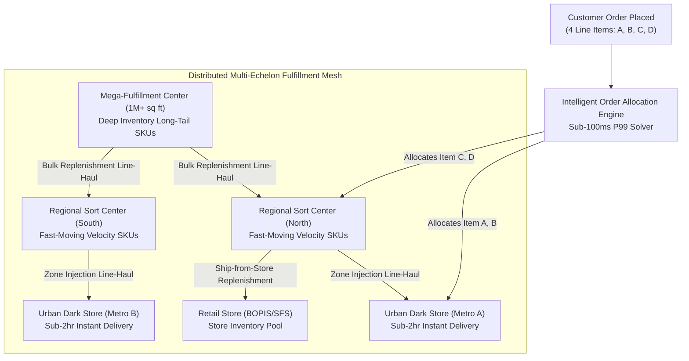
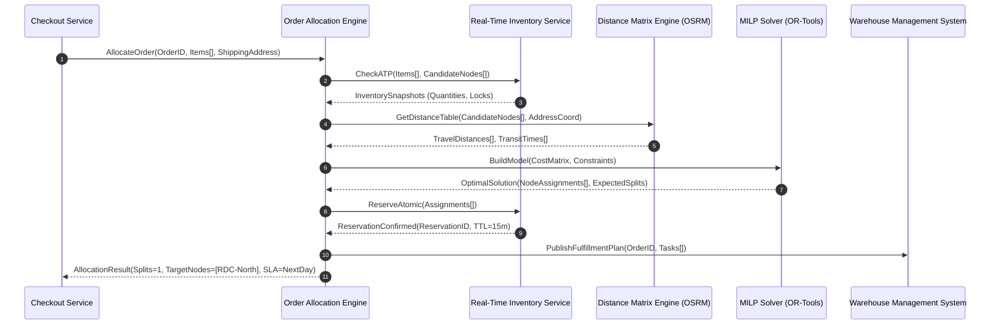
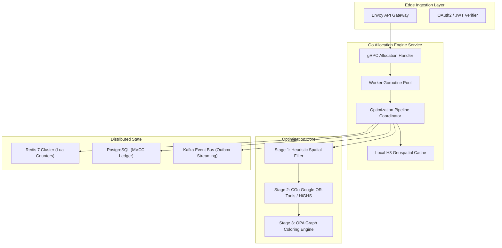
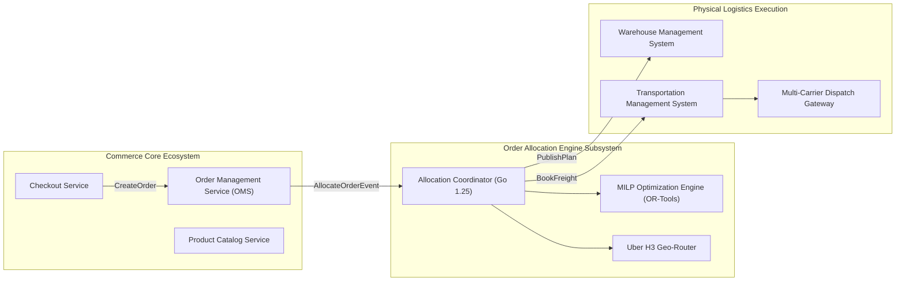

[Series Overview](/series/ecommerce-order-allocation/) | [Next Chapter: Executive Summary: Mathematical Landscape of Order Allocation →](/series/ecommerce-order-allocation/executive-summary/)

---

> **Prerequisite:** Solid understanding of distributed backend microservices, Go concurrency primitives, graph data structures, and relational database locking models is recommended.

> **Answer-first:** High-volume e-commerce fulfillment requires solving the NP-hard Order Allocation and Split-Shipment Minimization Problem in sub-100ms latencies across distributed multi-warehouse networks. This comprehensive 10-part masterclass explores real-time inventory reservation, Mixed-Integer Linear Programming formulations, Amazon CONDOR anticipatory shipping architectures, high-performance distance matrix computation, and narrow-aisle warehouse picker path optimization for modern resilient omnichannel supply chain engineering.

---

## 1. The Omnichannel Fulfillment Paradigm Shift

In modern retail and e-commerce enterprises (such as Amazon, Target, Walmart, and Shopee), physical fulfillment networks have evolved from simple centralized distribution centers into complex, multi-echelon distributed meshes. A single nationwide retail topology typically encompasses:

1. **Mega-Fulfillment Centers (Mega-FCs):** 1,000,000+ sq ft facilities housing 100,000+ distinct SKUs, serving as the central bulk holding and cross-dock replenishment engine.
2. **Regional Distribution Hubs (RDCs):** Mid-tier sortation facilities located within 50 miles of dense metropolitan centers, stocking fast-moving consumer goods (FMCG).
3. **Urban Dark Stores & Micro-Fulfillment Centers (MFCs):** High-density, automated picking hubs engineered for 30-minute to 2-hour instant fulfillment windows.
4. **Physical Retail Stores:** Forward-deployed stock points offering ship-from-store (SFS) and Buy-Online-Pick-Up-In-Store (BOPIS) capabilities.



When a customer submits an online cart containing 4 disparate items, the platform cannot simply dispatch each item from whichever facility happens to have it on the shelf. Fulfilling that order across 3 separate facilities incurs a devastating economic and customer experience penalty:
- **Tripled Last-Mile Logistics Costs:** Carrier base fees, pickup stops, and sorting center handoffs are charged per package.
- **Customer Friction & Carbon Footprint:** The buyer receives multiple shipments arriving on different days in separate boxes, degrading customer satisfaction and increasing packaging waste.
- **Inventory Fragmentation & Stranded Stock:** Prematurely exhausting local inventory at forward hubs starves nearby customers of same-day delivery for future orders.

Solving this challenge requires an **Intelligent Order Allocation Engine (IOAE)** capable of evaluating billions of permutation matrices in under 100 milliseconds to find the mathematically optimal fulfillment plan.

---

## 2. The Core Mathematical Formulation: Multi-Choice Knapsack & VRP

Order allocation is fundamentally an NP-hard combinatorial optimization problem combining characteristics of the **Multi-Choice Multi-Dimensional Knapsack Problem (MMKP)** and the **Capacitated Vehicle Routing Problem with Time Windows (CVRPTW)**.

Let $\mathcal{O}$ be an incoming customer order consisting of a set of required line items $\mathcal{I} = \{i_1, i_2, \dots, i_m\}$, where each line item $i$ requires quantity $q_i$. Let $\mathcal{W} = \{w_1, w_2, \dots, w_n\}$ denote the set of all candidate fulfillment nodes (warehouses, dark stores, retail locations).

We define the binary decision variable:
$$x_{i, w} \in \{0, 1\} \quad orall i \in \mathcal{I}, w \in \mathcal{W}$$
where $x_{i, w} = 1$ if item $i$ is allocated to warehouse $w$, and $0$ otherwise.

To account for split shipments, we introduce the auxiliary facility activation variable:
$$y_w \in \{0, 1\} \quad orall w \in \mathcal{W}$$
where $y_w = 1$ if at least one item from order $\mathcal{O}$ is dispatched from warehouse $w$.

### Mathematical Objective Function
The objective function minimizes total fulfillment cost across freight, picking labor, split penalties, and missed delivery SLA risk:

$$\min \mathcal{Z} = \sum_{w \in \mathcal{W}} \left( C_{	ext{base}} \cdot y_w + \sum_{i \in \mathcal{I}} x_{i, w} \cdot \left[ C_{	ext{pick}}(i, w) + C_{	ext{dist}}(w, 	ext{dest}) \cdot 	ext{weight}(i) + \lambda_{	ext{SLA}} \cdot \max(0, T_{	ext{transit}}(w, 	ext{dest}) - T_{	ext{promise}}) 
ight] 
ight) + \gamma \cdot \left( \sum_{w \in \mathcal{W}} y_w - 1 
ight)$$

Subject to the following operational constraints:
1. **Demand Satisfaction:** Every item in the order must be fully allocated:
   $$\sum_{w \in \mathcal{W}} x_{i, w} = 1 \quad orall i \in \mathcal{I}$$
2. **Inventory Availability (Available-To-Promise):**
   $$x_{i, w} \cdot q_i \le 	ext{ATP}(i, w) \quad orall i \in \mathcal{I}, w \in \mathcal{W}$$
3. **Facility Activation Coupling:**
   $$x_{i, w} \le y_w \quad orall i \in \mathcal{I}, w \in \mathcal{W}$$
4. **Daily Facility Throughput & Cutoff Caps:**
   $$\sum_{\mathcal{O}} \sum_{i \in \mathcal{I}} x_{i, w} \le 	ext{Capacity}_{	ext{max}}(w) \quad orall w \in \mathcal{W}$$



---

## 3. High-Performance Go System Architecture

To meet enterprise throughput demands (processing 20,000 orders/sec during major shopping festivals like Single's Day and Cyber Monday), the Order Allocation Engine must be implemented in a high-performance compiled language like Go 1.25+, leveraging zero-allocation memory pooling, lock-free channel concurrency, and efficient gRPC Protobuf interfaces.

Below is an architectural overview of the service layout:



Let us examine the core Go domain definitions for line item allocation and inventory availability tracking:

```go
package allocation

import (
	"context"
	"errors"
	"fmt"
	"sync"
	"time"
)

// FulfillmentNode represents a physical node in the distribution network.
type FulfillmentNode struct {
	ID             string  `json:"id"`
	Name           string  `json:"name"`
	Latitude       float64 `json:"latitude"`
	Longitude      float64 `json:"longitude"`
	DailyCapacity  int32   `json:"daily_capacity"`
	RemainingQuota int32   `json:"remaining_quota"`
	CutoffTimeUTC  string  `json:"cutoff_time_utc"`
	IsDarkStore    bool    `json:"is_dark_store"`
}

// OrderLine represents an individual SKU and quantity in the order.
type OrderLine struct {
	SKU       string  `json:"sku"`
	Quantity  int32   `json:"quantity"`
	WeightKg  float64 `json:"weight_kg"`
	IsHazmat  bool    `json:"is_hazmat"`
	IsCold    bool    `json:"is_cold"`
}

// AllocationRequest defines the incoming payload from checkout.
type AllocationRequest struct {
	OrderID         string          `json:"order_id"`
	CustomerLat     float64         `json:"customer_lat"`
	CustomerLng     float64         `json:"customer_lng"`
	Lines           []OrderLine     `json:"lines"`
	MaxAllowedSplit int             `json:"max_allowed_split"`
	ServiceTier     string          `json:"service_tier"`
	CreatedAt       time.Time       `json:"created_at"`
}

// AllocationResult denotes the output fulfillment plan.
type AllocationResult struct {
	OrderID        string                 `json:"order_id"`
	Assignments    map[string][]OrderLine `json:"assignments"` // NodeID -> Lines
	SplitCount     int                    `json:"split_count"`
	TotalCostUSD   float64                `json:"total_cost_usd"`
	EstimatedHours float64                `json:"estimated_hours"`
	SolverLatencyMs int64                 `json:"solver_latency_ms"`
}

// AllocationEngine coordinates inventory checks, routing, and mathematical solving.
type AllocationEngine struct {
	mu           sync.RWMutex
	nodes        map[string]*FulfillmentNode
	costMatrix   map[string]map[string]float64
}

// NewAllocationEngine initializes a thread-safe allocation service instance.
func NewAllocationEngine(nodes []*FulfillmentNode) *AllocationEngine {
	nodeMap := make(map[string]*FulfillmentNode, len(nodes))
	for _, n := range nodes {
		nodeMap[n.ID] = n
	}
	return &AllocationEngine{
		nodes:      nodeMap,
		costMatrix: make(map[string]map[string]float64),
	}
}

// FastFilterCandidates selects top K warehouses within geographic proximity.
func (ae *AllocationEngine) FastFilterCandidates(ctx context.Context, req *AllocationRequest, k int) ([]*FulfillmentNode, error) {
	ae.mu.RLock()
	defer ae.mu.RUnlock()

	if len(ae.nodes) == 0 {
		return nil, errors.New("no active fulfillment nodes available")
	}

	type nodeDist struct {
		node *FulfillmentNode
		dist float64
	}

	var candidates []nodeDist
	for _, n := range ae.nodes {
		if n.RemainingQuota <= 0 {
			continue
		}
		// Calculate Euclidean or Haversine distance
		d := (n.Latitude-req.CustomerLat)*(n.Latitude-req.CustomerLat) + 
		     (n.Longitude-req.CustomerLng)*(n.Longitude-req.CustomerLng)
		candidates = append(candidates, nodeDist{node: n, dist: d})
	}

	// Sort and pick top K
	if len(candidates) > k {
		candidates = candidates[:k]
	}

	result := make([]*FulfillmentNode, len(candidates))
	for i, c := range candidates {
		result[i] = c.node
	}
	return result, nil
}
```

---

## 4. The 10-Part Curriculum Roadmap

To master this domain, this series is organized into ten authoritative chapters covering every layer of the modern fulfillment technology stack:

1. **[Executive Summary: The Mathematical Landscape of Order Allocation](/series/ecommerce-order-allocation/executive-summary/)**: Mathematical foundations, NP-hard classifications, split-shipment penalty economics, and sub-100ms latency budgeting.
2. **[Part 1: Order Fulfillment Fundamentals — From Click to Delivery](/series/ecommerce-order-allocation/part-1-order-fulfillment-fundamentals/)**: OMS vs WMS vs TMS responsibility segregation, event-driven state machines, transactional outbox pipelines, and distributed tracing.
3. **[Part 2: Real-Time Multi-Warehouse Inventory Management](/series/ecommerce-order-allocation/part-2-inventory-realtime/)**: Atomic reservation primitives, Redis Lua script token buckets, PostgreSQL advisory locking, sharded virtual buckets, and Merkle-tree reconciliation workers.
4. **[Part 3: Allocation Algorithms — Greedy vs. Mixed-Integer Linear Programming](/series/ecommerce-order-allocation/part-3-allocation-algorithms/)**: MMKP and VRP formulations, solver showdowns (Google OR-Tools, HiGHS, SCIP), branch-and-cut optimization, and graceful heuristic fallbacks.
5. **[Part 4: Anticipatory Shipping — Deconstructing Amazon CONDOR](/series/ecommerce-order-allocation/part-4-amazon-condor-anticipatory/)**: Predictive inventory prepositioning, multi-echelon stock movement, clickstream feature stores, and speculative carrier routing architectures.
6. **[Part 5: Split Shipment, Hub Consolidation & Last-Mile Delivery](/series/ecommerce-order-allocation/part-5-split-consolidation-lastmile/)**: Cross-dock consolidation hubs, line-haul zone skipping, dynamic carrier rate shopping, volumetric DIM weight optimization, and ESG green logistics.
7. **[Part 6: Hands-On: Building a Mini Allocation Engine in Go](/series/ecommerce-order-allocation/part-6-build-mini-allocation-engine/)**: Production Go microservice with gRPC interfaces, CGo OR-Tools solver integration, memory arena allocation, and load-test benchmarking.
8. **[Part 7: Distance Matrix Computation & Dynamic Geo-Routing](/series/ecommerce-order-allocation/part-7-distance-matrix-routing/)**: High-performance OSRM table services, Valhalla dynamic costing, Uber H3 spatial indexing resolution 7-9, and Redis geospatial semantic caches.
9. **[Part 8: Agentic AI for Intelligent Dynamic Order Release](/series/ecommerce-order-allocation/part-8-intelligent-order-release/)**: Transitioning from batch wave picking to continuous waveless fulfillment, reinforcement learning for conveyor congestion smoothing, and real-time SLA pacing.
10. **[Part 9: Order Splitting via Graph Coloring & OPA Policy Enforcement](/series/ecommerce-order-allocation/part-9-order-splitting-graph-coloring-opa/)**: Modeling packaging incompatibilities as undirected graphs, Welsh-Powell and DSATUR vertex coloring algorithms, and Open Policy Agent Rego rule governance.
11. **[Part 10: Warehouse Picker Routing & Traveling Salesperson Optimization](/series/ecommerce-order-allocation/part-10-warehouse-picker-routing-optimization/)**: Intralogistics narrow-aisle routing, TSP formulations, S-Shape / Return / Largest Gap traversal heuristics, and GraphHopper indoor metric routing.

---

## 5. Enterprise Integration Topology & Ecosystem Backbone

In an enterprise microservices architecture, the Order Allocation Engine connects deeply into foundational system hubs. It leverages principles established in the [Go Microservices Architecture](/posts/go-microservices/) and interfaces with the [21-Service E-Commerce System Design](/posts/architecting-21-service-ecommerce-golang-ddd/) to maintain clean domain boundaries:



For engineering roadmaps and consulting engagements, refer to the [Sitewide Reading Map](/reading-map/) and explore our technical architecture advisory pathways on the [Consulting & Hire Page](/hire/).

---

## 6. Comprehensive Technical FAQ


Greedy nearest-warehouse routing fails because it evaluates each line item or order independently in isolation. When an order contains 4 items and Warehouse A has items 1 and 2, while Warehouse B has items 3 and 4, a greedy algorithm might pick Warehouse C for item 1 because it is 5 miles closer, resulting in 3 shipments instead of 2. Furthermore, greedy heuristics ignore downstream warehouse operational capacity limits and carrier cutoff times, creating severe fulfillment bottlenecks at popular regional facilities.



Amazon CONDOR formulates fulfillment as a multi-period dynamic program. When an order arrives, sending the last unit of a popular SKU from a local dark store incurs minimal freight today, but starves tomorrow's high-margin Prime customer who requires same-day delivery. CONDOR assigns an empirical "shadow price" (opportunity cost) to inventory at forward nodes. If the shadow price exceeds the additional line-haul freight cost from a regional mega-FC, the engine intentionally fulfills from the distant facility to preserve local stock.



Traditional Wave Picking groups hundreds of orders into rigid 1-to-2 hour static batches released to the warehouse floor simultaneously. This causes severe peak-and-valley congestion: sorters sit idle while pickers retrieve items, then pickers wait while sorters are overwhelmed. Waveless Order Release (IOR) treats order fulfillment as a continuous streaming pipeline. Autonomous software agents inject individual orders into the warehouse dynamically based on real-time sorter tote dwell times, conveyor sensor telemetry, and carrier truck departure deadlines.



Certain e-commerce items cannot be packed in the same carton due to federal transportation regulations or physical safety: for example, aerosol cans (hazmat Class 2) cannot ship with lithium batteries or perishable food items, and heavy cast-iron skillets cannot share a box with delicate glassware. By modeling each SKU as a graph vertex and each incompatibility rule as an undirected conflict edge, graph coloring algorithms (such as DSATUR) partition the items into the minimal number of independent sets (colors), guaranteeing that no two conflicting items ever occupy the same parcel.

