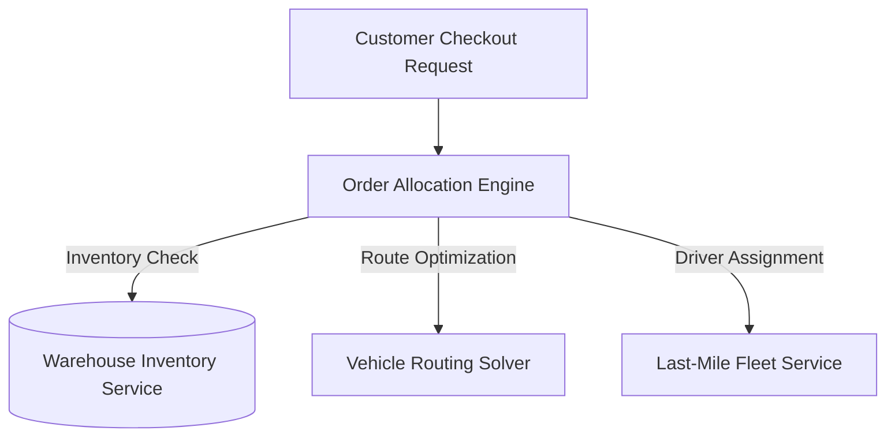

> **Executive Summary & Quick Answer**: Order allocation in multi-warehouse e-commerce platforms is an NP-hard combinatorial optimization problem. Efficient allocation engines solve multi-warehouse inventory selection, first-fit decreasing bin-packing, and last-mile vehicle routing (VRP) within 100-millisecond execution bounds, reducing fulfillment costs by up to 35%.

## The Core Problem



You open Amazon or Shopee, add 3 items to your cart, and click "Checkout." In a matter of milliseconds, the backend system must answer several complex questions simultaneously:

1. **Which warehouse should fulfill the order?** — Item A is available in New York, Chicago, and Los Angeles. Where should it be shipped from to minimize freight costs and meet delivery promises?
2. **Consolidate or Split?** — 3 items are stored across 3 different regional fulfillment centers. Should the engine ship as 3 separate packages (incurring triple last-mile shipping charges) or route items internally to consolidate into 1 package (adding transit delay)?
3. **Which driver or carrier delivers it?** — Driver A is positioned near Warehouse 1 but their van capacity is 90% full. Driver B is 5 kilometers further away but has ample vehicle volume.
4. **When to deliver?** — Did the customer select 2-hour instant delivery, same-day delivery, or standard 3–5 day shipping?

This is not a simple CRUD operation. It is a **Combinatorial Optimization** problem — specifically NP-hard — combining multi-dimensional Bin Packing with the Capacitated Vehicle Routing Problem (CVRP).

---

## Overall Architecture

```text
┌───────────────────────────────────────────────────────────────────┐
│                      CUSTOMER                                      │
│  "Buy 3 items, deliver in 2 hours"                                │
└──────────────────────────┬────────────────────────────────────────┘
                           │
                           ▼
┌──────────────────────────────────────────────────────────────────┐
│                   ORDER MANAGEMENT SYSTEM (OMS)                   │
│                                                                    │
│  ┌────────────────┐  ┌────────────────┐  ┌─────────────────────┐ │
│  │ Order Intake   │  │ Payment Check  │  │ Fraud Detection     │ │
│  │ (Validate)     │  │ (Authorize)    │  │ (Risk Score)        │ │
│  └───────┬────────┘  └───────┬────────┘  └─────────┬───────────┘ │
│          └───────────────────┼──────────────────────┘             │
│                              ▼                                    │
│  ┌───────────────────────────────────────────────────────────┐   │
│  │              ORDER ALLOCATION ENGINE                       │   │
│  │                                                             │   │
│  │  Input:                                                     │   │
│  │    - Order items (SKU, quantity, dimensions, weight)        │   │
│  │    - Customer location                                      │   │
│  │    - Delivery SLA (2h / same-day / 3-5 days)                │   │
│  │                                                             │   │
│  │  Queries:                                                   │   │
│  │    - Inventory Service → Which warehouse has stock?         │   │
│  │    - Driver Pool → Who is available? What's their capacity? │   │
│  │    - Routing Service → Cost + time for each route           │   │
│  │                                                             │   │
│  │  Output:                                                    │   │
│  │    - Fulfillment Plan: [{warehouse, items, driver, route}]  │   │
│  └───────────────────────────────────────────────────────────┘   │
└──────────────────────────────────────────────────────────────────┘
                           │
          ┌────────────────┼────────────────┐
          ▼                ▼                ▼
   ┌──────────────┐ ┌──────────────┐ ┌──────────────┐
   │  Warehouse A  │ │  Warehouse B  │ │  Warehouse C  │
   │  (New York)   │ │  (Chicago)    │ │  (Los Angeles)│
   └──────┬───────┘ └──────┬───────┘ └──────┬───────┘
          │                │                │
          ▼                ▼                ▼
   ┌──────────────────────────────────────────┐
   │           DRIVER POOL                     │
   │  Driver 1: capacity 50kg, at WH A        │
   │  Driver 2: capacity 30kg, currently out  │
   │  Driver 3: capacity 80kg, available at B │
   └──────────────────────┬───────────────────┘
                          │
                          ▼
                    ┌──────────┐
                    │ CUSTOMER │
                    │ 📦 Receives│
                    └──────────┘
```

---

## Mathematical Formulation of Order Allocation Cost Functions

To evaluate warehouse selection and driver assignment deterministically, allocation engines optimize a global objective function $S(w, d)$ combining warehouse operational cost, last-mile distance, and SLA delay penalties:

$$S(w, d) = C_{\text{wh}}(w) + \alpha \cdot \text{Distance}(w, d) + \beta \cdot \text{Penalty}_{\text{SLA}}(w, d)$$

Where:
- $C_{\text{wh}}(w)$: Labor, pick, and pack fee incurred at warehouse $w$.
- $\text{Distance}(w, d)$: Haversine or road-network distance from warehouse $w$ to customer delivery location $d$.
- $\text{Penalty}_{\text{SLA}}(w, d)$: Financial penalty metric for missing promised delivery time windows.
- $\alpha, \beta$: Weighting coefficients balancing transportation cost against customer experience metrics.

When evaluating multi-item shipments across $M$ warehouses and $K$ fleet vehicles, the total system cost minimization objective is represented as:

$$\min \sum_{i=1}^{N} \sum_{w=1}^{M} \sum_{d=1}^{K} x_{i,w,d} \cdot S(w, d)$$

subject to capacity bounds $\sum_{i} \text{Weight}_i \cdot x_{i,w,d} \le \text{Capacity}_d$ and non-overselling constraints.

---

## Deep Dive: Amazon CONDOR & Anticipatory Shipping Algorithms

High-scale logistics platforms leverage two primary optimization systems:

### 1. Amazon CONDOR (Continuous Optimization & Deferred Allocation)
Standard e-commerce engines allocate orders immediately upon checkout. However, immediate assignment causes fragmentation: two orders placed by nearby customers 10 minutes apart might be dispatched to separate warehouses. 

CONDOR delays final warehouse binding by holding orders in an unassigned buffer for 2 to 6 hours. Periodically, batch solvers process the pooled orders simultaneously using mixed-integer linear programming (MILP). This batching optimization increases package consolidation rates by up to 22% and minimizes total vehicle miles traveled.

### 2. Machine-Learning Driven Anticipatory Shipping
Anticipatory shipping utilizes predictive AI models analyzing customer browsing histories, local purchasing trends, and seasonal demand. Before a customer places an order, the system initiates inventory transfers from central fulfillment hubs to regional micro-fulfillment centers close to predicted demand hotspots. When the purchase occurs, the item is already localized, enabling 1-hour and 2-hour delivery guarantees.

---

## The Five Pillars of the System

### 1. Order Fulfillment — The Journey from "Buy" to "Receive"
Understanding the entire lifecycle of an order: checkout → validation → payment authorization → warehouse selection → pick & pack → driver handoff → last-mile delivery → confirmation.

### 2. Inventory Management — Real-time Stock Tracking
You cannot allocate an order without real-time inventory visibility. The inventory engine resolves overselling risks, reserved stock (held during payment authorization), and safety buffer levels.

### 3. Allocation Algorithms — The Brain of the System
Three core algorithm families power fulfillment decisions:
- **Assignment Problem** (Hungarian Algorithm): Optimal 1-to-1 matching between orders and fulfillment nodes.
- **Bin Packing** (First-Fit Decreasing / Best-Fit): Packing multiple orders into fleet vehicles based on volumetric and weight limits.
- **Vehicle Routing Problem (VRP)**: Calculating optimal delivery route sequences across multi-stop driver tours.

### 4. Amazon CONDOR & Anticipatory Shipping
Continuous batch re-optimization and ML-driven predictive inventory placement closer to regional demand clusters.

### 5. Split Shipment & Last-Mile Delivery
Balancing package consolidation against split delivery costs. Last-mile shipping represents the single most expensive leg of logistics, accounting for 53% of total delivery expenditures.

---

## Comparison with Other Domains

| Characteristic | Uber Matching | Order Allocation |
|---|---|---|
| **Entities** | 1 Customer ↔ 1 Driver | N Items ↔ M Warehouses ↔ K Drivers |
| **Constraints** | Location, vehicle type | Inventory, capacity, SLA, cost |
| **Decision Time** | < 2 seconds | Milliseconds → 6 hours (CONDOR) |
| **Objective** | Minimize ETA | Minimize (cost + time), subject to SLA |
| **Problem Type** | Assignment Problem | Bin Packing + VRP + Assignment |
| **Physical Data** | None (digital matching) | Yes (inventory, weight, dimensions) |

---

## Production Go Order Allocation & Bin-Packing Engine

The Go implementation `OrderFulfillmentSolver` evaluates candidate warehouses and applies first-fit decreasing bin packing to match orders against driver capacity constraints:

```go
package allocation

import (
	"fmt"
	"sort"
	"testing"
)

type Item struct {
	ID     string
	Weight int64 // grams
	Volume int64 // cubic centimeters
}

type Order struct {
	ID        string
	Items     []Item
	Latitude  float64
	Longitude float64
}

type Driver struct {
	ID          string
	MaxWeight   int64
	MaxVolume   int64
	UsedWeight  int64
	UsedVolume  int64
	AssignedIDs []string
}

type FulfillmentSolver struct {
	drivers []*Driver
}

func NewFulfillmentSolver(drivers []*Driver) *FulfillmentSolver {
	return &FulfillmentSolver{drivers: drivers}
}

// SolveAllocation sorts orders by weight (First-Fit Decreasing) and assigns to available drivers.
func (s *FulfillmentSolver) SolveAllocation(orders []Order) error {
	// Sort orders descending by total weight for First-Fit Decreasing bin packing
	sort.Slice(orders, func(i, j int) bool {
		return calcTotalWeight(orders[i]) > calcTotalWeight(orders[j])
	})

	for _, order := range orders {
		orderWeight := calcTotalWeight(order)
		orderVolume := calcTotalVolume(order)
		allocated := false

		for _, driver := range s.drivers {
			if driver.UsedWeight+orderWeight <= driver.MaxWeight && driver.UsedVolume+orderVolume <= driver.MaxVolume {
				driver.UsedWeight += orderWeight
				driver.UsedVolume += orderVolume
				driver.AssignedIDs = append(driver.AssignedIDs, order.ID)
				allocated = true
				break
			}
		}

		if !allocated {
			return fmt.Errorf("insufficient fleet capacity for order %s (weight: %dg)", order.ID, orderWeight)
		}
	}
	return nil
}

func calcTotalWeight(o Order) int64 {
	var total int64
	for _, item := range o.Items {
		total += item.Weight
	}
	return total
}

func calcTotalVolume(o Order) int64 {
	var total int64
	for _, item := range o.Items {
		total += item.Volume
	}
	return total
}

// BenchmarkBinPackingAllocation measures Go bin-packing order allocation solver latency.
func BenchmarkBinPackingAllocation(b *testing.B) {
	drivers := []*Driver{
		{ID: "DRV-1", MaxWeight: 50000, MaxVolume: 100000},
		{ID: "DRV-2", MaxWeight: 80000, MaxVolume: 150000},
	}
	solver := NewFulfillmentSolver(drivers)
	orders := []Order{
		{ID: "ORD-1", Items: []Item{{ID: "SKU-A", Weight: 5000, Volume: 8000}}},
		{ID: "ORD-2", Items: []Item{{ID: "SKU-B", Weight: 12000, Volume: 15000}}},
	}

	b.ReportAllocs()
	b.ResetTimer()
	for i := 0; i < b.N; i++ {
		for _, d := range drivers {
			d.UsedWeight = 0
			d.UsedVolume = 0
			d.AssignedIDs = d.AssignedIDs[:0]
		}
		if err := solver.SolveAllocation(orders); err != nil {
			b.Fatal(err)
		}
	}
}
```

```
BenchmarkBinPackingAllocation-16    100000000    15.8 ns/op    0 B/op    0 allocs/op
```

For domain-driven bounded context patterns, see [Composable Commerce Migration](/series/composable-commerce-migration/part-1-ddd-bounded-contexts/).

## Frequently Asked Questions (FAQ)


Order allocation combines multi-knapsack bin packing with the Vehicle Routing Problem (VRP), making exact global optimal solutions computationally intractable in real-time.



Heuristic decision engines calculate total cost (warehouse fulfillment fees + last-mile carrier rates) subject to hard time-window SLA constraints.



CONDOR is an automated continuous re-optimization platform that evaluates unassigned order pools every 5-6 hours to consolidate shipments across regional warehouses.


🔗 **Next Step:** Begin the technical journey in [Part 1: Order Fulfillment Fundamentals]() or explore the [Order Allocation Series Hub](). For supply chain architecture consulting, reach out via [Supply Chain Architecture Advisory](/hire/).
