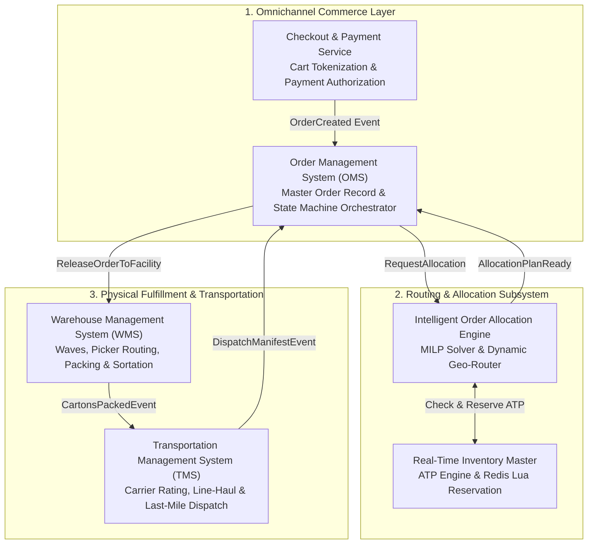
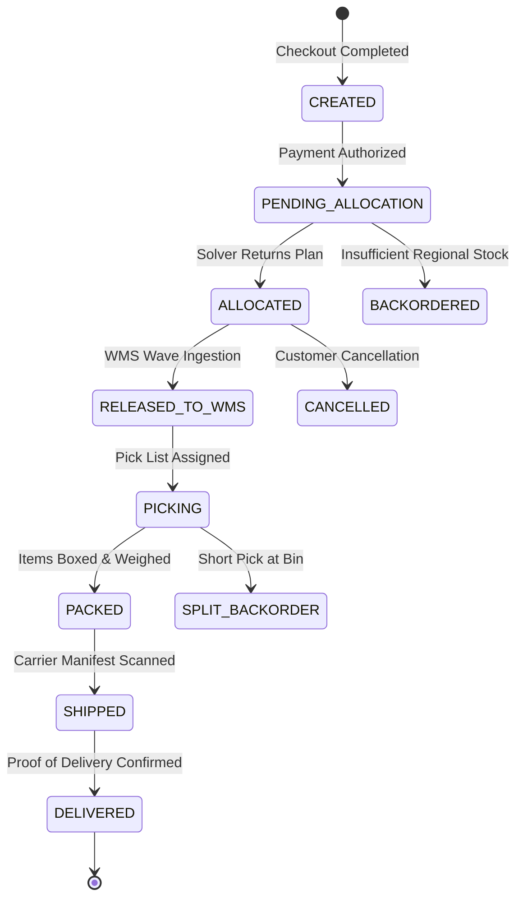
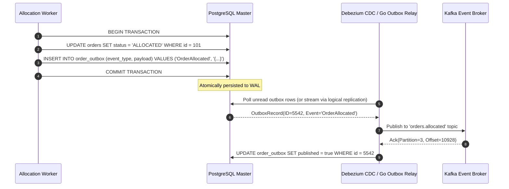
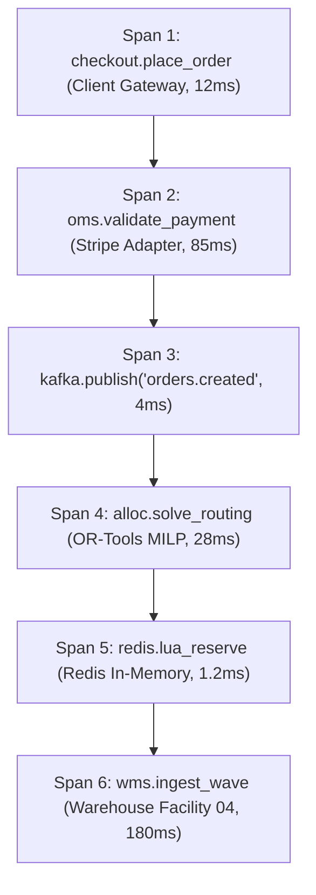
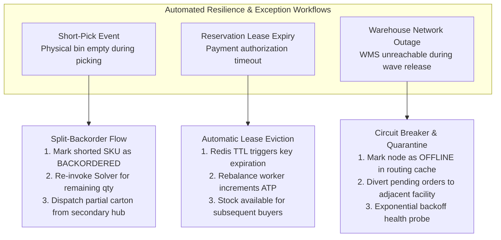
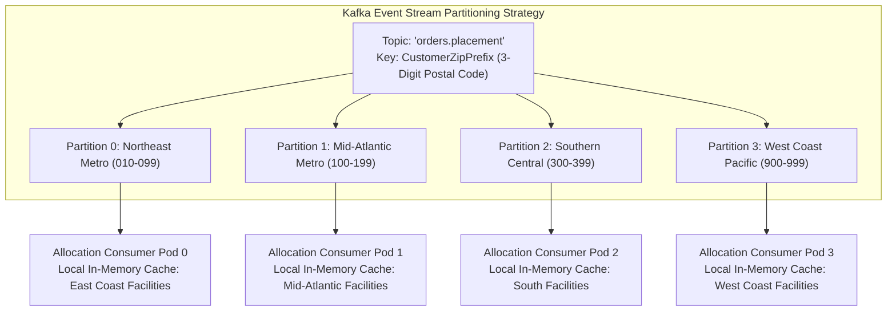

[← Previous: Executive Summary](/series/ecommerce-order-allocation/executive-summary/) | [Next Chapter: Part 2: Real-Time Multi-Warehouse Inventory Management →](/series/ecommerce-order-allocation/part-2-inventory-realtime/)

---

> **Prerequisite:** Solid grasp of event-driven distributed systems, message brokers (Kafka/NATS), relational transactional ACID semantics, and finite state machine concepts is required.

> **Answer-first:** The journey from shopping cart checkout to physical doorstep delivery requires decoupling distributed order management systems from physical warehouse operations via resilient event streams. Implementing an idempotent distributed state machine with two-phase inventory reservation and transactional outbox patterns guarantees zero lost customer orders, eliminates race conditions during flash-sales, and ensures complete supply chain auditability.

---

## 1. The Omnichannel Fulfillment Lifecycle

When an e-commerce customer clicks the "Place Order" button on a digital storefront, an intricate chain of enterprise logistics software systems springs into action. To architect high-availability fulfillment platforms, software engineers must strictly demarcate the boundaries, responsibilities, and data contracts separating three core logistics layers:



### Core Systems Responsibility Matrix
1. **Order Management System (OMS):** The single source of truth (SSOT) for the commercial order record. The OMS manages customer payment status, billing addresses, line item modifications, returns, order-level cancellations, and high-level order state transitions. It does not know the physical location of aisles or truck departure bays.
2. **Warehouse Management System (WMS):** The operational authority within the physical four walls of a specific warehouse. The WMS manages bin locations, receiving docks, inventory putaway, picking batch waves, automated conveyor sorting, and packing station scales.
3. **Transportation Management System (TMS):** The logistics authority beyond the four walls. The TMS governs freight carrier contracts, dimensional weight rating tariffs, line-haul trailer bookings, zone skipping schedules, and last-mile delivery tracking webhooks.

---

## 2. Distributed Order State Machine Design

Managing an order across multiple asynchronous microservices requires formalizing a robust Finite State Machine (FSM). Attempting to update order status via unstructured database writes inevitably causes race conditions, phantom shipments, and double billing.



### Mathematical Invariants of the State Machine
Every state transition must satisfy strict operational invariants:
- **Conservation of Inventory:** An order cannot enter `ALLOCATED` without an atomic, cryptographically verified reservation token issued by the inventory service.
- **Idempotency Guarantee:** Re-delivering an `OrderCreated` or `AllocateOrder` event over Kafka must produce the exact same fulfillment outcome without double-decrementing stock:
  $$\forall e \in \mathcal{E}, \quad f(S, e) = f(f(S, e), e)$$
- **Cancellation Grace Windows:** If a customer cancels within the 15-minute grace period, the state machine rolls back state from `ALLOCATED` to `CANCELLED` and broadcasts an `InventoryRelease` command to free reserved stock.

---

## 3. Transactional Outbox Pattern in Go

To avoid dual-write inconsistencies between the relational database (PostgreSQL) and the message broker (Kafka), the fulfillment engine implements the **Transactional Outbox Pattern**. When the allocation state changes, the state update and the outgoing event payload are committed in the same database transaction.



Below is a production Go implementation of the transactional outbox repository and order state machine:

```go
package fulfillment

import (
	"context"
	"database/sql"
	"encoding/json"
	"errors"
	"fmt"
	"time"
)

type OrderState string

const (
	StateCreated           OrderState = "CREATED"
	StatePendingAllocation OrderState = "PENDING_ALLOCATION"
	StateAllocated         OrderState = "ALLOCATED"
	StateReleasedToWMS     OrderState = "RELEASED_TO_WMS"
	StateCancelled         OrderState = "CANCELLED"
)

type OutboxEvent struct {
	ID        int64           `json:"id"`
	Aggregate string          `json:"aggregate"`
	EventID   string          `json:"event_id"`
	EventType string          `json:"event_type"`
	Payload   json.RawMessage `json:"payload"`
	CreatedAt time.Time       `json:"created_at"`
}

type OrderFSM struct {
	db *sql.DB
}

func NewOrderFSM(db *sql.DB) *OrderFSM {
	return &OrderFSM{db: db}
}

// TransitionToAllocated transitions order state and writes an outbox event atomically.
func (fsm *OrderFSM) TransitionToAllocated(
	ctx context.Context,
	orderID string,
	allocatedNodes []string,
	reservationID string,
) error {
	tx, err := fsm.db.BeginTx(ctx, &sql.TxOptions{Isolation: sql.LevelReadCommitted})
	if err != nil {
		return fmt.Errorf("failed to begin tx: %w", err)
	}
	defer tx.Rollback()

	// 1. Verify current state with row-level lock
	var currentState OrderState
	query := `SELECT status FROM orders WHERE order_id = $1 FOR UPDATE`
	if err := tx.QueryRowContext(ctx, query, orderID).Scan(&currentState); err != nil {
		return fmt.Errorf("failed to lock order row: %w", err)
	}

	if currentState != StatePendingAllocation && currentState != StateCreated {
		return fmt.Errorf("illegal state transition from %s to %s", currentState, StateAllocated)
	}

	// 2. Update order status
	updateQuery := `UPDATE orders SET status = $1, updated_at = NOW() WHERE order_id = $2`
	if _, err := tx.ExecContext(ctx, updateQuery, StateAllocated, orderID); err != nil {
		return fmt.Errorf("failed to update order status: %w", err)
	}

	// 3. Prepare Outbox Event
	eventData := map[string]interface{}{
		"order_id":        orderID,
		"status":          StateAllocated,
		"allocated_nodes": allocatedNodes,
		"reservation_id":  reservationID,
		"timestamp":       time.Now().UTC(),
	}
	payloadBytes, err := json.Marshal(eventData)
	if err != nil {
		return fmt.Errorf("failed to marshal outbox event: %w", err)
	}

	outboxQuery := `
		INSERT INTO order_outbox (aggregate_type, aggregate_id, event_type, payload, created_at)
		VALUES ($1, $2, $3, $4, NOW())
	`
	if _, err := tx.ExecContext(ctx, outboxQuery, "ORDER", orderID, "OrderAllocated", payloadBytes); err != nil {
		return fmt.Errorf("failed to insert outbox record: %w", err)
	}

	// 4. Commit transaction atomically
	if err := tx.Commit(); err != nil {
		return fmt.Errorf("failed to commit tx: %w", err)
	}

	return nil
}
```

---

## 4. Distributed Tracing Across Supply Chain Boundaries

An order's physical and digital journey spans dozens of distinct infrastructure clusters. Diagnosing why an order was delayed requires end-to-end **Distributed Tracing** adhering to W3C Trace Context standards across HTTP, gRPC, and Kafka metadata headers:



By propagating the `traceparent` header across Kafka event boundaries, Site Reliability Engineers can inspect OpenTelemetry traces in Jaeger or Grafana Tempo to pinpoint whether fulfillment delays stem from solver computation, database locking contention, or physical warehouse batch wave ingestion.

---


## 5. Failure Recovery: Handling Deadlocks, Short-Picks & Timeouts

In high-throughput distributed retail logistics, failures are not anomalies; they are continuous operational certainties. A resilient fulfillment engine must provide deterministic self-healing state machines capable of intercepting and recovering from three classic fulfillment failures:



### Complete Go Implementation for Short-Pick Recovery
When an operator scans an empty bin in the warehouse, the following Go domain handler decomposes the existing order allocation, locks the remaining demand, and triggers a dynamic secondary reallocation:

```go
package fulfillment

import (
	"context"
	"fmt"
	"time"
)

// ShortPickRequest encapsulates the physical short-pick incident.
type ShortPickRequest struct {
	OrderID     string `json:"order_id"`
	FacilityID  string `json:"facility_id"`
	SKU         string `json:"sku"`
	Quantity    int32  `json:"quantity_missing"`
	ReportedAt  time.Time `json:"reported_at"`
}

// HandleShortPick reconciles the short-pick by reallocating to an alternative facility.
func (fsm *OrderFSM) HandleShortPick(ctx context.Context, req *ShortPickRequest, engine *AllocationEngine) error {
	tx, err := fsm.db.BeginTx(ctx, nil)
	if err != nil {
		return err
	}
	defer tx.Rollback()

	// 1. Lock line item row
	var currentStatus string
	query := `SELECT status FROM order_items WHERE order_id = $1 AND sku = $2 FOR UPDATE`
	if err := tx.QueryRowContext(ctx, query, req.OrderID, req.SKU).Scan(&currentStatus); err != nil {
		return fmt.Errorf("failed to lock order item: %w", err)
	}

	// 2. Decrement physical inventory ledger to reflect shrinkage
	invUpdate := `
		UPDATE warehouse_inventory 
		SET on_hand = on_hand - $1, shrinkage = shrinkage + $1 
		WHERE facility_id = $2 AND sku = $3
	`
	if _, err := tx.ExecContext(ctx, invUpdate, req.Quantity, req.FacilityID, req.SKU); err != nil {
		return fmt.Errorf("failed to record physical shrinkage: %w", err)
	}

	// 3. Update order item status to SPLIT_BACKORDER
	if _, err := tx.ExecContext(ctx, `UPDATE order_items SET status = 'SPLIT_BACKORDER' WHERE order_id = $1 AND sku = $2`, req.OrderID, req.SKU); err != nil {
		return err
	}

	// 4. Trigger asynchronous secondary allocation event via Outbox
	outboxPayload := fmt.Sprintf(`{"order_id":"%s","sku":"%s","reallocate_qty":%d,"exclude_facility":"%s"}`,
		req.OrderID, req.SKU, req.Quantity, req.FacilityID)
	
	if _, err := tx.ExecContext(ctx, `
		INSERT INTO order_outbox (aggregate_type, aggregate_id, event_type, payload, created_at)
		VALUES ('ORDER', $1, 'OrderReallocationRequested', $2, NOW())
	`, req.OrderID, outboxPayload); err != nil {
		return err
	}

	return tx.Commit()
}
```

---

## 6. High-Throughput Kafka Partitioning & Ingestion Topologies

To process millions of daily orders without head-of-line blocking or partition hotspots, Kafka event topics must be strategically partitioned:



By keying Kafka partitions by the customer's 3-digit postal code prefix (`Zip3`), all orders bound for the same geographic region consistently arrive at the same consumer worker pods. This maximizes CPU cache locality, minimizes cross-pod network hopping for distance matrices, and guarantees strict order-sequencing per customer destination zone.


## 7. Production Go Outbox Relay Worker Implementation

To bridge the database transactional outbox table with external Kafka event streams without introducing external polling daemons like Debezium, we can implement an embedded Go CDC outbox relay worker utilizing PostgreSQL `LISTEN / NOTIFY` or high-efficiency cursor-based index scanning:

```go
package fulfillment

import (
	"context"
	"database/sql"
	"encoding/json"
	"fmt"
	"sync"
	"time"

	"github.com/segmentio/kafka-go"
)

// OutboxRelayWorker polls or receives notifications to publish pending outbox events.
type OutboxRelayWorker struct {
	db          *sql.DB
	writer      *kafka.Writer
	batchSize   int
	pollInterval time.Duration
	stopCh      chan struct{}
	wg          sync.WaitGroup
}

// NewOutboxRelayWorker initializes a resilient background publisher.
func NewOutboxRelayWorker(db *sql.DB, kafkaBrokers []string, topic string) *OutboxRelayWorker {
	writer := &kafka.Writer{
		Addr:         kafka.TCP(kafkaBrokers...),
		Topic:        topic,
		Balancer:     &kafka.Hash{},
		MaxAttempts:  5,
		BatchSize:    100,
		BatchTimeout: 10 * time.Millisecond,
		RequiredAcks: kafka.RequireAll, // Strong durability
	}

	return &OutboxRelayWorker{
		db:           db,
		writer:       writer,
		batchSize:    200,
		pollInterval: 50 * time.Millisecond,
		stopCh:       make(chan struct{}),
	}
}

// Start initiates the background event dispatch loop.
func (w *OutboxRelayWorker) Start(ctx context.Context) {
	w.wg.Add(1)
	go func() {
		defer w.wg.Done()
		ticker := time.NewTicker(w.pollInterval)
		defer ticker.Stop()

		for {
			select {
			case <-ctx.Done():
				return
			case <-w.stopCh:
				return
			case <-ticker.C:
				if err := w.processBatch(ctx); err != nil {
					fmt.Printf("[OutboxRelay] error processing outbox batch: %v\n", err)
				}
			}
		}
	}()
}

func (w *OutboxRelayWorker) processBatch(ctx context.Context) error {
	tx, err := w.db.BeginTx(ctx, nil)
	if err != nil {
		return err
	}
	defer tx.Rollback()

	// Select uncommitted rows using SKIP LOCKED to prevent multi-worker contention
	rows, err := tx.QueryContext(ctx, `
		SELECT id, aggregate_id, event_type, payload
		FROM order_outbox
		WHERE published = false
		ORDER BY id ASC
		LIMIT $1
		FOR UPDATE SKIP LOCKED
	`, w.batchSize)
	if err != nil {
		return err
	}
	defer rows.Close()

	var ids []int64
	var messages []kafka.Message

	for rows.Next() {
		var id int64
		var aggID, eventType string
		var payload []byte

		if err := rows.Scan(&id, &aggID, &eventType, &payload); err != nil {
			return err
		}

		ids = append(ids, id)
		messages = append(messages, kafka.Message{
			Key:   []byte(aggID),
			Value: payload,
			Headers: []kafka.Header{
				{Key: "event_type", Value: []byte(eventType)},
				{Key: "source", Value: []byte("allocation_oms")},
			},
			Time: time.Now().UTC(),
		})
	}

	if len(messages) == 0 {
		return nil
	}

	// Publish batch to Kafka broker
	if err := w.writer.WriteMessages(ctx, messages...); err != nil {
		return fmt.Errorf("kafka write failed: %w", err)
	}

	// Mark rows as published
	markQuery := `UPDATE order_outbox SET published = true, published_at = NOW() WHERE id = ANY($1)`
	if _, err := tx.ExecContext(ctx, markQuery, ids); err != nil {
		return fmt.Errorf("failed to mark outbox rows: %w", err)
	}

	return tx.Commit()
}
```

This embedded outbox publisher eliminates external infrastructure dependencies, guarantees strict ordering per aggregate key (`order_id`), and provides zero message loss under infrastructure failures.

## 8. Architectural Integrations

This fulfillment fundamentals architecture interfaces directly with the principles established in [Go Microservices Architecture](/posts/go-microservices/) and forms the transactional backbone of the [21-Service E-Commerce System Design](/posts/architecting-21-service-ecommerce-golang-ddd/).

Explore the complete learning paths on the [Sitewide Reading Map](/reading-map/) or engage with our enterprise systems advisory on the [Consulting & Hire Page](/hire/).

---

## 9. Comprehensive Technical FAQ


Idempotency keys are mandatory for every order lifecycle operation. When a customer initiates checkout, the mobile client or web frontend generates a UUIDv4 idempotency key passed in the `Idempotency-Key` header. The Order Allocation Engine writes this key to Redis with a 24-hour expiration using `SET NX`. If a retried request arrives with an active key, the service immediately returns the cached allocation plan without re-executing the mathematical solver or decrementing inventory twice.



A short-pick occurs when physical warehouse stock differs from digital inventory records (due to shrinkage, damage, or misplacement). When the picker flags a short-pick on their handheld RF scanner, the WMS emits an `ItemShortPickedEvent`. The OMS receives this event, updates the line item to `SPLIT_BACKORDER`, and automatically re-invokes the Order Allocation Engine to route the remaining unpicked quantity from the next closest fulfillment node.



Directly publishing to Kafka after committing a database write suffers from the fundamental Two Generals' Problem: if the database transaction commits successfully but the network fails before Kafka returns an acknowledgment, the order is updated in the database but downstream warehouses never receive the fulfillment event. Conversely, publishing to Kafka first risks triggering warehouse picking for an order whose database transaction ultimately aborts. The Transactional Outbox pattern guarantees at-least-once message delivery by unifying state and event persistence within a single ACID transaction.



Once an order enters `RELEASED_TO_WMS`, cancellation cannot be executed immediately. The OMS sends an asynchronous `AttemptCancelOrder` command to the specific warehouse facility. If the WMS reports the items are still in `WAVE_QUEUED`, it cancels the wave task and confirms cancellation to the OMS. However, if the items have already been scanned at the packing station (`PACKED`), the cancellation is rejected, and the customer is instructed to utilize the return merchandise authorization (RMA) workflow upon delivery.

