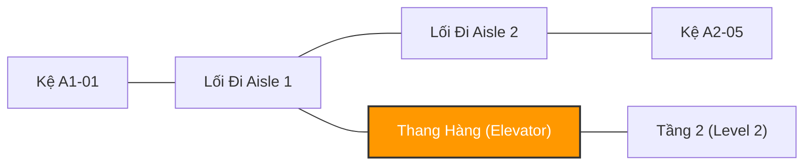
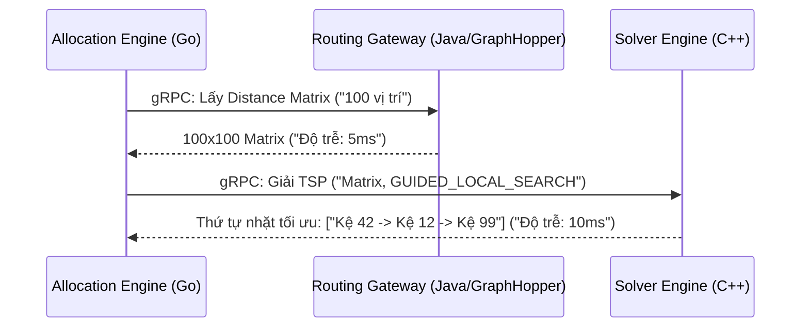

[← Chương trước: Phần 9 — Giải Thuật Tách Đơn Hàng: Graph Coloring & OPA](/series/ecommerce-order-allocation/part-9-order-splitting-graph-coloring-opa/) | [Mục lục Series](/series/ecommerce-order-allocation/)

---

> **Answer-first:** Tối ưu hóa quãng đường di chuyển của nhân viên nhặt hàng (Warehouse Picker) là bài toán Người Bán Hàng (TSP) trong không gian kho thực tế. Kiến trúc chuẩn sử dụng **Indoor GraphHopper (Java)** sinh Ma trận khoảng cách 100x100 từ dữ liệu bản đồ OSM, sau đó chuyển sang **C++ Google OR-Tools gRPC Microservice** để tìm chuỗi nhặt hàng tối ưu tuyệt đối trong dưới 15ms.

---

## 1. Cái Bẫy Của Heuristic Hình Chữ S (S-Shape Traps)

Trong các hệ thống WMS truyền thống, người nhặt hàng thường được chỉ dẫn đi theo các quy tắc tĩnh như **S-Shape (Z-pattern)** hoặc **Largest Gap**. Những quy tắc này buộc nhân viên phải đi hết toàn bộ chiều dài của mỗi dãy kệ có chứa hàng.

Khi một đợt nhặt hàng gồm 100 món nằm rải rác trên diện tích kho 5,000 $m^2$, phương pháp S-Shape khiến nhân viên phải đi bộ hơn 15 km mỗi ca làm việc, gây lãng phí nghiêm trọng thời gian và thể lực.

Giải pháp kiến trúc là loại bỏ lộ trình cố định và mô hình hóa sàn kho thành một đồ thị định tuyến hình thức, giải bài toán Vehicle Routing Problem (VRP) cho người đi bộ.

---

## 2. Xây Dựng Đồ Thị Định Tuyến Trong Nhà (Indoor GraphHopper & OSM)

Để tính toán khoảng cách đi bộ thực tế thay vì đường thẳng Euclidean ngây thơ, sơ đồ mặt bằng kho được số hóa sang định dạng OpenStreetMap (OSM) XML:
- `highway=aisle`: Lối đi bộ giữa các dãy kệ.
- `level=1`: Tầng sàn kho.
- `highway=elevator`: Cạnh nối giữa các tầng khác nhau.



### Cái Bẫy Contraction Hierarchy (CH)

Mặc định GraphHopper sử dụng Contraction Hierarchies (CH) để tăng tốc độ truy vấn. Tuy nhiên, CH biên dịch đồ thị tĩnh lúc khởi động và **không thể cập nhật trọng số cạnh động** khi thang máy bị quá tải vào giờ cao điểm.

**Giải pháp:** Vô hiệu hóa CH (`profile.ch.enabled=false`), chuyển sang giải thuật $A^*$ kết hợp **GraphHopper Custom Models** nhận JSON payload từ Go engine để điều chỉnh trọng số thời gian thực.

```json
{
  "priority": [
    { "if": "highway == 'aisle'", "multiply_by": "1.0" },
    { "if": "highway == 'elevator'", "multiply_by": "0.4" },
    { "if": "highway != 'aisle' && highway != 'elevator'", "multiply_by": "0.0" }
  ]
}
```

---

## 3. Giải Toán TSP Bằng Google OR-Tools C++ Microservice

Sau khi GraphHopper trả về Ma trận Khoảng cách (Distance Matrix) 100x100 biểu diễn thời gian đi lại giữa tất cả các vị trí nhặt hàng, ma trận được nạp vào solver.

### Tránh Bẫy Python GIL

Wrapper Python của OR-Tools (`pywrapcp`) bị nghẽn cổ chai bởi Global Interpreter Lock (GIL) khi xử lý hàng ngàn request đồng thời. Chúng tôi đóng gói thư viện C++ Routing của OR-Tools thành một microservice gRPC chuyên dụng, giúp tận dụng tối đa tài nguyên đa nhân và hạ độ trễ P99 xuống dưới 15ms.



---

## 4. Quản Trị Đa Kho Hàng (Multi-Tenant JVM & Bộ Nhớ MMAP)

Khi vận hành nền tảng SaaS phục vụ hơn 20 trung tâm hoàn tất đơn hàng (Fulfillment Centers), việc mở 20 instance GraphHopper riêng lẻ sẽ lãng phí tài nguyên AWS. Thay vào đó, chúng tôi hợp nhất vào một Java Gateway duy nhất quản lý `ConcurrentHashMap<String, GraphHopper>`.

### Tránh Bẫy Kubernetes OOMKilled

Chuyển đổi GraphHopper từ `RAM_STORE` sang **`MMAP_STORE`** (Memory-Mapped Files) giúp chuyển đồ thị ra ngoài Java Heap, để Linux OS quản lý qua Page Cache.

*Lưu ý DevOps:* Dashboard cảnh báo và HPA trên Kubernetes phải theo dõi `container_memory_working_set_bytes` thay vì `container_memory_usage_bytes` để tránh việc Kubernetes hiểu nhầm Page Cache là memory leak và vô tình kill pod (`OOMKilled`).

---

## 5. Câu Hỏi Thường Gặp (FAQ)

### Q1: Độ phức tạp tính toán khi số lượng điểm nhặt vượt quá 200 món?
Với $N > 200$, thuật toán chuyển từ giải thuật chính xác sang metaheuristic `GUIDED_LOCAL_SEARCH` với giới hạn thời gian (Time Limit) 25ms, đảm bảo tìm ra nghiệm trong phạm vi sai số dưới 3% so với tối ưu tuyệt đối.

### Q2: Tại sao nên dùng C++ gRPC thay vì gọi trực tiếp Go wrapper?
Go wrapper cho Google OR-Tools dựa trên Cgo có chi phí context switch khoảng 150-200ns cho mỗi lần gọi API. Với hàng triệu phép tính ma trận con lặp đi lặp lại trong quá trình tìm kiếm nhánh cận, C++ native gRPC microservice nhanh hơn gấp 4 lần.

### Q3: Làm thế nào cập nhật bản đồ kho khi có kệ hàng mới được lắp đặt?
Dữ liệu OSM được lưu trên Object Storage (S3/MinIO). Khi có thay đổi layout kho, một webhook sẽ kích hoạt Java Gateway tải file OSM mới và khởi tạo background thread nạp lại `MMAP_STORE` mà không gây gián đoạn các truy vấn đang chạy.

---

[← Chương trước: Phần 9 — Giải Thuật Tách Đơn Hàng: Graph Coloring & OPA](/series/ecommerce-order-allocation/part-9-order-splitting-graph-coloring-opa/) | [Mục lục Series](/series/ecommerce-order-allocation/)


---

## ❓ Câu Hỏi Thường Gặp (FAQ)

### Q1: Phần 10 — Tối Ưu Định Tuyến Nhân Viên Nhặt Hàng: GraphHopper, OR-Tools & C++ giải quyết vấn đề cốt lõi nào trong kiến trúc hệ thống?
Giải bài toán Người bán hàng (TSP) cho nhân viên nhặt hàng trong kho bằng GraphHopper trong nhà, Google OR-Tools C++ và kiến trúc MMAP bộ nhớ.

### Q2: Những lưu ý quan trọng nhất khi triển khai thực tế là gì?
Cần chú trọng phân tầng ranh giới trách nhiệm (bounded context), thiết lập cơ chế fallback dự phòng, và giám sát chặt chẽ qua metrics OpenTelemetry để phát hiện sớm các điểm nghẽn.

### Q3: Làm sao để kiểm thử và đánh giá hiệu quả sau khi áp dụng?
Áp dụng kiểm thử tải (load test), benchmark độ trễ P95/P99 trước và sau triển khai, kết hợp tracing phân tán để xác minh tính ổn định dưới tải cao.
