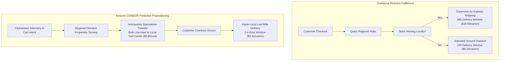
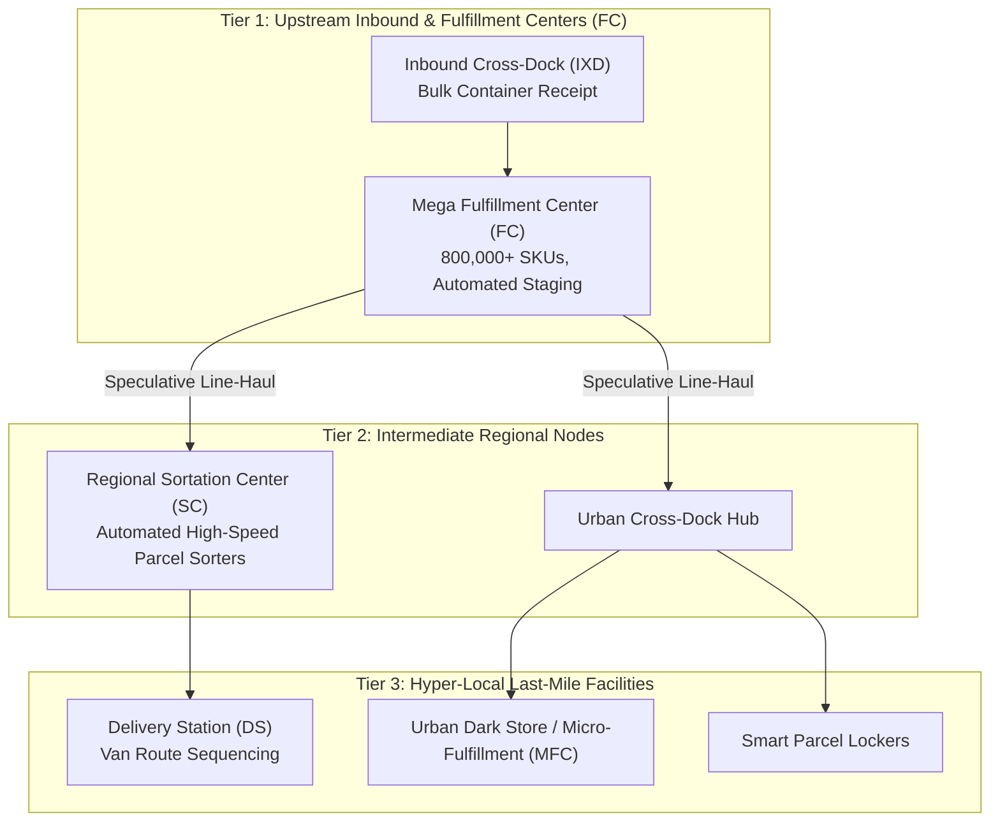
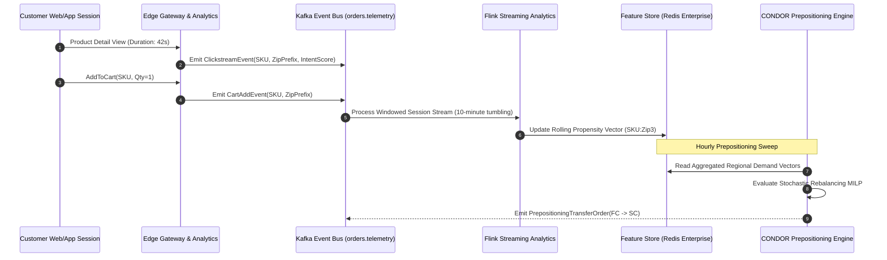
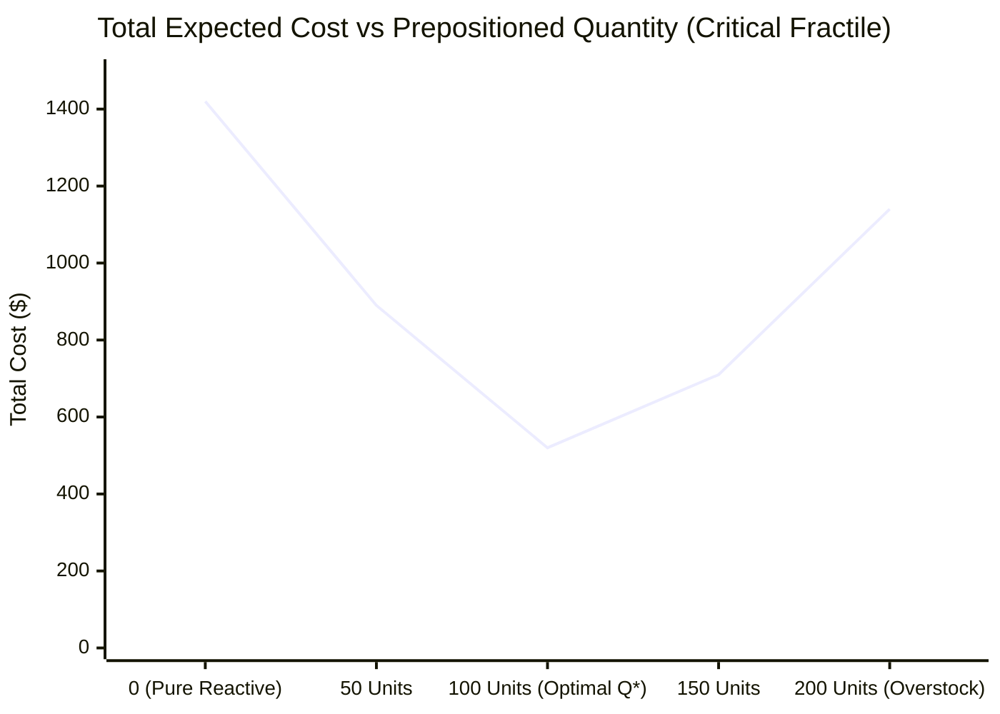
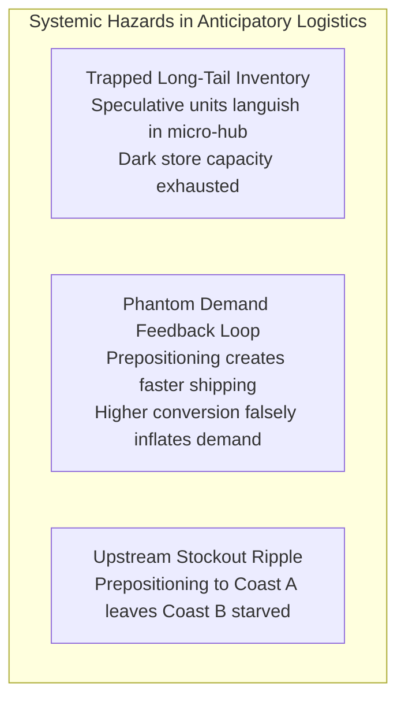
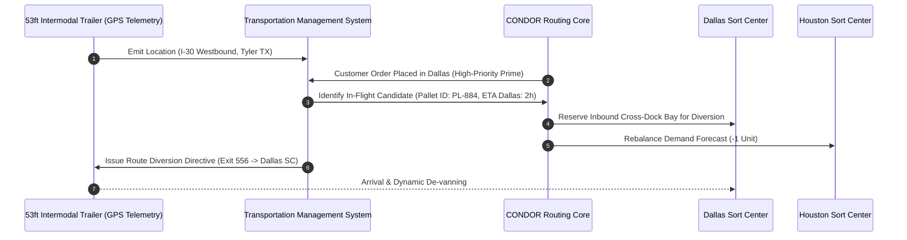

[← Previous Chapter: Part 3: Allocation Algorithms](/series/ecommerce-order-allocation/part-3-allocation-algorithms/) | [Series Hub](/series/ecommerce-order-allocation/) | [Next Chapter: Part 5: Split Shipments & Last-Mile Consolidation →](/series/ecommerce-order-allocation/part-5-split-consolidation-lastmile/)

---

> **Prerequisite:** Understanding of distributed event streaming (Kafka/Flink), time-series forecasting models, multi-tier logistics topologies, and stateful microservices.

> **Answer-first:** Amazon CONDOR revolutionized global e-commerce logistics by replacing reactive order routing with predictive multi-echelon anticipatory shipping algorithms. By forecasting regional customer purchase propensities using clickstream telemetry and prepositioning high-velocity inventory at local sortation centers prior to checkout, CONDOR reduces average transit times from 48 hours to same-day delivery while slashing long-haul line-haul expenses.

---

## 1. The Paradigm Shift: Reactive Routing vs. Predictive Logistics

Traditional e-commerce supply chains are fundamentally reactive: an order is submitted by a customer, payment is authorized, and the allocation engine queries physical warehouse nodes to determine where to pick, pack, and label the carton. 

Under reactive models, fulfilling same-day or next-day delivery commitments requires maintaining vast, redundant stockpiles of every SKU across all regional nodes—an impossible economic burden that drives inventory holding costs through the ceiling.

Amazon disrupted this model by patenting and deploying **Anticipatory Shipping** and the **CONDOR (Continuous Optimization & Network Dynamic Order Routing)** engine:



### Core Economic Mechanics of Anticipatory Prepositioning
1. **Line-Haul Economies of Scale:** Moving 10,000 speculative units in a dedicated 53-foot intermodal dry van trailer from an inland Fulfillment Center (FC) to an urban Sortation Center (SC) costs approximately **$0.08 per unit-mile**. In contrast, dispatching individual parcels via express air freight costs **$1.85 per unit-mile**.
2. **Compressing Delivery Latency:** Prepositioning inventory within a 30-mile radius of the target demographic transforms 2-day transit times into sub-4-hour door-to-door deliveries.
3. **Mitigating Bullwhip Amplification:** Predictive smoothing prevents spiky order surges from overwhelming fulfillment center dock doors.

---

## 2. Multi-Echelon Network Topology

Anticipatory shipping does not move cartons directly to customer doorsteps prior to purchase; rather, it stages inventory progressively through a hierarchical multi-echelon logistics network:



### Facility Roles in the CONDOR Topology
- **Inbound Cross-Dock (IXD):** Ingests ocean shipping containers and full truckload supplier shipments, breaking bulk pallets into sorted tote loads without long-term storage.
- **Mega Fulfillment Center (FC):** High-density robotic warehouse holding broad long-tail catalog inventory (millions of SKUs).
- **Regional Sortation Center (SC):** High-velocity cross-dock facilities where trucks arrive from multiple FCs, parcels are sorted by postal zip codes, and consolidated trailers depart for local delivery stations.
- **Delivery Station (DS):** The final logistics waypoint where packages are loaded into last-mile delivery vans sequenced by individual street addresses.

---

## 3. Real-Time Telemetry & Propensity Scoring Pipeline

The predictive engine continuously ingests multi-channel telemetry to calculate regional demand propensity scores. The data ingestion architecture relies on Apache Kafka, Apache Flink, and vector search indices:



### Feature Vectors for Propensity Estimation
The machine learning scoring model computes a purchase probability $P(\text{buy} \mid \text{SKU}, z, \Delta t)$ for a 3-digit postal zip prefix $z$ over time window $\Delta t$:

$$\mathbf{x}_{(i, z)} = \big[ \text{CTR}_{i, z}, \; \text{CartAdds}_{i, z}, \; \text{WishlistAdds}_{i, z}, \; \text{LocalWeatherForecast}_z, \; \text{HistoricalVelocity}_{i, z}, \; \text{PriceDiscountPercentage}_i \big]$$

The logistic propensity score is evaluated via Gradient Boosted Decision Trees (LightGBM/XGBoost) running on real-time streaming feature stores:

$$P(\text{buy}) = \frac{1}{1 + e^{-\mathbf{w}^T \mathbf{x}_{(i, z)}}}$$

---

## 4. Mathematical Formulation: Stochastic Inventory Prepositioning

Prepositioning decisions must balance the cost of speculative shipping against the risk of unsold inventory requiring costly reverse logistics (re-traversing the line-haul network back to an upstream FC).

### Sets and Cost Parameters
- $I$: Set of high-velocity candidate SKUs.
- $Z$: Set of 3-digit regional zip zones.
- $h_{i}$: Holding cost per day of SKU $i$ at an urban delivery station.
- $c_{\text{spec}}$: Bulk speculative line-haul transport cost per unit ($0.85).
- $c_{\text{react}}$: Reactive emergency air transport cost per unit ($14.20).
- $c_{\text{rev}}$: Reverse logistics transport cost if speculative stock goes unsold ($2.10).
- $D_{i, z}$: Random variable representing customer demand in zone $z$, distributed with probability density $f_{i, z}(\xi)$.

The objective minimizes the expected total fulfillment and reverse logistics cost:

$$\min_{Q_{i, z}} \sum_{i \in I} \sum_{z \in Z} \left( c_{\text{spec}} \cdot Q_{i, z} + c_{\text{react}} \cdot \mathbb{E}\left[ \max(0, D_{i, z} - Q_{i, z}) \right] + c_{\text{rev}} \cdot \mathbb{E}\left[ \max(0, Q_{i, z} - D_{i, z}) \right] + h_i \cdot Q_{i, z} \right)$$

This formulation represents a **Multi-Location Newsvendor Problem with Recourse**. The optimal stocking quantity $Q^*_{i, z}$ satisfies the critical fractile condition:

$$F_{i, z}(Q^*_{i, z}) = \frac{c_{\text{react}} - c_{\text{spec}}}{c_{\text{react}} - c_{\text{spec}} + c_{\text{rev}} + h_i}$$



---

## 5. Production Go Implementation: CONDOR Prepositioning Controller

Below is the production Go service responsible for aggregating regional demand signals, computing critical fractiles, and generating automated inter-facility transfer requests:

```go
package condor

import (
	"context"
	"fmt"
	"math"
	"sync"
	"time"
)

// RegionalDemandSignal encapsulates streaming demand telemetry.
type RegionalDemandSignal struct {
	SKU              string
	ZipPrefix        string // 3-digit postal code (e.g., "941")
	MeanDemand       float64
	StdDevDemand     float64
	ReactiveAirCost  float64 // Cost if dispatched reactively via air ($14.20)
	SpeculativeCost  float64 // Cost to preposition in bulk via linehaul ($0.85)
	ReverseLogistics float64 // Cost to return unsold inventory ($2.10)
	HoldingCostPerUnit float64
}

// TransferOrder represents an automated stock relocation directive.
type TransferOrder struct {
	TransferID   string
	SKU          string
	SourceFC     string
	DestSC       string
	Quantity     int
	CreatedAt    time.Time
	CriticalRatio float64
}

// PrepositioningController manages predictive transfers.
type PrepositioningController struct {
	mu           sync.RWMutex
	sourceNodes  map[string]string // ZipPrefix -> Upstream FC ID
	destNodes    map[string]string // ZipPrefix -> Local Sort Center ID
}

// NewPrepositioningController initializes the controller with network topology.
func NewPrepositioningController(sourceNodes, destNodes map[string]string) *PrepositioningController {
	return &PrepositioningController{
		sourceNodes: sourceNodes,
		destNodes:   destNodes,
	}
}

// EvaluatePrepositioning computes optimal Newsvendor stocking and issues transfer orders.
func (c *PrepositioningController) EvaluatePrepositioning(
	ctx context.Context,
	signals []RegionalDemandSignal,
) ([]TransferOrder, error) {
	c.mu.RLock()
	defer c.mu.RUnlock()

	var transfers []TransferOrder

	for _, sig := range signals {
		// 1. Calculate the Newsvendor Critical Fractile
		numerator := sig.ReactiveAirCost - sig.SpeculativeCost
		denominator := numerator + sig.ReverseLogistics + sig.HoldingCostPerUnit
		if denominator <= 0 {
			continue
		}

		criticalRatio := numerator / denominator

		// 2. Compute Inverse Normal CDF approximation (probit function)
		zScore := normInverse(criticalRatio)

		// 3. Compute optimal prepositioning quantity Q* = mu + z * sigma
		optimalQ := sig.MeanDemand + zScore*sig.StdDevDemand
		recommendedUnits := int(math.Round(math.Max(0, optimalQ)))

		if recommendedUnits <= 0 {
			continue
		}

		srcFC, okSrc := c.sourceNodes[sig.ZipPrefix]
		dstSC, okDst := c.destNodes[sig.ZipPrefix]
		if !okSrc || !okDst {
			continue
		}

		transfers = append(transfers, TransferOrder{
			TransferID:    fmt.Sprintf("TRF-%s-%s-%d", sig.SKU, sig.ZipPrefix, time.Now().UnixNano()),
			SKU:           sig.SKU,
			SourceFC:      srcFC,
			DestSC:        dstSC,
			Quantity:      recommendedUnits,
			CreatedAt:     time.Now(),
			CriticalRatio: criticalRatio,
		})
	}

	return transfers, nil
}

// normInverse computes Abramowitz & Stegun rational approximation of Inverse Normal CDF.
func normInverse(p float64) float64 {
	if p <= 0.0 {
		return -4.0
	}
	if p >= 1.0 {
		return 4.0
	}

	// Rational approximation coefficients
	const (
		c0 = 2.515517
		c1 = 0.802853
		c2 = 0.010328
		d1 = 1.432788
		d2 = 0.189269
		d3 = 0.001308
	)

	var t float64
	var sign float64

	if p < 0.5 {
		t = math.Sqrt(-2.0 * math.Log(p))
		sign = -1.0
	} else {
		t = math.Sqrt(-2.0 * math.Log(1.0-p))
		sign = 1.0
	}

	numerator := c0 + c1*t + c2*t*t
	denominator := 1.0 + d1*t + d2*t*t + d3*t*t*t
	return sign * (t - (numerator / denominator))
}
```

---

## 6. Risk Engineering: Avoiding Trapped Inventory & Bullwhip Amplification

While anticipatory shipping unlocks immense customer satisfaction benefits, poorly calibrated models introduce severe operational hazards:



### Dampening Techniques
1. **Dynamic Virtual Pools:** Units staged at regional sortation centers remain visible to the global allocation engine. If demand fails to materialize locally within 24 hours, the units are dynamically released for line-haul forwarding to adjacent zones.
2. **Strict Velocity Gating:** Only SKUs exhibiting high sustained sales velocity (Coefficient of Variation $CV = \frac{\sigma}{\mu} < 0.35$) are eligible for anticipatory transfers. Long-tail products are strictly restricted to centralized Mega FCs.

---


---

## 6. In-Transit Interception & Dynamic Trajectory Modification

A crowning achievement of Amazon's anticipatory shipping architecture is the ability to modify the destination of physical goods while trailers or delivery vehicles are already in motion (**In-Flight Interception**). If a customer in Dallas places an order for a laptop, and an anticipatory transfer truck carrying that identical laptop from Memphis to Houston is currently passing through northeast Texas, CONDOR dynamically re-addresses the pallet at the next highway waypoint:



### Complete Go Implementation for In-Flight Pallet Interception
The following service continuously monitors in-flight trailer telemetry, solves dynamic diversion feasibility, and updates electronic waybills:

```go
package inflight

import (
	"context"
	"fmt"
	"math"
	"time"
)

// GeoCoordinate represents geographic coordinates.
type GeoCoordinate struct {
	Latitude  float64
	Longitude float64
}

// InFlightTrailer represents a line-haul vehicle currently on the road.
type InFlightTrailer struct {
	TrailerID       string
	CurrentLocation GeoCoordinate
	DestinationHub  string
	SpeedMph        float64
	ManifestSKUs    map[string]int // SKU -> Qty on board
	HeadingDegrees  float64
}

// InterceptionCandidate evaluates feasibility of diverting a trailer.
type InterceptionCandidate struct {
	TrailerID    string
	TargetHubID  string
	DetourMiles  float64
	DelayMinutes float64
	UnitCostDelta float64
}

// InterceptionEngine orchestrates in-transit re-routing.
type InterceptionEngine struct {
	hubLocations map[string]GeoCoordinate
}

// NewInterceptionEngine initializes the engine with physical hub coordinates.
func NewInterceptionEngine(hubs map[string]GeoCoordinate) *InterceptionEngine {
	return &InterceptionEngine{hubLocations: hubs}
}

// FindBestDiversion locates the lowest-cost in-flight trailer carrying the requested SKU.
func (e *InterceptionEngine) FindBestDiversion(
	ctx context.Context,
	sku string,
	destinationHub string,
	trailers []InFlightTrailer,
	maxDelayMinutes float64,
) (*InterceptionCandidate, error) {
	destCoord, ok := e.hubLocations[destinationHub]
	if !ok {
		return nil, fmt.Errorf("unknown destination hub: %s", destinationHub)
	}

	var bestCandidate *InterceptionCandidate
	minDetour := math.MaxFloat64

	for _, tr := range trailers {
		qty, hasSKU := tr.ManifestSKUs[sku]
		if !hasSKU || qty <= 0 {
			continue
		}

		// Calculate direct distance from trailer's current location to target hub
		distMiles := haversineDistance(tr.CurrentLocation, destCoord)
		travelHours := distMiles / math.Max(tr.SpeedMph, 30.0)
		delayMins := travelHours * 60.0

		if delayMins <= maxDelayMinutes && distMiles < minDetour {
			minDetour = distMiles
			bestCandidate = &InterceptionCandidate{
				TrailerID:    tr.TrailerID,
				TargetHubID:  destinationHub,
				DetourMiles:  distMiles,
				DelayMinutes: delayMins,
				UnitCostDelta: distMiles * 0.045, // Marginal fuel & driver tariff
			}
		}
	}

	if bestCandidate == nil {
		return nil, fmt.Errorf("no eligible in-flight trailer found for SKU %s meeting SLA", sku)
	}

	return bestCandidate, nil
}

// haversineDistance calculates spherical great-circle distance in miles.
func haversineDistance(p1, p2 GeoCoordinate) float64 {
	const earthRadiusMiles = 3958.8
	dLat := (p2.Latitude - p1.Latitude) * (math.Pi / 180.0)
	dLon := (p2.Longitude - p1.Longitude) * (math.Pi / 180.0)

	lat1 := p1.Latitude * (math.Pi / 180.0)
	lat2 := p2.Latitude * (math.Pi / 180.0)

	a := math.Sin(dLat/2)*math.Sin(dLat/2) +
		math.Sin(dLon/2)*math.Sin(dLon/2)*math.Cos(lat1)*math.Cos(lat2)
	c := 2 * math.Atan2(math.Sqrt(a), math.Sqrt(1-a))

	return earthRadiusMiles * c
}
```

---

## 7. Clickstream Telemetry Data Contracts (Protobuf & Kafka Schema)

To power real-time demand scoring across millions of concurrent users without data corruption or parsing bottlenecks, event streaming pipelines require strict Protobuf contract definitions:

```protobuf
syntax = "proto3";

package telemetry.v1;

message UserSessionTelemetry {
  string session_id = 1;
  string anonymous_user_hash = 2;
  string regional_zip_prefix = 3; // 3-digit prefix, e.g. "752"
  int64 timestamp_epoch_ms = 4;
  
  enum InteractionType {
    INTERACTION_TYPE_UNSPECIFIED = 0;
    PAGE_VIEW = 1;
    SCROLL_DEPTH = 2;
    CART_ADD = 3;
    WISHLIST_ADD = 4;
    CHECKOUT_STEP = 5;
  }
  
  InteractionType event_type = 5;
  string sku = 6;
  int32 dwell_time_seconds = 7;
  double estimated_intent_score = 8;
}
```

By decoupling PII from telemetry streams and aggregating signals into regional 3-digit postal partitions, supply chain organizations comply with GDPR and CCPA while giving the predictive allocation engine high-fidelity demand heatmaps.

## 8. Architectural Integrations

This anticipatory logistics architecture connects directly into our core distributed systems engineering literature:
- [Go & Microservices Architecture Hub](/posts/go-microservices/) — Resilient stream processing and worker concurrency in Go.
- [21-Service E-Commerce System Design](/posts/architecting-21-service-ecommerce-golang-ddd/) — Inventory ledger and distributed transaction guarantees.
- Explore full engineering curricula on our [Sitewide Reading Map](/reading-map/).
- Connect with our logistics system architects via the [Consulting & Hire Page](/hire/).

---

## 9. Frequently Asked Questions (FAQ)


No. That is a common media misconception. Amazon CONDOR anticipatory shipping prepositions inventory to intermediate regional Sortation Centers (SCs) and local Delivery Stations (DSs) within the customer's postal delivery cluster. The physical package is only labeled with the customer's exact residential street address after the final payment authorization occurs.



Unsold items are managed through a secondary dynamic markdown and cross-zone consolidation engine. If an item exceeds its target dwell time (e.g., 72 hours) at a delivery station, the engine evaluates whether to apply an algorithmic local promotional discount, route the unit to an Amazon Fresh retail store, or consolidate it onto a scheduled return line-haul trailer.



CONDOR does not require personally identifiable customer tracking (PII). Demand forecasting operates exclusively on aggregated, anonymized geographic buckets (3-digit postal code prefixes representing 100,000+ residents). Session telemetry tracks product view density within regional IP blocks without tracking individual user identities.



Anticipatory demand shifts during flash sales require continuous, sub-second event processing. Apache Flink operates on a native true-streaming model (event-by-event with low millisecond latency) with rock-solid RocksDB stateful windowing. Spark Streaming's micro-batch architecture introduces seconds of latency and higher garbage collection jitter on high-frequency clickstream streams.

