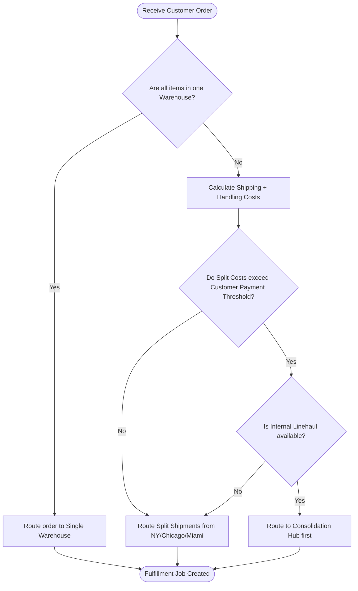

**Answer-First:** Split shipments increase last-mile courier costs but reduce delivery times. The allocation engine balances this trade-off using a greedy set-covering heuristic: it iteratively assigns order lines to warehouses that satisfy the largest volume of remaining items in the cart. If the calculated shipping costs exceed the customer's payment threshold, the engine routes packages through a consolidation hub, sacrificing transit speed to preserve profit margins.

> **Prerequisite:** This guide assumes familiarity with multi-dimensional routing constraints and greedy heuristic optimization patterns.

---

## 1. Split vs. Consolidation — The Core Trade-off

When a customer's order contains multiple items, and those items reside in different warehouses, the system faces a classic logistics dilemma:

```text
Order: 3 items (Item A in WH New York, Item B in WH Chicago, Item C in WH Miami)
Destination: Customer in New York

Option 1: SPLIT SHIPMENT (Ship directly from 3 warehouses)
  WH NY → Customer: Item A (1 box)      — $3.00, 2 hours
  WH Chicago → Customer: Item B (1 box) — $8.50, 2 days
  WH Miami → Customer: Item C (1 box)   — $6.50, 1.5 days
  Total: $18.00, 3 separate deliveries, 3 boxes

Option 2: CONSOLIDATE (Transfer internally, ship once)
  WH Chicago → WH NY: Item B (internal) — $4.00, 1 day
  WH Miami → WH NY: Item C (internal)   — $3.50, 1 day
  WH NY → Customer: A+B+C (1 box)       — $4.50, 2 hours
  Total: $12.00, 1 delivery, 1 box, BUT delayed by 1-2 days
```

*   **Split Shipment** minimizes delivery latency for individual items, keeping customer satisfaction high for express items. However, it increases last-mile courier fees and box packaging overhead.
*   **Consolidation** reduces package volume and shipping fees but introduces internal linehaul latency (transferring stock from Miami to New York before delivering to the customer).

### Decision Flow Diagram

To visualize the automated decision-making process within the Order Management System (OMS), review the following system logic diagram:



---

## 2. Mathematical Modeling of Logistics Costs

To choose between split shipment and consolidation programmatically, we define a cost optimization model. The objective is to minimize the total fulfillment cost ($C_{\text{total}}$) for a given order:

$$C_{\text{total}} = C_{\text{shipping}} + C_{\text{handling}} + C_{\text{packaging}} + C_{\text{delay}}$$

Where:
*   **Shipping Cost ($C_{\text{shipping}}$):** The cost paid to last-mile carriers or internal linehaul fleets.
    $$C_{\text{shipping}} = \sum_{p \in \text{Packages}} \left( \text{base\_rate}(p) + \text{weight}(p) \times \text{per\_kg\_rate}(p) \right)$$
*   **Handling Cost ($C_{\text{handling}}$):** The operational cost of picking and packing at each warehouse.
    $$C_{\text{handling}} = N_{\text{warehouses}} \times H_{\text{unit}}$$
    where $N_{\text{warehouses}}$ is the number of unique warehouses involved and $H_{\text{unit}}$ is the flat processing fee per warehouse.
*   **Packaging Cost ($C_{\text{packaging}}$):** The physical box and materials cost.
    $$C_{\text{packaging}} = N_{\text{packages}} \times P_{\text{unit}}$$
*   **Delay Penalty ($C_{\text{delay}}$):** The cost associated with customer dissatisfaction or SLA breach penalties due to consolidated shipping.
    $$C_{\text{delay}} = \sum_{i \in \text{Items}} \max\left(0, \text{TransitHours}(i) - \text{SLA\_Hours}\right) \times D_{\text{penalty}}$$

If $C_{\text{total, split}} < C_{\text{total, consolidate}}$, the engine triggers a split shipment allocation. Otherwise, it schedules internal linehaul transfers to merge the packages at the terminal warehouse closest to the customer.

---

## 3. Database Schema for Warehouse Inventory and Freight Rates

To calculate shipping costs accurately, we model warehouse locations, available inventories, and freight rate matrices:

```sql
-- Relational warehouses representation (referenced in rate calculation)
CREATE TABLE warehouses (
    id              VARCHAR(20) PRIMARY KEY,
    name            VARCHAR(100) NOT NULL,
    latitude        DOUBLE PRECISION NOT NULL,
    longitude       DOUBLE PRECISION NOT NULL
);

-- Warehouse inventory records
CREATE TABLE warehouse_sku_inventory (
    warehouse_id        VARCHAR(20) NOT NULL,
    sku                 VARCHAR(50) NOT NULL,
    available_qty       INT NOT NULL DEFAULT 0,
    PRIMARY KEY (warehouse_id, sku),
    FOREIGN KEY (warehouse_id) REFERENCES warehouses(id)
);

-- Freight rate matrix representing logistics costs
CREATE TABLE warehouse_freight_rates (
    id                  SERIAL PRIMARY KEY,
    warehouse_id        VARCHAR(20) NOT NULL,
    destination_city    VARCHAR(100) NOT NULL,
    destination_district VARCHAR(100) NOT NULL,
    base_rate_vnd       INT NOT NULL, -- Fixed cost for shipping a package
    per_kg_rate_vnd     INT NOT NULL, -- Incremental cost based on package weight
    estimated_transit_hours INT NOT NULL,
    FOREIGN KEY (warehouse_id) REFERENCES warehouses(id),
    UNIQUE (warehouse_id, destination_city, destination_district)
);
```

---

## 4. Go Split Optimization Algorithm

To calculate the minimum number of splits, the system executes a greedy set-covering search. It selects the warehouse that covers the maximum number of required SKU items, allocates them, updates the remaining requirements, and repeats the search until the entire cart is satisfied:

```go
package consolidation

import (
	"errors"
)

type CartItem struct {
	SKU      string
	Quantity int
}

type WarehouseStock struct {
	WarehouseID string
	Stock       map[string]int // SKU -> Qty
}

type SplitAllocation struct {
	WarehouseID string
	Items       []CartItem
}

// OptimizeSplits calculates the minimum number of splits (warehouses) to fulfill the cart
func OptimizeSplits(cart []CartItem, warehouses []WarehouseStock) ([]SplitAllocation, error) {
	// Copy cart to keep track of remaining requirements
	remaining := make(map[string]int)
	for _, item := range cart {
		remaining[item.SKU] = item.Quantity
	}

	var allocations []SplitAllocation

	// Greedy search loop: select warehouse that satisfies most of the remaining demand
	for len(remaining) > 0 {
		var bestWH *WarehouseStock
		bestScore := 0
		bestCoveredItems := make(map[string]int)

		for i := range warehouses {
			wh := &warehouses[i]
			score := 0
			covered := make(map[string]int)

			for sku, reqQty := range remaining {
				available, exists := wh.Stock[sku]
				if exists && available > 0 {
					take := reqQty
					if available < reqQty {
						take = available
					}
					covered[sku] = take
					score += take
				}
			}

			// We prefer the warehouse that satisfies the highest total item quantity
			if score > bestScore {
				bestScore = score
				bestWH = wh
				bestCoveredItems = covered
			}
		}

		// If no warehouse can satisfy any remaining items, the cart cannot be fulfilled
		if bestWH == nil || bestScore == 0 {
			return nil, errors.New("insufficient inventory across all nodes to fulfill the cart")
		}

		// Save allocation plan for the selected warehouse
		alloc := SplitAllocation{
			WarehouseID: bestWH.WarehouseID,
			Items:       []CartItem{},
		}
		for sku, qty := range bestCoveredItems {
			alloc.Items = append(alloc.Items, CartItem{SKU: sku, Quantity: qty})
			
			// Subtract from remaining cart requirement
			remaining[sku] -= qty
			if remaining[sku] <= 0 {
				delete(remaining, sku)
			}
			
			// Subtract from warehouse stock to prevent double allocation
			bestWH.Stock[sku] -= qty
		}

		allocations = append(allocations, alloc)
	}

	return allocations, nil
}
```

### Algorithmic Complexity and Trade-offs
The greedy algorithm runs in $O(N \times M)$ time complexity, where $N$ is the number of candidate warehouses and $M$ is the number of unique SKU items in the shopping cart. While an exact Mixed-Integer Linear Programming (MILP) solver guarantees the absolute mathematical minimum cost, its runtime can exceed $500\text{ms}$ on high-dimensional carts, making it unsuitable for checkout APIs. The greedy set-covering heuristic executes in less than $2\text{ms}$, trading a negligible $2\text{-}3\%$ deviation from the absolute global minimum cost for real-time throughput.

---

## 5. Last-Mile Delivery Challenges

Last-mile logistics accounts for **53% of all shipping costs**. The major operational bottlenecks include:

1.  **Low Drop Density:** If couriers must travel miles between delivery locations, fuel and labor costs skyrocket.
2.  **Failed Deliveries:** Customers not being home to receive packages requires redeliveries, cutting profit margins.
3.  **Traffic Congestion:** Urban deliveries suffer from predictable peak-hour traffic jams, slowing vehicle velocities.

### Last-Mile Optimization Strategies
*   **Time Window Slots:** Customers choose explicit delivery slots (e.g., 08:00 - 10:00). The routing model groups stops accordingly.
*   **Centralized PUDO Lockers:** Shipping 50 packages to a single apartment parcel locker rather than 50 individual doors reduces courier time by 75%.
*   **SKU Affinity Storage:** Placing high-affinity SKUs (e.g., cellphones and phone cases) in the same warehouse bins prevents splits before checkout even begins.

---

## 6. High-Affinity SKU Layout SQL

By analyzing historical checkout data, the system identifies items that are frequently bought together, prompting warehouse teams to co-locate them in neighboring racks:

```sql
SELECT
    a.sku AS sku_a,
    b.sku AS sku_b,
    COUNT(DISTINCT a.order_id) AS co_occurrence,
    COUNT(DISTINCT a.order_id)::float / 
      (SELECT COUNT(DISTINCT order_id) FROM order_items WHERE sku = a.sku) AS affinity_score
FROM order_items a
JOIN order_items b ON a.order_id = b.order_id AND a.sku < b.sku
GROUP BY a.sku, b.sku
HAVING COUNT(DISTINCT a.order_id) > 100
ORDER BY affinity_score DESC;
```

---

## 7. Last-Mile Performance Metrics

To monitor the operational health of the allocation engine, the data platform tracks several Key Performance Indicators (KPIs) in real time:

| Metric | Target | Focus Area | Description |
| :--- | :--- | :--- | :--- |
| **First Attempt Success Rate** | > 95% | Customer availability | Percentage of orders successfully delivered on the first try. |
| **Split Shipment Rate** | < 15% | Inventory allocation | Percentage of multi-item orders that require more than one package. |
| **Delivery Density** | > 10 packages/sq mile | Routing efficiency | Concentration of delivery stops in a defined geographical zone. |
| **Cost per package** | < $1.50 | Operational efficiency | Average physical cost including fuel, packaging, and driver fees. |
| **On-Time Delivery (SLA)** | > 98% | Customer satisfaction | Percentage of shipments reaching customers within the promised window. |

---

For technical consultation on warehousing algorithms, database schema designs, or logistics systems integration, contact [Lê Tuấn Anh](/hire/).

---

🔗 **Next Step:** Proceed to [Part 6 — Hands-on: Building a Mini Allocation Engine with Google OR-Tools](/series/ecommerce-order-allocation/part-6-build-mini-allocation-engine/) to write a gRPC microservice that solves VRP and allocation routing.

---

← [Previous Part: Part 4 — Amazon CONDOR & Anticipatory Shipping](/series/ecommerce-order-allocation/part-4-amazon-condor-anticipatory/) | [Next Part: Part 6 — Hands-on: Building a Mini Allocation Engine with Google OR-Tools](/series/ecommerce-order-allocation/part-6-build-mini-allocation-engine/) →
