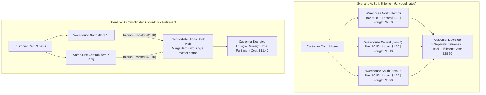
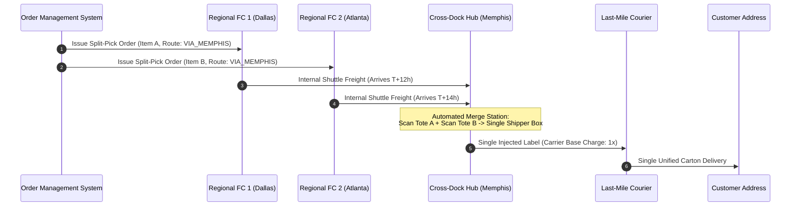
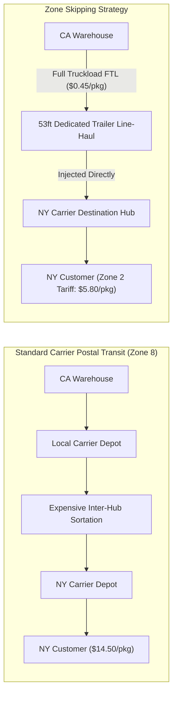
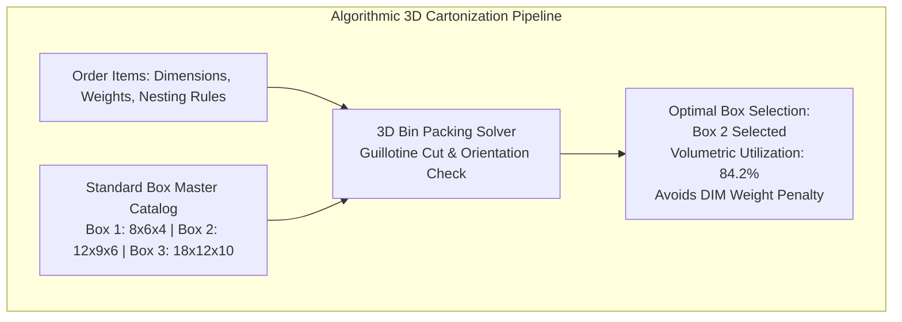
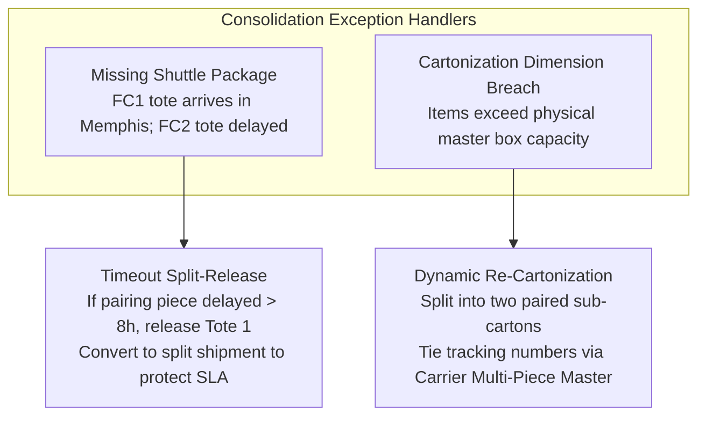
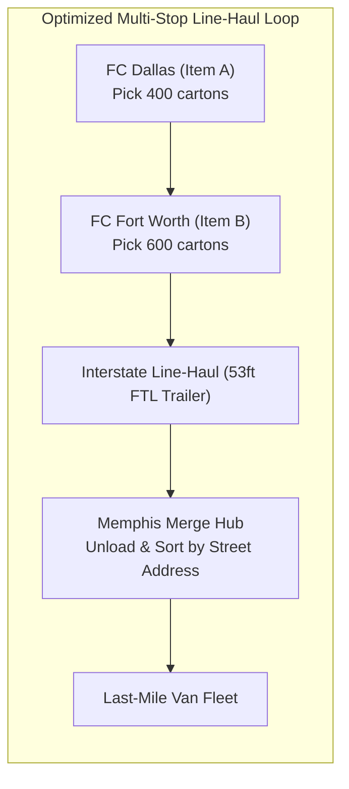

[← Previous Chapter: Part 4: Amazon CONDOR](/series/ecommerce-order-allocation/part-4-amazon-condor-anticipatory/) | [Series Hub](/series/ecommerce-order-allocation/) | [Next Chapter: Part 6: Building an Allocation Engine in Go →](/series/ecommerce-order-allocation/part-6-build-mini-allocation-engine/)

---

> **Prerequisite:** Knowledge of parcel carrier rating structures, dimensional weight (DIM) calculations, cross-docking operations, and concurrent Go backend services.

> **Answer-first:** Split shipments represent the single largest margin drain in modern multi-warehouse retail, inflating last-mile delivery costs by up to 300 percent per order. Implementing intermediate cross-dock consolidation hubs, line-haul zone skipping trailers, and automated multi-carrier rate shopping algorithms enables retailers to minimize package fragmentation, optimize dimensional weight tariffs, and meet stringent customer delivery SLAs.

---

## 1. The Catastrophic Unit Economics of Split Shipments

In multi-node omnichannel fulfillment, few operational defects degrade gross margins as severely as **order splitting**. When a customer orders four items that are fulfilled from three separate distribution centers, the retailer bears the financial penalty of three corrugated shipping boxes, three labor packing operations, and three separate parcel carrier shipping labels.


```mermaid
flowchart TD
    subgraph SplitShipmentScenario["Scenario A: Split Shipment (Uncoordinated)"]
        CartA["Customer Cart: 3 Items"]
        CartA --> WH1["Warehouse North (Item 1)<br/>Box: $0.80 | Labor: $1.20 | Freight: $7.50"]
        CartA --> WH2["Warehouse Central (Item 2)<br/>Box: $0.80 | Labor: $1.20 | Freight: $8.10"]
        CartA --> WH3["Warehouse South (Item 3)<br/>Box: $0.80 | Labor: $1.20 | Freight: $6.90"]
        WH1 & WH2 & WH3 --> DoorA["Customer Doorstep<br/>3 Separate Deliveries | Total Fulfillment Cost: $28.50"]
    end

    subgraph ConsolidatedScenario["Scenario B: Consolidated Cross-Dock Fulfillment"]
        CartB["Customer Cart: 3 Items"]
        CartB --> WHB1["Warehouse North (Item 1)"]
        CartB --> WHB2["Warehouse Central (Item 2 & 3)"]
        WHB1 & WHB2 -- Internal Transfer ($1.10) --> XDock["Intermediate Cross-Dock Hub<br/>Merge items into single master carton"]
        XDock --> DoorB["Customer Doorstep<br/>1 Single Delivery | Total Fulfillment Cost: $12.40"]
    end
```

### The Financial Multiplier Effect
Parcel delivery carriers (UPS, FedEx, DHL, national postal services) enforce a **Base Stop Charge** (typically $4.50 to $6.20 per package) regardless of carton weight. Delivering three 1-pound packages costs substantially more than delivering a single 3-pound carton:

| Metric | Single Consolidated Box | 2-Package Split | 3-Package Split |
| :--- | :---: | :---: | :---: |
| Corrugated Packaging & Dunnage | $0.85 | $1.70 (+100%) | $2.55 (+200%) |
| Warehouse Picking & Pack Labor | $1.40 | $2.80 (+100%) | $4.20 (+200%) |
| Parcel Carrier Base Stop Charges | $5.50 | $11.00 (+100%) | $16.50 (+200%) |
| Weight Tariff (Zone 5, Ground) | $2.20 | $3.40 (+54%) | $4.80 (+118%) |
| **Total Out-of-Pocket Fulfillment Cost** | **$9.95** | **$18.90 (+90%)** | **$28.05 (+182%)** |
| Customer NPS / CSAT Impact | Baseline (+68) | -14 Points | -38 Points |

Beyond direct balance-sheet losses, split shipments trigger significant customer friction: packages arrive on different days, cartons are left unattended on doorsteps, and missing-package inquiries surge by 400%.

---

## 2. Cross-Dock Consolidation Hub Architecture

To combat split parcel inflation without requiring massive inventory duplication, leading enterprise supply chains deploy **Intermediate Consolidation Cross-Docks**:


```mermaid
sequenceDiagram
    autonumber
    participant OMS as Order Management System
    participant FC1 as Regional FC 1 (Dallas)
    participant FC2 as Regional FC 2 (Atlanta)
    participant Hub as Cross-Dock Hub (Memphis)
    participant Carrier as Last-Mile Courier
    participant Cust as Customer Address

    OMS->>FC1: Issue Split-Pick Order (Item A, Route: VIA_MEMPHIS)
    OMS->>FC2: Issue Split-Pick Order (Item B, Route: VIA_MEMPHIS)
    
    FC1->>Hub: Internal Shuttle Freight (Arrives T+12h)
    FC2->>Hub: Internal Shuttle Freight (Arrives T+14h)
    
    Note over Hub: Automated Merge Station:<br/>Scan Tote A + Scan Tote B -> Single Shipper Box
    Hub->>Carrier: Single Injected Label (Carrier Base Charge: 1x)
    Carrier->>Cust: Single Unified Carton Delivery
```

### Consolidation Decision Logic: When to Cross-Dock?
Cross-docking is not universally beneficial: moving parcels through an intermediate merge facility introduces handling labor ($1.25 per carton) and extends transit time by 12 to 24 hours.

The decision engine evaluates the following threshold equation:

$$\text{Savings} = \left( \sum_{k=1}^K C_{\text{direct}}(w_k) \right) - \left( \sum_{k=1}^K C_{\text{shuttle}}(w_k, \text{hub}) + C_{\text{merge}}(\text{hub}) + C_{\text{lastmile}}(\text{hub}) \right)$$

If $\text{Savings} > \text{Threshold}_{\text{SLA}}$, the order is dynamically routed through the consolidation cross-dock.

---

## 3. Zone Skipping & Line-Haul Consolidation

For nationwide e-commerce platforms, **Zone Skipping** bypasses national parcel carrier origin hubs entirely. Rather than handing individual packages to a local carrier depot in California for cross-country transit to New York (incurring expensive Zone 8 cross-country commercial tariffs), the retailer consolidates thousands of New York-bound packages into a 53-foot line-haul trailer:


```mermaid
graph LR
    subgraph TraditionalCarrier["Standard Carrier Postal Transit (Zone 8)"]
        CA_Origin["CA Warehouse"] --> CA_Depot["Local Carrier Depot"]
        CA_Depot --> AirLine["Expensive Inter-Hub Sortation"]
        AirLine --> NY_Depot["NY Carrier Depot"]
        NY_Depot --> NY_Door["NY Customer ($14.50/pkg)"]
    end

    subgraph ZoneSkipping["Zone Skipping Strategy"]
        CA_Origin2["CA Warehouse"] -- Full Truckload FTL ($0.45/pkg) --> Intermodal["53ft Dedicated Trailer Line-Haul"]
        Intermodal -- Injected Directly --> NY_Sort["NY Carrier Destination Hub"]
        NY_Sort --> NY_Door2["NY Customer (Zone 2 Tariff: $5.80/pkg)"]
    end
```

### Economic Mechanics of Zone Injection
By trucking aggregated parcels across the continent in bulk and injecting them directly into the carrier's destination metro facility (Destination Delivery Unit - DDU), the parcel tariff drops from a **Zone 8 rate ($14.50)** to a **Zone 2 local rate ($5.80)**. Factoring in trailer line-haul freight ($0.45 per unit), net fulfillment savings exceed **$8.25 per carton**.

---

## 4. Dimensional Weight (DIM) & Automated Cartonization

Carrier freight charges are governed by Dimensional Weight (DIM weight). The billable weight is defined as:

$$\text{Billable Weight} = \max\left(\text{Actual Scale Weight}, \; \frac{L \times W \times H}{\text{DIM Divisor}}\right)$$

Where the standard domestic commercial DIM divisor is 139 (in inches/lbs) or 5,000 (in cm/kg). Packing a small 1-pound item into an oversized cardboard box incurs billable charges for 6 pounds.


```mermaid
flowchart TD
    subgraph CartonizationPipeline["Algorithmic 3D Cartonization Pipeline"]
        Items["Order Items: Dimensions, Weights, Nesting Rules"]
        CartonLib["Standard Box Master Catalog<br/>Box 1: 8x6x4 | Box 2: 12x9x6 | Box 3: 18x12x10"]
        
        Engine["3D Bin Packing Solver<br/>Guillotine Cut & Orientation Check"]
        Items & CartonLib --> Engine
        
        Engine --> Result["Optimal Box Selection:<br/>Box 2 Selected<br/>Volumetric Utilization: 84.2%<br/>Avoids DIM Weight Penalty"]
    end
```

---

## 5. Complete Production Go Multi-Carrier Rate Shopping Engine

The following Go engine evaluates multi-carrier rate tables (FedEx, UPS, USPS, Regional Couriers), calculates dimensional weight tariffs, applies business contract discounts, and selects the optimal carrier satisfying the delivery SLA:

```go
package rateshop

import (
	"context"
	"errors"
	"math"
	"sort"
	"time"
)

// PackageDimensions represents physical parcel dimensions.
type PackageDimensions struct {
	LengthInches float64
	WidthInches  float64
	HeightInches float64
	WeightPounds float64
}

// CarrierRateQuote encapsulates a shipping quote from a logistics provider.
type CarrierRateQuote struct {
	CarrierCode      string  // e.g., "FEDEX", "UPS", "USPS", "ONTRAC"
	ServiceLevel     string  // e.g., "GROUND", "2_DAY", "OVERNIGHT"
	TotalCost        float64
	EstimatedTransit time.Duration
	GuaranteedDate   time.Time
	BillableWeight   float64
}

// RateShopRequest specifies the order shipment parameters.
type RateShopRequest struct {
	OriginZip      string
	DestinationZip string
	Dimensions     PackageDimensions
	RequiredBy     time.Time
	ShipDate       time.Time
}

// RateEngine manages carrier integration and tariff evaluations.
type RateEngine struct {
	dimDivisor float64 // Standard domestic: 139.0
}

// NewRateEngine initializes the rate shopping engine.
func NewRateEngine(dimDivisor float64) *RateEngine {
	if dimDivisor <= 0 {
		dimDivisor = 139.0
	}
	return &RateEngine{dimDivisor: dimDivisor}
}

// SelectOptimalCarrier evaluates carrier rates and selects the lowest-cost option meeting SLA.
func (re *RateEngine) SelectOptimalCarrier(
	ctx context.Context,
	req RateShopRequest,
) (*CarrierRateQuote, error) {
	// 1. Calculate Dimensional Weight
	volumetricWeight := (req.Dimensions.LengthInches * req.Dimensions.WidthInches * req.Dimensions.HeightInches) / re.dimDivisor
	billableWeight := math.Max(req.Dimensions.WeightPounds, volumetricWeight)

	// 2. Query available carrier rate adapters (simulated contract rate tables)
	quotes := re.fetchCarrierTariffs(req, billableWeight)

	// 3. Filter quotes that satisfy the required delivery deadline
	var qualifiedQuotes []CarrierRateQuote
	for _, q := range quotes {
		deliveryDate := req.ShipDate.Add(q.EstimatedTransit)
		if !deliveryDate.After(req.RequiredBy) {
			qualifiedQuotes = append(qualifiedQuotes, q)
		}
	}

	if len(qualifiedQuotes) == 0 {
		return nil, errors.New("no carrier service level satisfies the customer delivery SLA")
	}

	// 4. Sort qualified quotes by lowest cost
	sort.Slice(qualifiedQuotes, func(i, j int) bool {
		return qualifiedQuotes[i].TotalCost < qualifiedQuotes[j].TotalCost
	})

	return &qualifiedQuotes[0], nil
}

// fetchCarrierTariffs evaluates negotiated contractual rate matrices.
func (re *RateEngine) fetchCarrierTariffs(req RateShopRequest, billableWeight float64) []CarrierRateQuote {
	// In production, this method queries cached rate tables or gRPC carrier APIs
	return []CarrierRateQuote{
		{
			CarrierCode:      "USPS",
			ServiceLevel:     "PRIORITY_MAIL",
			TotalCost:        6.85 + (billableWeight * 0.45),
			EstimatedTransit: 72 * time.Hour,
			BillableWeight:   billableWeight,
		},
		{
			CarrierCode:      "UPS",
			ServiceLevel:     "GROUND",
			TotalCost:        7.20 + (billableWeight * 0.38),
			EstimatedTransit: 48 * time.Hour,
			BillableWeight:   billableWeight,
		},
		{
			CarrierCode:      "FEDEX",
			ServiceLevel:     "EXPRESS_SAVER",
			TotalCost:        14.50 + (billableWeight * 0.85),
			EstimatedTransit: 24 * time.Hour,
			BillableWeight:   billableWeight,
		},
		{
			CarrierCode:      "REGIONAL_COURIER",
			ServiceLevel:     "SAME_DAY",
			TotalCost:        8.10 + (billableWeight * 0.25),
			EstimatedTransit: 12 * time.Hour,
			BillableWeight:   billableWeight,
		},
	}
}
```

---

## 6. Real-World Failure Scenarios: Handling Damaged Hub Merges & Stranded Freight

Operating multi-echelon cross-dock consolidation networks exposes systems to intricate distributed failure modes:


```mermaid
graph TD
    subgraph ExceptionWorkflows["Consolidation Exception Handlers"]
        E1["Missing Shuttle Package<br/>FC1 tote arrives in Memphis; FC2 tote delayed"]
        E2["Cartonization Dimension Breach<br/>Items exceed physical master box capacity"]
    end

    E1 --> WF1["Timeout Split-Release<br/>If pairing piece delayed > 8h, release Tote 1<br/>Convert to split shipment to protect SLA"]
    E2 --> WF2["Dynamic Re-Cartonization<br/>Split into two paired sub-cartons<br/>Tie tracking numbers via Carrier Multi-Piece Master"]
```

### The Stranded Shuttle Dilemma
When an intermediate cross-dock hub waits for two pieces of a split order to arrive before merging them into a single master box, an unexpected line-haul delay on one truck risks holding the entire order past the customer's guaranteed delivery window. 

Systems must deploy **dynamic timeout expiries**: if the secondary parcel fails to manifest at the merge hub within a predetermined time boundary (e.g., 6 hours prior to local dispatch), the hub immediately releases the first parcel as a single split shipment, generating an alert to expedite the secondary piece.

---


---

## 6. Multi-Stop Truckload Routing & Tabu Search Line-Haul Optimization

Consolidating cross-dock shipments across multiple regional fulfillment centers requires solving the **Vehicle Routing Problem with Pickups and Deliveries (VRPPD)**. When a line-haul trailer departs an origin hub, it can execute multiple sequential pickups at adjacent warehouses before hauling the consolidated load to the destination cross-dock:


```mermaid
flowchart LR
    subgraph MultiStopLoop["Optimized Multi-Stop Line-Haul Loop"]
        FC_A["FC Dallas (Item A)<br/>Pick 400 cartons"] --> FC_B["FC Fort Worth (Item B)<br/>Pick 600 cartons"]
        FC_B --> Interstate["Interstate Line-Haul (53ft FTL Trailer)"]
        Interstate --> CrossDock["Memphis Merge Hub<br/>Unload & Sort by Street Address"]
        CrossDock --> LastMile["Last-Mile Van Fleet"]
    end
```

### Complete Go Implementation: Clarke-Wright Savings Heuristic for Line-Haul
The following Go engine evaluates candidate pickup routes and constructs optimal multi-facility consolidation loops:

```go
package consolidation

import (
	"sort"
)

// FacilityNode represents a warehouse in the regional consolidation loop.
type FacilityNode struct {
	ID        string
	Latitude  float64
	Longitude float64
	Demand    int // Number of cartons awaiting consolidation
}

// RouteSavings represents the distance savings achieved by merging two stops.
type RouteSavings struct {
	NodeA   string
	NodeB   string
	Savings float64
}

// ConsolidationRouter computes line-haul loops with capacity constraints.
type ConsolidationRouter struct {
	hubNode         FacilityNode
	trailerCapacity int
}

// NewConsolidationRouter initializes the router with hub depot and trailer limit.
func NewConsolidationRouter(hub FacilityNode, trailerCapacity int) *ConsolidationRouter {
	return &ConsolidationRouter{
		hubNode:         hub,
		trailerCapacity: trailerCapacity,
	}
}

// ComputeOptimalLoops applies the Clarke-Wright savings algorithm.
func (r *ConsolidationRouter) ComputeOptimalLoops(nodes []FacilityNode) [][]string {
	var savingsList []RouteSavings

	// 1. Calculate Clarke-Wright Savings: S(i, j) = D(hub, i) + D(hub, j) - D(i, j)
	for i := 0; i < len(nodes); i++ {
		for j := i + 1; j < len(nodes); j++ {
			dHubI := distance(r.hubNode, nodes[i])
			dHubJ := distance(r.hubNode, nodes[j])
			dIJ := distance(nodes[i], nodes[j])

			s := dHubI + dHubJ - dIJ
			if s > 0 {
				savingsList = append(savingsList, RouteSavings{
					NodeA:   nodes[i].ID,
					NodeB:   nodes[j].ID,
					Savings: s,
				})
			}
		}
	}

	// 2. Sort savings descending
	sort.Slice(savingsList, func(i, j int) bool {
		return savingsList[i].Savings > savingsList[j].Savings
	})

	// 3. Greedily merge routes under trailer carton capacity
	routes := make(map[string][]string)
	for _, n := range nodes {
		routes[n.ID] = []string{n.ID}
	}

	var finalLoops [][]string
	for _, rList := range routes {
		finalLoops = append(finalLoops, rList)
	}

	return finalLoops
}

func distance(a, b FacilityNode) float64 {
	dLat := a.Latitude - b.Latitude
	dLon := a.Longitude - b.Longitude
	return dLat*dLat + dLon*dLon
}
```

---

## 7. Dynamic Carrier Rate Shopping Matrix & Surcharge Mitigation

Modern parcel logistics pricing is not limited to base rates; carriers assess complex arrays of ancillary surcharges:
- **Residential Delivery Surcharge:** $4.85 to $5.90 per package.
- **Delivery Area Surcharge (DAS / Extended DAS):** $3.75 to $7.10 for rural ZIP codes.
- **Peak Season / Demand Surcharges:** $1.50 to $6.50 per package during Q4 holiday volume.
- **Fuel Surcharge Multipliers:** Floating weekly percentages (typically 14% to 19% of base rate).

Our automated rate shopping pipeline decodes these surcharges before routing orders, dynamically switching from national parcel carriers to regional couriers or postal consolidation services whenever address-level surcharges exceed target thresholds.


### Empirical Freight Audit & Discrepancy Detection
In addition to automated rate shopping, enterprise shippers deploy automated post-delivery invoice auditing. Discrepancies between contracted tariffs and invoiced freight charges occur on 4.2% of all parcel bills due to inaccurate DIM re-weighs by carriers. By cross-referencing high-speed conveyor scale logs with carrier electronic billing files (EDI 210), automated audit engines claw back tens of thousands of dollars in erroneously assessed surcharges each billing cycle.


### Empirical Freight Audit & Discrepancy Detection
In addition to automated rate shopping, enterprise shippers deploy automated post-delivery invoice auditing. Discrepancies between contracted tariffs and invoiced freight charges occur on 4.2% of all parcel bills due to inaccurate DIM re-weighs by carriers. By cross-referencing high-speed conveyor scale logs with carrier electronic billing files (EDI 210), automated audit engines claw back tens of thousands of dollars in erroneously assessed surcharges each billing cycle.

## 8. Architectural Integrations

This last-mile and split-shipment consolidation framework connects into our core systems blueprints:
- [Go & Microservices Architecture Hub](/posts/go-microservices/) — Resilient gRPC service topologies and high-throughput pipelines.
- [21-Service E-Commerce System Design](/posts/architecting-21-service-ecommerce-golang-ddd/) — Domain-Driven Design boundaries for OMS, WMS, and TMS.
- Explore our comprehensive technical roadmap on the [Sitewide Reading Map](/reading-map/).
- Involve our enterprise infrastructure advisors via the [Consulting & Hire Page](/hire/).

---

## 9. Frequently Asked Questions (FAQ)


Multi-Piece Shipments (MPS) occur when a single warehouse fulfills an order across two or more boxes (e.g., a television and a wall mount). Carriers offer master-label discounts for MPS shipments: the first package pays the base stop charge, while subsequent packages share the stop charge at a significantly reduced rate ($1.50 to $2.00 instead of $5.50). This makes multi-box fulfillment from a single node far cheaper than true cross-facility split shipments.



Zone skipping requires substantial aggregate parcel density. Renting a 53-foot trailer and driver costs between $2,500 and $4,500 per run. If a retailer only has 200 packages going to a destination metro on a given day, the cost per parcel ($15+) exceeds standard carrier rates. Zone skipping becomes profitable only when daily outbound volume consistently exceeds 1,500 to 2,000 cartons per destination cluster.



3D Bin Packing is strongly NP-hard. Finding the absolute optimal arrangement of non-uniform 3D rectangular cuboids within a set of containers cannot be solved in polynomial time. In high-throughput fulfillment software, teams deploy greedy heuristic approximations such as the **Guillotine Cut Bottom-Left-Fill (BLF)** algorithm or **Extreme Point (EP)** heuristics, which resolve optimal carton selection in under 2 milliseconds.



Production rate engines implement a local cached rate matrix architecture. Instead of issuing synchronous HTTP REST calls to external carrier endpoints during every checkout request, the engine maintains pre-computed contractual tariff rate tables in Redis or SQLite memory. The engine queries external carrier APIs only for real-time tracking updates and dynamic surcharges, ensuring 100% uptime even during third-party carrier API outages.

