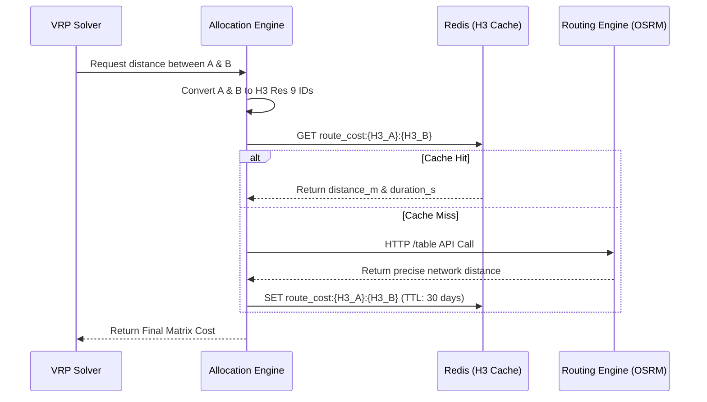

> **Series context:** This is Part 7 of the [E-commerce Order Allocation](/series/ecommerce-order-allocation/) series. The distance matrix built here feeds directly into the OR-Tools VRP solver in [Part 6](/series/ecommerce-order-allocation/part-6-build-mini-allocation-engine/).

## The Invisible yet Most Expensive Bottleneck in E-commerce Routing

**Answer-first:** For 1 warehouse + 100 delivery stops, you need 10,201 pairwise distances. Self-hosting **GraphHopper** or **OSRM** on a $20/month VPS delivers this in **under 50ms per batch — completely free**. Using Google Maps Distance Matrix API for the same workload costs **$510/day** ($186,150/year). OSRM wins on raw throughput (C++, millisecond-range matrix API). GraphHopper wins on flexibility (custom truck profiles, runtime rule changes). This guide covers Docker setup, Python integration, H3-based Redis caching, and feeding the matrix into Google OR-Tools — with code you can run today.

For any VRP (Vehicle Routing Problem) solver to find the optimal delivery route, it needs to know the exact cost between every pair of stops — this is the **distance matrix**. For 1 warehouse + 100 orders (101 points), that is `101 × 101 = 10,201` pairs. Choosing the wrong tool for this step can cost **$510/day** in API fees or cause multi-second latency spikes under load.

---

## 1. As the Crow Flies: The Haversine Formula

This calculates the straight-line distance between two points on a sphere (the Earth) using their Latitude and Longitude.

### Pros
- **Extremely fast:** Calculating 10,000 pairs takes milliseconds on a CPU.
- **No external data needed:** Pure mathematics; zero reliance on APIs or map data.

### Cons
- **Inaccurate:** It ignores roads, rivers, tunnels, and one-way streets. In urban reality, actual driving distance is usually 1.2x to 1.5x the Haversine distance.

### Python Example

```python
import math

def haversine(lat1, lon1, lat2, lon2):
    R = 6371.0 # Earth radius in km
    
    dlat = math.radians(lat2 - lat1)
    dlon = math.radians(lon2 - lon1)
    
    a = (math.sin(dlat / 2)**2 + 
         math.cos(math.radians(lat1)) * math.cos(math.radians(lat2)) * 
         math.sin(dlon / 2)**2)
    
    c = 2 * math.atan2(math.sqrt(a), math.sqrt(1 - a))
    return R * c # Returns km

# Building the Distance Matrix:
def build_haversine_matrix(locations):
    n = len(locations)
    matrix = [[0] * n for _ in range(n)]
    for i in range(n):
        for j in range(n):
            if i != j:
                matrix[i][j] = haversine(
                    locations[i].lat, locations[i].lng,
                    locations[j].lat, locations[j].lng
                )
    return matrix
```

**Practical usage:** Amazon and Grab often use Haversine as a "Candidate Filter" to eliminate points that are obviously too far away before calling more expensive algorithms.

---

## 2. The Ideal Solution for the Base Problem: Routing Engine (OSRM / GraphHopper)

If your problem **only requires delivering from a fixed warehouse to customers**, **without caring about real-time traffic** or **rush hour histories**, and solely needs distance based on the **actual existing road network** — then this is the perfect, most cost-effective solution.

> **Prerequisite:** This section assumes familiarity with [Order Allocation Algorithms](/series/ecommerce-order-allocation/part-3-allocation-algorithms/) and how a VRP solver consumes a pre-built distance matrix.

You need a **Routing Engine** to load road network graph data. This data is usually downloaded for free from **OpenStreetMap (OSM)** — which the community constantly updates whenever a new road is built, an alley is removed, or weight restrictions change. When the roads change, you simply re-download the map file (`.osm.pbf`) and restart the engine.

### Why not standard Dijkstra or A*?

If you run a standard **Dijkstra** or **A*** algorithm to find paths between 10,000 pairs on a city-wide map (which has millions of nodes), your server will freeze because the graph is too large to traverse per query.

Therefore, modern Routing Engines use "pre-processing" techniques:

1. **Contraction Hierarchies (CH):** Spends a few hours pre-analyzing the map to create "shortcuts" (virtual highways) between areas. At query time, the algorithm jumps across these shortcuts rather than traversing every alley → Query time drops to **microseconds**. The downside is that if a road closes, you must rebuild the entire map.
2. **Multi-Level Dijkstra (MLD) / Customizable Route Planning (CRP):** Divides the map into small cells. Updating the cost of a road only requires updating that specific cell (taking seconds) rather than the whole map. Great for real-time traffic injection.

### The Open-Source Giants: OSRM and GraphHopper Distance Matrix

In custom logistics systems, the two most famous open-source engines are **OSRM** (C++) and **GraphHopper** (Java).

| Feature | OSRM (Open Source Routing Machine) | GraphHopper |
|---|---|---|
| **Language** | C++ | Java |
| **Main Algorithms**| MLD and CH | CH, A*, Landmark |
| **Routing Profiles**| Written in Lua (driving, cycling, walking) | Written in Java / YAML |
| **Matrix API** | Unbelievably fast (C++ optimized) | Good, but OSRM edges out on massive matrices |
| **Flexibility** | Quite rigid, hard to change rules at runtime | Highly flexible (Custom Models) allows runtime rule changes |
| **Community** | Backed by Mapbox, widely used for static routing | Easy to embed in Java apps, very flexible |

**Routing Profiles:** 
The route for a motorcycle navigating tight alleys is completely different from a 10-ton truck (which is banned from small roads). Both OSRM and GraphHopper allow you to define **Profiles**. In OSRM, you write Lua files: `car.lua`, `truck.lua`, `bike.lua` to tell the engine which roads are legal.

### OSRM Table API: Lightning Fast Matrices

Assuming you self-host an OSRM server (very easy via Docker), it provides a `table` API that generates distance matrices optimally:

```bash
# Request to local OSRM to calculate a 3x3 matrix
curl "http://localhost:5000/table/v1/driving/106.70,10.77;106.71,10.78;106.72,10.79?annotations=distance,duration"

# Returns both durations (seconds) and distances (meters)
{
  "durations": [
    [0, 150, 320],
    [155, 0, 180],
    [330, 175, 0]
  ],
  "distances": [
    [0, 1200, 2400],
    [1250, 0, 1100],
    [2500, 1150, 0]
  ]
}
```
*Note: OSRM Table API can return a 100x100 matrix (10,000 elements) in just a few dozen milliseconds!*

**Pros of self-hosting:** Free, insanely fast, zero rate limits.
**Cons:** RAM heavy (especially if loading an entire country's map).

---

## How to Calculate a Distance Matrix with GraphHopper

**GraphHopper** is the most developer-friendly open-source routing engine for building a distance matrix in Java or via a self-hosted HTTP API. Unlike OSRM, GraphHopper supports runtime routing rule changes via **Custom Models** — making it the preferred choice when your delivery fleet has vehicle-specific constraints (weight limits, road class restrictions).

### Option A: GraphHopper Matrix API (Self-hosted)

Self-host the GraphHopper server with Docker and call the `/matrix` endpoint:

```bash
# Start GraphHopper server with a local OSM map file
docker run -d -p 8989:8989 \
  -v $(pwd)/data:/data \
  israelhikingmap/graphhopper \
  --url https://download.geofabrik.de/asia/vietnam-latest.osm.pbf \
  --host 0.0.0.0
```

```python
import requests
import json

def build_graphhopper_distance_matrix(locations: list[dict]) -> dict:
    """
    Calculate a full GraphHopper distance matrix for a list of lat/lng points.
    Returns duration (seconds) and distance (meters) for every pair.
    Args:
        locations: List of dicts with 'lat' and 'lng' keys.
    Returns:
        dict with 'durations' and 'distances' 2D arrays.
    """
    url = "http://localhost:8989/matrix"

    # GraphHopper Matrix API requires [lng, lat] order (GeoJSON convention)
    points = [[loc["lng"], loc["lat"]] for loc in locations]

    payload = {
        "points": points,
        "profile": "car",                     # Routing profile: car, bike, foot
        "out_arrays": ["times", "distances"],  # Request both duration and distance
        "fail_fast": False                     # Return partial results if a pair is unreachable
    }

    response = requests.post(url, json=payload, timeout=30)
    response.raise_for_status()
    data = response.json()

    return {
        "durations": data["times"],       # N×N matrix in seconds
        "distances": data["distances"]    # N×N matrix in meters
    }

# Example: 3 warehouses / delivery points in Ho Chi Minh City
locations = [
    {"lat": 10.7712, "lng": 106.7011},  # Warehouse
    {"lat": 10.7780, "lng": 106.7100},  # Customer A
    {"lat": 10.7650, "lng": 106.6980},  # Customer B
]

matrix = build_graphhopper_distance_matrix(locations)
print(f"Duration matrix (seconds): {matrix['durations']}")
print(f"Distance matrix (meters):  {matrix['distances']}")
# Output:
# Duration matrix (seconds): [[0, 320, 185], [315, 0, 410], [180, 405, 0]]
# Distance matrix (meters):  [[0, 2100, 1350], [2050, 0, 2900], [1300, 2880, 0]]
```

### Option B: GraphHopper Java SDK (Embedded)

For Java-based logistics backends, embed GraphHopper directly without a network hop:

```java
// Embedded GraphHopper distance matrix calculation
// Purpose: Build an NxN distance matrix without requiring a running HTTP server
import com.graphhopper.GraphHopper;
import com.graphhopper.config.CHProfile;
import com.graphhopper.config.Profile;
import com.graphhopper.routing.util.EncodingManager;

GraphHopper hopper = new GraphHopper();
hopper.setOSMFile("/data/vietnam-latest.osm.pbf");
hopper.setGraphHopperLocation("/data/graph-cache");
hopper.setProfiles(new Profile("car").setVehicle("car").setWeighting("fastest"));
hopper.getCHPreparationHandler().setCHProfiles(new CHProfile("car"));
hopper.importOrLoad();

// Use GHMatrixAPI to compute full NxN matrix
// See: https://github.com/graphhopper/graphhopper/tree/master/web-api
```

### GraphHopper vs. OSRM: Which to Choose for Distance Matrix?

| Criterion | GraphHopper Distance Matrix | OSRM Table API |
|---|---|---|
| **Speed (large matrices)** | Fast (CH/MLD) | Slightly faster (C++ optimized) |
| **Custom vehicle rules** | ✅ Runtime Custom Models | ❌ Requires recompile + Lua |
| **Java ecosystem** | ✅ Native SDK | ❌ HTTP only |
| **Docker ease** | ✅ Official image | ✅ Official image |
| **OSM data format** | `.osm.pbf` | `.osm.pbf` |
| **Best for** | Flexible profiles, Java backends | Max throughput, static profiles |

**Rule of thumb:** Use **OSRM** if you have a fixed vehicle type and need maximum raw speed. Use **GraphHopper** if you need to change routing rules at runtime (truck weight limits, toll avoidance, time-dependent costs).

---

## 3. Expensive Overkill: Commercial APIs (Google Maps / Mapbox)

If you are building a Ride-Hailing app that requires minute-perfect Estimated Time of Arrival (ETA) so customers don't cancel, you need real-time traffic data and historical rush hour patterns. In that case, you must use commercial APIs (like Google Maps).

**However, for static delivery routing from a fixed warehouse, this is entirely overkill and extremely wasteful.**

```python
# Calling Google Maps Distance Matrix API (Very Expensive)
import requests

url = "https://maps.googleapis.com/maps/api/distancematrix/json"
params = {
    "origins": "10.77,106.70|10.78,106.71",
    "destinations": "10.77,106.70|10.78,106.71",
    "departure_time": "now",  # Current traffic
    "key": "YOUR_API_KEY"
}
```

### The Exorbitant Cost

Google Maps charges about **$0.005** per Element (Pair).
Returning to our 1 warehouse + 100 orders = 10,201 pairs.
Every time you run the allocation algorithm, you pay: `10,201 × $0.005 = $51`.
If your warehouse dispatches 10 batches a day, you lose **$510/day** just to calculate distances!

This is exactly why domestic delivery companies self-host **OSRM** or **GraphHopper** instead of throwing money at Google Maps for warehouse routing. The OpenStreetMap network is more than adequate for this need.

---

## 4. System Design Strategies to Save Compute

To maintain high accuracy without overloading servers, large systems use these tricks:

### Technique 1: Clustering
If 5 orders are going to the same apartment building, cluster them into a single coordinate. A 101x101 matrix drops to 97x97.

### Technique 2: Hybrid Matrix (Haversine + OSRM)
Only calculate precise road distances for points that could realistically follow one another.
- If Point A and Point B are > 15km apart (via Haversine), assign an infinite cost. The VRP solver will naturally never route a vehicle from A to B.
- Only call OSRM for nearby pairs (< 5km).

### Technique 3: H3 Hexagon Caching (How Uber/Grab does it)

Recalculating the distance between two nearby alleys day after day is a waste of resources. Logistics giants use Uber's **H3 (Hexagonal Hierarchical Spatial Index)** to cache distance results.

#### Why Hexagons and not Geohash (Squares)?
In a square grid, the distance from the center to the 4 straight edges differs from the distance to the 4 corners. In a hexagon grid, the distance from the center to all neighboring cells is **exactly equal**. This is critical in routing because distance error margins are uniformly controlled in all directions.

#### How it works:

**1. Pick a Resolution:**
**H3 Resolution 9** is typically used (each hexagon is about 174 meters wide). This perfectly encapsulates a small residential block or a street segment.

**2. Convert Coordinates (Lat/Lng) to H3 Index:**
```python
import h3

# Convert Point A and Point B
h3_A = h3.geo_to_h3(10.7712, 106.7011, 9) # Result: '8965a6a0033ffff'
h3_B = h3.geo_to_h3(10.7780, 106.7100, 9) # Result: '8965a6a0027ffff'
```

**3. Check Cache (Redis) before invoking the Engine:**
```python
redis_key = f"route_cost:{h3_A}:{h3_B}"

cache_result = redis.get(redis_key)
if cache_result:
    return json.loads(cache_result) # Cache Hit! Zero computation.
else:
    # Cache Miss! Call OSRM
    result = call_osrm_api(lat1, lon1, lat2, lon2)
    
    # Save to Redis for next time (TTL = 30 days)
    redis.set(redis_key, json.dumps({
        "distance_m": result.distance,
        "duration_s": result.duration
    }), ex=2592000)
    
    return result
```

#### System Design: Caching Distance Matrix with H3 & Redis

To visualize the workflow, here is the architecture of how the allocation engine leverages the cache to save compute resources:



#### Pre-warming the Cache
Instead of waiting for a customer to order, the system can run a batch job at night:
1. Fetch all H3 cells that contain residential areas in the city.
2. Use OSRM (since it's free and local) to pre-calculate the distance between all H3 pairs (within 10km of each other).
3. Pump this data into Redis.

Because road networks rarely change (only when there's long-term construction), the Cache Hit ratio can exceed **95%**, giving you the speed of Haversine but the accuracy of a Routing Engine!

---

## FAQ


In a square grid (Geohash), the distance from the center to the 4 straight edges differs from the distance to the 4 corners. In an H3 hexagon grid, the distance from the center to all neighboring cells is **exactly equal**. This property is critical in routing because distance error margins are uniformly controlled in all directions, making your cached distance matrix much more reliable.



Routing engines load the full road network graph into RAM for Contraction Hierarchies to work at millisecond speeds. A small city map might only consume a few hundred MB of RAM. A nationwide map (e.g., Vietnam) can consume **4-8 GB of RAM**. A global map requires servers with tens or hundreds of GB. The practical optimization is to extract a geographic Bounding Box for your business's actual service area.



Use **Haversine** as a lightweight "Candidate Filter" to eliminate points that are obviously too far away (e.g., > 15km) before calling expensive algorithms. Use a true **Routing Engine (OSRM/GraphHopper)** for the final distance matrix, as actual driving distance in urban areas is usually 1.2x to 1.5x the Haversine distance due to one-way streets, rivers, and road layouts.


> *Summary of the Series: Order Fulfillment is not just a CRUD application tracking statuses. It is a symphony of event-driven microservices, real-time inventory algorithms, OR-Tools optimization, and ultra-fast Routing Engines processing spatial data.*

---

## References & Further Reading

- [Uber Engineering: H3 Hexagonal Hierarchical Spatial Index](https://www.uber.com/en-VN/blog/h3/)
- [Google Maps Platform Pricing: Distance Matrix API](https://mapsplatform.google.com/pricing/)
- [Open Source Routing Machine (OSRM)](http://project-osrm.org/)
- [GraphHopper Routing Engine Documentation](https://www.graphhopper.com/)
- [GraphHopper Matrix API Reference](https://docs.graphhopper.com/#tag/Matrix-API)
- [OpenStreetMap Vietnam Data (Geofabrik)](https://download.geofabrik.de/asia/vietnam.html)

🔗 **Next Step:** Now that you understand how to build an accurate distance matrix with GraphHopper, see how this feeds into [Part 6 — Building a Mini Allocation Engine](/series/ecommerce-order-allocation/part-6-build-mini-allocation-engine/) and the complete [Series Executive Summary](/series/ecommerce-order-allocation/executive-summary/).
