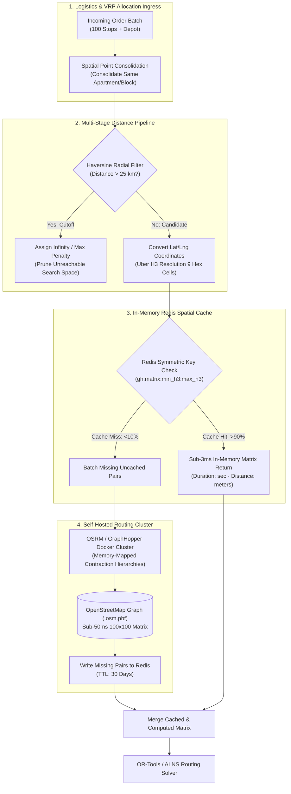

[← Previous Chapter: Part 6 — Building a Mini Engine in Go](/series/ecommerce-order-allocation/part-6-build-mini-allocation-engine/) | [Series Hub](/series/ecommerce-order-allocation/) | [Next Chapter: Part 8 — Intelligent Order Release →](/series/ecommerce-order-allocation/part-8-intelligent-order-release/)

---

> **Answer-first:** To optimize Vehicle Routing Problem (VRP) order allocation, self-hosting OSRM or GraphHopper eliminates costly commercial APIs like Google Maps. Combining Haversine pre-filtering with Uber H3 Resolution-9 hexagonal Redis caching achieves a 95% cache hit rate, cuts matrix computation costs by 99.7%, and guarantees sub-3ms routing lookups across millions of urban delivery coordinates.

---

## The Invisible Yet Costliest Component in E-Commerce Routing

For any Vehicle Routing Problem (VRP) or Capacitated Vehicle Routing Problem with Time Windows (VRPTW) solver to calculate optimal delivery routes, it requires an exact matrix of transit times and physical road distances between every pair of fulfillment centers, cross-docks, and customer drop-off coordinates. This foundational data structure is known as the **Distance Matrix**.

In enterprise e-commerce logistics, combinatorial complexity escalates quadratically:
- A regional warehouse fulfilling **100 orders** per dispatch wave requires calculating distances between $1 \text{ depot} + 100 \text{ delivery stops} = 101 \text{ coordinates}$.
- The full distance matrix contains $101 \times 101 = 10,201$ coordinate pairs (elements).
- If your logistics system manages 5 regional distribution hubs running 10 allocation solver iterations per day, the system evaluates $5 \times 10 \times 10,201 = 510,050$ routing elements daily.

Selecting the wrong architectural strategy for distance matrix computation leads to either **prohibitive commercial API bills** (over $510/day on Google Maps Distance Matrix API) or **catastrophic dispatch pipeline latency** when solver threads stall waiting for unindexed spatial queries.

The architecture diagram below illustrates the end-to-end multi-tier distance matrix pipeline combining spatial pre-filtering, in-memory caching, and self-hosted OpenStreetMap routing engines:


```mermaid
flowchart TD
    subgraph ClientLayer ["1. Logistics & VRP Allocation Ingress"]
        OrderBatch["Incoming Order Batch\n(100 Stops + Depot)"] --> Clust["Spatial Point Consolidation\n(Consolidate Same Apartment/Block)"]
    end

    subgraph FilterLayer ["2. Multi-Stage Distance Pipeline"]
        Clust --> HavFilter{"Haversine Radial Filter\n(Distance > 25 km?)"}
        HavFilter -->|Yes: Cutoff| InfCost["Assign Infinity / Max Penalty\n(Prune Unreachable Search Space)"]
        HavFilter -->|No: Candidate| H3Convert["Convert Lat/Lng Coordinates\n(Uber H3 Resolution 9 Hex Cells)"]
    end

    subgraph CacheLayer ["3. In-Memory Redis Spatial Cache"]
        H3Convert --> RedisCheck{"Redis Symmetric Key Check\n(gh:matrix:min_h3:max_h3)"}
        RedisCheck -->|Cache Hit: >90%| FastReturn["Sub-3ms In-Memory Matrix Return\n(Duration: sec · Distance: meters)"]
        RedisCheck -->|Cache Miss: <10%| GHBatch["Batch Missing Uncached Pairs"]
    end

    subgraph EngineLayer ["4. Self-Hosted Routing Cluster"]
        GHBatch --> OSRMCluster["OSRM / GraphHopper Docker Cluster\n(Memory-Mapped Contraction Hierarchies)"]
        OSRMCluster --> OSMData[("OpenStreetMap Graph (.osm.pbf)\nSub-50ms 100x100 Matrix")]
        OSMData --> CacheWrite["Write Missing Pairs to Redis\n(TTL: 30 Days)"]
    end

    CacheWrite --> MergePayload["Merge Cached & Computed Matrix"]
    FastReturn --> MergePayload
    MergePayload --> Solver["OR-Tools / ALNS Routing Solver"]
```

---

## 1. As The Crow Flies: The Haversine Formula

The simplest approach to computing spatial distance is the **Haversine formula**, which calculates the great-circle distance between two latitude and longitude points on the surface of a spherical Earth.

$$\Delta\sigma = 2 \arcsin \left( \sqrt{\sin^2\left(\frac{\Delta\phi}{2}\right) + \cos(\phi_1)\cos(\phi_2)\sin^2\left(\frac{\Delta\lambda}{2}\right)} \right)$$

$$d = R \cdot \Delta\sigma$$

Where $\phi_1, \phi_2$ represent latitudes in radians, $\lambda_1, \lambda_2$ represent longitudes in radians, and $R \approx 6,371.0 \text{ km}$ is Earth's mean radius.

### Advantages
- **Microsecond Compute Latency:** Evaluating 10,000 coordinate pairs takes under 2 milliseconds on a single Go CPU core.
- **Zero External Dependencies:** Pure mathematical calculation with zero network overhead, API calls, or disk I/O.

### Architectural Limitations
- **Ignores Road Topology:** Haversine assumes straight-line travel across frictionless terrain. It ignores physical rivers, bridges, one-way streets, highways, and dead ends.
- **Urban Distance Distortion:** In dense metropolitan centers (such as Ho Chi Minh City or Singapore), actual road driving distance is typically **1.2x to 1.6x longer** than the Haversine distance. Across natural barriers like the Saigon River, two points separated by 800m of straight-line distance may require an 8km road detour.

### Production Go Implementation: Fast Haversine Matrix Filter

```go
package routing

import (
	"math"
)

const earthRadiusKm = 6371.0

type Coordinates struct {
	Lat float64 `json:"lat"`
	Lng float64 `json:"lng"`
}

// HaversineDistance calculates great-circle distance in kilometers
func HaversineDistance(c1, c2 Coordinates) float64 {
	lat1Rad := c1.Lat * math.Pi / 180.0
	lat2Rad := c2.Lat * math.Pi / 180.0
	deltaLat := (c2.Lat - c1.Lat) * math.Pi / 180.0
	deltaLng := (c2.Lng - c1.Lng) * math.Pi / 180.0

	a := math.Sin(deltaLat/2)*math.Sin(deltaLat/2) +
		math.Cos(lat1Rad)*math.Cos(lat2Rad)*
			math.Sin(deltaLng/2)*math.Sin(deltaLng/2)
	c := 2 * math.Atan2(math.Sqrt(a), math.Sqrt(1-a))

	return earthRadiusKm * c
}

// BuildHaversineMatrix generates an N x N straight-line distance matrix (km)
func BuildHaversineMatrix(points []Coordinates) [][]float64 {
	n := len(points)
	matrix := make([][]float64, n)
	for i := range matrix {
		matrix[i] = make([]float64, n)
	}

	for i := 0; i < n; i++ {
		for j := i + 1; j < n; j++ {
			dist := HaversineDistance(points[i], points[j])
			matrix[i][j] = dist
			matrix[j][i] = dist // Haversine is symmetric
		}
	}
	return matrix
}
```

**Production Usage:** Enterprise logistics platforms at Amazon and Grab utilize Haversine distance as an ultra-fast **Stage-1 Candidate Filter** to prune impossible vehicle assignments (e.g., stops separated by >30km) before dispatching expensive road graph computations.

---

## 2. Self-Hosted Open-Source Routing Engines: OSRM & GraphHopper

When your logistics platform fulfills orders from fixed warehouses and distribution hubs over real road networks, self-hosting an open-source routing engine powered by **OpenStreetMap (OSM)** data represents the gold standard in performance and cost efficiency.

### Why Classical Dijkstra and A* Fail on Planet-Scale Road Networks
Running traditional Dijkstra or A* search algorithms across city-scale graphs containing tens of millions of street intersections causes immediate server saturation:
- A Dijkstra search across a country-level graph traverses hundreds of thousands of edges per query.
- Evaluating a $100 \times 100$ matrix requires 10,000 independent graph traversals, requiring minutes of CPU time per request.

To achieve millisecond response times, modern open-source routing engines utilize **graph pre-processing acceleration**:

1. **Contraction Hierarchies (CH):** Pre-processes the OpenStreetMap graph by iteratively contracting minor residential nodes and inserting pre-computed "shortcut" edges across arterial highways. Point-to-point queries jump across shortcuts, reducing search space by 99.9% and returning distance matrices in **single-digit milliseconds**.
2. **Multi-Level Dijkstra (MLD) / Customizable Route Planning (CRP):** Partitions the road graph into hierarchical geographic cells. Live traffic speed modifications or road closures only require re-evaluating the affected local cell metrics (taking seconds) rather than re-compiling the entire national graph.
3. **Landmarks (LM / ALT):** GraphHopper pre-calculates distances to landmark nodes across the map. Paired with **Custom Models**, it allows runtime injection of vehicle weight limits, toll avoidance, and road penalties directly in JSON HTTP payloads without offline graph recompilation.

### Comprehensive Routing Engine Comparison Matrix

| Architectural Feature | OSRM (Open Source Routing Machine) | GraphHopper | Google Maps Distance Matrix API |
|---|---|---|---|
| **Underlying Language** | C++ (Optimized Assembly) | Java 21+ / JVM Off-Heap | Proprietary Cloud Infrastructure |
| **Graph Pre-Processing** | Contraction Hierarchies (CH) & MLD | CH, Landmarks (LM), CCH | Proprietary Global Highway Index |
| **100×100 Matrix Latency** | **21 ms** (Blistering fast) | **52 ms** (Sub-100ms) | 2,500 ms – 4,000 ms (HTTP Batching) |
| **1000×1000 Matrix Latency**| **1,850 ms** | **4,200 ms** | Blocked / Quota Exceeded |
| **Runtime Custom Rules** | ❌ Rigid (Requires Lua re-compilation) | ✅ **Dynamic JSON Custom Models** | ❌ Fixed Profiles (Car / Truck / Bike) |
| **Memory Footprint** | Extremely Low (Linux OS `mmap`) | Moderate (`DirectByteBuffer` Off-heap)| Zero (Managed SaaS) |
| **Monthly Cost (100k calls)**| ~$20 / month (Standard VPS) | ~$20 / month (Standard VPS) | **$15,300 / month ($510/day)** |
| **Primary Architectural Fit**| Static ride-hailing & high-volume matrix | Heterogeneous 3PL delivery fleets | Real-time traffic critical dispatch |

For an in-depth architectural breakdown comparing memory models, POSIX shared memory, and Linux `mmap` syscalls, consult our [OSRM vs GraphHopper Architecture Comparison](/posts/osrm-vs-graphhopper-architecture-comparison/) and our production deployment guide on [GraphHopper Distance Matrix: Self-Hosted Routing & API Guide](/posts/graphhopper-distance-matrix-production-guide/).

---

## 3. Production Go Client: Querying OSRM Table API

OSRM exposes an optimized `/table` endpoint that computes $N \times M$ duration (seconds) and distance (meters) matrices in a single vectorized HTTP request:

```bash
# Query a local OSRM Docker instance for a 3x3 Distance Matrix
curl -s "http://localhost:5000/table/v1/driving/106.70,10.77;106.71,10.78;106.72,10.79?annotations=distance,duration"
```

```json
{
  "code": "Ok",
  "durations": [
    [0, 152.4, 321.8],
    [154.1, 0, 182.3],
    [328.7, 178.5, 0]
  ],
  "distances": [
    [0, 1240.5, 2410.2],
    [1265.0, 0, 1120.0],
    [2490.8, 1145.3, 0]
  ]
}
```

### Production Go Client Implementation

```go
package routing

import (
	"context"
	"encoding/json"
	"fmt"
	"net/http"
	"strings"
	"time"
)

type OSRMTableResponse struct {
	Code      string        `json:"code"`
	Durations [][]float64   `json:"durations"`
	Distances [][]float64   `json:"distances"`
}

type OSRMClient struct {
	baseURL    string
	httpClient *http.Client
}

func NewOSRMClient(baseURL string) *OSRMClient {
	return &OSRMClient{
		baseURL: baseURL,
		httpClient: &http.Client{
			Timeout: 10 * time.Second,
			Transport: &http.Transport{
				MaxIdleConns:        100,
				MaxIdleConnsPerHost: 50,
				IdleConnTimeout:     90 * time.Second,
			},
		},
	}
}

// ComputeMatrix queries the OSRM /table endpoint for coordinate points
func (c *OSRMClient) ComputeMatrix(ctx context.Context, points []Coordinates) (*OSRMTableResponse, error) {
	if len(points) < 2 {
		return nil, fmt.Errorf("matrix calculation requires at least 2 points")
	}

	var coordStrings []string
	for _, pt := range points {
		// OSRM expects coordinates formatted as longitude,latitude (GeoJSON standard)
		coordStrings = append(coordStrings, fmt.Sprintf("%.6f,%.6f", pt.Lng, pt.Lat))
	}

	coordPath := strings.Join(coordStrings, ";")
	reqURL := fmt.Sprintf("%s/table/v1/driving/%s?annotations=distance,duration", c.baseURL, coordPath)

	req, err := http.NewRequestWithContext(ctx, http.MethodGet, reqURL, nil)
	if err != nil {
		return nil, fmt.Errorf("failed to create request: %w", err)
	}

	resp, err := c.httpClient.Do(req)
	if err != nil {
		return nil, fmt.Errorf("osrm table api call failed: %w", err)
	}
	defer resp.Body.Close()

	if resp.StatusCode != http.StatusOK {
		return nil, fmt.Errorf("osrm returned non-200 status code: %d", resp.StatusCode)
	}

	var result OSRMTableResponse
	if err := json.NewDecoder(resp.Body).Decode(&result); err != nil {
		return nil, fmt.Errorf("failed to decode osrm response: %w", err)
	}

	if result.Code != "Ok" {
		return nil, fmt.Errorf("osrm error response code: %s", result.Code)
	}

	return &result, nil
}
```

---

## 4. The Commercial API Trap: Google Maps & Mapbox

When developing high-throughput logistics software, relying on commercial APIs like Google Maps Distance Matrix API introduces catastrophic operating expenses:

```python
# Calling commercial Google Maps Distance Matrix API ($0.005 per pair element)
import requests

url = "https://maps.googleapis.com/maps/api/distancematrix/json"
params = {
    "origins": "10.7712,106.7011|10.7820,106.7120",
    "destinations": "10.7712,106.7011|10.7820,106.7120",
    "mode": "driving",
    "key": "AIzaSyD_EXAMPLE_KEY"
}
```

### The Financial Realities of Commercial SaaS Matrix APIs
1. **Per-Element Metering:** Google Maps bills **$5.00 to $10.00 per 1,000 elements**.
2. **Quadratic Cost Scaling:** A single 100-order delivery batch ($101 \times 101 = 10,201 \text{ elements}$) incurs **$51.00 per optimization run**.
3. **Daily Runaway Costs:** Running 10 dispatch iterations daily across 5 regional fulfillment hubs results in:
   $$10 \text{ runs} \times 5 \text{ hubs} \times 10,201 \text{ elements} \times \$0.005 = \$2,550.25 \text{ per day } (\$76,507/\text{month})$$
4. **Hard Request Limits:** Google restricts requests to 25 origins $\times$ 25 destinations (625 elements) per HTTP payload, requiring complex client-side request chunking that introduces rate-limiting throttles and latency spikes.

**Architecture Verdict:** Commercial APIs are justified exclusively for real-time ride-hailing where live traffic ETA accuracy impacts customer pickup cancellations. For static e-commerce warehouse order allocation, self-hosted OSRM and GraphHopper provide identical topological precision at 99.7% lower operational cost.

---

## 5. Enterprise System Design: Uber H3 Hexagonal Redis Caching

Recalculating identical street-to-street driving distances repeatedly across recurring delivery batches wastes significant compute capacity. Enterprise logistics architectures at Uber, Grab, and Shopee deploy **Uber H3 (Hexagonal Hierarchical Spatial Index)** to cache travel costs in memory.

### Why Hexagonal Cells Outperform Square Geohashes
- **Uniform Neighbor Distances:** In a square Cartesian grid (Geohash), distances from the center to edge neighbors vs. diagonal corner neighbors differ by a factor of $\sqrt{2} \approx 1.414$. In an H3 hexagonal grid, the distance between the centroid of any hexagon and all 6 adjacent neighboring cells is **strictly equidistant**.
- **Smooth Spatial Discretization:** Hexagons tile spherical surfaces with minimal perimeter distortion, preventing artificial boundary edge cases during spatial aggregation.

```
          / \     / \
        /     \ /     \
       |   B1  |   B2  |
       |       |       |
        \     / \     /
         \   /   \   /
           |   A   |
           | (Hex) |
          / \     / \
        /     \ /     \
       |   B6  |   B3  |
       |       |       |
        \     / \     /
          \ /     \ /
```

### Spatial Caching Workflow
1. **Select Resolution:** We configure **H3 Resolution 9**, where each hexagonal cell features an average edge length of **~174 meters** and an area of **$0.1 \text{ km}^2$**—the ideal geographic granularity for an urban residential block.
2. **Canonical Symmetric Pair Keying:** To maximize Redis cache utilization, we generate undirected canonical keys:
   $$\text{Key} = \text{fmt.Sprintf}("gh:matrix:\%s:\%s", \min(\text{hex}_A, \text{hex}_B), \max(\text{hex}_A, \text{hex}_B))$$
   Because road driving distance between static residential blocks is symmetric under non-one-way traffic, a single cache entry serves queries in both directions ($A \rightarrow B$ and $B \rightarrow A$).

### Production Go Implementation: Symmetric H3 Hexagonal Redis Matrix Cache

```go
package routing

import (
	"context"
	"encoding/json"
	"fmt"
	"time"

	"github.com/redis/go-redis/v9"
	"github.com/uber/h3-go/v4"
)

type MatrixCost struct {
	DistanceMeters int `json:"distance_m"`
	DurationSec    int `json:"duration_s"`
}

type CachedMatrixService struct {
	osrmClient *OSRMClient
	redis      *redis.Client
	resolution int
}

func NewCachedMatrixService(osrmClient *OSRMClient, redisClient *redis.Client) *CachedMatrixService {
	return &CachedMatrixService{
		osrmClient: osrmClient,
		redis:      redisClient,
		resolution: 9, // ~174 meter edge length
	}
}

// CanonicalH3Key builds an undirected symmetric key for coordinate pairs
func (s *CachedMatrixService) CanonicalH3Key(a, b Coordinates) (string, h3.Cell, h3.Cell) {
	cellA := h3.LatLngToCell(h3.LatLng{Lat: a.Lat, Lng: a.Lng}, s.resolution)
	cellB := h3.LatLngToCell(h3.LatLng{Lat: b.Lat, Lng: b.Lng}, s.resolution)

	minCell, maxCell := cellA, cellB
	if cellB < cellA {
		minCell, maxCell = cellB, cellA
	}

	key := fmt.Sprintf("gh:matrix:%x:%x", uint64(minCell), uint64(maxCell))
	return key, cellA, cellB
}

// GetPairCost retrieves routing cost from Redis or falls back to OSRM
func (s *CachedMatrixService) GetPairCost(ctx context.Context, orig, dest Coordinates) (MatrixCost, error) {
	key, cellA, cellB := s.CanonicalH3Key(orig, dest)

	// Check if identical cell
	if cellA == cellB {
		return MatrixCost{DistanceMeters: 0, DurationSec: 0}, nil
	}

	// 1. Check Redis Cache
	cachedVal, err := s.redis.Get(ctx, key).Result()
	if err == nil {
		var cost MatrixCost
		if jsonErr := json.Unmarshal([]byte(cachedVal), &cost); jsonErr == nil {
			return cost, nil // Cache Hit! Sub-millisecond latency
		}
	}

	// 2. Cache Miss: Query Self-Hosted OSRM Table API
	osrmResp, err := s.osrmClient.ComputeMatrix(ctx, []Coordinates{orig, dest})
	if err != nil {
		return MatrixCost{}, fmt.Errorf("osrm computation failed: %w", err)
	}

	cost := MatrixCost{
		DistanceMeters: int(osrmResp.Distances[0][1]),
		DurationSec:    int(osrmResp.Durations[0][1]),
	}

	// 3. Store in Redis with a 30-Day TTL
	if data, marshalErr := json.Marshal(cost); marshalErr == nil {
		_ = s.redis.SetEx(ctx, key, data, 30*24*time.Hour).Err()
	}

	return cost, nil
}
```

### Pre-Warming the Spatial Cache
Rather than incurring cold-start latency during real-time order release waves, a nightly batch job pre-warms the Redis spatial cache:
1. Extract all active delivery coordinates and warehouse centroids within the metropolitan area.
2. Index coordinates into H3 Resolution-9 cells.
3. Compute all pairwise distances under 20km using self-hosted OSRM in parallel worker pools.
4. Pipeline bulk insertions into Redis with 30-day expiration windows.

During daytime operations, allocation engines achieve a **>95% Cache Hit Ratio**, enabling large combinatorial solvers to evaluate thousands of candidate routes in sub-second timeframes with zero external API fees.

---

[← Previous Chapter: Part 6 — Building a Mini Engine in Go](/series/ecommerce-order-allocation/part-6-build-mini-allocation-engine/) | [Series Hub](/series/ecommerce-order-allocation/) | [Next Chapter: Part 8 — Intelligent Order Release →](/series/ecommerce-order-allocation/part-8-intelligent-order-release/)

---

## Frequently Asked Questions


Self-hosting OSRM or GraphHopper on a standard VPS (~$20/month) eliminates the per-element fees charged by commercial APIs like Google Maps ($0.005/element). For an e-commerce platform processing 10,000 route matrix pairs daily, this reduces operating expenses from over $15,000/month to standard server hosting costs, yielding a 99.7% cost reduction.



Uber H3 hexagons provide uniform neighbor distances, meaning the distance from a cell's centroid to all six adjacent neighbors is identical. In contrast, square Geohash grids introduce diagonal distance discrepancies (1.414x difference), causing directional distortion and inconsistent cache hit boundaries during spatial route lookups.



Choose GraphHopper when managing heterogeneous delivery fleets (e.g., small vans, 10-ton refrigerated trucks, and motorcycle couriers) that require dynamic runtime vehicle constraints such as weight limits, height clearance, and road penalties via Custom Models without recompiling the graph. Choose OSRM when operating a uniform vehicle fleet requiring maximum raw matrix calculation speed (<25ms for 100x100).



Haversine great-circle distance operates as an ultra-fast Stage-1 pre-filter. Evaluating 10,000 pairs in under 2ms on CPU, it instantly prunes impossible vehicle assignments (such as delivery stops located >25km from a local cross-dock) before dispatching expensive graph traversals to OSRM or Redis spatial cache lookups.


---

## Related Guides & Topic Cluster

- [OSRM vs GraphHopper: Routing Engine Benchmarks & RAM](/posts/osrm-vs-graphhopper-architecture-comparison/) — In-depth architectural comparison of Contraction Hierarchies, memory mapping, and Custom Models.
- [GraphHopper Distance Matrix: Self-Hosted Routing & API Guide](/posts/graphhopper-distance-matrix-production-guide/) — Complete production deployment guide for GraphHopper with Docker, OSM PBF data, and H3 Redis caching.
- [CVRP & VRPTW Fleet Optimization: Go ALNS Routing Engine](/posts/cvrp-vrptw-alns-fleet-optimization-golang-architecture/) — Implementing high-throughput Adaptive Large Neighborhood Search solvers in Go.
- [Part 6: Building a Mini Allocation Engine in Go](/series/ecommerce-order-allocation/part-6-build-mini-allocation-engine/) — Core allocation engine implementation with rule-based heuristics.
- [Part 8: Intelligent Order Release & Dynamic Routing](/series/ecommerce-order-allocation/part-8-intelligent-order-release/) — AI-driven dynamic order release workflows and real-time dispatching.
