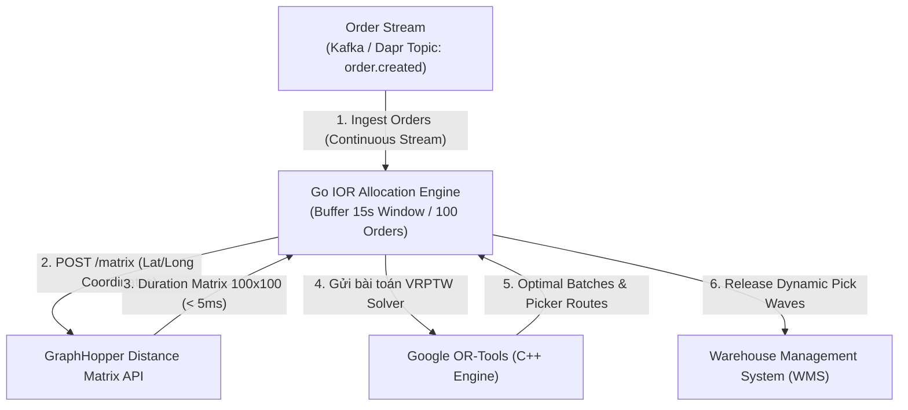

[← Chương trước: Phần 7 — Distance Matrix Routing](/series/ecommerce-order-allocation/part-7-distance-matrix-routing/) | [Mục lục Series](/series/ecommerce-order-allocation/)

---

> **Answer-first:** Dynamic Intelligent Order Release (IOR) thay thế static wave batching bằng cơ chế tối ưu hóa micro-batch liên tục. Viết bằng Go, engine tiếp nhận order stream, truy vấn GraphHopper Distance Matrix API (<5ms), điều phối qua Dapr Pub/Sub và giải VRPTW với Google OR-Tools để cân bằng tải picker và cam kết SLA cutoff.

---

## 1. Sự kết thúc của Static Wave Batching

Các hệ thống Warehouse Management Systems (WMS) truyền thống thực thi quy trình hoàn tất đơn hàng (fulfillment) thông qua **static wave batching**. Các đơn hàng tích lũy trong một database queue trong suốt cả ngày, và tại các khoảng thời gian được lên lịch sẵn (như 08:00, 11:00, và 14:00), một batch job sẽ khóa queue lại, tổng hợp các SKU, tạo ra danh sách nhặt hàng (pick lists) bằng giấy hoặc kỹ thuật số, và phân công công việc cho các nhân viên kho (warehouse operators).

Mặc dù static wave batching đơn giản hóa việc lên lịch cho kho hàng một cách định định (deterministic), các hoạt động e-commerce tốc độ cao gặp phải 3 lỗi cấu trúc (structural failure modes) dưới mô hình này:

1. **Rủi ro vi phạm SLA cho đơn hỏa tốc (Express Orders):** Một đơn đặt vào lúc 08:05 với SLA giao hàng trong 2 giờ phải chờ gần 3 tiếng đến thời điểm chốt (cutoff) 11:00 trước khi việc nhặt hàng bắt đầu. Sự chậm trễ của static queue này tiêu tốn tới 75% tổng cửa sổ thời gian SLA trước khi một món hàng được lấy ra khỏi kệ.
2. **Hiệu suất Picker hình răng cưa (Sawtooth Picker Utilization):** Sàn kho hàng trải qua các đợt gia tăng công việc (workload spikes) cực lớn ngay sau khi phát hành wave (wave release), gây ra tắc nghẽn lối đi (aisle congestion) và nghẽn cổ chai (bottlenecks) trên băng chuyền. Một khi wave picking hoàn thành, hiệu suất làm việc của picker giảm mạnh cho đến thời gian cutoff được lên lịch tiếp theo.
3. **Mất kết nối với Carrier Cutoff (Carrier Cutoff Detachment):** Các static waves phát hành đơn hàng mà không có khả năng hiển thị (visibility) theo thời gian thực vào các khung giờ đến (arrival windows) của carrier, tình trạng khả dụng của cửa lấy hàng (dock door), hay tình trạng giao thông last-mile. Một xe tải giao hàng khởi hành lúc 10:30 nhận các món hàng được nhặt trong wave 08:00, bỏ lỡ các đơn express đến lúc 08:15 lẽ ra có thể vừa vặn lên xe.

```text
Static Wave Batching:
[08:00 Cutoff] ---> High Utilization / Aisle Congestion ---> Idle Waiting Period ---> [11:00 Cutoff]

Dynamic Intelligent Order Release (IOR):
Continuous Stream ---> Multi-Trigger Engine ---> Micro-Batch Release ---> Smooth Picker Flow
```

**Dynamic Intelligent Order Release (IOR)** thay thế các thời gian cutoff batch được lên lịch bằng một vòng lặp đánh giá (evaluation loop) dựa trên sự kiện, theo thời gian thực. Các đơn hàng mới đến stream liên tục vào một bộ đệm đánh giá in-memory cho từng khu vực hoàn tất đơn hàng (fulfillment zone). Quá trình tối ưu hóa chạy linh hoạt dựa trên một **Multi-Trigger Policy** (Chính sách nhiều bộ kích hoạt):

* **Volume Threshold (Ngưỡng số lượng) (N >= N_max):** Kích hoạt (trigger) một chu kỳ tối ưu hóa khi các đơn hàng tích lũy (ví dụ: 50 đơn mỗi zone) tạo ra một lộ trình nhặt hàng dày đặc (dense pick path).
* **Maximum Wait Window (Cửa sổ chờ tối đa) (Delta_t >= T_max):** Đảm bảo các món hàng ngoài giờ cao điểm khối lượng thấp (low-volume off-peak items) được phát hành trong một cửa sổ giới hạn (ví dụ: 5 phút).
* **SLA Urgency Override (Ghi đè độ khẩn cấp SLA) (min(T_deadline - t_now) <= T_urgent):** Ngay lập tức buộc thực thi một chu kỳ tối ưu hóa nếu bất kỳ đơn hàng chờ nào còn dưới 30 phút là trễ thời điểm cutoff khởi hành của carrier.

---

## 2. Kiến trúc cấp cao (High-Level Architecture)

Kiến trúc Dynamic IOR phân tách (decouple) việc tiếp nhận stream thông lượng cao (high-throughput stream ingestion) khỏi việc thực thi solver tổ hợp nặng nề (heavy combinatorial solver execution) bằng cách sử dụng cấu trúc (topology) microservice event-driven.

Pipeline xử lý gồm 5 component hoạt động như sau:

1. **Order Stream Ingestion:** Go IOR Engine tiếp nhận các event đặt hàng theo thời gian thực từ Order Management System (OMS). Đơn hàng được lưu trữ trong một bộ đệm (buffer) in-memory thread-safe được nhóm theo từng warehouse zone.
2. **Matrix Engine Query:** Khi kích hoạt một chu kỳ release, Go Engine trích xuất tọa độ cho các đơn hàng ứng viên và truy vấn một GraphHopper Distance Matrix API self-hosted để xây dựng một ma trận N x N về khoảng cách lái xe theo cặp và travel durations.
3. **Event Mesh Dispatch:** Go Engine đóng gói ma trận, khối lượng đơn hàng, và cửa sổ thời gian SLA vào một CloudEvent payload và publish `ior.optimization.requested` tới Dapr Pub/Sub.
4. **VRPTW Solver Worker:** Một Python worker subscribe vào Dapr Pub/Sub nhận event, xây dựng một mô hình Vehicle Routing Problem with Time Windows (VRPTW) trong Google OR-Tools, thực thi Guided Local Search trong deadline 5 giây, và trả về các route nhặt hàng tối ưu (optimal pick routes) qua `ior.optimization.completed`.
5. **WMS Wave Execution:** Go Engine nhận các wave routes tối ưu, cập nhật state trong Dapr State Store với ETag locks, và đẩy (push) các phân công pick wave (pick wave assignments) tới WMS để định tuyến (routing) cho picker.



---

## 3. Tích hợp GraphHopper Distance Matrix trong Go

Các công thức Haversine đường thẳng (straight-line formulas) đánh giá thấp khoảng cách lái xe thực tế trong đô thị từ 20% đến 50% trong các mạng lưới đường giao thông dày đặc và không thể tính toán được travel durations. Để cung cấp các đầu vào chính xác cho việc tối ưu hóa solver, Go IOR Engine truy vấn REST endpoint `/matrix` của GraphHopper self-hosted sử dụng Contraction Hierarchies (CH) trên dữ liệu OpenStreetMap (OSM).

Go service này xây dựng một ma trận tọa độ theo cặp bao gồm warehouse depot (index 0) và N điểm đến của đơn hàng.

```go
package matrix

import (
	"bytes"
	"context"
	"encoding/json"
	"fmt"
	"net/http"
	"time"
)

// Point represents a geographic coordinate [Longitude, Latitude] for GraphHopper.
type Point [2]float64

// MatrixRequest defines the JSON payload for GraphHopper POST /matrix.
type MatrixRequest struct {
	Points    []Point  `json:"points"`
	OutArrays []string `json:"out_arrays"`
	Vehicle   string   `json:"vehicle"`
	FailFast  bool     `json:"fail_fast"`
}

// MatrixResponse holds the GraphHopper distance and duration matrices.
type MatrixResponse struct {
	Distances [][]int64 `json:"distances"` // meters
	Times     [][]int64 `json:"times"`     // seconds
	Info      struct {
		Took float64 `json:"took"`
	} `json:"info"`
}

// Client handles communication with the self-hosted GraphHopper Matrix API.
type Client struct {
	BaseURL    string
	HTTPClient *http.Client
}

// NewClient initializes a GraphHopper matrix client.
func NewClient(baseURL string) *Client {
	return &Client{
		BaseURL: baseURL,
		HTTPClient: &http.Client{
			Timeout: 10 * time.Second,
		},
	}
}

// FetchMatrix queries GraphHopper for pairwise distances and durations.
func (c *Client) FetchMatrix(ctx context.Context, points []Point, vehicle string) ([][]int64, [][]int64, error) {
	reqBody := MatrixRequest{
		Points:    points,
		OutArrays: []string{"distances", "times"},
		Vehicle:   vehicle,
		FailFast:  false,
	}

	jsonBytes, err := json.Marshal(reqBody)
	if err != nil {
		return nil, nil, fmt.Errorf("failed to marshal matrix request: %w", err)
	}

	url := fmt.Sprintf("%s/matrix", c.BaseURL)
	req, err := http.NewRequestWithContext(ctx, http.MethodPost, url, bytes.NewBuffer(jsonBytes))
	if err != nil {
		return nil, nil, fmt.Errorf("failed to create http request: %w", err)
	}
	req.Header.Set("Content-Type", "application/json")

	resp, err := c.HTTPClient.Do(req)
	if err != nil {
		return nil, nil, fmt.Errorf("graphhopper matrix request failed: %w", err)
	}
	defer resp.Body.Close()

	if resp.StatusCode != http.StatusOK {
		return nil, nil, fmt.Errorf("graphhopper returned non-200 status: %d", resp.StatusCode)
	}

	var res MatrixResponse
	if err := json.NewDecoder(resp.Body).Decode(&res); err != nil {
		return nil, nil, fmt.Errorf("failed to decode matrix response: %w", err)
	}

	return res.Distances, res.Times, nil
}
```

---

## 4. Tối ưu hóa Event-Driven qua Dapr Pub/Sub

Các lệnh gọi đồng bộ (synchronous calls) REST hoặc gRPC trực tiếp giữa Go IOR Engine và các Python solver worker gây ra rủi ro solver blocking (nghẽn solver), lỗi HTTP cascades liên hoàn, và sự liên kết chặt chẽ (tight coupling) giữa các dịch vụ dưới tải đỉnh (peak load).

Sử dụng component **Distributed Application Runtime (Dapr) Pub/Sub** để abstract các message broker (như Redis Streams, Apache Kafka, hoặc NATS JetStream). Go Engine publish một payload CloudEvent v1.0 được chuẩn hóa (`ior.optimization.requested`), cho phép các Python solver worker mở rộng (scale) chiều ngang phía sau một subscription queue được chia sẻ sử dụng Kubernetes Event-driven Autoscaling (KEDA).

```go
package pubsub

import (
	"context"
	"fmt"
	"time"

	dapr "github.com/dapr/go-sdk/client"
)

// OrderItem represents a pending order in the release pool.
type OrderItem struct {
	ID            string    `json:"id"`
	CustomerLat   float64   `json:"customer_lat"`
	CustomerLng   float64   `json:"customer_lng"`
	WeightKg      float64   `json:"weight_kg"`
	VolumeM3      float64   `json:"volume_m3"`
	CarrierCutoff time.Time `json:"carrier_cutoff"`
	SLADeadline   time.Time `json:"sla_deadline"`
}

// OptimizationPayload contains problem details for the OR-Tools VRPTW solver.
type OptimizationPayload struct {
	EventID         string      `json:"event_id"`
	WarehouseID     string      `json:"warehouse_id"`
	Timestamp       time.Time   `json:"timestamp"`
	DepotLat        float64     `json:"depot_lat"`
	DepotLng        float64     `json:"depot_lng"`
	MaxVehicles     int         `json:"max_vehicles"`
	VehicleCapacity float64     `json:"vehicle_capacity"`
	Orders          []OrderItem `json:"orders"`
	DistanceMatrix  [][]int64   `json:"distance_matrix"`
	DurationMatrix  [][]int64   `json:"duration_matrix"`
}

// Publisher dispatches optimization requests to Dapr Pub/Sub.
type Publisher struct {
	daprClient  dapr.Client
	pubsubName  string
	topicName   string
}

// NewPublisher initializes a Dapr event publisher.
func NewPublisher(client dapr.Client, pubsubName, topicName string) *Publisher {
	return &Publisher{
		daprClient: client,
		pubsubName: pubsubName,
		topicName:  topicName,
	}
}

// PublishOptimizationRequest dispatches an ior.optimization.requested event.
func (p *Publisher) PublishOptimizationRequest(ctx context.Context, payload OptimizationPayload) error {
	err := p.daprClient.PublishEvent(ctx, p.pubsubName, p.topicName, payload)
	if err != nil {
		return fmt.Errorf("failed to publish cloud event to topic %s: %w", p.topicName, err)
	}
	return nil
}
```

---

## 5. Google OR-Tools VRPTW Solver Worker

Python solver worker nhận payload CloudEvent, trích xuất ma trận thời gian và khoảng cách, format các constraint, và cấu hình `RoutingModel` của Google OR-Tools.

Công thức toán học ánh xạ (maps) quy trình release order vào một bài toán Vehicle Routing Problem with Time Windows (VRPTW):
* **Depot Node (0):** Cửa nạp hàng (loading dock) của warehouse.
* **Customer Nodes (1..N):** Các điểm đến của đơn hàng.
* **Transit Costs:** Travel durations theo cặp từ ma trận GraphHopper.
* **Time Windows:** Thời gian cutoff khởi hành của carrier được chuyển đổi thành giây so với thời gian rời depot (T_0 = 0).
* **Soft Cutoff Penalties:** Các cận trên mềm (soft upper bounds) trên biến số thời gian đến, áp đặt các chi phí tài chính cho mỗi giây trễ hẹn để mô hình hóa (model) các chuyến khởi hành carrier bị lỡ.

```python
import json
import logging
from dataclasses import dataclass
from typing import List, Dict, Any
from ortools.constraint_solver import routing_enums_pb2
from ortools.constraint_solver import pywrapcp

logging.basicConfig(level=logging.INFO)
logger = logging.getLogger("ior-vrptw-solver")

@dataclass
class VRPTWProblem:
    distance_matrix: List[List[int]]
    duration_matrix: List[List[int]]
    time_windows: List[tuple]  # (earliest_sec, latest_sec) per node
    demands: List[int]          # Integer weight or volume units
    vehicle_capacities: List[int]
    num_vehicles: int
    depot: int = 0

class IORSolverWorker:
    def __init__(self, time_limit_seconds: int = 5):
        self.time_limit_seconds = time_limit_seconds

    def solve(self, problem: VRPTWProblem) -> Dict[str, Any]:
        num_nodes = len(problem.distance_matrix)
        manager = pywrapcp.RoutingIndexManager(
            num_nodes, problem.num_vehicles, problem.depot
        )
        routing = pywrapcp.RoutingModel(manager)

        # 1. Distance Transit Callback (Arc Cost)
        def distance_callback(from_index: int, to_index: int) -> int:
            from_node = manager.IndexToNode(from_index)
            to_node = manager.IndexToNode(to_index)
            return problem.distance_matrix[from_node][to_node]

        transit_callback_index = routing.RegisterTransitCallback(distance_callback)
        routing.SetArcCostEvaluatorOfAllVehicles(transit_callback_index)

        # 2. Time Transit Callback (Duration Matrix)
        def time_callback(from_index: int, to_index: int) -> int:
            from_node = manager.IndexToNode(from_index)
            to_node = manager.IndexToNode(to_index)
            return problem.duration_matrix[from_node][to_node]

        time_callback_index = routing.RegisterTransitCallback(time_callback)

        # 3. Add Time Dimension (VRPTW)
        time_dim_name = 'Time'
        routing.AddDimension(
            time_callback_index,
            3600,   # Maximum allowed waiting/slack time (1 hour)
            86400,  # Maximum total route duration (24 hours)
            False,  # Force start time to zero
            time_dim_name
        )
        time_dimension = routing.GetDimensionOrDie(time_dim_name)

        # 3.1 Apply Time Windows, Soft Cutoff Penalties, and Node Disjunctions
        PENALTY_UNSERVICED_ORDER = 100_000  # Penalty for dropping an order to candidate pool

        for node_idx, (earliest, latest) in enumerate(problem.time_windows):
            if node_idx == problem.depot:
                continue
            index = manager.NodeToIndex(node_idx)
            
            # Allow arrival up to 2 hours past cutoff, but charge $10 per second late
            time_dimension.CumulVar(index).SetRange(earliest, latest + 7200)
            time_dimension.SetCumulVarSoftUpperBound(index, latest, 10)
            
            # Allow solver to drop order if infeasible, applying disjunction penalty
            routing.AddDisjunction([index], PENALTY_UNSERVICED_ORDER)

        # 4. Add Capacity Dimension
        def demand_callback(from_index: int) -> int:
            from_node = manager.IndexToNode(from_index)
            return problem.demands[from_node]

        demand_callback_index = routing.RegisterUnaryTransitCallback(demand_callback)
        routing.AddDimensionWithCapacity(
            demand_callback_index,
            0,  # Null capacity slack
            problem.vehicle_capacities,
            True,
            'Capacity'
        )

        # 5. Configure Search Parameters (Guided Local Search)
        search_parameters = pywrapcp.DefaultRoutingSearchParameters()
        search_parameters.first_solution_strategy = (
            routing_enums_pb2.FirstSolutionStrategy.PARALLEL_CHEAPEST_INSERTION
        )
        search_parameters.local_search_metaheuristic = (
            routing_enums_pb2.LocalSearchMetaheuristic.GUIDED_LOCAL_SEARCH
        )
        search_parameters.time_limit.seconds = self.time_limit_seconds

        # 6. Solve
        solution = routing.SolveWithParameters(search_parameters)
        if not solution:
            logger.warning("No feasible solution found by OR-Tools solver.")
            return {"status": "INFEASIBLE", "routes": []}

        # 7. Extract Solution Routes
        output_routes = []
        for vehicle_id in range(problem.num_vehicles):
            index = routing.Start(vehicle_id)
            route_stops = []
            while not routing.IsEnd(index):
                node = manager.IndexToNode(index)
                time_var = time_dimension.CumulVar(index)
                route_stops.append({
                    "node": node,
                    "arrival_time_sec": solution.Min(time_var),
                    "departure_time_sec": solution.Max(time_var)
                })
                index = solution.Value(routing.NextVar(index))

            if len(route_stops) > 1:  # Filter out empty vehicle routes
                output_routes.append({
                    "vehicle_id": vehicle_id,
                    "stops": route_stops
                })

        return {
            "status": "OPTIMAL",
            "objective_cost": solution.ObjectiveValue(),
            "routes": output_routes
        }
```

---

## 6. Information Gain & Kỹ thuật Production

Triển khai quy trình order release động (dynamic order release) trong vận tải doanh nghiệp đòi hỏi phải giải quyết các edge cases mà các formulation VRP sách giáo khoa tiêu chuẩn thường bỏ qua.

### 1. Hàm phạt phi tuyến tính từng phần (Piecewise Non-Linear Penalty Functions) cho Carrier Cutoffs

Các cận mềm tuyến tính tiêu chuẩn (C_late = p * (t - T_cutoff)) không phản ánh được tính kinh tế của bãi xe carrier (carrier dock economics). Việc lỡ chuyến khởi hành xe tải của carrier 2 phút hoàn toàn khác với lỡ 30 phút. Nếu một xe tải của carrier rời bãi lúc 17:00, độ trễ 2 phút có thể được khắc phục bằng cách giữ phương tiện ở cổng (gate). Độ trễ 30 phút sẽ khiến xe tải rời đi mà không có hàng, làm các đơn hàng bị kẹt lại trong 24 giờ và chịu các khoản phạt SLA nặng nề.

Để mô hình hóa thực tế vận hành này, IOR triển khai một **Hàm phạt phi tuyến tính từng phần (Piecewise Non-Linear Penalty Function)**:

```text
P(t) = 0                                       nếu t <= T_cutoff
P(t) = K_base + alpha * (t - T_cutoff)^2       nếu T_cutoff < t <= T_cutoff + Delta_T_grace
P(t) = infinity                                nếu t > T_cutoff + Delta_T_grace
```

Trong đó `K_base` đại diện cho chi phí phạt cơ bản do lỡ lịch hẹn lấy hàng, `alpha` gia tốc sự tăng trưởng hình phạt khi độ trễ tăng lên, và `Delta_T_grace` xác định giới hạn cutoff tuyệt đối (absolute hard cutoff limit). Trong OR-Tools, điều này được triển khai bằng cách kết hợp `SetCumulVarSoftUpperBound` với node disjunction penalties (`AddDisjunction`).

```text
Penalty Cost P(t)
   ^
   |                                     /  Hard Limit (Infeasible)
   |                                    /|
   |                                  .' |
   |                                 /   |
   |                             _.-'    |
   |                        _.-''        |
  0 +----------------------*-------------+-------------------> Time t
                       T_cutoff   T_cutoff + Delta_T
```

### 2. Two-Phase Freezing Horizon & Micro-Wave Merging (Chân trời đóng băng hai giai đoạn & Hợp nhất Micro-Wave)

Việc liên tục tái tối ưu hóa (re-optimizing) các phân công đơn hàng mỗi vài phút sẽ tạo ra **sự bất ổn định đường đi lấy hàng (pick path instability)** cho các warehouse operators. Nếu một picker nhận được các chỉ dẫn routing cập nhật ngay giữa quá trình pick, họ phải quay lại dọc theo các lối đi trong kho, gây nhầm lẫn trong vận hành và làm giảm throughput (thông lượng).

IOR giải quyết tính bất ổn định của việc pick bằng một **Two-Phase Freezing Horizon (Chân trời đóng băng hai giai đoạn)**:

* **Locked Phase (Giai đoạn Khóa) (T <= 10 mins):** Các pick waves đã được gửi (dispatched) tới WMS chuyển sang trạng thái `PICKING_IN_PROGRESS`. Các waves trong giai đoạn này là khóa cứng (hard-locked). Solver engine không thể sửa đổi, xóa, hoặc sắp xếp lại các item trong một wave khóa cứng đang hoạt động.
* **Candidate Wave Pool (Bể Wave ứng viên) (10 mins < T <= 30 mins):** Các đơn express mới đến được đánh giá dựa trên các ứng viên waves chưa bị khóa (un-locked candidate waves). Nếu một đơn express mới tới chia sẻ vùng chồng chéo (spatial bounding-box overlap) không gian cao với một candidate wave hiện tại, Go IOR Engine sẽ **hợp nhất (merges)** đơn hàng đó vào trong micro-wave trước khi xác nhận khóa (lock commitment), tránh làm gián đoạn đường đi nhặt hàng trên sàn đang hoạt động.

### 3. Spatial H3 Matrix Caching

Việc truy vấn GraphHopper `/matrix` cho mỗi lần đánh giá micro-batch sẽ tạo ra network overhead (chi phí mạng) không cần thiết khi các đơn đặt hàng tần suất cao bắt nguồn từ các cụm giao hàng (delivery clusters) dày đặc trong đô thị.

Bằng cách ánh xạ các tọa độ giao hàng của khách hàng tới **Uber H3 Spatial Hexagon Indexes (Resolution 8, ~0.73 km2)**, Go Engine lưu bộ nhớ cache (caches) thời gian di chuyển (travel durations) từ điểm đến tới depot vào trong Redis sử dụng centroid (tâm) của H3 cell.

```text
[Order Coordinates] ---> [H3 Index Resolution 8 Cell] ---> [Redis Cache Lookup]
                                                                 |
                                       +-------------------------+-------------------------+
                                       | Cache Hit                                         | Cache Miss
                                       v                                                   v
                       [Return Cached Travel Time]                       [Query GraphHopper Matrix API]
                                                                                           |
                                                                                           v
                                                                             [Store Cell Pair in Redis]
```

Khi 80% điểm giao hàng nhận mới khớp với các spatial cells được lưu cache (cache hit), kích thước payload của GraphHopper giảm từ N x N xuống M x M (M << N), giảm độ trễ của việc tra cứu matrix (matrix lookup latencies) tới 75%.

### 4. WMS Pick Zone Congestion Backpressure (Chống quá tải khu vực lấy hàng của WMS)

Nếu telemetry (đo lường từ xa) của WMS báo cáo rằng một khu vực picking aisle hoặc conveyor belt (ví dụ: Zone B) đang gặp phải tình trạng tắc nghẽn (heavy congestion) hay thiếu hụt bin chứa (bin shortages), Go IOR Engine sẽ chủ động điều chỉnh các thông số đánh giá multi-trigger của nó:

* **Dynamic Volume Throttling:** Giảm N_max đối với các zone đang tắc nghẽn để ngăn ngừa sự quá tải trên sàn.
* **SLA Priority Re-weighting:** Tăng penalty weights cho các món hàng express trong khi hoãn lại các chuyến hàng đường bộ (ground shipments) tiêu chuẩn.
* **Capacity Feedback Loop:** Ngăn chặn tắc nghẽn tại lối đi trong warehouse trong khi vẫn đảm bảo thực hiện các cam kết SLA ưu tiên cao.

---

[← Chương trước: Phần 7 — Distance Matrix Routing](/series/ecommerce-order-allocation/part-7-distance-matrix-routing/) | [Mục lục Series](/series/ecommerce-order-allocation/)


---

## ❓ Câu Hỏi Thường Gặp (FAQ)

### Q1: Phần 8 — AI Agentic cho Dynamic Intelligent Order Release (IOR) giải quyết vấn đề cốt lõi nào trong kiến trúc hệ thống?
Thay thế static wave batching truyền thống bằng một engine Dynamic Intelligent Order Release theo thời gian thực và nhận thức năng lực bằng Go, sử dụng GraphHopper và Google OR-Tools qua Dapr.

### Q2: Những lưu ý quan trọng nhất khi triển khai thực tế là gì?
Cần chú trọng phân tầng ranh giới trách nhiệm (bounded context), thiết lập cơ chế fallback dự phòng, và giám sát chặt chẽ qua metrics OpenTelemetry để phát hiện sớm các điểm nghẽn.

### Q3: Làm sao để kiểm thử và đánh giá hiệu quả sau khi áp dụng?
Áp dụng kiểm thử tải (load test), benchmark độ trễ P95/P99 trước và sau triển khai, kết hợp tracing phân tán để xác minh tính ổn định dưới tải cao.
