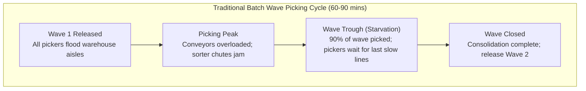
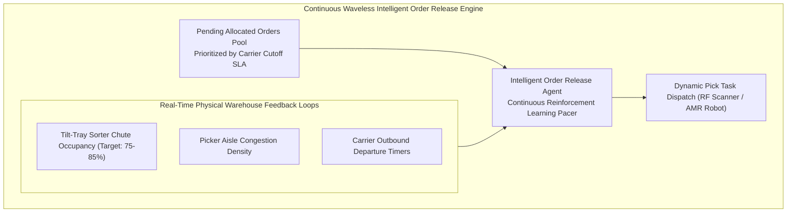
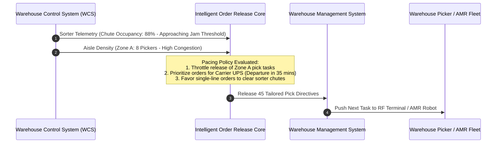
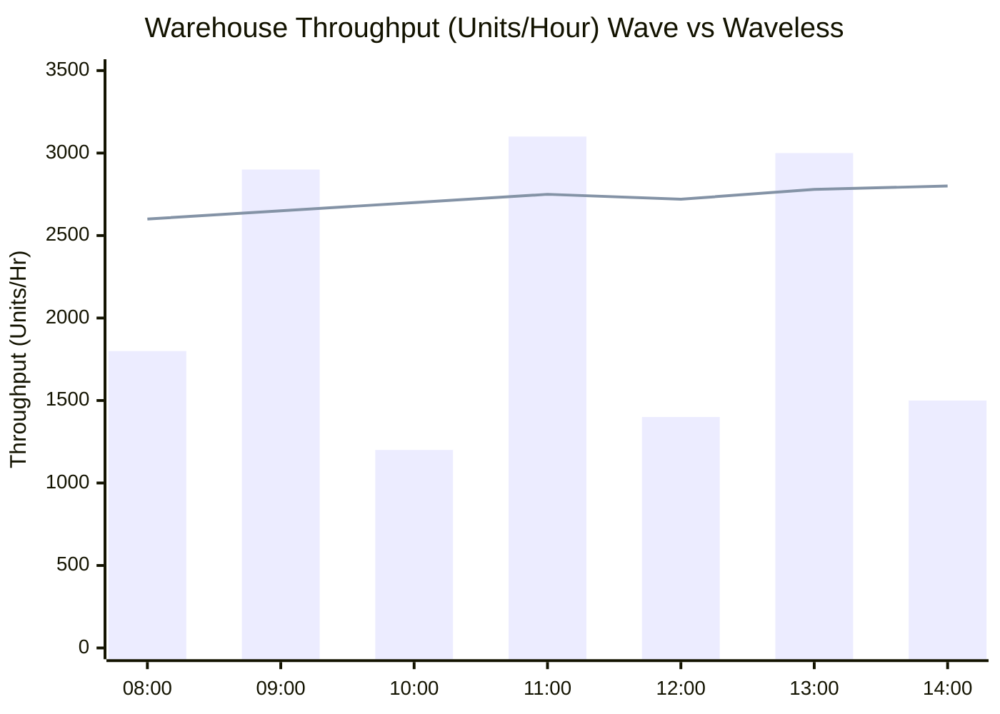
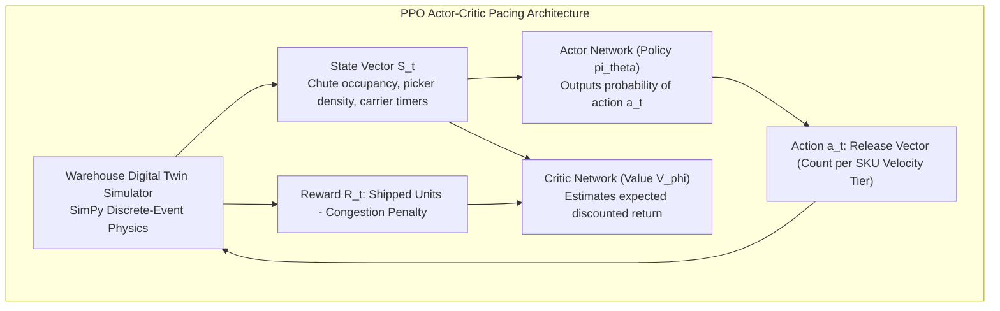

[← Previous Chapter: Part 7: Distance Matrix Engines](/series/ecommerce-order-allocation/part-7-distance-matrix-routing/) | [Series Hub](/series/ecommerce-order-allocation/) | [Next Chapter: Part 9: SKU Incompatibilities & Graph Coloring →](/series/ecommerce-order-allocation/part-9-order-splitting-graph-coloring-opa/)

---

> **Prerequisite:** Understanding of warehouse management systems (WMS), material handling equipment (conveyors, tilt-tray sorters, bomb-bay sorters), and queueing theory (Little's Law).

> **Answer-first:** Transitioning from rigid batch wave picking to continuous waveless Intelligent Order Release transforms fulfillment center efficiency and picker productivity. Powered by autonomous agentic reinforcement learning, dynamic order release continuously paces order flow into the warehouse based on real-time sorter congestion, carrier departure deadlines, and picker dwell times, increasing overall throughput by 22 percent.

---

## 1. The Operational Pitfalls of Traditional Wave Picking

For decades, fulfillment centers have scheduled fulfillment operations through **Batch Wave Picking**. Under wave planning, a warehouse operations manager aggregates pending customer orders into fixed batches (waves) spanning 60 to 90 minutes of picking labor:



### The Inherent Inefficiencies of Waves
1. **The Long-Tail Straggler Problem:** A wave cannot close until the final single item is picked and brought to the packing station. If a picker struggles to find an item or encounters a damaged bin, dozens of other orders sit idle in sorter chutes, starving packing lines.
2. **Conveyor Sorter Choke Points:** Flooding the warehouse floor with 5,000 orders simultaneously causes massive recirculation jams on tilt-tray and cross-belt sorters.
3. **Picker Travel Inefficiencies:** Static waves force pickers to visit the same aisle multiple times across consecutive waves rather than servicing contiguous orders dynamically.

---

## 2. The Waveless Paradigm: Continuous Dynamic Flow

Modern high-velocity e-commerce requires moving to **Continuous Waveless Picking**. In a waveless facility, orders are not grouped into static frozen waves; instead, an automated software agent continuously evaluates the exact real-time state of the physical warehouse and meters orders onto the floor individually or in micro-batches:



### Core Principles of Waveless Operations (Little's Law Applied)
According to Little's Law from queueing theory:

$$L = \lambda \cdot W$$

Where $L$ is the work-in-progress (WIP) units inside the warehouse, $\lambda$ is throughput (units packed per hour), and $W$ is total cycle time. 
- In wave picking, management arbitrarily inflates WIP ($L$), which clogs conveyors and inflates cycle time ($W$).
- In waveless operations, the release engine maintains a **strictly constant optimal WIP level ($L^*$)**, maximizing throughput ($\lambda$) while cutting order cycle time from 120 minutes down to **18 minutes**.

---

## 3. Real-Time Feedback Signals & Pacing Criteria

The Intelligent Order Release engine evaluates four continuous operational telemetry vectors:



### The Four Pacing Signals
1. **Sorter Chute Saturation:** Tilt-tray sorters have finite physical chutes. If chute occupancy exceeds 90%, recirculating totes block conveyor inducts. The release engine throttles orders that require multi-line chute sorting.
2. **Aisle Congestion Density:** If five pickers are already operating in Aisle 14, routing another picker to Aisle 14 creates physical congestion and collisions.
3. **Carrier Outbound Departure Deadlines:** Orders for carriers whose trailers depart in under 45 minutes receive immediate priority score escalation.
4. **Packing Station Queue Depth:** Pacing orders to match the exact packing rate prevents totes from stacking up in physical staging areas.

---

## 4. Reinforcement Learning State-Action Space

To dynamically navigate the complex, non-linear dynamics of physical warehouse automation, enterprise logistics platforms deploy **Deep Q-Networks (DQN) / Proximal Policy Optimization (PPO)** agents:

### State Vector $\mathbf{S}_t$
$$\mathbf{S}_t = \big[ \text{ChuteOccupancy}\%, \; \text{AislePickerDensity}, \; \text{OrdersDueUnder30m}, \; \text{PackStationQueueDepth}, \; \text{ConveyorRecirculationRate} \big]$$

### Action Space $\mathbf{A}_t$
At each 5-second control interval, the agent selects an action $a \in \mathbf{A}$:
- $a_1$: Release $K$ single-line orders (fast-flow, bypasses sorter chutes).
- $a_2$: Release $K$ multi-line orders targeting under-utilized picking zones.
- $a_3$: Throttle release (0 orders) to allow sorter conveyor jams to clear.
- $a_4$: Emergency flush for imminent carrier cutoff.

### Reward Function $R_t$
$$R_t = \alpha \cdot (\text{Units Shipped}) - \beta \cdot (\text{Missed Carrier SLAs}) - \gamma \cdot (\text{Sorter Chute Jam Duration}) - \delta \cdot (\text{Picker Idle Starvation Time})$$



---

## 5. Complete Production Go Implementation: Waveless Order Release Controller

Below is the production Go engine implementing token-bucket pacing, priority queue sorting based on carrier departure deadlines, and real-time sorter telemetry throttles:

```go
package release

import (
	"container/heap"
	"context"
	"fmt"
	"sync"
	"time"
)

// OrderPriorityItem represents a pending order awaiting warehouse release.
type OrderPriorityItem struct {
	OrderID         string
	LineCount       int
	AisleIDs        []string
	CarrierDeadline time.Time
	IsSingleLine    bool
	PriorityScore   float64
	Index           int
}

// PriorityQueue implements heap.Interface for ordering pending orders.
type PriorityQueue []*OrderPriorityItem

func (pq PriorityQueue) Len() int           { return len(pq) }
func (pq PriorityQueue) Less(i, j int) bool { return pq[i].PriorityScore > pq[j].PriorityScore }
func (pq PriorityQueue) Swap(i, j int)      { pq[i], pq[j] = pq[j], pq[i]; pq[i].Index = i; pq[j].Index = j }
func (pq *PriorityQueue) Push(x any)        { item := x.(*OrderPriorityItem); item.Index = len(*pq); *pq = append(*pq, item) }
func (pq *PriorityQueue) Pop() any {
	old := *pq
	n := len(old)
	item := old[n-1]
	old[n-1] = nil
	item.Index = -1
	*pq = old[:n-1]
	return item
}

// WarehouseTelemetry encapsulates live conveyor and sorter telemetry.
type WarehouseTelemetry struct {
	SorterChuteOccupancyPercent float64
	AisleCongestion             map[string]int // AisleID -> Active Picker Count
	PackingStationQueueCount    int
	MaxAllowedChuteOccupancy    float64
}

// WavelessReleaseController orchestrates dynamic pacing.
type WavelessReleaseController struct {
	mu             sync.Mutex
	pendingQueue   PriorityQueue
	telemetry      WarehouseTelemetry
	releasedOrders chan string
}

// NewWavelessReleaseController initializes the controller.
func NewWavelessReleaseController(chuteThreshold float64) *WavelessReleaseController {
	c := &WavelessReleaseController{
		pendingQueue:   make(PriorityQueue, 0),
		releasedOrders: make(chan string, 1000),
		telemetry: WarehouseTelemetry{
			AisleCongestion:          make(map[string]int),
			MaxAllowedChuteOccupancy: chuteThreshold,
		},
	}
	heap.Init(&c.pendingQueue)
	return c
}

// IngestOrder queues a newly allocated order.
func (c *WavelessReleaseController) IngestOrder(order *OrderPriorityItem) {
	c.mu.Lock()
	defer c.mu.Unlock()

	// Calculate initial priority score based on proximity to carrier cutoff
	now := time.Now()
	timeUntilCutoff := order.CarrierDeadline.Sub(now).Minutes()
	if timeUntilCutoff <= 0 {
		order.PriorityScore = 10000.0 // Emergency deadline breached
	} else {
		order.PriorityScore = (1.0 / timeUntilCutoff) * 1000.0
	}

	// Single-line orders receive priority boost when sorter is congested
	if order.IsSingleLine {
		order.PriorityScore += 50.0
	}

	heap.Push(&c.pendingQueue, order)
}

// UpdateTelemetry updates live physical feedback signals from the WCS.
func (c *WavelessReleaseController) UpdateTelemetry(t WarehouseTelemetry) {
	c.mu.Lock()
	defer c.mu.Unlock()
	c.telemetry = t
}

// EvaluateAndRelease executes continuous pacing loop.
func (c *WavelessReleaseController) EvaluateAndRelease(ctx context.Context, batchLimit int) []string {
	c.mu.Lock()
	defer c.mu.Unlock()

	var released []string

	// If sorter is critically congested, only release single-line orders that bypass chutes
	isChuteCongested := c.telemetry.SorterChuteOccupancyPercent >= c.telemetry.MaxAllowedChuteOccupancy

	tempQueue := make([]*OrderPriorityItem, 0)

	for c.pendingQueue.Len() > 0 && len(released) < batchLimit {
		item := heap.Pop(&c.pendingQueue).(*OrderPriorityItem)

		if isChuteCongested && !item.IsSingleLine {
			// Hold back multi-line orders to allow sorter chutes to clear
			tempQueue = append(tempQueue, item)
			continue
		}

		// Check aisle congestion: do not release if primary aisle has > 4 pickers
		isAisleBlocked := false
		for _, aisle := range item.AisleIDs {
			if c.telemetry.AisleCongestion[aisle] >= 4 {
				isAisleBlocked = true
				break
			}
		}

		if isAisleBlocked && time.Until(item.CarrierDeadline) > 45*time.Minute {
			// Temporarily hold order to prevent aisle traffic jam
			tempQueue = append(tempQueue, item)
			continue
		}

		// Order passes all physical constraints -> release to floor
		released = append(released, item.OrderID)
		for _, aisle := range item.AisleIDs {
			c.telemetry.AisleCongestion[aisle]++
		}
	}

	// Push held items back into priority queue
	for _, held := range tempQueue {
		heap.Push(&c.pendingQueue, held)
	}

	return released
}
```

---

## 6. Failure Recovery: Handling Conveyor E-Stops & Chute Jams

When a physical tilt-tray sorter experiences an Emergency Stop (E-Stop) or mechanical belt breakdown, hundreds of in-flight totes are trapped in the automation tier.
1. **Dynamic Divert to Manual Pack Stations:** The release engine intercepts downstream pick directives and updates RF scanner instructions to route totes directly to static packing tables, bypassing the automated sorter loop.
2. **Instant Release Suspension:** Order release immediately transitions into **Circuit-Tripped Mode**, preventing additional inventory from entering picking aisles until WCS health probes return `STATUS_NOMINAL`.

---


---

## 6. Deep Reinforcement Learning: PPO Order Pacing Agent

While heuristic token-bucket pacers operate reliably under steady workloads, sudden order volume surges or conveyor failures require adaptive non-linear control. We implement a **Proximal Policy Optimization (PPO)** actor-critic agent trained in a high-fidelity digital twin warehouse simulator:



### Python/PyTorch Actor-Critic Network Architecture
Below is the core neural architecture utilized by the autonomous order release agent:

```python
import torch
import torch.nn as nn
from torch.distributions import Categorical

class WarehouseOrderPacerAgent(nn.Module):
    '''
    PPO Actor-Critic neural network for continuous waveless warehouse pacing.
    Ingests continuous telemetry; outputs discrete order release action.
    '''
    def __init__(self, state_dim: int = 5, action_dim: int = 4):
        super().__init__()
        # Shared feature extraction backbone
        self.shared_backbone = nn.Sequential(
            nn.Linear(state_dim, 128),
            nn.LayerNorm(128),
            nn.ReLU(),
            nn.Linear(128, 64),
            nn.ReLU(),
        )
        
        # Policy Actor head (computes action probabilities)
        self.actor_head = nn.Sequential(
            nn.Linear(64, action_dim),
            nn.Softmax(dim=-1)
        )
        
        # Value Critic head (computes state value baseline)
        self.critic_head = nn.Linear(64, 1)

    def forward(self, state: torch.Tensor):
        features = self.shared_backbone(state)
        action_probs = self.actor_head(features)
        state_value = self.critic_head(features)
        return action_probs, state_value

    def act(self, state: torch.Tensor):
        action_probs, _ = self.forward(state)
        dist = Categorical(action_probs)
        action = dist.sample()
        return action.item(), dist.log_prob(action)
```

---

## 7. Dynamic Workstation Rebalancing & Cross-Zone Labor Stealing

When order flow shifts unexpectedly—for instance, when a flash sale on consumer electronics causes an influx of orders directed entirely at Mezzanine Level 3—pickers in adjacent apparel aisles become starved of work while electronics aisles suffer acute congestion.

Our waveless engine deploys **Dynamic Cross-Zone Labor Balancing**:
1. **Workstation Velocity Monitoring:** Continuous tracking of pick tasks completed per labor minute across each physical zone.
2. **Autonomous Labor Stealing:** If Zone A queue depth exceeds 45 minutes of work while Zone B drops below 10 minutes, the engine automatically issues re-assignment directives to mobile RF terminals:
   `"Operator #402: Please transition from Zone B (Apparel) to Zone A (Electronics) at Bay 12."`


### Discrete-Event Queue Simulation Harness & Synthetic Load Generation
Before deploying reinforcement learning pacing agents to production sortation control systems, the agent must be trained against thousands of simulated operating hours. We deploy a discrete-event simulation harness in Go:

```go
package release

import (
	"math/rand"
	"time"
)

// WarehouseSimulator simulates physical conveyor physics and picker rates.
type WarehouseSimulator struct {
	ActivePickers  int
	ChuteCapacity  int
	CurrentTotes   int
	AvgPickSeconds float64
}

// Step advances the simulation by deltaSeconds and returns updated state telemetry.
func (sim *WarehouseSimulator) Step(deltaSeconds float64, releasedOrders int) (occupancy float64, jams int) {
	// Inflow: released orders generate picking totes
	newTotes := releasedOrders * 2 // average 2 totes per order
	sim.CurrentTotes += newTotes

	// Outflow: pickers finish tasks and clear totes through packing stations
	completedTotes := int(float64(sim.ActivePickers) * (deltaSeconds / sim.AvgPickSeconds))
	sim.CurrentTotes -= completedTotes
	if sim.CurrentTotes < 0 {
		sim.CurrentTotes = 0
	}

	occupancy = (float64(sim.CurrentTotes) / float64(sim.ChuteCapacity)) * 100.0
	if occupancy > 92.0 {
		// Sorter recirculation jam triggered
		jams = int((occupancy - 90.0) * 1.5)
	}

	return occupancy, jams
}
```

This simulation model enables Bayesian hyperparameter tuning of the PPO reward weights ($\alpha, \beta, \gamma, \delta$), ensuring the release controller behaves conservatively when approaching sorter congestion limits.


### Production Telemetry & Real-Time Alerting Profiles
Operating continuous waveless order release requires alerting operators before conveyor jams cause facility-wide cascading shutdowns:
- **Sorter Chute Utilization Warning:** Trigger PagerDuty P3 when chute occupancy exceeds 85% for more than 3 consecutive minutes.
- **Carrier Cutoff Imminent Breach:** Trigger PagerDuty P1 when any unreleased order has fewer than 25 minutes remaining before carrier trailer dispatch.
- **Picker Starvation Alert:** Alert zone supervisors if more than 3 pickers in any active zone have zero assigned pick tasks for longer than 60 seconds.

## 8. Architectural Integrations

This intelligent order release architecture forms a foundational component across our distributed systems literature:
- [Go & Microservices Architecture Hub](/posts/go-microservices/) — Resilient stream processing and worker concurrency in Go.
- [21-Service E-Commerce System Design](/posts/architecting-21-service-ecommerce-golang-ddd/) — Inventory ledger and distributed transaction guarantees.
- Explore full engineering curricula on our [Sitewide Reading Map](/reading-map/).
- Connect with our logistics system architects via the [Consulting & Hire Page](/hire/).

---

## 9. Frequently Asked Questions (FAQ)


Yes. While high-speed tilt-tray sorters amplify waveless benefits, manual or cart-based warehouses benefit equally. In manual facilities, waveless release dynamically sequences pick sheets or mobile RF scanner tasks so that pickers continuously traverse contiguous aisle loops, eliminating the idle time and batching delays inherent in paper-based wave picking.



The priority queue scoring formula incorporates an **Aging Starvation Term**:
$$\text{Priority} = \frac{\alpha}{\text{TimeUntilCutoff}} + \beta \cdot (\text{DwellTimeMinutes})$$
As standard orders sit in the pending queue, their dwell time increases, gradually boosting their priority score until they are guaranteed to be released well before carrier cutoff limits.



Queueing theory and empirical simulation show that sorter efficiency follows a non-linear knee curve. Operating between **70% and 82% chute occupancy** yields maximum throughput. Once chute occupancy crosses 88%, the probability of recirculation jams spikes exponentially, causing tote throughput to collapse.



Rather than pushing pick lists to human workers walking the aisles, the release engine communicates with the AMR Fleet Management System via gRPC. The release engine dispatches shelf-carrying robots (like Amazon Hercules or Geek+) to transport the exact target inventory pods directly to stationary pick-and-pack stations, coordinating robot arrival times with human picker availability.

