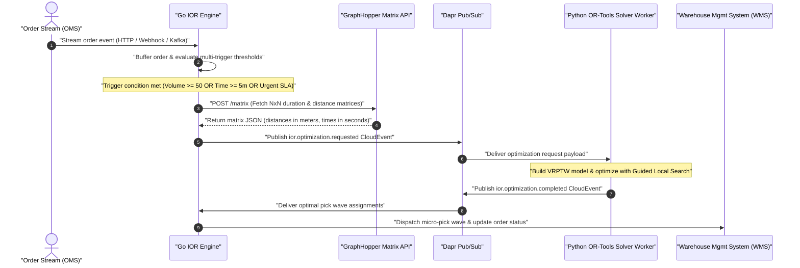

> **Series context:** This is Part 8 of the [E-commerce Order Allocation](/series/ecommerce-order-allocation/) series, building on the GraphHopper distance matrix routing engine from [Part 7](/series/ecommerce-order-allocation/part-7-distance-matrix-routing/) and OR-Tools VRP solver from [Part 6](/series/ecommerce-order-allocation/part-6-build-mini-allocation-engine/).

# Agentic AI for Dynamic Intelligent Order Release (IOR)

**Answer-first:** Dynamic Intelligent Order Release (IOR) replaces rigid warehouse wave batching with continuous, event-driven micro-batch optimization. Operating in Go, the engine ingests order streams, queries a self-hosted GraphHopper Distance Matrix API, dispatches events over Dapr Pub/Sub, and invokes Google OR-Tools VRPTW solvers to release pick waves respecting carrier cutoffs and picker capacity.

---

## 1. The Death of Static Wave Batching

Traditional Warehouse Management Systems (WMS) execute fulfillment via **static wave batching**. Orders accumulate in a database queue throughout the day, and at scheduled intervals (such as 08:00, 11:00, and 14:00), a batch job locks the queue, aggregates SKUs, generates paper or digital pick lists, and assigns work to warehouse operators.

While static wave batching simplifies deterministic warehouse scheduling, high-velocity e-commerce operations encounter three structural failure modes under this paradigm:

1. **SLA Breach Risks for Express Orders:** An order placed at 08:05 with a 2-hour delivery SLA must wait nearly 3 hours for the 11:00 wave cutoff before picking begins. The static queue delay consumes up to 75% of the total SLA window before an item is retrieved from a shelf.
2. **Sawtooth Picker Utilization:** Warehouse floors experience extreme workload spikes immediately after a wave release, causing aisle congestion and conveyor belt bottlenecks. Once the wave picking completes, picker utilization drops sharply until the next scheduled cutoff time.
3. **Carrier Cutoff Detachment:** Static waves release orders without visibility into real-time carrier arrival windows, dock door availability, or last-mile traffic conditions. A delivery truck departing at 10:30 receives items picked during the 08:00 wave, missing express orders that arrived at 08:15 that could have fit onto the vehicle.

```
Static Wave Batching:
[08:00 Cutoff] ---> High Utilization / Aisle Congestion ---> Idle Waiting Period ---> [11:00 Cutoff]

Dynamic Intelligent Order Release (IOR):
Continuous Stream ---> Multi-Trigger Engine ---> Micro-Batch Release ---> Smooth Picker Flow
```

**Dynamic Intelligent Order Release (IOR)** replaces scheduled batch cutoffs with a real-time, event-driven evaluation loop. Incoming orders stream continuously into an in-memory evaluation buffer per fulfillment zone. Optimization runs dynamically based on a **Multi-Trigger Policy**:

* **Volume Threshold ($N \ge N_{max}$):** Triggers an optimization cycle when accumulated orders (e.g., 50 orders per zone) yield a dense pick path.
* **Maximum Wait Window ($\Delta t \ge T_{max}$):** Guarantees low-volume off-peak items are released within a bounded window (e.g., 5 minutes).
* **SLA Urgency Override ($\min(T_{deadline} - t_{now}) \le T_{urgent}$):** Immediately forces an optimization cycle if any pending order is within 30 minutes of missing a carrier departure cutoff.

---

## 2. High-Level Architecture

The Dynamic IOR architecture decouples high-throughput stream ingestion from heavy combinatorial solver execution using an event-driven microservice topology.

The 5-component processing pipeline operates as follows:

1. **Order Stream Ingestion:** The Go IOR Engine ingests real-time order placement events from the Order Management System (OMS). Orders are stored in an in-memory thread-safe buffer grouped by warehouse zone.
2. **Matrix Engine Query:** Upon triggering a release cycle, the Go Engine extracts coordinates for candidate orders and queries a self-hosted GraphHopper Distance Matrix API to construct an $N \times N$ matrix of pairwise driving distances and travel durations.
3. **Event Mesh Dispatch:** The Go Engine packages the matrix, order weights, and SLA time windows into a CloudEvent payload and publishes `ior.optimization.requested` to Dapr Pub/Sub.
4. **VRPTW Solver Worker:** A Python worker subscribing to Dapr Pub/Sub receives the event, constructs a Vehicle Routing Problem with Time Windows (VRPTW) model in Google OR-Tools, executes Guided Local Search within a 5-second deadline, and returns optimal pick routes via `ior.optimization.completed`.
5. **WMS Wave Execution:** The Go Engine receives the optimized wave routes, updates state in the Dapr State Store with ETag locks, and pushes pick wave assignments to the WMS for picker routing.



---

## 3. GraphHopper Distance Matrix Integration in Go

Haversine straight-line formulas underestimate actual urban driving distances by 20% to 50% in dense road networks and fail to compute travel durations. To provide accurate inputs for solver optimization, the Go IOR Engine queries the self-hosted GraphHopper `/matrix` REST endpoint using Contraction Hierarchies (CH) over OpenStreetMap (OSM) data.

The Go service constructs a pairwise coordinate matrix including the warehouse depot (index 0) and $N$ order destinations.

```go
package matrix

import (
	"bytes"
	"context"
	"encoding/json"
	"fmt"
	"net/http"
	"time"
)

// Point represents a geographic coordinate [Longitude, Latitude] for GraphHopper.
type Point [2]float64

// MatrixRequest defines the JSON payload for GraphHopper POST /matrix.
type MatrixRequest struct {
	Points    []Point  `json:"points"`
	OutArrays []string `json:"out_arrays"`
	Vehicle   string   `json:"vehicle"`
	FailFast  bool     `json:"fail_fast"`
}

// MatrixResponse holds the GraphHopper distance and duration matrices.
type MatrixResponse struct {
	Distances [][]int64 `json:"distances"` // meters
	Times     [][]int64 `json:"times"`     // seconds
	Info      struct {
		Took float64 `json:"took"`
	} `json:"info"`
}

// Client handles communication with the self-hosted GraphHopper Matrix API.
type Client struct {
	BaseURL    string
	HTTPClient *http.Client
}

// NewClient initializes a GraphHopper matrix client.
func NewClient(baseURL string) *Client {
	return &Client{
		BaseURL: baseURL,
		HTTPClient: &http.Client{
			Timeout: 10 * time.Second,
		},
	}
}

// FetchMatrix queries GraphHopper for pairwise distances and durations.
func (c *Client) FetchMatrix(ctx context.Context, points []Point, vehicle string) ([][]int64, [][]int64, error) {
	reqBody := MatrixRequest{
		Points:    points,
		OutArrays: []string{"distances", "times"},
		Vehicle:   vehicle,
		FailFast:  false,
	}

	jsonBytes, err := json.Marshal(reqBody)
	if err != nil {
		return nil, nil, fmt.Errorf("failed to marshal matrix request: %w", err)
	}

	url := fmt.Sprintf("%s/matrix", c.BaseURL)
	req, err := http.NewRequestWithContext(ctx, http.MethodPost, url, bytes.NewBuffer(jsonBytes))
	if err != nil {
		return nil, nil, fmt.Errorf("failed to create http request: %w", err)
	}
	req.Header.Set("Content-Type", "application/json")

	resp, err := c.HTTPClient.Do(req)
	if err != nil {
		return nil, nil, fmt.Errorf("graphhopper matrix request failed: %w", err)
	}
	defer resp.Body.Close()

	if resp.StatusCode != http.StatusOK {
		return nil, nil, fmt.Errorf("graphhopper returned non-200 status: %d", resp.StatusCode)
	}

	var res MatrixResponse
	if err := json.NewDecoder(resp.Body).Decode(&res); err != nil {
		return nil, nil, fmt.Errorf("failed to decode matrix response: %w", err)
	}

	return res.Distances, res.Times, nil
}
```

---

## 4. Event-Driven Optimization via Dapr Pub/Sub

Direct synchronous REST or gRPC calls between the Go IOR Engine and Python solver workers introduce solver blocking risks, cascading HTTP timeouts, and tight service coupling under peak load.

Using the **Distributed Application Runtime (Dapr) Pub/Sub** component abstracts message brokers (such as Redis Streams, Apache Kafka, or NATS JetStream). The Go Engine publishes a standardized CloudEvent v1.0 payload (`ior.optimization.requested`), allowing Python solver workers to scale horizontally behind a shared subscription queue using Kubernetes Event-driven Autoscaling (KEDA).

```go
package pubsub

import (
	"context"
	"fmt"
	"time"

	dapr "github.com/dapr/go-sdk/client"
)

// OrderItem represents a pending order in the release pool.
type OrderItem struct {
	ID            string    `json:"id"`
	CustomerLat   float64   `json:"customer_lat"`
	CustomerLng   float64   `json:"customer_lng"`
	WeightKg      float64   `json:"weight_kg"`
	VolumeM3      float64   `json:"volume_m3"`
	CarrierCutoff time.Time `json:"carrier_cutoff"`
	SLADeadline   time.Time `json:"sla_deadline"`
}

// OptimizationPayload contains problem details for the OR-Tools VRPTW solver.
type OptimizationPayload struct {
	EventID         string      `json:"event_id"`
	WarehouseID     string      `json:"warehouse_id"`
	Timestamp       time.Time   `json:"timestamp"`
	DepotLat        float64     `json:"depot_lat"`
	DepotLng        float64     `json:"depot_lng"`
	MaxVehicles     int         `json:"max_vehicles"`
	VehicleCapacity float64     `json:"vehicle_capacity"`
	Orders          []OrderItem `json:"orders"`
	DistanceMatrix  [][]int64   `json:"distance_matrix"`
	DurationMatrix  [][]int64   `json:"duration_matrix"`
}

// Publisher dispatches optimization requests to Dapr Pub/Sub.
type Publisher struct {
	daprClient  dapr.Client
	pubsubName  string
	topicName   string
}

// NewPublisher initializes a Dapr event publisher.
func NewPublisher(client dapr.Client, pubsubName, topicName string) *Publisher {
	return &Publisher{
		daprClient: client,
		pubsubName: pubsubName,
		topicName:  topicName,
	}
}

// PublishOptimizationRequest dispatches an ior.optimization.requested event.
func (p *Publisher) PublishOptimizationRequest(ctx context.Context, payload OptimizationPayload) error {
	err := p.daprClient.PublishEvent(ctx, p.pubsubName, p.topicName, payload)
	if err != nil {
		return fmt.Errorf("failed to publish cloud event to topic %s: %w", p.topicName, err)
	}
	return nil
}
```

---

## 5. Google OR-Tools VRPTW Solver Worker

The Python solver worker receives the CloudEvent payload, extracts duration and distance matrices, formats constraints, and configures the Google OR-Tools `RoutingModel`.

The mathematical formulation maps order release into a Vehicle Routing Problem with Time Windows (VRPTW):
* **Depot Node ($0$):** Warehouse loading dock.
* **Customer Nodes ($1..N$):** Order destinations.
* **Transit Costs:** Pairwise travel durations from GraphHopper matrix.
* **Time Windows:** Carrier departure cutoff times converted to seconds relative to depot departure ($T_0 = 0$).
* **Soft Cutoff Penalties:** Soft upper bounds on arrival time variables, imposing financial costs per second of tardiness to model missed carrier departures.

```python
import json
import logging
from dataclasses import dataclass
from typing import List, Dict, Any
from ortools.constraint_solver import routing_enums_pb2
from ortools.constraint_solver import pywrapcp

logging.basicConfig(level=logging.INFO)
logger = logging.getLogger("ior-vrptw-solver")

@dataclass
class VRPTWProblem:
    distance_matrix: List[List[int]]
    duration_matrix: List[List[int]]
    time_windows: List[tuple]  # (earliest_sec, latest_sec) per node
    demands: List[int]          # Integer weight or volume units
    vehicle_capacities: List[int]
    num_vehicles: int
    depot: int = 0

class IORSolverWorker:
    def __init__(self, time_limit_seconds: int = 5):
        self.time_limit_seconds = time_limit_seconds

    def solve(self, problem: VRPTWProblem) -> Dict[str, Any]:
        num_nodes = len(problem.distance_matrix)
        manager = pywrapcp.RoutingIndexManager(
            num_nodes, problem.num_vehicles, problem.depot
        )
        routing = pywrapcp.RoutingModel(manager)

        # 1. Distance Transit Callback (Arc Cost)
        def distance_callback(from_index: int, to_index: int) -> int:
            from_node = manager.IndexToNode(from_index)
            to_node = manager.IndexToNode(to_index)
            return problem.distance_matrix[from_node][to_node]

        transit_callback_index = routing.RegisterTransitCallback(distance_callback)
        routing.SetArcCostEvaluatorOfAllVehicles(transit_callback_index)

        # 2. Time Transit Callback (Duration Matrix)
        def time_callback(from_index: int, to_index: int) -> int:
            from_node = manager.IndexToNode(from_index)
            to_node = manager.IndexToNode(to_index)
            return problem.duration_matrix[from_node][to_node]

        time_callback_index = routing.RegisterTransitCallback(time_callback)

        # 3. Add Time Dimension (VRPTW)
        time_dim_name = 'Time'
        routing.AddDimension(
            time_callback_index,
            3600,   # Maximum allowed waiting/slack time (1 hour)
            86400,  # Maximum total route duration (24 hours)
            False,  # Force start time to zero
            time_dim_name
        )
        time_dimension = routing.GetDimensionOrDie(time_dim_name)

        # 3.1 Apply Time Windows, Soft Cutoff Penalties, and Node Disjunctions
        PENALTY_UNSERVICED_ORDER = 100_000  # Penalty for dropping an order to candidate pool

        for node_idx, (earliest, latest) in enumerate(problem.time_windows):
            if node_idx == problem.depot:
                continue
            index = manager.NodeToIndex(node_idx)
            
            # Allow arrival up to 2 hours past cutoff, but charge $10 per second late
            time_dimension.CumulVar(index).SetRange(earliest, latest + 7200)
            time_dimension.SetCumulVarSoftUpperBound(index, latest, 10)
            
            # Allow solver to drop order if infeasible, applying disjunction penalty
            routing.AddDisjunction([index], PENALTY_UNSERVICED_ORDER)

        # 4. Add Capacity Dimension
        def demand_callback(from_index: int) -> int:
            from_node = manager.IndexToNode(from_index)
            return problem.demands[from_node]

        demand_callback_index = routing.RegisterUnaryTransitCallback(demand_callback)
        routing.AddDimensionWithCapacity(
            demand_callback_index,
            0,  # Null capacity slack
            problem.vehicle_capacities,
            True,
            'Capacity'
        )

        # 5. Configure Search Parameters (Guided Local Search)
        search_parameters = pywrapcp.DefaultRoutingSearchParameters()
        search_parameters.first_solution_strategy = (
            routing_enums_pb2.FirstSolutionStrategy.PARALLEL_CHEAPEST_INSERTION
        )
        search_parameters.local_search_metaheuristic = (
            routing_enums_pb2.LocalSearchMetaheuristic.GUIDED_LOCAL_SEARCH
        )
        search_parameters.time_limit.seconds = self.time_limit_seconds

        # 6. Solve
        solution = routing.SolveWithParameters(search_parameters)
        if not solution:
            logger.warning("No feasible solution found by OR-Tools solver.")
            return {"status": "INFEASIBLE", "routes": []}

        # 7. Extract Solution Routes
        output_routes = []
        for vehicle_id in range(problem.num_vehicles):
            index = routing.Start(vehicle_id)
            route_stops = []
            while not routing.IsEnd(index):
                node = manager.IndexToNode(index)
                time_var = time_dimension.CumulVar(index)
                route_stops.append({
                    "node": node,
                    "arrival_time_sec": solution.Min(time_var),
                    "departure_time_sec": solution.Max(time_var)
                })
                index = solution.Value(routing.NextVar(index))

            if len(route_stops) > 1:  # Filter out empty vehicle routes
                output_routes.append({
                    "vehicle_id": vehicle_id,
                    "stops": route_stops
                })

        return {
            "status": "OPTIMAL",
            "objective_cost": solution.ObjectiveValue(),
            "routes": output_routes
        }
```

---

## 6. Information Gain & Production Engineering

Deploying dynamic order release in enterprise logistics requires addressing edge cases that standard textbook VRP formulations ignore.

### 1. Piecewise Non-Linear Penalty Functions for Carrier Cutoffs

Standard linear soft bounds ($C_{late} = p \cdot (t - T_{cutoff})$) fail to reflect carrier dock economics. Missing a carrier truck departure by 2 minutes is fundamentally different from missing it by 30 minutes. If a carrier truck leaves the dock at 17:00, a 2-minute delay can be mitigated by holding the vehicle at the gate. A 30-minute delay causes the truck to depart without the items, stranding orders for 24 hours and incurring heavy SLA penalties.

To model this operational reality, IOR implements a **Piecewise Non-Linear Penalty Function**:

$$P(t) = \begin{cases} 
0 & \text{if } t \le T_{cutoff} \\
K_{base} + \alpha \cdot (t - T_{cutoff})^2 & \text{if } T_{cutoff} < t \le T_{cutoff} + \Delta T_{grace} \\
\infty & \text{if } t > T_{cutoff} + \Delta T_{grace}
\end{cases}$$

Where $K_{base}$ represents the base penalty cost for missed pickup scheduling, $\alpha$ accelerates penalty growth as tardiness increases, and $\Delta T_{grace}$ defines the absolute hard cutoff limit. In OR-Tools, this is implemented by combining `SetCumulVarSoftUpperBound` with node disjunction penalties (`AddDisjunction`).

```
Penalty Cost P(t)
   ^
   |                                     /  Hard Limit (Infeasible)
   |                                    /|
   |                                  .' |
   |                                 /   |
   |                             _.-'    |
   |                        _.-''        |
  0 +----------------------*-------------+-------------------> Time t
                       T_cutoff   T_cutoff + Delta_T
```

### 2. Two-Phase Freezing Horizon & Micro-Wave Merging

Constantly re-optimizing order assignments every few minutes creates **pick path instability** for warehouse operators. If a picker receives updated routing instructions mid-pick, they must backtrack across warehouse aisles, causing operational confusion and reduced throughput.

IOR resolves pick instability using a **Two-Phase Freezing Horizon**:

* **Locked Phase ($T \le 10\text{ mins}$):** Pick waves dispatched to the WMS transition to `PICKING_IN_PROGRESS`. Waves in this phase are hard-locked. The solver engine cannot modify, remove, or re-order items in an active locked wave.
* **Candidate Wave Pool ($10\text{ mins} < T \le 30\text{ mins}$):** Incoming express orders are evaluated against un-locked candidate waves. If a newly arrived express order shares high spatial bounding-box overlap with an existing candidate wave, the Go IOR Engine **merges** the order into the micro-wave before lock commitment, avoiding pick path disruption on the active floor.

### 3. Spatial H3 Matrix Caching

Querying GraphHopper `/matrix` for every micro-batch evaluation creates unnecessary network overhead when high-frequency orders originate from dense urban delivery clusters.

By mapping customer delivery coordinates to **Uber H3 Spatial Hexagon Indexes (Resolution 8, ~0.73 $\text{km}^2$)**, the Go Engine caches destination-to-depot travel durations in Redis using H3 cell centroids. 

```
[Order Coordinates] ---> [H3 Index Resolution 8 Cell] ---> [Redis Cache Lookup]
                                                                 |
                                       +-------------------------+-------------------------+
                                       | Cache Hit                                         | Cache Miss
                                       v                                                   v
                       [Return Cached Travel Time]                       [Query GraphHopper Matrix API]
                                                                                           |
                                                                                           v
                                                                             [Store Cell Pair in Redis]
```

When 80% of incoming delivery points hit cached spatial cells, the GraphHopper payload size shrinks from $N \times N$ to $M \times M$ ($M \ll N$), reducing matrix lookup latencies by up to 75%.

### 4. WMS Pick Zone Congestion Backpressure

If WMS telemetry reports that a specific picking aisle or conveyor belt zone (e.g., Zone B) is experiencing heavy congestion or bin shortages, the Go IOR Engine dynamically adjusts its multi-trigger evaluation parameters:

* **Dynamic Volume Throttling:** Reduces $N_{max}$ for congested zones to prevent floor clutter.
* **SLA Priority Re-weighting:** Increases penalty weights for express items while deferring standard ground shipments.
* **Capacity Feedback Loop:** Prevents warehouse aisle bottlenecks while guaranteeing high-priority SLA commitments.
