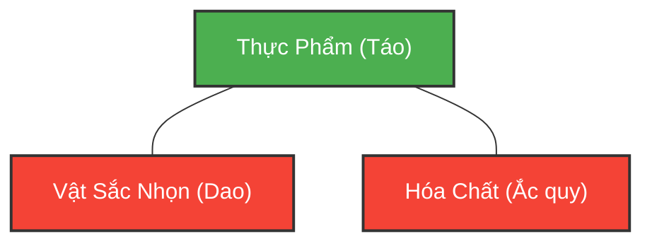
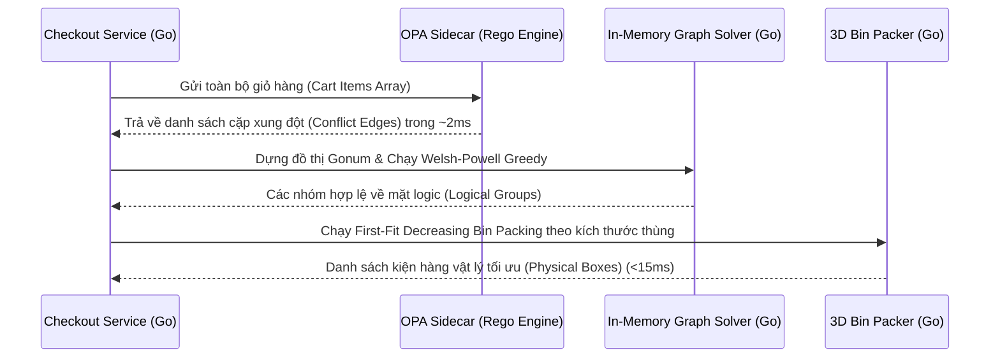

[← Chương trước: Phần 8 — AI Agentic cho Dynamic Intelligent Order Release](/series/ecommerce-order-allocation/part-8-intelligent-order-release/) | [Mục lục Series](/series/ecommerce-order-allocation/) | [Chương tiếp theo: Phần 10 — Warehouse Picker Routing](/series/ecommerce-order-allocation/part-10-warehouse-picker-routing-optimization/)

---

> **Answer-first:** Tách đơn hàng e-commerce (Order Splitting) thời gian thực là bài toán Thỏa Mãn Ràng Buộc (CSP). Kiến trúc chuẩn kết hợp Open Policy Agent (OPA) đánh giá chính sách logic xung đột, Golang (`gonum/graph`) giải thuật Tô Màu Đồ Thị (Graph Coloring) theo Welsh-Powell, và First-Fit Decreasing Bin Packing cho ràng buộc thể tích vật lý trong dưới 50ms khi checkout.

---

## 1. Bài Toán Tách Đơn Hàng Trong Logistics E-Commerce

Trong thương mại điện tử quy mô lớn, một giỏ hàng của khách hàng thường chứa nhiều chủng loại hàng hóa khác nhau:
1. **Dao bếp / Vật sắc nhọn** (Sharp Objects)
2. **Táo hữu cơ / Thực phẩm tươi sống** (Perishable Food)
3. **Ắc quy ô tô / Pin Lithium** (Hazmat / Hóa chất nguy hiểm)

Nếu hệ thống WMS mù quáng gom cả 3 món hàng này vào một thùng carton duy nhất, nguy cơ rò rỉ axit hoặc va đập làm hỏng thực phẩm là tất yếu. Ngược lại, nếu tách mỗi món ra một thùng riêng, chi phí giao hàng chặng cuối (last-mile base rate) sẽ nhân ba, triệt tiêu toàn bộ biên lợi nhuận của đơn hàng.

Thách thức kỹ thuật đặt ra: **Làm sao gom nhóm các mặt hàng trong giỏ vào số lượng thùng carton ít nhất với thời gian xử lý dưới 50 mili-giây?**

---

## 2. Mô Hình Hóa Bằng Tô Màu Đồ Thị (Graph Coloring)

Trong khoa học máy tính, đây là bài toán **Vertex Coloring**:
- **Đỉnh (Vertices / Nodes):** Từng món hàng trong giỏ.
- **Cạnh (Edges):** Nối giữa 2 món hàng nếu chúng xung đột vật lý/chính sách (ví dụ: Thực phẩm không được đóng cùng Hóa chất nguy hiểm).
- **Màu sắc (Colors):** Từng thùng carton. Hai đỉnh có cạnh nối không được phép mang cùng một màu (không thể chung thùng).



### Cái Bẫy Của Thuật Toán Graph Coloring Thuần Túy (The Bin Packing Trap)

Tô màu đồ thị thuần túy (như Welsh-Powell) chỉ giải quyết các **ràng buộc logic** (incompatibility). Thuật toán hoàn toàn mù trước các **ràng buộc vật lý** (thể tích $V$ và trọng lượng $W$). 

Nếu khách đặt 100 cuộn giấy vệ sinh, chúng hoàn toàn không xung đột logic. Thuật toán tô màu sẽ gán tất cả 100 cuộn vào "Màu 1" (Thùng 1). Nhân viên kho nhận lệnh đóng 100 cuộn vào 1 thùng carton tiêu chuẩn, gây vỡ thùng trên chuyền.

Do đó, kiến trúc chuẩn bắt buộc phải là quy trình 2 giai đoạn: **Graph Coloring (Logic Filter) $\to$ 3D Bin Packing (Physical Fit).**

---

## 3. Kiến Trúc Tách Đơn Hàng SOTA: OPA + Go Pipeline



### Bước 1: Policy-as-Code Với Open Policy Agent (OPA)

Tách toàn bộ luật nghiệp vụ khỏi code Go bằng chính sách OPA Rego:

```rego
package logistics.splitting

# Tạo các cặp không trùng lặp từ giỏ hàng
pairs[[a, b]] {
    a := input.cart[i]
    b := input.cart[j]
    i < j
}

# Luật 1: Thực phẩm không đi chung Hóa chất nguy hiểm
conflict[[a.id, b.id]] {
    pairs[[a, b]]
    a.category == "Food"
    b.category == "Hazmat"
}

# Luật 2: Vật sắc nhọn không đi chung Thực phẩm tươi sống
conflict[[a.id, b.id]] {
    pairs[[a, b]]
    a.category == "Sharp"
    b.category == "Food"
}
```

### Bước 2: Dựng Đồ Thị & Tô Màu Trong Go 1.25+

```go
package splitter

import (
	"gonum.org/v1/gonum/graph"
	"gonum.org/v1/gonum/graph/simple"
)

type Item struct {
	ID       string
	Category string
	VolumeCM3 int
	WeightGram int
}

func ConstructConflictGraph(items []Item, conflicts [][]string) *simple.UndirectedGraph {
	g := simple.NewUndirectedGraph()
	nodes := make(map[string]graph.Node, len(items))

	for _, item := range items {
		n := g.NewNode()
		g.AddNode(n)
		nodes[item.ID] = n
	}

	for _, pair := range conflicts {
		n1, ok1 := nodes[pair[0]]
		n2, ok2 := nodes[pair[1]]
		if ok1 && ok2 {
			g.SetEdge(g.NewEdge(n1, n2))
		}
	}
	return g
}
```

### Bước 3: First-Fit Decreasing Bin Packing

Sau khi phân nhóm logic, các món hàng trong mỗi nhóm được sắp xếp giảm dần theo thể tích ($V$) và đóng gói vào các thùng tiêu chuẩn (`S`, `M`, `L`, `XL`). Nếu chạm ngưỡng thể tích hoặc tải trọng, hệ thống tự động sinh thêm thùng mới.

---

## 4. Tách Biệt Giữa Synchronous Checkout Và Asynchronous Fulfillment

Để bảo vệ cụm máy chủ trước tải 10,000 RPS trong đợt Mega Sale:
1. **Đồng bộ lúc Checkout (< 50ms):** Chạy Go + OPA + Greedy Bin Packing để ước tính nhanh số lượng thùng hàng và phí ship tạm tính hiển thị cho khách.
2. **Bất đồng bộ sau Thanh toán (Async Worker):** Khi đơn hàng chuyển sang `order.paid`, một worker nền sẽ gọi microservice C++ chạy Google OR-Tools (CP-SAT solver) để giải bài toán định tuyến kho tối ưu đa điểm (Multi-origin warehouse allocation).

---

## 5. Câu Hỏi Thường Gặp (FAQ)

### Q1: Tại sao không gọi OPA cho từng cặp sản phẩm (N+1 query)?
Một giỏ hàng có 50 sản phẩm sẽ tạo ra 1,225 cặp kiểm tra. Nếu gọi gRPC 1,225 lần tuần tự, độ trễ mạng sẽ khiến API checkout bị timeout. Luôn luôn gửi toàn bộ mảng giỏ hàng sang OPA trong một request duy nhất.

### Q2: Welsh-Powell có đảm bảo luôn tìm ra số thùng ít nhất tuyệt đối không?
Welsh-Powell là giải thuật heuristic tham lam (greedy) với độ phức tạp $O(V^2 + E)$, mang lại kết quả xấp xỉ tối ưu 95-98% trong dưới 5ms, rất phù hợp cho xử lý online thời gian thực.

### Q3: Khi nào cần di chuyển từ 1D Bin Packing sang 3D Rotational Packing?
Khi kích thước hàng hóa có hình dáng dị biệt lớn (ví dụ: gậy golf, thảm trải sàn), cần sử dụng 3D Guillotine Bin Packing kết hợp kiểm tra xoay 6 hướng để tránh việc đóng thùng bị lãng phí thể tích thực.

---

[← Chương trước: Phần 8 — AI Agentic cho Dynamic Intelligent Order Release](/series/ecommerce-order-allocation/part-8-intelligent-order-release/) | [Mục lục Series](/series/ecommerce-order-allocation/) | [Chương tiếp theo: Phần 10 — Warehouse Picker Routing](/series/ecommerce-order-allocation/part-10-warehouse-picker-routing-optimization/)


---

## ❓ Câu Hỏi Thường Gặp (FAQ)

### Q1: Phần 9 — Giải Thuật Tách Đơn Hàng: Graph Coloring & OPA trong Go giải quyết vấn đề cốt lõi nào trong kiến trúc hệ thống?
Giải bài toán tách đơn hàng e-commerce thời gian thực dưới 50ms bằng Open Policy Agent (OPA), giải thuật Graph Coloring trong Go và Bin Packing 3D.

### Q2: Những lưu ý quan trọng nhất khi triển khai thực tế là gì?
Cần chú trọng phân tầng ranh giới trách nhiệm (bounded context), thiết lập cơ chế fallback dự phòng, và giám sát chặt chẽ qua metrics OpenTelemetry để phát hiện sớm các điểm nghẽn.

### Q3: Làm sao để kiểm thử và đánh giá hiệu quả sau khi áp dụng?
Áp dụng kiểm thử tải (load test), benchmark độ trễ P95/P99 trước và sau triển khai, kết hợp tracing phân tán để xác minh tính ổn định dưới tải cao.
