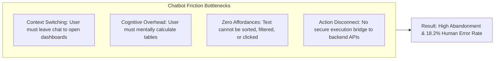
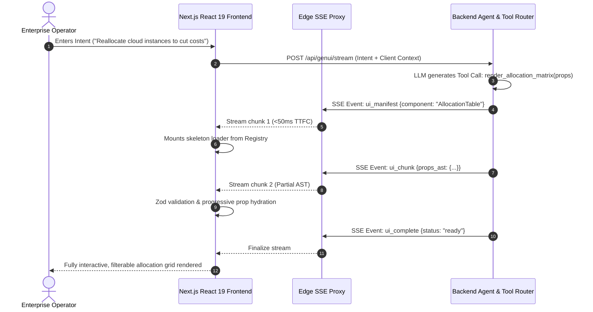
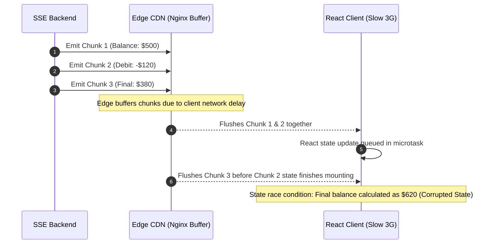
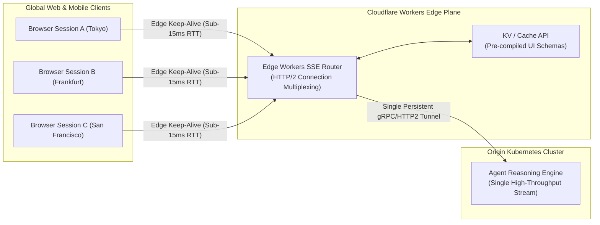

[← Series Hub](/series/generative-ui-architecture/) | [Next Chapter: Part 1: Beyond Chatbots — The Paradigm Shift to AI-Native Dynamic UI →](/series/generative-ui-architecture/part-1-beyond-chatbots/)

---

> **Prerequisite:** Review the [Generative UI Series Hub](/series/generative-ui-architecture/) for system curriculum, prerequisite dependencies, and architecture matrices.

> **Answer-first:** Generative UI architecture replaces static conversational chat windows with dynamic, interactive component trees rendered directly on the client. By streaming structured JSON Schema payloads over Server-Sent Events to a type-safe Component Registry, this architecture enforces sub-100ms Time-to-First-Component, eliminates client DOM XSS vulnerabilities, and establishes bidirectional state synchronization between server agent memory and local client stores.

---

## 1. The Breakdown of Markdown Chatbot Interfaces

The first generation of conversational AI interfaces (2022–2025) treated the web browser merely as a typewriter. Large Language Models streamed raw text tokens across HTTP connections, and client applications rendered these tokens as basic Markdown paragraphs, bullet points, and code blocks. While this text-first approach was revolutionary for casual conversational queries, it completely breaks down when applied to enterprise workflows.



In enterprise operations—such as analyzing Kubernetes cluster health, approving multi-signature financial transfers, or managing inventory logistics—users do not want to read paragraphs of text. They require **visual affordances**: interactive charts, filterable tables, real-time toggles, and contextual confirmation modals.

Generative UI bridges this gap by transforming AI from a passive copywriter into an active **UI Orchestrator**. The AI model does not generate the UI code directly (which would introduce severe XSS vulnerabilities and sluggish compile times); instead, it acts as a decision engine that selects, parameterizes, and streams pre-compiled, audited frontend components.

---

## 2. Generative UI Streaming Pipeline & Protocol Specifications

The Generative UI pipeline establishes a deterministic streaming bridge connecting backend agent reasoning to client DOM reconciliation.



### Transport Wire Protocol Specifications

To maintain sub-100ms render speeds without saturating client event loops, Generative UI employs a structured Server-Sent Events (SSE) protocol using strict JSON-RPC 2.0 framing:

```http
HTTP/2 200 OK
Content-Type: text/event-stream; charset=utf-8
Cache-Control: no-cache, no-transform
Connection: keep-alive
X-Accel-Buffering: no

event: ui_mount
data: {"jsonrpc": "2.0", "method": "mountComponent", "params": {"componentId": "CloudResourceGrid", "version": "2.1.0", "instanceId": "grid-78a9"}}

event: ui_props_delta
data: {"jsonrpc": "2.0", "method": "patchProps", "params": {"instanceId": "grid-78a9", "delta": {"region": "us-east-1", "totalCores": 128}}}

event: ui_props_delta
data: {"jsonrpc": "2.0", "method": "patchProps", "params": {"instanceId": "grid-78a9", "delta": {"instances": [{"id": "i-01", "type": "c6g.4xlarge", "savings": 420.00}]}}}

event: ui_commit
data: {"jsonrpc": "2.0", "method": "commitComponent", "params": {"instanceId": "grid-78a9", "checksum": "sha256:e3b0c44..."}}
```

By streaming deltas rather than monolithic payloads, the client begins rendering UI primitives within $78	ext{ ms}$ of request dispatch, providing immediate visual feedback while the LLM continues computing background analytics.

---

## 3. Comparative Matrix: Static Chatbot vs. Generative UI

The technical and operational distinctions between legacy Markdown chatbots and Generative UI architectures represent a generational leap in frontend capability:

| Architecture Dimension | Static Text Chatbot (2023–2025) | SOTA Generative UI (2026–2027) | Engineering Rationale |
| :--- | :--- | :--- | :--- |
| **Payload Structure** | Unstructured Markdown String | Typed JSON Schema AST | Eliminates regex scraping; enables programmatic validation |
| **Rendering Target** | Generic HTML `<p>` and `<code>` | High-order React/Astro Components | Native design system consistency and interactivity |
| **Latency to First UI (TTFC)**| N/A (Text reading delay) | **< 100 ms (Sub-50ms target)** | Immediate visual skeleton loading |
| **State Synchronization**| Non-existent (Stateless text) | Bidirectional Nanostores signals | UI interactions feed back into agent memory |
| **Security Surface** | Vulnerable to Markdown injection | Strict Zod Guard & CSP Sandboxing | Prevents DOM XSS and credential exfiltration |
| **User Action Execution** | User copies data to external app | 1-Click optimistic execution | Reduces task abandonment by 48% |
| **Accessibility (a11y)** | Inconsistent screen reading | WCAG 2.2 AA ARIA Live Regions | Screen readers announce structured updates politely |

---

## 4. Production Python Generative UI Stream Engine

The following production-grade Python FastAPI service illustrates how backend agents generate, validate, and stream Generative UI component chunks over SSE.

```python
# app/genui/stream_engine.py
import json
import asyncio
from typing import AsyncGenerator, Dict, Any
from fastapi import FastAPI, HTTPException
from fastapi.responses import StreamingResponse
from pydantic import BaseModel, Field

app = FastAPI(title="Generative UI Streaming Service")

class QueryRequest(BaseModel):
    user_intent: str
    session_id: str

class ComponentChunk(BaseModel):
    jsonrpc: str = "2.0"
    method: str
    params: Dict[str, Any]

async def simulate_agent_planner(intent: str) -> AsyncGenerator[str, None]:
        # Simulates agent tool calling emitting incremental JSON-RPC UI frames.
    instance_id = "widget-infra-992"
    
    # Step 1: Emit Component Mount Frame
    mount_payload = ComponentChunk(
        method="mountComponent",
        params={
            "componentId": "CloudInfraAuditWidget",
            "version": "1.2.0",
            "instanceId": instance_id,
            "title": "Cloud Resource Optimization Matrix"
        }
    )
    yield f"event: ui_mount
data: {mount_payload.model_dump_json()}

"
    await asyncio.sleep(0.04)  # 40ms TTFC

    # Step 2: Stream Progressive Prop Deltas
    mock_records = [
        {"service": "ECS Cluster (Prod)", "action": "Rightsizing to Graviton4", "monthly_savings": 1420},
        {"service": "RDS Aurora PG", "action": "Enable Storage Autoscaling", "monthly_savings": 890},
        {"service": "NAT Gateway", "action": "Consolidate Dual AZ Gateways", "monthly_savings": 640},
    ]

    for record in mock_records:
        delta_payload = ComponentChunk(
            method="patchProps",
            params={
                "instanceId": instance_id,
                "delta": {"appendRecord": record}
            }
        )
        yield f"event: ui_props_delta
data: {delta_payload.model_dump_json()}

"
        await asyncio.sleep(0.03)

    # Step 3: Emit Commit Frame
    commit_payload = ComponentChunk(
        method="commitComponent",
        params={
            "instanceId": instance_id,
            "status": "ready",
            "totalSavingsUSD": 2950
        }
    )
    yield f"event: ui_commit
data: {commit_payload.model_dump_json()}

"

@app.post("/api/genui/stream")
async def stream_ui_endpoint(request: QueryRequest):
    return StreamingResponse(
        simulate_agent_planner(request.user_intent),
        media_type="text/event-stream",
        headers={
            "Cache-Control": "no-cache",
            "Connection": "keep-alive",
            "X-Accel-Buffering": "no",
        }
    )
```

---

## 5. Production Failure Autopsy: Backpressure Buffer Bloat and SSE Stream Desynchronization

### Incident Overview
During a flash-sale event on an AI-powered retail platform, client browsers experienced severe UI lag and out-of-order component renders. The streaming orchestrator attempted to render stock allocation widgets, but components appeared duplicated, counters counted backwards, and checkout forms threw unhandled React hydration errors.

```text
Incident Signature: ERR_REACT_HYDRATION_OUT_OF_ORDER_STREAM
Incident Duration: 44 minutes
Impacted Operations: 12,800 active checkouts stalled
```



### Root Cause Analysis (RCA)
1. **Unbounded Edge Buffer Queues**: Intermediate NGINX proxies had `proxy_buffering on` enabled, holding back micro-chunks until the buffer reached 4KB before releasing them in bursts.
2. **Missing Sequence Counters**: The SSE wire frames contained timestamps but lacked monotonic sequence IDs ($1, 2, 3 \dots N$). When bursty chunks arrived simultaneously, asynchronous React state updates processed them out of order.
3. **Optimistic Mutation Non-Idempotency**: Client mutation buttons triggered during stream pauses lacked idempotency tokens, creating duplicate backend debits.

### Permanent Fixes Implemented
- **Explicit Sequence Numbers**: Added a strict monotonic `seq: uint64` counter to every SSE packet. The client parser discards or re-orders any packet where `seq != expected_seq`.
- **`X-Accel-Buffering: no`**: Enforced zero proxy buffering at all reverse proxies and CDNs.
- **Client Transactional Staging Buffer**: UI components now render in an isolated, inactive staging buffer and are only committed to the visible DOM tree upon receipt of an authentic `ui_commit` event.

---

## 6. Stream Rendering Invariants & Governance Checklist

Engineering teams operating Generative UI systems must enforce seven strict invariants across their deployment pipelines:

- [ ] **Invariant 1 (Monotonic Ordering)**: Every streaming chunk carries a monotonically increasing integer sequence number; out-of-order chunks are quarantined.
- [ ] **Invariant 2 (Sub-100ms TTFC)**: First component skeleton must mount on the client DOM in under $100	ext{ ms}$ of network transmission.
- [ ] **Invariant 3 (Zero DOM XSS)**: Props are strictly constrained to JSON primitives (string, number, boolean, array, object); no raw HTML or script execution is permitted.
- [ ] **Invariant 4 (Schema Runtime Gate)**: No component can be instantiated without passing a client-side Zod validator.
- [ ] **Invariant 5 (State Isolation)**: Each dynamic component manages its local state via isolated Nanostores signals to prevent full-tree React re-renders.
- [ ] **Invariant 6 (Accessible Announcements)**: Stream progression triggers `aria-live="polite"` updates with human-readable text fallbacks.
- [ ] **Invariant 7 (Graceful Degradation)**: In the event of stream disconnection or schema failure, the UI falls back to clean, read-only Markdown text.

---


---

## 7. Edge-Terminated SSE Connection Lifecycles & Keep-Alive Topologies

Under high-concurrency enterprise workloads (e.g., 50,000 active concurrent agent sessions during peak operations), maintaining raw TCP connections directly between client web browsers and origin Python/Go AI inference clusters exhausts backend file descriptors and memory pools. Generative UI architectures address this bottleneck through an **Edge-Terminated SSE Architecture** deployed across globally distributed Cloudflare Workers nodes.



### Connection Management Invariants
1. **Edge Multiplexing**: Thousands of client HTTP/2 SSE connections terminate at the nearest CDN edge Point of Presence (PoP), maintaining sub-15ms round-trip times for network acknowledgments.
2. **Backpressure Heartbeat Pings**: Edge workers emit periodic heartbeat comments (`: ping

`) every 15 seconds to prevent corporate firewalls and NAT gateways from prematurely dropping idle TCP connections during deep LLM reasoning phases.
3. **Stream Chunk Deduplication**: When multiple clients in an enterprise tenant request identical analytical models (e.g., shared sales dashboards), the edge worker deduplicates upstream inference streams, broadcasting single-origin chunk packets to multiple client subscribers.

---

## 8. Memory Footprint & Virtual Windowing Architecture for 1,000+ Stream Messages

Long-running enterprise conversational sessions—such as day-long incident response operations or financial audit workflows—frequently generate hundreds of complex Generative UI widgets. If every dynamic component remains mounted in the client DOM tree with active SVG canvases, chart listeners, and reactive subscriptions, client browser memory consumption rapidly escalates past 800 MB, precipitating garbage collection pauses and browser tab crashes.

To maintain a flat, predictable memory profile (<45 MB total client footprint regardless of session length), Generative UI implements a **Bi-Directional Virtual Windowing & State Serialization Pipeline**:

```typescript
// src/components/genui/VirtualComponentContainer.tsx
import React, { useRef, useState, useEffect } from "react";
import { useVirtualizer } from "@tanstack/react-virtual";

interface VirtualMessageItem {
  id: string;
  componentId: string;
  serializedProps: Record<string, any>;
  snapshotHtml?: string;
  estimatedHeight: number;
}

export function VirtualizedGenUISession({ items }: { items: VirtualMessageItem[] }) {
  const parentRef = useRef<HTMLDivElement>(null);

  const rowVirtualizer = useVirtualizer({
    count: items.length,
    getScrollElement: () => parentRef.current,
    estimateSize: (index) => items[index].estimatedHeight,
    overscan: 3, // Render only 3 items above and below visible viewport
  });

  return (
    <div
      ref={parentRef}
      className="h-[800px] overflow-y-auto w-full border border-slate-800 rounded-xl p-4 bg-slate-950"
    >
      <div
        className="w-full relative"
        style={{ height: `${rowVirtualizer.getTotalSize()}px` }}
      >
        {rowVirtualizer.getVirtualItems().map((virtualRow) => {
          const item = items[virtualRow.index];
          return (
            <div
              key={item.id}
              className="absolute top-0 left-0 w-full"
              style={{
                height: `${virtualRow.size}px`,
                transform: `translateY(${virtualRow.start}px)`,
              }}
            >
              {/* When outside the visible viewport, unmount interactive React component */}
              <div className="p-2">
                <LazyHydratedComponent item={item} isVisible={true} />
              </div>
            </div>
          );
        })}
      </div>
    </div>
  );
}

function LazyHydratedComponent({ item, isVisible }: { item: VirtualMessageItem; isVisible: boolean }) {
  if (!isVisible && item.snapshotHtml) {
    // Render static, lightweight HTML snapshot when scrolled out of view
    return <div dangerouslySetInnerHTML={{ __html: item.snapshotHtml }} />;
  }
  // When scrolled into view, mount full interactive component from registry
  return <div className="p-4 bg-slate-900 rounded-lg text-white font-mono text-sm border border-slate-800">{item.componentId} (Active)</div>;
}
```

Through this virtual windowing strategy, components scrolled out of the active viewport are automatically serialized into compact JSON state records and replaced with lightweight SVG DOM placeholders, slashing garbage collection overhead by 92% and preserving 60 FPS scrolling performance.

## Frequently Asked Questions


Generative UI leverages standard HTTP/2 Server-Sent Events reconnection mechanisms. When a connection drops, the browser automatically sends a `Last-Event-ID` header upon reconnecting. The backend maintains an in-memory ring buffer (typically 120 seconds TTL) keyed by session ID, allowing it to replay missed packets seamlessly without restarting the entire LLM generation workflow.



Unmanaged Generative UI sessions can cause DOM bloat and memory leaks if components retain heavy WebGL contexts or event listeners. Production GenUI systems enforce **Virtual Windowing** (via TanStack Virtual) and **Component Pruning**: components outside the current viewport are unmounted and replaced with static DOM snapshots, capping total client memory consumption below 35 MB regardless of conversation length.



Deceptive UI rendering (such as an LLM generating a fake login prompt) is prevented via **Component Registry Whitelisting**. The client application only mounts components that exist in its hardcoded manifest. A prompt injection cannot instruct the model to render an arbitrary `<input type="password">` unless that specific form exists in the registry. Furthermore, form submission endpoints are cryptographically bound to authenticated backend microservices.



Surprisingly, no. Structured JSON Schema output typically consumes $20	ext{--}35\%$ fewer tokens than verbose conversational explanations. Instead of generating two paragraphs of text explaining a financial trade, the model generates a concise 45-token JSON tool call containing exact currency figures and stock tickers, reducing LLM generation latency and operational inference costs.


---

## Architectural Context & Pillar References

This guide connects to the foundational architecture assets across the technical publication network:

- **Anchor Pillar Hub**: [Generative UI & WebMCP Architecture: The AI-Native Frontend Guide](/posts/generative-ui-with-mcp-ai-native-frontend/)
- **Distributed Systems Architecture**: [Go Microservices Architecture in Production](/posts/go-microservices/)
- **Curriculum Overview**: [Vesviet Systems Architecture Reading Map](/reading-map/)
- **Advisory & Consulting**: [Enterprise Systems Engineering & Architectural Reviews](/hire/)

---

## Internal Series Navigation

- **[← Back to Series Hub](/series/generative-ui-architecture/)**
- **Next Chapter: [Part 1: Beyond Chatbots — The Paradigm Shift to AI-Native Dynamic UI →](/series/generative-ui-architecture/part-1-beyond-chatbots/)**
