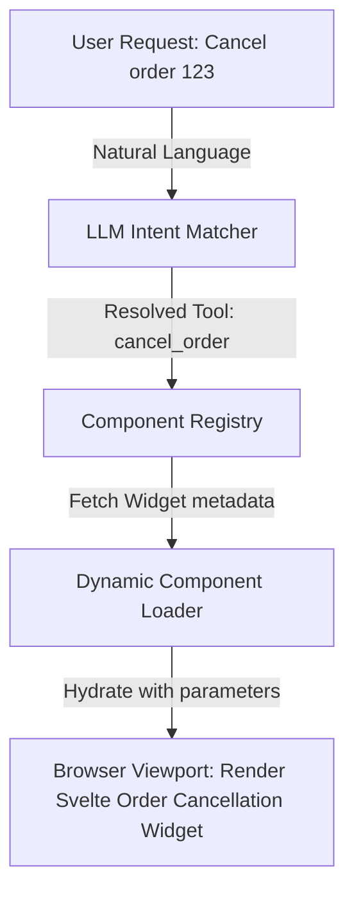

Over the past two years, the software industry has been swept up in the "Chat-in-a-box" storm. A multitude of companies have embedded a chat window (usually in the right corner of the screen) into every application—from core banking systems and ERPs to HR management software—with the hope that AI will automate all user actions.

But reality has proven the opposite.

## 1.1. The Chatbot Paradox in Enterprise Software

Chatbots (or natural language conversational interfaces) initially felt extremely powerful. But when applied to complex professional tasks, they expose fatal flaws in UX (User Experience):

1. **Context Switching:** A user is looking at a financial spreadsheet. To ask AI for analysis, they must look away from the sheet, click the chat box, type a prompt, wait for the AI to generate a long block of text (markdown), read and understand it, and then copy-paste the result back into the spreadsheet. This process is slower and more exhausting than just clicking a button.
2. **Lack of Affordance:** Traditional Graphical User Interfaces (GUI) tell users what the system can do via buttons and menus. With an empty chat box, users fall into "Blank Canvas Paralysis" — they don't know what to command the AI to do.
3. **Illusion of Control:** When AI returns text instead of a concrete action on the system, users find it very difficult to verify the correctness of the data, especially in accounting or healthcare operations.

**Conclusion:** Conversational natural language (Chatting) is not the only interface, and often **not the best interface**, for interacting with AI in professional workflows.

## 1.2. What is Generative UI (GenUI)?

To resolve this paradox, we need a new Frontend architecture paradigm: **Generative UI**.

Instead of the AI replying with text, the AI system **replies with interactive UI Components** (for example: a visual chart, a pre-filled input form, or a control slider).

The evolution of interfaces:
- **Static UI:** Hard-coded by developers. Every user sees the exact same interface.
- **Adaptive UI / Personalization:** The interface automatically changes layout based on fixed rules (e.g., Responsive design, Dark/Light mode, or product recommendations based on history).
- **Generative UI:** The interface does not exist until the user interacts. The AI evaluates the user's Intent and generates the most appropriate UI assembly at that exact moment.



### Dynamic State Payloads in GenUI

In standard REST configurations, JSON APIs return structured models (e.g., a list of orders). In a Generative UI architecture, the payload includes both the **component signature** (telling the registry which component to load) and the **hydration state** (the parameters to feed into it).

Below is the Go representation of a dynamic GenUI stream message payload:

```go
package genui

import (
	"encoding/json"
	"time"
)

type UIComponentPayload struct {
	ComponentID string          `json:"component_id"` // E.g. "order-cancellation-widget"
	Version     string          `json:"version"`      // Semver version of the component
	Props       json.RawMessage `json:"props"`        // Raw JSON properties to inject
	Timestamp   time.Time       `json:"timestamp"`
}

// CancellationProps defines parameters for the Order Cancellation Svelte widget
type CancellationProps struct {
	OrderID         string   `json:"order_id"`
	ReasonOptions   []string `json:"reason_options"`
	AllowRefund     bool     `json:"allow_refund"`
	RefundAccount   string   `json:"refund_account"`
}

func CreateCancellationPayload(orderID string) (*UIComponentPayload, error) {
	props := CancellationProps{
		OrderID:       orderID,
		ReasonOptions: []string{"Item damaged", "Delayed shipping", "Wrong size ordered", "Other"},
		AllowRefund:   true,
		RefundAccount: "Visa **** 1234",
	}

	propsBytes, err := json.Marshal(props)
	if err != nil {
		return nil, err
	}

	return &UIComponentPayload{
		ComponentID: "order-cancellation-widget",
		Version:     "1.2.0",
		Props:       propsBytes,
		Timestamp:   time.Now(),
	}, nil
}
```

---

## 1.3. Future UX Patterns Replacing Chatbots

As we move away from Chatbots, AI will be deeply embedded into the core of products through 3 main patterns:

### 1. Embedded AI (Inline Copilot)
AI does not live in an isolated Sidebar but right where the user is working (Inline).
- *Example:* Notion AI or Cursor IDE. You highlight a block of text/code and press `Ctrl+K`, the AI appears right at that line, modifying the data in-place.

### 2. Zero UI (Invisible Interface)
The concept that "the best interface is no interface." AI operates via **Ambient (background)** and **Predictive** mechanisms.
- Based on context, mouse position, sensor data, or habits, the AI automatically changes the state of the application or pre-fills information without the user having to command it.
- *Example:* Apple Vision Pro tracking eye gaze to highlight a component before the user even moves their hand.

### 3. Multi-Agent Collaborative Dashboards
When a system has multiple Agents working together (e.g., Data Agent collects metrics $\rightarrow$ Analyst Agent analyzes $\rightarrow$ Report Agent writes a report), a Chatbot interface is completely powerless to display this parallel workflow.

The solution is **Collaborative Dashboards**:
- Using **Node-based views (Grid/Graph)** or **Kanban Boards** to represent Agents as "virtual employees" at work.
- Users have a holistic view (Transparency), knowing exactly which Agent is idle, which is processing, and can jump in to intervene (Human-in-the-loop) at any step in the process.

To support real-time updates of agent states on a collaborative dashboard, the backend must stream state transition events. Below is a Go HTTP event handler that broadcasts agent lifecycle transitions using Server-Sent Events (SSE):

```go
package main

import (
	"encoding/json"
	"fmt"
	"net/http"
	"time"
)

type AgentState struct {
	AgentID   string `json:"agent_id"`
	AgentName string `json:"agent_name"`
	Status    string `json:"status"` // E.g., IDLE, PLANNING, EXECUTING, WAITING_APPROVAL
	TaskName  string `json:"task_name"`
}

// StreamAgentStates establishes an SSE stream with the client dashboard
func StreamAgentStates(w http.ResponseWriter, r *http.Request) {
	w.Header().Set("Content-Type", "text/event-stream")
	w.Header().Set("Cache-Control", "no-cache")
	w.Header().Set("Connection", "keep-alive")
	w.Header().Set("Access-Control-Allow-Origin", "*")

	flusher, ok := w.(http.Flusher)
	if !ok {
		http.Error(w, "Streaming unsupported", http.StatusInternalServerError)
		return
	}

	ticker := time.NewTicker(2 * time.Second)
	defer ticker.Stop()

	// Simulate agent state transitions
	agent := AgentState{
		AgentID:   "agent-007",
		AgentName: "Financial Analyst Agent",
		Status:    "PLANNING",
		TaskName:  "Calculating Q3 Revenue Accruals",
	}

	for {
		select {
		case <-r.Context().Done():
			fmt.Println("Client disconnected from Agent Dashboard Stream")
			return
		case <-ticker.C:
			// Simulate transition
			switch agent.Status {
			case "PLANNING":
				agent.Status = "EXECUTING"
				agent.TaskName = "Analyzing general ledger postings..."
			case "EXECUTING":
				agent.Status = "WAITING_APPROVAL"
				agent.TaskName = "Confirming balance adjustment of 50M VND"
			case "WAITING_APPROVAL":
				agent.Status = "IDLE"
				agent.TaskName = ""
			default:
				agent.Status = "PLANNING"
				agent.TaskName = "Calculating Q3 Revenue Accruals"
			}

			data, _ := json.Marshal(agent)
			fmt.Fprintf(w, "data: %s\n\n", data)
			flusher.Flush()
		}
	}
}
```

This event stream allows the frontend dashboard to update node positions and status lights in real-time, providing immediate visibility and control over the active agents.

---

🔗 **Next Step:** To achieve Generative UI, the Frontend cannot just receive simple Data like old REST APIs. It needs to receive State from the AI Agent's brain. In the next part, we will design a flexible structure (not locked into Next.js) using Astro: **[Part 2 — Framework-Agnostic State Management Architecture]()**.

