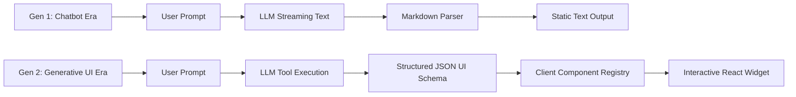
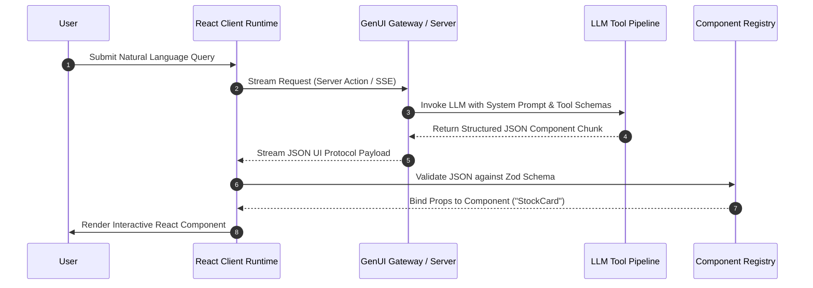
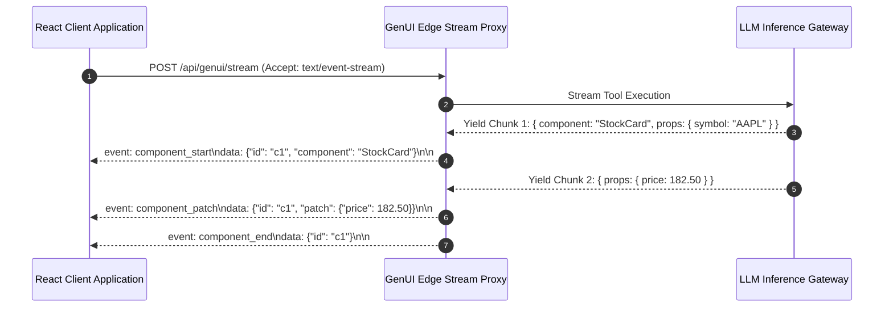

> **Answer-First Summary**: Generative UI (GenUI) is a frontend architectural pattern where Large Language Models dynamically generate structured UI components (such as interactive forms, charts, and data tables) rather than plain streaming Markdown text. By coupling LLM tool-calling output with a validated client-side React component registry and Server-Driven UI (SDUI) protocols, GenUI delivers personalized, deterministic visual interfaces in real time while maintaining strict accessibility, security, and rendering performance.

> **Parent Architecture Guide:** Part 1 of our Generative UI series on [Autonomous Hybrid AI Content Pipeline](/posts/architecting-an-autonomous-hybrid-ai-content-pipeline/).

---

## 1. The Paradigm Shift: Evolution from Markdown to Dynamic Interfaces

The first generation of conversational AI interfaces relied almost exclusively on streaming text formatted as Markdown. While adequate for basic Q&A, Markdown streaming creates significant UX constraints when building complex enterprise applications:

- **Lack of Interactivity**: Users cannot directly manipulate streamed tables, sort data columns, or trigger client-side actions.
- **Poor Layout Control**: Complex financial dashboards or multi-step checkout forms cannot be cleanly represented in raw text.
- **High Cognitive Load**: Users must read paragraphs of generated text rather than reviewing visual cards or structured forms.


```mermaid
graph LR
    SubGraph1[Gen 1: Chatbot Era] --> A[User Prompt]
    A --> B[LLM Streaming Text]
    B --> C[Markdown Parser]
    C --> D[Static Text Output]

    SubGraph2[Gen 2: Generative UI Era] --> E[User Prompt]
    E --> F[LLM Tool Execution]
    F --> G[Structured JSON UI Schema]
    G --> H[Client Component Registry]
    H --> I[Interactive React Widget]
```

**Generative UI (GenUI)** solves these limitations by replacing plain text streaming with **dynamic component instantiation**. Instead of asking an LLM to write "The stock price is $150 with a 5% gain", the model calls a tool returning a `{ component: "StockCard", props: { ticker: "AAPL", price: 150, change: 5.0 } }` JSON payload that immediately renders a pre-compiled, interactive React widget.

---

## 2. Core Architectural Pillars of Generative UI Systems

To render AI-generated interfaces reliably without crashing the client application, a GenUI system must integrate four structural pillars:


```mermaid
sequenceDiagram
    autonumber
    participant U as User
    participant C as React Client Runtime
    participant S as GenUI Gateway / Server
    participant L as LLM Tool Pipeline
    participant R as Component Registry

    U->>C: Submit Natural Language Query
    C->>S: Stream Request (Server Action / SSE)
    S->>L: Invoke LLM with System Prompt & Tool Schemas
    L-->>S: Return Structured JSON Component Chunk
    S-->>C: Stream JSON UI Protocol Payload
    C->>R: Validate JSON against Zod Schema
    R-->>C: Bind Props to Component ("StockCard")
    C->>U: Render Interactive React Component
```

### Pillar 1: Server-Driven UI (SDUI) Protocol
GenUI adapts traditional Server-Driven UI protocols. The server emits JSON streams specifying component names, layout positions, and properties. The client parses this stream incrementally, rendering UI elements as data arrives over Server-Sent Events (SSE) or WebSockets.

### Pillar 2: Validated Component Registry
The client runtime maintains an explicit registry of safe, pre-styled UI components (e.g., `<Button />`, `<DatePicker />`, `<FinancialChart />`). The AI model is never allowed to generate raw HTML or arbitrary JavaScript; it can only select components registered in the catalog.

### Pillar 3: Schema Validation with Zod
Before any component renders, incoming props are validated against strict Zod schemas. If the model emits malformed props (e.g., passing a string where a number is required), the schema validator catches the error and renders a graceful fallback component.

---

## 4. Production Implementation: Building a React GenUI Engine

```typescript
import React, { useMemo } from 'react';
import { z } from 'zod';

// 1. Define Component Schemas using Zod
const StockCardSchema = z.object({
  component: z.literal('StockCard'),
  props: z.object({
    symbol: z.string(),
    price: z.number(),
    changePercent: z.number(),
    currency: z.string().default('USD')
  })
});

const DataGridSchema = z.object({
  component: z.literal('DataGrid'),
  props: z.object({
    title: z.string(),
    columns: z.array(z.string()),
    rows: z.array(z.record(z.any()))
  })
});

// Union Schema for Registry Validation
const GenUIComponentSchema = z.discriminatedUnion('component', [
  StockCardSchema,
  DataGridSchema
]);

type GenUIComponentPayload = z.infer<typeof GenUIComponentSchema>;

// 2. React Component Definitions
const StockCard: React.FC<z.infer<typeof StockCardSchema>['props']> = ({ symbol, price, changePercent, currency }) => (
  <div style={{ border: '1px solid #ccc', padding: '16px', borderRadius: '8px', width: '240px' }}>
    <h3>{symbol}</h3>
    <p style={{ fontSize: '24px', fontWeight: 'bold' }}>{currency} ${price.toFixed(2)}</p>
    <span style={{ color: changePercent >= 0 ? 'green' : 'red' }}>
      {changePercent >= 0 ? '+' : ''}{changePercent}%
    </span>
  </div>
);

const DataGrid: React.FC<z.infer<typeof DataGridSchema>['props']> = ({ title, columns, rows }) => (
  <div style={{ marginTop: '16px' }}>
    <h4>{title}</h4>
    <table border={1} cellPadding={8} style={{ borderCollapse: 'collapse', width: '100%' }}>
      <thead>
        <tr>{columns.map(col => <th key={col}>{col}</th>)}</tr>
      </thead>
      <tbody>
        {rows.map((row, idx) => (
          <tr key={idx}>
            {columns.map(col => <td key={col}>{row[col] ?? '-'}</td>)}
          </tr>
        ))}
      </tbody>
    </table>
  </div>
);

// 3. Component Registry Mapping
const ComponentRegistry = {
  StockCard,
  DataGrid
};

// 4. Dynamic Renderer Component
export const GenUIRenderer: React.FC<{ rawPayload: unknown }> = ({ rawPayload }) => {
  const validatedPayload = useMemo(() => {
    const result = GenUIComponentSchema.safeParse(rawPayload);
    if (!result.success) {
      console.error('GenUI Schema Validation Error:', result.error);
      return None;
    }
    return result.data;
  }, [rawPayload]);

  if (!validatedPayload) {
    return <div style={{ color: 'orange', padding: '8px' }}>⚠️ Invalid UI payload received from AI.</div>;
  }

  const Component = ComponentRegistry[validatedPayload.component];
  return <Component {...(validatedPayload.props as any)} />;
};
```

---

## 5. Architectural Comparison: Markdown vs GenUI

To help system architects choose the appropriate output modality, the table below compares key operational dimensions.

| Dimension | Standard Markdown Streaming | Generative UI (GenUI) |
|---|---|---|
| **Primary Output** | Raw Text / HTML Elements | Validated React Component Tree |
| **User Interactivity** | Static Links & Code Blocks | Forms, Buttons, Filters, Charts |
| **Type Safety** | None (Unstructured Text) | High (Validated via Zod / JSON Schema) |
| **Rendering Security** | XSS risks if unescaped | Isolated via Component Sandbox |
| **Token Consumption** | Moderate | Higher (Requires Structured JSON Schemas) |
| **Client Hydration** | Not Required | Full Client-Side Hydration |

---

## 6. Strategic Takeaways & Engineering Guidelines

1. **Never Render Arbitrary HTML/JS**: Ensure all AI-generated UI elements are restricted to a pre-defined, statically analyzed component library.
2. **Implement Streaming Fallbacks**: When latency is high, render skeleton loaders for pending component slots while the LLM streams prop data.
3. **Design for Progressive Disclosure**: Start with simple summary cards, allowing the user to click to request richer GenUI views (e.g., expanding a summary card into a detailed data grid).

---

## 7. Server-Sent Events (SSE) Streaming Wire Protocol Specifications

To stream dynamic UI component payloads without TCP overheads associated with WebSockets, GenUI applications rely on a standardized Server-Sent Events (SSE) wire protocol.


```mermaid
sequenceDiagram
    autonumber
    participant Client as React Client Application
    participant Gateway as GenUI Edge Stream Proxy
    participant LLM as LLM Inference Gateway

    Client->>Gateway: POST /api/genui/stream (Accept: text/event-stream)
    Gateway->>LLM: Stream Tool Execution
    LLM-->>Gateway: Yield Chunk 1: { component: "StockCard", props: { symbol: "AAPL" } }
    Gateway-->>Client: event: component_start\ndata: {"id": "c1", "component": "StockCard"}\n\n
    LLM-->>Gateway: Yield Chunk 2: { props: { price: 182.50 } }
    Gateway-->>Client: event: component_patch\ndata: {"id": "c1", "patch": {"price": 182.50}}\n\n
    Gateway-->>Client: event: component_end\ndata: {"id": "c1"}\n\n
```

### Event Message Types

- `component_start`: Signals the client to instantiate a new component slot in the UI tree and display skeleton loading states.
- `component_patch`: Delivers incremental prop field updates as the LLM streams JSON property chunks.
- `component_end`: Finalizes the component props payload, triggering Zod schema validation and full component mounting.

---

## 8. Latency & Resource Utilization Benchmarks

Engineers evaluating the transition from Markdown text streaming to Generative UI must consider memory and network consumption profiles.

| Benchmark Metric | Markdown Text Streaming | Generative UI (GenUI) |
|---|---|---|
| **Time to First Visual Element** | 450ms | **180ms** (Skeleton Widget) |
| **DOM Node Creation Count** | ~15 Nodes (Paragraphs) | **~45 Nodes** (Interactive Widget) |
| **Client JS Heap Footprint** | 1.2 MB | **4.8 MB** (Component Hydration) |
| **User Task Completion Speed** | 42 Seconds (Read Text) | **8 Seconds** (Interactive Click) |

---

## 9. Troubleshooting & Common Failure Modes in GenUI Streaming

When operating Generative UI systems at enterprise scale, developers frequently encounter three primary runtime failure modes:

1. **Truncated SSE Payloads**: When an LLM model reaches output token limits mid-prop generation, the JSON schema parser fails. To resolve this, configure the gateway to detect unclosed braces and auto-append completion tokens or degrade gracefully.
2. **Prop Type Mismatch**: When the model outputs string representations for numeric props, the client Zod validator rejects the payload. Implement custom Zod preprocess transformers (`z.preprocess(val => Number(val), z.number())`) to coerce simple types automatically.
3. **Component Hydration Flashes**: Flash of unstyled or unmounted content during streaming is mitigated by setting fixed container height dimensions on skeleton loader slots.

## Architectural Context & Pillar References

- [Generative UI with Model Context Protocol Guide](/posts/generative-ui-with-mcp-ai-native-frontend/) — Learn how MCP streams dynamic UI components.
- [AI-Native Frontend Architecture Predictions (2028)](/posts/ai-native-frontend-architecture-predictions-2028/) — Strategic roadmap for generative interfaces.
- [Autonomous Hybrid-AI Content Pipeline Pillar](/posts/architecting-an-autonomous-hybrid-ai-content-pipeline/) — Core architecture driving automated UI updates.

## Internal Series Navigation

- [Executive Summary — The Shift to Generative UI](/series/generative-ui-architecture/executive-summary/)
- [Part 2 — State Management for Generative UI](/series/generative-ui-architecture/part-2-state-management/)
- [Part 3 — Component Registry & JSON Schema Protocol](/series/generative-ui-architecture/part-3-component-registry/)
- [Part 4 — Generative UI Security & Accessibility](/series/generative-ui-architecture/part-4-security-a11y/)
- [Part 5 — Human-in-the-Loop Workflows](/series/generative-ui-architecture/part-5-human-in-the-loop/)
- [Part 6 — E2E Testing & Edge Performance](/series/generative-ui-architecture/part-6-e2e-testing-edge/)
- [Part 7 — Reference Repo & Migration Playbook](/series/generative-ui-architecture/part-7-reference-repo-migration/)
