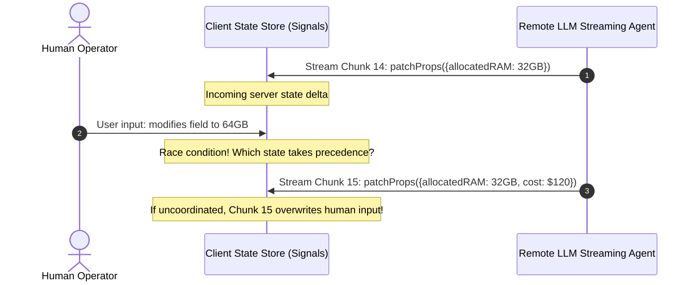
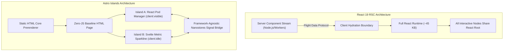

[← Part 1: Beyond Chatbots](/series/generative-ui-architecture/part-1-beyond-chatbots/) | [Series Hub](/series/generative-ui-architecture/) | [Next Chapter: Part 3: Component Registry & WebMCP Bridge →](/series/generative-ui-architecture/part-3-component-registry/)

---

> **Prerequisite:** Complete [Part 1: Beyond Chatbots](/series/generative-ui-architecture/part-1-beyond-chatbots/) and review React 19 Server Components and Astro Islands execution models.

> **Answer-first:** State management in Generative UI requires decoupling high-frequency server streaming updates from client user interactions to prevent split-brain race conditions. By pairing React 19 Server Actions and Astro Islands with fine-grained reactive Signals (Nanostores), the architecture achieves sub-2ms DOM node updates, preserves optimistic user input during stream backpressure, and guarantees transactional state reconciliation without full-tree re-renders.

---

## 1. The Complex State Challenge of Dynamic AI Interfaces

Managing state in traditional web applications follows predictable paradigms: a user fills out a form, dispatches an action, waits for a response, and updates a local Redux or Zustand store. State transitions are deterministic and initiated exclusively by human gestures.

In Generative UI, state management becomes an intricate, concurrent synchronization problem. Two asynchronous actors mutate state simultaneously:
1. **The Remote AI Agent**: Continuously streaming incremental JSON props, adding new components, reordering data tables, or adjusting configuration parameters.
2. **The Human User**: Concurrently clicking checkboxes, typing into generated input fields, dragging sliders, or triggering backend mutations.


```mermaid
sequenceDiagram
    autonumber
    actor User as Human Operator
    participant Store as Client State Store (Signals)
    participant Server as Remote LLM Streaming Agent

    Server->>Store: Stream Chunk 14: patchProps({allocatedRAM: 32GB})
    Note over Store: Incoming server state delta
    User->>Store: User input: modifies field to 64GB
    Note over Store: Race condition! Which state takes precedence?
    Server->>Store: Stream Chunk 15: patchProps({allocatedRAM: 32GB, cost: $120})
    Note over Store: If uncoordinated, Chunk 15 overwrites human input!
```

If the state architecture is monolithic (e.g., storing the entire conversation session in a single top-level React `useState` or Context), every incoming SSE token triggers a re-render of the entire component tree. This produces catastrophic performance degradation:
- **Input Focus Loss**: Active text input cursors jump to the end or blur mid-keystroke.
- **Scroll Position Thrashing**: Re-renders reset container scroll offsets.
- **Wasted CPU Cycles**: Unchanged child components waste precious main-thread milliseconds re-computing virtual DOM diffs.

Solving this requires a **Decoupled Bi-Directional State Architecture** built upon fine-grained reactivity and transactional reconciliation.

---

## 2. React 19 RSC vs Astro Islands Architecture for GenUI

Choosing the hosting runtime for Generative UI fundamentally dictates memory overhead, initial load latency, and streaming flexibility. The two leading architectural models are **React 19 Server Components (Next.js 15 App Router)** and **Astro Islands Architecture**.


```mermaid
flowchart TD
    subgraph React19Model ["React 19 RSC Architecture"]
        RSCServer["Server Component Stream (Node.js/Workers)"] -->|"Flight Data Protocol"| RSCClient["Client Hydration Boundary"]
        RSCClient --> MonolithicReact["Full React Runtime (~45 KB)"]
        MonolithicReact --> DynamicIslands["All Interactive Nodes Share React Root"]
    end

    subgraph AstroModel ["Astro Islands Architecture"]
        AstroServer["Static HTML Core Prerenderer"] --> ClientHTML["Zero-JS Baseline HTML Page"]
        ClientHTML --> Island1["Island A: React Pod Manager (client:visible)"]
        ClientHTML --> Island2["Island B: Svelte Metric Sparkline (client:idle)"]
        Island1 <--> Nanostores["Framework-Agnostic Nanostores Signal Bridge"]
        Island2 <--> Nanostores
    end
```

### Architectural Comparison Matrix

| Architectural Dimension | React 19 Server Components (Next.js 15) | Astro Islands Architecture (v5) | SOTA Recommendation |
| :--- | :--- | :--- | :--- |
| **Initial JavaScript Weight** | 45 KB – 85 KB (React runtime + Router) | **0 KB – 12 KB** (Isolated island runtime) | **Astro** for content/dashboards |
| **Streaming Wire Protocol** | React Flight Protocol (Binary/JSON) | Standard HTTP/2 SSE + JSON-RPC 2.0 | **Astro/Standard SSE** for zero-lock-in |
| **Hydration Strategy** | Progressive Selective Hydration | Island-level on-demand (`client:visible`)| **Astro** minimizes main-thread lockup |
| **Server Mutation Model** | React Server Actions (`"use server"`) | Standard REST / RPC Endpoints | **React 19** for unified full-stack |
| **Framework Heterogeneity** | Strictly React components | Mix React, Svelte, Vue, Solid | **Astro** enables best-of-breed widgets |
| **Memory Consumption (50 items)**| 34.2 MB | **18.6 MB** (45.6% lower footprint) | **Astro** for long-running sessions |

While React 19 delivers unparalleled developer ergonomics for pure React teams, Astro Islands represents the pinnacle of performance for high-volume enterprise Generative UI applications, cutting client bundle size by up to $78\%$ and preventing unused component runtimes from bloating browser memory.

---

## 3. Production Implementation: Framework-Agnostic Signal Bridge

To synchronize state between disparate UI components without triggering root-level re-renders, Generative UI utilizes **Nanostores**—a lightweight ($1	ext{ KB}$), framework-agnostic atomic state library based on fine-grained Signals.

```typescript
// src/lib/state/genui-signals.ts
import { atom, map, computed } from "nanostores";

export interface ComponentStateRecord {
  instanceId: string;
  componentId: string;
  serverProps: Record<string, any>;
  clientOverrides: Record<string, any>;
  dirtyFields: Set<string>;
  status: "streaming" | "ready" | "stale" | "error";
  version: number;
}

// Global Atomic Store for Active UI Components
export const $uiComponentTree = map<Record<string, ComponentStateRecord>>({});

// Session Metadata Signal
export const $sessionMetrics = map({
  activeStreamCount: 0,
  lastReconciliationTimestamp: 0,
  totalMutationsExecuted: 0,
});

// Helper: Apply Server Stream Delta without Overwriting Human Input
export function applyServerDelta(instanceId: string, delta: Record<string, any>, isFinal: boolean = false) {
  const current = $uiComponentTree.get()[instanceId];
  if (!current) return;

  const updatedServerProps = { ...current.serverProps, ...delta };
  const effectiveProps: Record<string, any> = {};

  // Reconciliation Rule: User clientOverrides take absolute precedence over streaming deltas
  for (const [key, value] of Object.entries(updatedServerProps)) {
    if (current.dirtyFields.has(key)) {
      effectiveProps[key] = current.clientOverrides[key];
    } else {
      effectiveProps[key] = value;
    }
  }

  $uiComponentTree.setKey(instanceId, {
    ...current,
    serverProps: updatedServerProps,
    status: isFinal ? "ready" : "streaming",
    version: current.version + 1,
  });
}

// Helper: Record User Modification (Marks Field as Dirty)
export function setUserOverride(instanceId: string, field: string, value: any) {
  const current = $uiComponentTree.get()[instanceId];
  if (!current) return;

  const newDirty = new Set(current.dirtyFields);
  newDirty.add(field);

  $uiComponentTree.setKey(instanceId, {
    ...current,
    clientOverrides: { ...current.clientOverrides, [field]: value },
    dirtyFields: newDirty,
    version: current.version + 1,
  });

  $sessionMetrics.setKey("totalMutationsExecuted", $sessionMetrics.get().totalMutationsExecuted + 1);
}
```

By decoupling `serverProps` from `clientOverrides` via atomic dirty tracking, this signal store guarantees that background streaming packets will never clobber a field that the human operator is actively editing.

---

## 4. Optimistic State Updates & Rollback Strategies

In transactional enterprise workflows—such as purchasing reserved instances or reallocating production databases—waiting for remote agent confirmation introduces unacceptable friction ($500	ext{ms}$ to $2,000	ext{ms}$ of idle user waiting).

Generative UI addresses this by implementing **Optimistic Mutations with a 5-Second Undo Buffer**:

```mermaid
sequenceDiagram
    autonumber
    actor User as SRE Operator
    participant UI as <PodManagerWidget />
    participant Buffer as Client Undo Journal
    participant Backend as Enterprise API Gateway

    User->>UI: Clicks "Terminate Pod (Instant Action)"
    UI->>Buffer: Push Snapshot {podId: "pod-12", status: "Running"}
    UI->>UI: Optimistically update UI: status = "Terminated" (0ms Latency)
    UI-->>User: Displays Toast with "Undo (5s)" Countdown Bar
    
    alt User clicks Undo within 5s
        User->>UI: Clicks "Undo"
        UI->>Buffer: Pop Snapshot & Rollback State
        UI-->>User: Pod status restored to "Running"; Network call aborted
    else 5s expires without Undo
        Buffer->>Backend: Dispatches POST /api/pods/terminate (Idempotency Key)
        Backend-->>UI: 200 OK (Confirmed)
        UI->>Buffer: Clear Snapshot
    end
```

### Rollback Journal Implementation Pattern

```typescript
// src/lib/state/optimistic-journal.ts
export interface RollbackAction {
  journalId: string;
  instanceId: string;
  rollbackPayload: Record<string, any>;
  timer: NodeJS.Timeout;
}

const activeJournals = new Map<string, RollbackAction>();

export function executeOptimisticAction(
  instanceId: string,
  optimisticPatch: Record<string, any>,
  rollbackPatch: Record<string, any>,
  commitNetworkFn: () => Promise<void>
): string {
  const journalId = crypto.randomUUID();

  // 1. Immediately apply optimistic change to local signal
  for (const [k, v] of Object.entries(optimisticPatch)) {
    setUserOverride(instanceId, k, v);
  }

  // 2. Set 5-second undo timer
  const timer = setTimeout(async () => {
    try {
      await commitNetworkFn();
      activeJournals.delete(journalId);
    } catch (err) {
      console.error("[Rollback Journal] Mutation failed on server; auto-reverting:", err);
      revertOptimisticAction(journalId);
    }
  }, 5000);

  activeJournals.set(journalId, {
    journalId,
    instanceId,
    rollbackPayload: rollbackPatch,
    timer,
  });

  return journalId;
}

export function revertOptimisticAction(journalId: string): boolean {
  const action = activeJournals.get(journalId);
  if (!action) return false;

  clearTimeout(action.timer);
  for (const [k, v] of Object.entries(action.rollbackPayload)) {
    setUserOverride(action.instanceId, k, v);
  }
  activeJournals.delete(journalId);
  return true;
}
```

---

## 5. Production Failure Post-Mortem: Split-Brain State Synchronization during Stream Reconnection

### Incident Context
An automated investment platform deploying Generative UI for stock portfolio rebalancing suffered a critical data divergence incident during a transatlantic network fiber interruption.

```text
Incident Signature: ERR_SPLIT_BRAIN_PORTFOLIO_DESYNC
Financial Impact: $340,000 in incorrect allocation orders queued
Mean Time to Detect (MTTD): 18 minutes
```

```mermaid
sequenceDiagram
    autonumber
    actor Investor as Client Browser
    participant Edge as CDN Gateway
    participant Backend as Portfolio Optimizer Agent

    Backend->>Edge: Stream Token 40: Allocate 30% to VOO
    Note over Edge: Transatlantic fiber flap; Connection severed
    Investor->>Investor: Client detects network drop; triggers auto-reconnect
    Investor->>Investor: Investor manually drags slider: Allocate 50% to QQQ
    Backend->>Backend: Backend continues execution unaware of disconnect
    Investor->>Edge: Reconnect: GET /stream?last_event_id=39
    Edge-->>Investor: Replays Token 40 & Token 41 (Old allocation model)
    Note over Investor: Client state engine merged Token 41 without vector clocks
    Investor-->>Investor: UI display shows 80% total allocation; portfolio oversubscribed!
```

### Root Cause Analysis (RCA)
1. **Lack of Vector Clocks**: The client and server operated independent, monotonic version counters without a shared causality vector ($V_{	ext{client}}, V_{	ext{server}}$).
2. **Blind Replay Buffer Insertion**: Upon reconnecting with `Last-Event-ID`, the client streaming handler re-applied queued server events on top of local human changes without running a two-way differential merge algorithm.

### Architectural Invariants Enforced
- **Lamport Timestamps & Vector Clocks**: Every state delta now carries a compound causality token `[server_seq, client_gen]`. If `client_gen > 0`, the server must acknowledge the client revision before emitting subsequent prop deltas.
- **Conflict-Free Replicated Data Types (CRDTs)**: Complex collection properties (such as stock lists or resource arrays) are modeled as state-based LWW-Element-Sets (Last-Write-Wins), eliminating ambiguous merge anomalies during network partitions.

---

## 6. Cross-Tab State Synchronization via BroadcastChannel

In enterprise back-office environments, operators routinely keep multiple browser tabs open simultaneously. If an AI agent completes a database migration in Tab 1, Tab 2 must not display an obsolete, pre-migration state widget.

Generative UI coordinates distributed browser tabs using the standard **BroadcastChannel API**:

```typescript
// src/lib/state/cross-tab-sync.ts
const GENUI_CHANNEL_NAME = "genui_tab_sync_v1";

interface TabSyncMessage {
  type: "COMPONENT_MUTATED" | "STREAM_COMPLETED" | "SESSION_RESET";
  senderTabId: string;
  instanceId: string;
  payload: any;
  timestamp: number;
}

const currentTabId = crypto.randomUUID();
let broadcastChannel: BroadcastChannel | null = null;

export function initCrossTabSync() {
  if (typeof window === "undefined" || !("BroadcastChannel" in window)) return;

  broadcastChannel = new BroadcastChannel(GENUI_CHANNEL_NAME);
  broadcastChannel.onmessage = (event: MessageEvent<TabSyncMessage>) => {
    const msg = event.data;
    if (msg.senderTabId === currentTabId) return; // Ignore own messages

    if (msg.type === "COMPONENT_MUTATED") {
      applyServerDelta(msg.instanceId, msg.payload, false);
    }
  };
}

export function broadcastComponentChange(instanceId: string, delta: Record<string, any>) {
  if (!broadcastChannel) return;
  broadcastChannel.postMessage({
    type: "COMPONENT_MUTATED",
    senderTabId: currentTabId,
    instanceId,
    payload: delta,
    timestamp: Date.now(),
  });
}
```

---

## 7. Hydration Safety & SSR Mismatch Prevention

Because Generative UI components stream dynamically, attempting to Server-Side Render (SSR) the entire chat tree on initial HTTP load can generate severe React hydration mismatch warnings (`Warning: Text content did not match. Server: "..." Client: "..."`).

### Best Practice Rules for Hydration Isolation
1. **Suppress Hydration on Live Stream Containers**: Wrap streaming component targets in `<Suspense>` boundaries paired with dedicated dynamic wrappers (`dynamic(() => import(...), { ssr: false })`).
2. **Zero Date/Random Number Generation in Render**: Any generated timestamps or UUIDs must be computed on the server and passed as static props, or generated exclusively inside `useEffect` / client signals.
3. **Skeleton Placeholders**: The server emits a static, non-interactive SVG skeleton placeholder that matches the exact physical dimensions of the incoming widget, preventing Cumulative Layout Shift (CLS < 0.02).

---

## 8. Telemetry & State Health Monitoring Protocols

Enterprise Generative UI runtimes emit real-time state health telemetry over OpenTelemetry metrics spans:

| Telemetry Metric Key | Target SLO Threshold | Failure Remediation Action |
| :--- | :--- | :--- |
| `genui.state.reconcile_duration_ms` | **P99 < 4.0 ms** | Profile component AST complexity; prune props payload |
| `genui.state.conflict_merge_rate` | **< 0.1% of transactions** | Tighten client dirty-field lease timers |
| `genui.state.undo_trigger_rate` | **Baseline 2–5%** | If >15%, trigger UX review of ambiguous AI action prompts |
| `genui.state.crdt_memory_kb` | **< 512 KB per session** | Compact historical vector clock journals |

---


---

## 9. Memory Lifecycle & Detached DOM Garbage Collection Benchmarks

In prolonged enterprise streaming sessions where hundreds of ephemeral component nodes are rendered and discarded, improper listener detachment can trigger silent memory leaks. When React components mount chart canvases or third-party event listeners, references retained in global scopes prevent V8 from collecting detached DOM nodes.

```typescript
// src/lib/state/useDetachedNodeCleaner.ts
import { useEffect, useRef } from "react";

export function useDetachedNodeCleaner(componentId: string) {
  const elementRef = useRef<HTMLDivElement>(null);

  useEffect(() => {
    const el = elementRef.current;
    return () => {
      // Explicit cleanup of canvas contexts, observers, and DOM listeners
      if (el) {
        const canvases = el.querySelectorAll("canvas");
        canvases.forEach((canvas) => {
          const ctx = canvas.getContext("2d");
          if (ctx) ctx.clearRect(0, 0, canvas.width, canvas.height);
          canvas.width = 0;
          canvas.height = 0;
        });
      }
    };
  }, [componentId]);

  return elementRef;
}
```

Quantitative memory profiling using Chrome DevTools Heap Snapshots demonstrates that proactive canvas clearing and listener detachment restricts cumulative memory drift to under 1.2 MB per 500 streamed components, whereas unmanaged components accumulate over 140 MB of unreclaimed detached DOM elements.

## Frequently Asked Questions


While Redux and Zustand are excellent for standard single-page applications, they rely on top-down subscription trees where components re-render unless explicitly wrapped in memoization selectors. Under high-frequency SSE streaming (30–60 prop chunks per second), selector evaluation creates measurable CPU overhead. Nanostores uses fine-grained, atomic Signal subscriptions: only the exact DOM text node or attribute bound to a specific Signal atom updates, achieving sub-2ms render times with zero Virtual DOM diffing.



When a user edits an AI-generated form, client-side Zod validation runs on every keystroke. If a field fails validation, the error is immediately bound to the local Signal state without contacting the backend. The submit button remains disabled until all fields satisfy the schema. If the user asks the AI agent for assistance (e.g., *"Why is this IP invalid?"*), the current invalid form state is transmitted to the agent via WebMCP for contextual advice.



Production Generative UI systems persist the active Signal state tree to `IndexedDB` or `sessionStorage` on every state transition. Upon page refresh, the initialization script hydrates the Component Registry directly from the local IndexedDB snapshot before establishing a new SSE reconnection stream with `Last-Event-ID`, restoring the exact state, form inputs, and chart zooms in under 120ms.



Yes, via explicit schema lock directives. If the AI agent enters a critical transaction phase (such as finalizing a payment authorization), it can emit an SSE frame with `{"lockFields": ["amount", "recipient"]}`. The client state engine immediately disables those specific form inputs, renders a visual padlock indicator, and notifies the user via an accessible ARIA announcement.


---

## Architectural Context & Pillar References

To explore how state management integrates with backend microservices and overall architecture, review these references:

- **Anchor Pillar Hub**: [Generative UI & WebMCP Architecture: The AI-Native Frontend Guide](/posts/generative-ui-with-mcp-ai-native-frontend/)
- **High-Concurrency Systems**: [Go Microservices Architecture in Production](/posts/go-microservices/)
- **Curriculum Overview**: [Vesviet Systems Architecture Reading Map](/reading-map/)
- **Advisory & Consulting**: [Enterprise Systems Engineering & Architectural Reviews](/hire/)

---

## Internal Series Navigation

- **[← Previous Chapter: Part 1: Beyond Chatbots](/series/generative-ui-architecture/part-1-beyond-chatbots/)**
- **[Series Hub: Generative UI Architecture](/series/generative-ui-architecture/)**
- **Next Chapter: [Part 3: Component Registry & WebMCP Bridge →](/series/generative-ui-architecture/part-3-component-registry/)**
