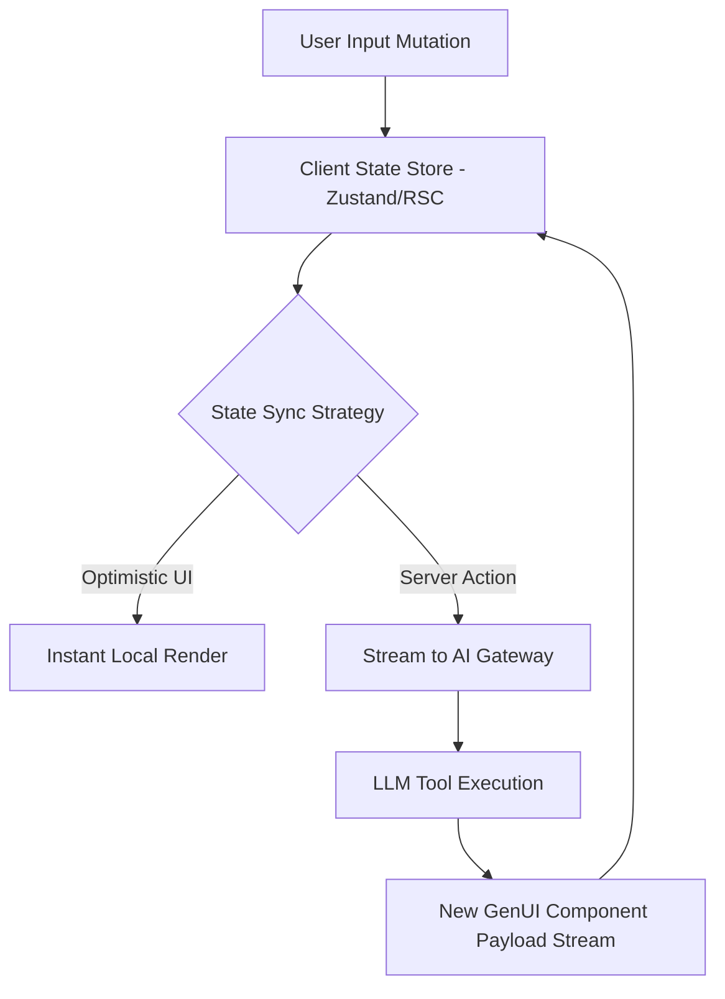
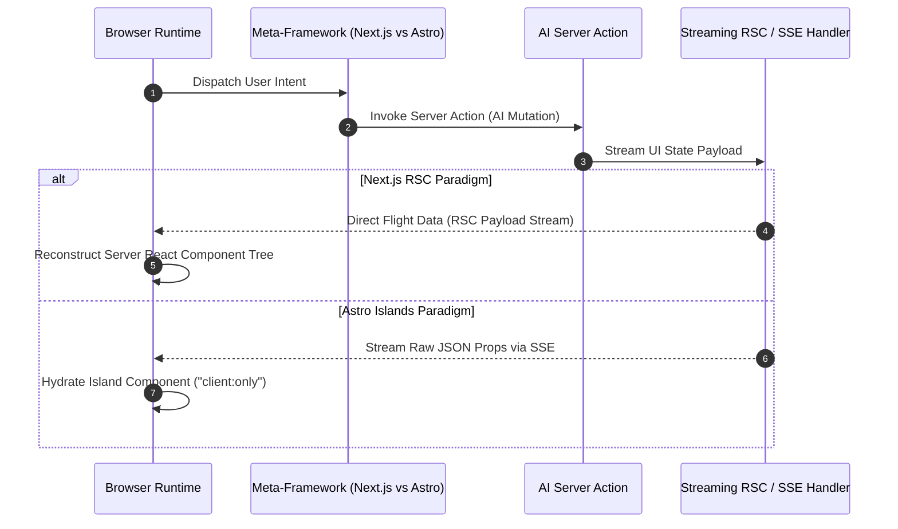
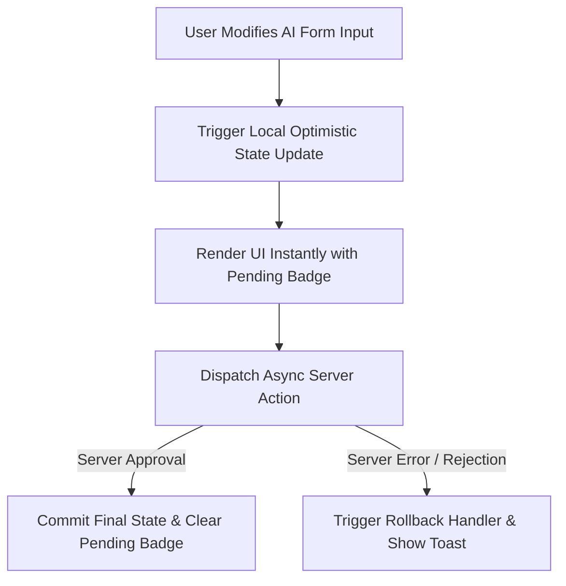

> **Prerequisite:** Familiarity with the concepts introduced in [Part 1 — Beyond Chatbots](/series/generative-ui-architecture/part-1-beyond-chatbots/). Review it first if the terminology in this part is unfamiliar.

> **Answer-first:** Managing client-server state in Generative UI requires choosing between Next.js React Server Components (RSC) and Astro Islands Architecture. Next.js RSC streams server action payloads directly into component trees for server-driven context binding, while Astro isolates dynamic AI rendering into client-hydrated widgets. This article evaluates state flows, optimistic updates, and hydration strategies across both meta-frameworks.

---

## 1. The Complex State Challenge of Dynamic AI Interfaces

**Answer-first:** In traditional web applications, state transitions are predictable: a user clicks a button, a deterministic HTTP request fires, and a defined client state handler (Redux, Zustand, React Context) updates the view.

In a **Generative UI (GenUI)** application, state management becomes non-deterministic and multi-directional:

1. **Server-Side AI State**: The server maintains conversation context, active tool executions, and LLM token streams.
2. **Dynamic Client Props**: Component properties arrive asynchronously over streaming transport channels (Server-Sent Events or RSC streams).
3. **User Mutation Interactivity**: The user interacts with an AI-generated form, modifying inputs locally before submitting state back to the AI context loop.


```mermaid
graph TD
    A[User Input Mutation] --> B[Client State Store - Zustand/RSC]
    B --> C{State Sync Strategy}
    C -->|Optimistic UI| D[Instant Local Render]
    C -->|Server Action| E[Stream to AI Gateway]
    E --> F[LLM Tool Execution]
    F --> G[New GenUI Component Payload Stream]
    G --> B
```

Without a clean state management boundary, applications suffer from visual flickering, broken form fields during stream updates, and lost user input.

---

## 2. Next.js RSC vs Astro Islands Architecture for GenUI

Choosing the right meta-framework foundation directly dictates how state and UI streams flow between server and client runtimes.


```mermaid
sequenceDiagram
    autonumber
    participant Client as Browser Runtime
    participant Framework as Meta-Framework (Next.js vs Astro)
    participant ServerAction as AI Server Action
    participant Stream as Streaming RSC / SSE Handler

    Client->>Framework: Dispatch User Intent
    Framework->>ServerAction: Invoke Server Action (AI Mutation)
    ServerAction->>Stream: Stream UI State Payload
    alt Next.js RSC Paradigm
        Stream-->>Client: Direct Flight Data (RSC Payload Stream)
        Client->>Client: Reconstruct Server React Component Tree
    else Astro Islands Paradigm
        Stream-->>Client: Stream Raw JSON Props via SSE
        Client->>Client: Hydrate Island Component ("client:only")
    end
```

### Next.js React Server Components (RSC)
Next.js leverages Server Actions and Flight Data Streams (`renderToReadableStream`). The AI model executes server-side, rendering React components directly on the server and streaming serialized RSC flight payloads to the client.
- **Advantage**: Zero client-side bundle penalty for complex server component logic; direct access to server databases and secrets.
- **Disadvantage**: Heavy framework lock-in and complex hydration boundary management.

### Astro Islands Architecture
Astro renders static HTML by default and selectively hydrates interactive "islands" using directives such as `client:visible` or `client:only="react"`.
- **Advantage**: Ultra-lightweight initial page load (zero JavaScript baseline); framework-agnostic (allows mixing React, Vue, Svelte islands).
- **Disadvantage**: Requires manual client-side state management bridges (e.g., nanostores) to synchronize state across isolated islands.

---

## 3. Production Implementation: RSC State Management in Next.js

Production React Server Components (RSC) implementation streaming Server Actions and dynamic loading skeletons.

```typescript
// app/actions/genui-stream.tsx
'use server';

import { createStreamableUI } from 'ai/rsc';
import React from 'react';

// Simulated Component Registry
const LoadingSkeleton = () => (
  <div className="animate-pulse p-4 bg-gray-100 rounded-lg">
    <div className="h-4 bg-gray-300 rounded w-3/4 mb-2"></div>
    <div className="h-4 bg-gray-300 rounded w-1/2"></div>
  </div>
);

const UserStatsWidget = ({ name, role, score }: { name: string; role: string; score: number }) => (
  <div className="p-4 border rounded-xl bg-white shadow-sm">
    <h3 className="text-lg font-bold">{name}</h3>
    <p className="text-sm text-gray-500">{role}</p>
    <div className="mt-2 text-2xl font-semibold text-blue-600">Score: {score}</div>
  </div>
);

export async function submitUserPrompt(userPrompt: string) {
  const uiStream = createStreamableUI(<LoadingSkeleton />);

  // Asynchronous Execution Simulation (LLM Execution)
  (async () => {
    try {
      // Simulate network & inference delay
      await new Promise((resolve) => setTimeout(resolve, 1200));

      // Stream updated dynamic component
      uiStream.update(
        <UserStatsWidget 
          name="Alex Rivera" 
          role="Senior Solutions Architect" 
          score={94} 
        />
      );

      uiStream.done();
    } catch (error) {
      uiStream.error(<div className="text-red-500">Failed to render AI component.</div>);
    }
  })();

  return {
    id: Date.now().toString(),
    display: uiStream.value
  };
}
```

---

## 4. Architectural Comparison: Next.js RSC vs Astro Islands

Next.js RSC leverages server streams while Astro Islands uses lightweight selective hydration.

| Feature / Metric | Next.js RSC Architecture | Astro Islands Architecture |
|---|---|---|
| **Streaming Mechanism** | React Flight Protocol Streams | Server-Sent Events (SSE) + JSON |
| **Client JS Footprint** | Moderate (React Hydration Runtime) | Ultra-Low (Selective Hydration) |
| **State Synchronization** | Built-in via Server Context | Shared Stores (Nanostores / Zustand) |
| **Component Multi-Framework Support** | React Only | React, Vue, Svelte, Solid |
| **Form Mutation Pattern** | Native Server Actions | Standard Fetch API / SSE Handlers |
| **Optimistic UI Updates** | `useOptimistic()` React Hook | Custom Local State Store |

---

## 5. Best Practices for GenUI State Engineering

Use explicit hydration boundaries, restrict client components to leaf nodes, and enforce schema contracts.

1. **Use Explicit Hydration Boundaries**: Mark interactive GenUI components with `client:only="react"` in Astro or place explicit `'use client'` directives at low leaf node levels in Next.js to prevent unnecessary server re-renders.

---

## 6. Optimistic State Updates & Rollback Strategies

When users interact with GenUI forms, waiting for a full server round-trip causes noticeable UI latency.


```mermaid
graph TD
    A[User Modifies AI Form Input] --> B[Trigger Local Optimistic State Update]
    B --> C[Render UI Instantly with Pending Badge]
    C --> D[Dispatch Async Server Action]
    D -->|Server Approval| E[Commit Final State & Clear Pending Badge]
    D -->|Server Error / Rejection| F[Trigger Rollback Handler & Show Toast]
```

### React `useOptimistic` Pattern

In Next.js RSC architectures, developers utilize React's `useOptimistic` hook to apply instant visual updates while background Server Actions process the transaction.

```typescript
// Example Optimistic Form State Handler
import { useOptimistic } from 'react';

export function OptimisticFormWidget({ currentBalance, onUpdate }: { currentBalance: number, onUpdate: (newBalance: number) => Promise<void> }) {
  const [optimisticBalance, setOptimisticBalance] = useOptimistic(
    currentBalance,
    (state, amountToAdd: number) => state + amountToAdd
  );

  async function handleTransfer(formData: FormData) {
    const amount = Number(formData.get('amount'));
    setOptimisticBalance(amount);
    await onUpdate(amount);
  }

  return (
    <form action={handleTransfer}>
      <p>Balance: ${optimisticBalance.toFixed(2)}</p>
      <input type="number" name="amount" defaultValue={100} />
      <button type="submit">Transfer Funds</button>
    </form>
  );
}
```

---

## 8. Hydration Safety & SSR Mismatch Prevention

Because GenUI components receive dynamic props generated server-side during AI streaming runs, standard React hydration mismatches can occur if client local clocks or browser storage influence prop values.

### Hydration Safeguards

1. **Suppress Hydration Warnings**: For non-critical dynamic timestamps, apply `suppressHydrationWarning={true}` on rendered leaf elements.
2. **Client-Only Render Gates**: Wrap dynamic AI components in a `useEffect` hydration gate ensuring client-only rendering for browser-specific APIs (such as WebGL or Canvas rendering).

---

## 9. Cross-Tab State Synchronization via BroadcastChannel

In complex enterprise dashboards where users open multiple browser tabs, GenUI state changes must synchronize across all active windows without a page reload.

```typescript
// BroadcastChannel Synchronization Hook for GenUI State
import { useEffect } from 'react';

export function useGenUIBroadcastSync(onRemoteStateChange: (newState: any) => void) {
  useEffect(() => {
    const channel = new BroadcastChannel('genui_state_bus');
    
    channel.onmessage = (event) => {
      if (event.data && event.data.type === 'GENUI_STATE_UPDATE') {
        onRemoteStateChange(event.data.payload);
      }
    };

    return () => channel.close();
  }, [onRemoteStateChange]);

  const broadcastStateChange = (payload: any) => {
    const channel = new BroadcastChannel('genui_state_bus');
    channel.postMessage({ type: 'GENUI_STATE_UPDATE', payload });
    channel.close();
  };

  return { broadcastStateChange };
}
```

---

## 10. Memory Management & Event Listener Cleanup

Because GenUI components are continuously created, updated, and unmounted by dynamic AI streaming payloads, improper state subscriptions can cause client memory leaks.

### Memory Optimization Rules

- **Unsubscribe Streaming Handlers**: Ensure all EventSource or WebSocket connections are explicitly closed in the cleanup phase of React `useEffect` hooks.
- **Cap State History Buffers**: Limit local state history arrays (e.g. keeping only the last 50 component renders in memory) to prevent memory ballooning during prolonged chat sessions.

---

## 11. Telemetry & State Health Monitoring Protocols

To monitor state health across high-volume GenUI sessions, application telemetry tracks three key metrics:

- **State Mutation Latency**: Time elapsed between user input click and client state store commit (Target: < 16ms).
- **Stream Interruption Recovery**: Count of successful state rollbacks triggered by SSE connection drops.
- **Store Size Bloat Rate**: Memory footprint growth of Zustand or Redux state stores over 60-minute active sessions.

---

## Architectural Context & Pillar References

This section references core pillar guides on protocol specs, state models, and autonomous hybrid pipeline architectures.

- [Generative UI with Model Context Protocol Architecture](/posts/generative-ui-with-mcp-ai-native-frontend/) — Protocol overview for state synchronization.
- [AI-Native Frontend Architecture Predictions (2028)](/posts/ai-native-frontend-architecture-predictions-2028/) — Future trends in frontend state models.
- [Autonomous Hybrid-AI Content Pipeline Guide](/posts/architecting-an-autonomous-hybrid-ai-content-pipeline/) — End-to-end pipeline implementation details.

🔗 **Next Step:** Continue to [Part 3 — Component Registry](/series/generative-ui-architecture/part-3-component-registry/) for the following module in the series.

## Internal Series Navigation

Navigate the Generative UI Architecture series covering component registries, state management, security, HITL workflows, and edge performance.

- [Executive Summary — The Shift to Generative UI](/series/generative-ui-architecture/executive-summary/)
- [Part 1 — Beyond Chatbots: Dynamic Component Rendering](/posts/generative-ui-with-mcp-ai-native-frontend/)
- [Part 3 — Component Registry & JSON Schema Protocol](/posts/generative-ui-with-mcp-ai-native-frontend/)
- [Part 4 — Generative UI Security & Accessibility](/posts/generative-ui-with-mcp-ai-native-frontend/)
- [Part 5 — Human-in-the-Loop Workflows](/posts/generative-ui-with-mcp-ai-native-frontend/)
- [Part 6 — E2E Testing & Edge Performance](/posts/generative-ui-with-mcp-ai-native-frontend/)
- [Part 7 — Reference Repo & Migration Playbook](/series/generative-ui-architecture/part-7-reference-repo-migration/)
