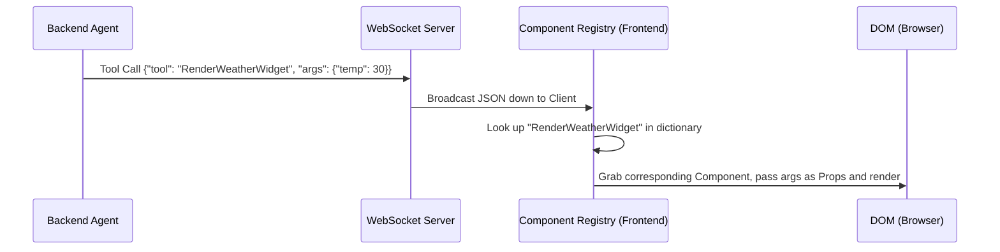

In the previous part, we understood that a Framework-Agnostic Frontend (like Astro) doesn't receive HTML code from AI, but JSON data. But how does the Frontend know it needs to render that JSON block into a `<Card>`, a `<Chart>`, or a `<Form>`? 

The answer lies in the **Component Registry** — the interface resolution brain of the Generative UI architecture.

## 3.1. The Convergence of MCP (Model Context Protocol) and Frontend

To understand the Component Registry, we need to go upstream to the Backend. On the Backend, modern Agentic systems are standardizing communication with peripheral systems (like Databases, APIs) via the **MCP (Model Context Protocol)** standard.

When an Agent wants to fetch weather data, it doesn't call the API itself. It issues a **Tool Call**:
```json
{
  "name": "get_weather_mcp_tool",
  "arguments": { "location": "Hanoi" }
}
```

In Generative UI, we leverage this exact "Tool Call" mechanism, but apply it to the Frontend. Instead of calling a tool on the Backend, the Agent calls a "UI Tool" to request the Frontend to display an interface. **We map 1-1 between the Backend MCP Tool and the Frontend UI Component.**

## 3.2. The Component Registry Concept

The **Component Registry** is simply a dictionary (Map) living on the Frontend (e.g., in Astro's config), used to match the `Tool_Name` called by the AI with the actual `Component_Name` in the source code.

### End-to-End Flow Diagram:



### Mock Frontend Code Example (Astro/Svelte):

First, you register valid Components in the Registry:
```javascript
// src/lib/registry.js
import WeatherWidget from '../components/WeatherWidget.svelte';
import ShopeeOrderCancel from '../components/ShopeeOrderCancel.svelte';

export const ComponentRegistry = {
  "RenderWeatherWidget": WeatherWidget,
  "RenderOrderCancel": ShopeeOrderCancel,
  // Any Component not here will be ignored
};
```

In the main Render component (Dynamic Component):
```svelte
<!-- src/components/DynamicRenderer.svelte -->
<script>
  import { ComponentRegistry } from '$lib/registry';
  export let aiPayload; // Example: { tool: "RenderWeatherWidget", args: { temp: 30 } }

  // Look up component in Registry
  $: TargetComponent = ComponentRegistry[aiPayload.tool];
</script>

{#if TargetComponent}
  <!-- ⚠️ SECURITY WARNING: In reality aiPayload.args must be validated by Zod before spreading into Props. (See Part 4) -->
  <svelte:component this={TargetComponent} {...aiPayload.args} />
{:else}
  <div class="error">Agent requested a non-existent interface.</div>
{/if}
```

## 3.3. Controlled Generative UI Design Pattern

The architecture above is called **Controlled Generative UI**.

You DO NOT allow the AI to think up button colors or write `<div>` tags. You force the AI to "assemble" interfaces from LEGO blocks (Components) created entirely by your Frontend developers (who understand UI/UX and Brand Identity best).

**The massive benefits of Controlled GenUI:**
1. **Brand Consistency:** The `<Button>` or `<ShopeeOrderCancel>` component is built by your Design system team. It will have the signature border radius, primary orange color, and standard typography. The AI only worries about filling in the data (Data).
2. **Framework-Agnostic:** The AI doesn't need to know if you're using Svelte, Vue, or Tailwind. It just returns JSON. If next year the company switches from Svelte to SolidJS, the AI Agent on the Backend doesn't need to change a single line of code.
3. **Reusability:** Components in the Registry can absolutely be the same Components used for normal static screens. You don't need to write separate Components just for AI.

---
🔗 **Next Step:** The Component Registry brings endless flexibility, but it's also a vital security checkpoint. What if we allowed AI to pass *any* JSON into a Component's Props? What happens to accessibility standards for the visually impaired (WCAG)? Read on in [Part 4 — Security & Accessibility (A11y) in GenUI](/series/generative-ui-architecture/part-4-security-a11y/).
