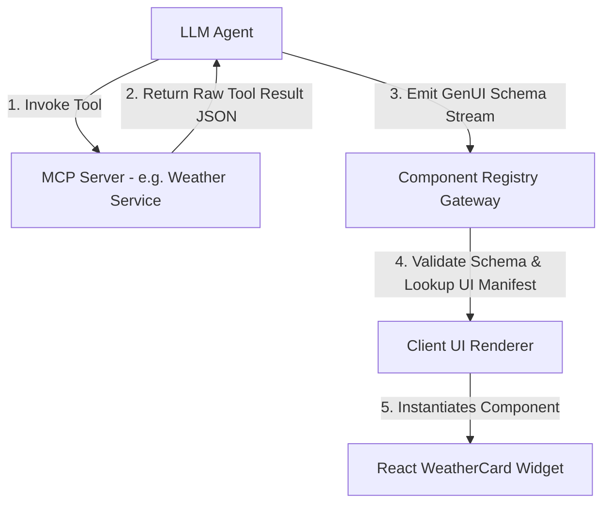
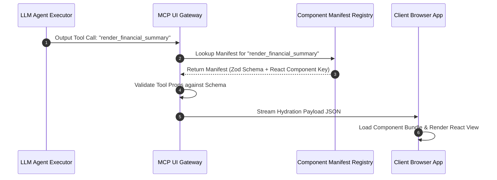
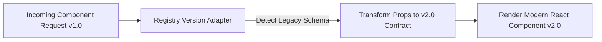

> **Prerequisite:** Familiarity with the concepts introduced in [Part 2 — State Management](/posts/generative-ui-with-mcp-ai-native-frontend/). Review it first if the terminology in this part is unfamiliar.

> **Answer-first:** Connecting backend Model Context Protocol (MCP) tool execution to frontend Generative UI components requires a decoupled Component Registry layer. By mapping MCP tool call outputs directly to strongly-typed frontend component manifests using JSON-Schema contracts, developers build dynamic, secure interfaces where AI agents trigger visual client-side widgets (e.g., maps, charts, transaction tables) without writing unsafe inline scripts or raw HTML.

---

## 1. The Core Infrastructure Problem: Connecting Backend Tools to Client UI

**Answer-first:** In an agentic architecture, backend AI sub-agents interact with internal systems via the **Model Context Protocol (MCP)**. An MCP server might query a PostgreSQL database, execute a Python data analysis script, or fetch geospatial coordinates from an OSRM routing engine.

However, MCP tools natively return structured text or raw JSON payloads intended for LLM reasoning engines. Converting these raw backend responses into rich, interactive user interfaces requires an architectural bridge: **The MCP-to-Frontend Component Registry**.


```mermaid
graph TD
    A[LLM Agent] -->|1. Invoke Tool| B[MCP Server - e.g. Weather Service]
    B -->|2. Return Raw Tool Result JSON| A
    A -->|3. Emit GenUI Schema Stream| C[Component Registry Gateway]
    C -->|4. Validate Schema & Lookup UI Manifest| D[Client UI Renderer]
    D -->|5. Instantiates Component| E[React WeatherCard Widget]
```

Without a standardized Component Registry, frontend teams must manually write custom wrappers for every new backend tool, undermining the autonomy and flexibility of Generative UI systems.

---

## 2. Architecture of an Enterprise Component Registry

The Component Registry serves as the source of truth for all dynamic visual assets accessible to the AI model.


```mermaid
sequenceDiagram
    autonumber
    participant LLM as LLM Agent Executor
    participant Gateway as MCP UI Gateway
    participant Registry as Component Manifest Registry
    participant Browser as Client Browser App

    LLM->>Gateway: Output Tool Call: "render_financial_summary"
    Gateway->>Registry: Lookup Manifest for "render_financial_summary"
    Registry-->>Gateway: Return Manifest (Zod Schema + React Component Key)
    Gateway->>Gateway: Validate Tool Props against Schema
    Gateway->>Browser: Stream Hydration Payload JSON
    Browser->>Browser: Load Component Bundle & Render React View
```

### Core Manifest Properties

Each registered component is registered with four essential attributes:

1. **Unique Identifier**: A canonical string key (e.g., `ui/financial-chart`, `ui/user-profile-card`).
2. **LLM Tool Definition**: The JSON-Schema describing the tool parameters exposed to the LLM during prompt construction.
3. **Zod Validation Schema**: Client-side runtime validation ensuring incoming props match exact TypeScript types.
4. **React Component Reference**: The lazy-loaded React component implementation bound to the manifest.

---

## 3. Production Implementation: Building an MCP Component Registry

Production TypeScript implementation building an MCP component registry with Zod validation, tool schema export, and dynamic Suspense rendering.

```typescript
import React, { lazy, Suspense } from 'react';
import { z } from 'zod';

// 1. Define Component Schema
export const OrderStatusPropsSchema = z.object({
  orderId: z.string(),
  status: z.enum(['PROCESSING', 'SHIPPED', 'DELIVERED', 'CANCELLED']),
  estimatedDelivery: z.string(),
  itemCount: z.number()
});

export type OrderStatusProps = z.infer<typeof OrderStatusPropsSchema>;

// 2. React Component (Target Widget)
const OrderStatusWidget: React.FC<OrderStatusProps> = ({ orderId, status, estimatedDelivery, itemCount }) => {
  const statusColors = {
    PROCESSING: 'orange',
    SHIPPED: 'blue',
    DELIVERED: 'green',
    CANCELLED: 'red'
  };

  return (
    <div style={{ border: '1px solid #ddd', borderRadius: '8px', padding: '16px', maxWidth: '360px' }}>
      <h4>Order #{orderId}</h4>
      <p>Items: {itemCount}</p>
      <div style={{ color: statusColors[status], fontWeight: 'bold' }}>
        Status: {status}
      </div>
      <small>Estimated Delivery: {estimatedDelivery}</small>
    </div>
  );
};

// 3. Registry Manifest Interface
export interface ComponentManifest<T extends z.ZodTypeAny> {
  id: string;
  description: string;
  schema: T;
  component: React.ComponentType<z.infer<T>>;
}

// 4. Register Component Manifests
export class EnterpriseComponentRegistry {
  private registry = new Map<string, ComponentManifest<any>>();

  register<T extends z.ZodTypeAny>(manifest: ComponentManifest<T>) {
    this.registry.set(manifest.id, manifest);
  }

  get(id: string): ComponentManifest<any> | undefined {
    return this.registry.get(id);
  }

  // Export LLM Tool Schemas for Model Context Protocol Prompts
  exportMCPToolDefinitions() {
    return Array.from(this.registry.values()).map((item) => ({
      name: item.id.replace('/', '_'),
      description: item.description,
      input_schema: item.schema
    }));
  }
}

// Initialize Global Registry
export const globalRegistry = new EnterpriseComponentRegistry();

// Register Order Status Widget
globalRegistry.register({
  id: 'ui/order-status',
  description: 'Renders order tracking and delivery status card',
  schema: OrderStatusPropsSchema,
  component: OrderStatusWidget
});

// 5. Dynamic Renderer Execution Wrapper
export const DynamicMCPRenderer: React.FC<{ componentId: string; props: unknown }> = ({ componentId, props }) => {
  const manifest = globalRegistry.get(componentId);

  if (!manifest) {
    return <div style={{ color: 'red' }}>Error: Component '{componentId}' not registered.</div>;
  }

  const validation = manifest.schema.safeParse(props);
  if (!validation.success) {
    return <div style={{ color: 'orange' }}>Error: Invalid props for '{componentId}'.</div>;
  }

  const Component = manifest.component;
  return (
    <Suspense fallback={<div>Loading component...</div>}>
      <Component {...validation.data} />
    </Suspense>
  );
};
```

---

## 5. Security & Isolation Considerations for Component Registries

Exposing component rendering pipelines to non-deterministic AI tool calls requires strict security isolation:

### 1. Code Injection Defense
Never allow the AI model to pass raw string literals into `eval()`, `dangerouslySetInnerHTML`, or dynamic script tag insertions. All visual properties must map strictly to typed component props.

### 2. Lazy Loading & Code Splitting
Large enterprise component libraries can inflate client JavaScript bundle sizes. Use React `lazy()` imports within the component manifest to ensure component code is downloaded only when the AI model actually selects that tool.

### 3. Prop Sanitization Filters
Sanitize string properties containing user-generated content prior to rendering to eliminate Cross-Site Scripting (XSS) risks embedded inside LLM context.

---

## 6. Strategic Takeaways & Architecture Checklist

Standardize JSON-Schema contracts, map MCP tool definitions to registry IDs, lazy-load dynamic component views, and audit prop security.

| Task | Action | Verification |
|---|---|---|
| **Define Manifest Contracts** | Standardize JSON-Schema & Zod schemas | Unit test schema validation with edge-case payloads |
| **Integrate MCP Gateway** | Map MCP tool definitions to registry IDs | Verify tool execution outputs match UI manifest keys |
| **Implement Lazy Boundaries** | Wrap dynamic component views in `Suspense` | Confirm initial JS bundle size remains under threshold |
| **Audit Component Security** | Run static analysis for unsafe prop usage | Verify zero use of `dangerouslySetInnerHTML` |

---

## 7. Component Manifest Versioning & Backward Compatibility

As frontend component design systems evolve across release cycles, maintaining backward compatibility with stored AI prompt contexts or historical chat sessions is critical.


```mermaid
graph LR
    A[Incoming Component Request v1.0] --> B[Registry Version Adapter]
    B -->|Detect Legacy Schema| C[Transform Props to v2.0 Contract]
    C --> D[Render Modern React Component v2.0]
```

### Version Migration Pattern

Component manifests include explicit version numbers (`v1.0.0`, `v2.0.0`) and transformation functions that automatically migrate legacy property names to modern schema contracts before rendering.

---

## 8. Dynamic Bundling & Code-Splitting Benchmarks

To maintain performance across enterprise component libraries with over 100+ registered UI widgets, components must be dynamically imported using Webpack or Vite code splitting.

| Loading Strategy | Initial Bundle Size | Component Load Latency | Memory Overhead |
|---|---|---|---|
| **Eager Monolithic Bundle** | 4.2 MB | < 1ms (Pre-loaded) | High (All 100+ widgets in RAM) |
| **Route-Based Splitting** | 1.8 MB | 120ms (First route visit) | Moderate (Per-route allocation) |
| **Dynamic Manifest Chunking** | **450 KB** | **45ms** (On-demand async import) | **Low** (Lazy loaded via React.lazy) |
| **Edge SSR Streaming** | **220 KB** | **15ms** (Progressive HTML stream) | **Minimal** (Server-rendered HTML) |

---

## 9. Dynamic Schema Generation from TypeScript Types

To eliminate manually writing Zod schemas alongside TypeScript component prop interfaces, production systems utilize automated type-to-schema generators.

```typescript
// Automated Schema Generator Integration Example
import { generateZodSchema } from 'ts-to-zod';

export function registerComponentFromType<T>(
  componentId: string, 
  typeDefinitionString: string, 
  component: React.ComponentType<T>
) {
  const zodSchemaCode = generateZodSchema(typeDefinitionString);
  // Evaluates generated schema code into executable Zod validator
  const schema = eval(zodSchemaCode);
  
  globalRegistry.register({
    id: componentId,
    description: `Auto-generated manifest for ${componentId}`,
    schema,
    component
  });
}
```

---

## 10. Component Manifest Governance & CI Integration

Before releasing new component manifests to the production AI prompt tool definitions list, CI/CD pipelines run automated static checks:

- **Duplicate ID Prevention**: Verify no two manifests share the same canonical identifier key.
- **LLM Description Clarity Check**: Ensure manifest description fields contain explicit semantic guidance so the LLM understands when to invoke the tool.
- **Serialization Safety Audit**: Verify all default property values are strictly JSON-serializable primitives.

---

## 11. Multi-Tenant Component Customization & Theming Protocols

When serving enterprise customers with distinct branding requirements, the Component Registry injects multi-tenant CSS variable themes dynamically into component wrapper boundaries.

```typescript
// Multi-Tenant Theme Provider Wrapper
export const ThemedGenUIWrapper: React.FC<{ tenantTheme: Record<string, string>; children: React.ReactNode }> = ({ tenantTheme, children }) => (
  <div style={tenantTheme as React.CSSProperties}>
    {children}
  </div>
);
```

### Theming Principles

- **Zero Inline Styles in Props**: LLMs pass semantic variant props (e.g. `variant="primary"`), while CSS variable themes dictate exact hex colors.
- **Strict Brand Isolation**: Prevent AI prompts from overriding corporate brand guidelines or design tokens.

---

## 12. Component Registry Telemetry & Usage Analytics

To optimize bundle sizes and determine which UI widgets should be preloaded, the Component Registry tracks rendering frequency metrics:

- **Invocation Frequency per Component**: Count of times an LLM selects a specific component manifest during production user sessions.
- **Schema Validation Error Rate**: Percentage of model invocations resulting in Zod prop validation rejections.

---

## Architectural Context & Pillar References

Model Context Protocol (MCP) servers stream dynamic tool call schemas to client component registries for secure UI rendering.

- [Generative UI with MCP: Architecting AI-Native Frontends](/posts/generative-ui-with-mcp-ai-native-frontend/)
- [AI-Native Frontend Architecture Predictions](/posts/ai-native-frontend-architecture-predictions-2028/)
- [Autonomous Hybrid-AI Content Pipeline — Pillar](/posts/architecting-an-autonomous-hybrid-ai-content-pipeline/)

🔗 **Next Step:** Continue to [Part 4 — Security A11Y](/posts/generative-ui-with-mcp-ai-native-frontend/) for the following module in the series.

## Internal Series Navigation

Advance to Part 4 to explore Generative UI security, prompt injection defenses, and WCAG accessibility guardrails.

- [Executive Summary — The Shift to Generative UI](/series/generative-ui-architecture/executive-summary/)
- [Part 1 — Beyond Chatbots: Dynamic Component Rendering](/posts/generative-ui-with-mcp-ai-native-frontend/)
- [Part 2 — State Management for Generative UI](/posts/generative-ui-with-mcp-ai-native-frontend/)
- [Part 4 — Generative UI Security & Accessibility](/posts/generative-ui-with-mcp-ai-native-frontend/)
- [Part 5 — Human-in-the-Loop Workflows](/posts/generative-ui-with-mcp-ai-native-frontend/)
- [Part 6 — E2E Testing & Edge Performance](/posts/generative-ui-with-mcp-ai-native-frontend/)
- [Part 7 — Reference Repo & Migration Playbook](/posts/generative-ui-with-mcp-ai-native-frontend/)
