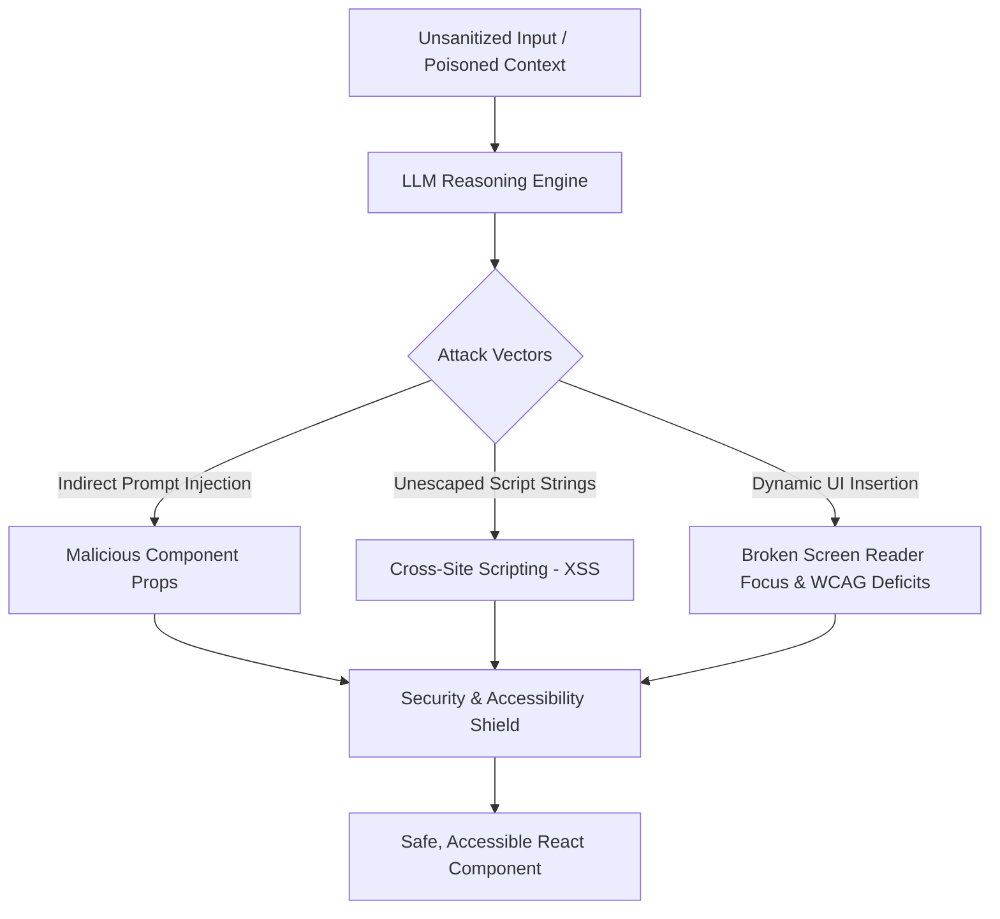
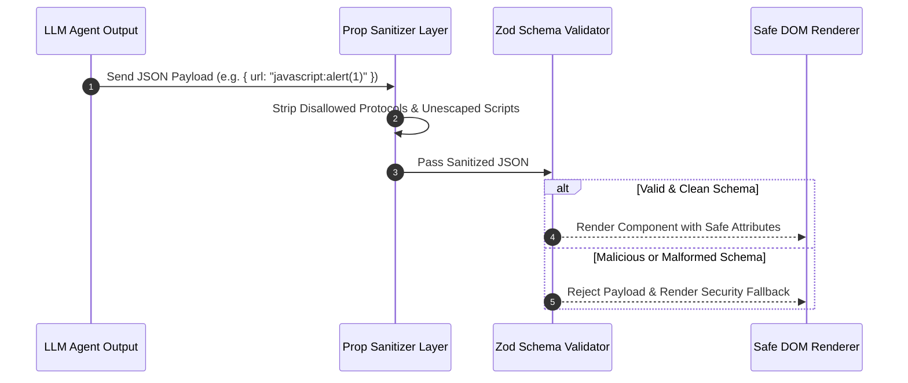

> **Answer-First Summary**: Building secure, accessible Generative UI systems requires defensive engineering across two critical vectors: Prompt-to-UI Injection Defenses and WCAG 2.1 AA Accessibility Enforcement. By enforcing strict prop sanitization, eliminating arbitrary HTML injection, and embedding automated accessibility attributes (`aria-live`, semantic focus traps, and contrast compliance) directly into dynamic component templates, teams prevent client-side XSS exploits while ensuring AI-generated interfaces remain fully accessible to screen readers and keyboard users.

> **Parent Architecture Guide:** Part 4 exploring security and accessibility within [Autonomous Hybrid AI Content Pipeline](/posts/architecting-an-autonomous-hybrid-ai-content-pipeline/).

---

## 1. The Dual Challenge: Security and Accessibility in Dynamic UI

Generative UI introduces unprecedented client-side runtime risks. In traditional frontend applications, UI structure is static and fully reviewed during build time. In a GenUI architecture, visual elements are constructed dynamically based on non-deterministic LLM responses.

This creates two critical vulnerabilities:

1. **Security Vulnerabilities (XSS & Indirect Prompt Injection)**: Attackers poison upstream context or API payloads to trick the LLM into generating malicious JavaScript strings, dangerous URLs, or hijacked button click handlers.
2. **Accessibility Deficits (WCAG Non-Compliance)**: Dynamically rendered components often lack proper ARIA labels, focus management, and screen reader announcements, rendering the interface unusable for accessibility users.


```mermaid
graph TD
    A[Unsanitized Input / Poisoned Context] --> B[LLM Reasoning Engine]
    B --> C{Attack Vectors}
    C -->|Indirect Prompt Injection| D[Malicious Component Props]
    C -->|Unescaped Script Strings| E[Cross-Site Scripting - XSS]
    C -->|Dynamic UI Insertion| F[Broken Screen Reader Focus & WCAG Deficits]

    D --> G[Security & Accessibility Shield]
    E --> G
    F --> G
    G --> H[Safe, Accessible React Component]
```

Implementing a unified Security and Accessibility Shield ensures that every AI-generated component meets enterprise security standards and regulatory compliance requirements.

---

## 2. Security Threat Model & Defense Mechanisms

When an LLM constructs component prop payloads, security guardrails must enforce strict boundaries before rendering occurs in the browser.


```mermaid
sequenceDiagram
    autonumber
    participant LLM as LLM Agent Output
    participant Sanitize as Prop Sanitizer Layer
    participant Zod as Zod Schema Validator
    participant DOM as Safe DOM Renderer

    LLM->>Sanitize: Send JSON Payload (e.g. { url: "javascript:alert(1)" })
    Sanitize->>Sanitize: Strip Disallowed Protocols & Unescaped Scripts
    Sanitize->>Zod: Pass Sanitized JSON
    alt Valid & Clean Schema
        Zod-->>DOM: Render Component with Safe Attributes
    else Malicious or Malformed Schema
        Zod-->>DOM: Reject Payload & Render Security Fallback
    end
```

### Threat Vector 1: Cross-Site Scripting (XSS) via Props
Attackers attempt to inject script tags or event handlers into string props (e.g., ``).
- **Mitigation**: Perform recursive string sanitization using DOMPurify or strict regex pattern matchers that strip HTML tags from string props.

### Threat Vector 2: URL Scheme Hijacking
Attackers force string props meant for links or images to use unsafe protocols (`javascript:`, `data:text/html`).
- **Mitigation**: Enforce URL protocol whitelisting (only `https://` or relative paths allowed).

### Threat Vector 3: Clickjacking & Form Manipulation
Attackers generate deceptive forms that attempt to submit sensitive user credentials to external endpoints.
- **Mitigation**: Restrict dynamic form component submit actions to internal relative API routes.

---

## 4. Production Implementation: Safe & Accessible GenUI Wrapper

```typescript
import React, { useEffect, useRef } from 'react';
import DOMPurify from 'dompurify';
import { z } from 'zod';

// Zod Schema Enforcing Safe Protocols
export const AccessibleButtonPropsSchema = z.object({
  label: z.string(),
  ariaLabel: z.string(),
  variant: z.enum(['primary', 'secondary', 'danger']).default('primary'),
  actionId: z.string()
});

export type AccessibleButtonProps = z.infer<typeof AccessibleButtonPropsSchema>;

interface SafeGenUIWrapperProps {
  payload: unknown;
  onActionTriggered: (actionId: string) => void;
}

export const SafeGenUIWrapper: React.FC<SafeGenUIWrapperProps> = ({ payload, onActionTriggered }) => {
  const announcementRef = useRef<HTMLDivElement>(null);

  // 1. Validate Schema
  const parseResult = AccessibleButtonPropsSchema.safeParse(payload);

  useEffect(() => {
    // 2. Accessibility: Announce dynamic component arrival to screen readers
    if (parseResult.success && announcementRef.current) {
      announcementRef.current.textContent = `New interactive component available: ${parseResult.data.label}`;
    }
  }, [parseResult]);

  if (!parseResult.success) {
    return (
      <div role="alert" style={{ color: 'red', border: '1px solid red', padding: '8px', borderRadius: '4px' }}>
        <strong>Security Alert:</strong> Invalid or untrusted component schema rejected.
      </div>
    );
  }

  const { label, ariaLabel, variant, actionId } = parseResult.data;

  // 3. Security: Sanitize all text strings
  const sanitizedLabel = DOMPurify.sanitize(label, { ALLOWED_TAGS: [] });
  const sanitizedAriaLabel = DOMPurify.sanitize(ariaLabel, { ALLOWED_TAGS: [] });

  const variantStyles = {
    primary: { backgroundColor: '#0055ff', color: '#ffffff' },
    secondary: { backgroundColor: '#e0e0e0', color: '#333333' },
    danger: { backgroundColor: '#d32f2f', color: '#ffffff' }
  };

  return (
    <div>
      {/* Hidden Live Region for Screen Reader Announcements */}
      <div 
        ref={announcementRef} 
        aria-live="polite" 
        aria-atomic="true" 
        className="sr-only"
        style={{ position: 'absolute', width: '1px', height: '1px', overflow: 'hidden', clip: 'rect(0,0,0,0)' }}
      />

      {/* Render Safe Accessible Button */}
      <button
        type="button"
        aria-label={sanitizedAriaLabel}
        style={{
          padding: '10px 18px',
          borderRadius: '6px',
          border: 'none',
          cursor: 'pointer',
          fontWeight: 600,
          ...variantStyles[variant]
        }}
        onClick={() => onActionTriggered(actionId)}
      >
        {sanitizedLabel}
      </button>
    </div>
  );
};
```

---

## 5. Accessibility (WCAG 2.1 AA) Compliance Matrix for GenUI

To ensure compliance with global accessibility regulations (e.g., ADA, Section 508, European Accessibility Act), GenUI systems must satisfy four core WCAG principles:

| WCAG Principle | Requirement for| Vulnerability Vector | Test Automation Tool | CI/CD Gate Target |
|---|---|---|
| **String XSS Injection** | Jest + DOMPurify Test Matrix | 100% Sanitization Pass Rate |
| **WCAG Contrast Violations** | Playwright + @axe-core/playwright | Zero Critical Accessibility Errors |
| **Unsafe URL Protocol Injection** | Zod Schema Regex Suite | Reject non-HTTPS protocols |

---

## 11. Trusted Types & Subresource Integrity (SRI) Protocols

To defend modern browsers against DOM-based Cross-Site Scripting (DOM XSS), enterprise GenUI apps configure W3C Trusted Types policies.
| WCAG Principle | Requirement for Dynamic AI UI | Implementation Strategy |
|---|---|---|
| **1. Perceivable** | Dynamic UI updates must be announced to screen reader users | Wrap dynamic component injection targets in `<div aria-live="polite">` |
| **2. Operable** | All AI-generated forms and buttons must be keyboard navigable | Enforce `tabIndex={0}` and standard `Enter`/`Space` key handlers |
| **3. Understandable** | Input errors in AI forms must provide clear error messages | Render explicit `aria-describedby` error associations |
| **4. Robust** | Markup must parse cleanly without invalid ARIA attribute combinations | Validate ARIA attribute types using strict TypeScript interfaces |

---

## 6. Strategic Security & Accessibility Guidelines

1. **Enforce Zero HTML Injection**: Never allow LLMs to output raw HTML tags within JSON prop fields. Plain text strings sanitized by DOMPurify should be mandatory.
2. **Automate WCAG Auditing in CI/CD**: Run automated accessibility tests (using axe-core or Playwright-axe) against component registry stories before releasing new widgets.
3. **Whitelist Action Callbacks**: Restrict dynamic component event handlers to registered internal action identifiers rather than executing arbitrary inline code.

---

## 7. Content Security Policy (CSP) Directives for GenUI Systems

To prevent malicious script execution even in the event of a sanitizer bypass, enterprise applications must serve rigid HTTP Content Security Policy (CSP) headers.

```http
Content-Security-Policy: 
    default-src 'self'; 
    script-src 'self' 'nonce-rAnd0mN0nc3Value'; 
    style-src 'self' 'unsafe-inline'; 
    connect-src 'self' https://api.vesviet.com https://genui-gateway.internal; 
    object-src 'none'; 
    base-uri 'self';
```

### Essential CSP Guardrails

- `script-src`: Restrict script execution exclusively to cryptographically hashed nonces generated per request. Block `unsafe-eval` and `unsafe-inline`.
- `connect-src`: Limit fetch and Server-Sent Event (SSE) connection destinations to explicitly whitelisted API domains.

---

## 8. Automated Security & Accessibility Verification Matrix

---

## 9. Dynamic iFrame Sandbox Isolation for Untrusted UI Widgets

When third-party plugin components or user-submitted micro-widgets are rendered dynamically, applications wrap them inside an isolated HTML5 iFrame sandbox.

```html
<!-- Secure iFrame Sandbox for Untrusted Dynamic AI Widgets -->
<iframe
  srcdoc="<!DOCTYPE html><html><body><div id='widget-root'></div></body></html>"
  sandbox="allow-scripts"
  csp="default-src 'none'; script-src 'self' 'nonce-xyz';"
  style="border: none; width: 100%; height: 300px;"
></iframe>
```

### Sandbox Security Attributes

- `sandbox="allow-scripts"`: Permits basic JavaScript execution while blocking access to parent window cookies, localStorage, and top-level navigation.
- `allow-same-origin` (Explicitly Omitted): Omitting `allow-same-origin` prevents untrusted widget code from accessing the parent domain's DOM or credential tokens.

---

## 10. Automated Penetration Testing of Dynamic Props

Security teams execute automated fuzz testing against the GenUI Prop Sanitizer using specialized attack dictionaries (such as OWASP XSS Filter Evasion Cheat Sheet payloads).

```typescript
// Example Automated Prop Fuzzing Test Suite
import { test, expect } from '@jest/globals';
import DOMPurify from 'dompurify';

const xssFuzzPayloads = [
  '<script>alert(1)</script>',
  'javascript:alert(document.cookie)',
  '',
  '<svg onload=alert(1)>'
];

test('Prop sanitizer strips all malicious XSS vectors', () => {
  xssFuzzPayloads.forEach((payload) => {
    const clean = DOMPurify.sanitize(payload, { ALLOWED_TAGS: [] });
    expect(clean).not.toContain('<script>');
    expect(clean).not.toContain('javascript:');
    expect(clean).not.toContain('onerror=');
  });
});

// Additional Sanity Assertion for Event Handler Attributes
test('Prop sanitizer strips inline event handlers', () => {
  const dirty = '<button onclick="evil()">Click Me</button>';
  const clean = DOMPurify.sanitize(dirty, { ALLOWED_TAGS: [] });
  expect(clean).toBe('Click Me');
});

```

---

## Architectural Context & Pillar References

- [Generative UI with Model Context Protocol Security](/posts/generative-ui-with-mcp-ai-native-frontend/) — Securing MCP component rendering and inputs.
- [AI-Native Frontend Architecture Predictions (2028)](/posts/ai-native-frontend-architecture-predictions-2028/) — Security & accessibility guidelines for AI frontends.
- [Autonomous Hybrid-AI Content Pipeline Deep-Dive](/posts/architecting-an-autonomous-hybrid-ai-content-pipeline/) — System-level security in content pipelines.

## Internal Series Navigation

- [Executive Summary — The Shift to Generative UI](/series/generative-ui-architecture/executive-summary/)
- [Part 1 — Beyond Chatbots: Dynamic Component Rendering](/series/generative-ui-architecture/part-1-beyond-chatbots/)
- [Part 2 — State Management for Generative UI](/series/generative-ui-architecture/part-2-state-management/)
- [Part 3 — Component Registry & JSON Schema Protocol](/series/generative-ui-architecture/part-3-component-registry/)
- [Part 5 — Human-in-the-Loop Workflows](/series/generative-ui-architecture/part-5-human-in-the-loop/)
- [Part 6 — E2E Testing & Edge Performance](/series/generative-ui-architecture/part-6-e2e-testing-edge/)
- [Part 7 — Reference Repo & Migration Playbook](/series/generative-ui-architecture/part-7-reference-repo-migration/)
