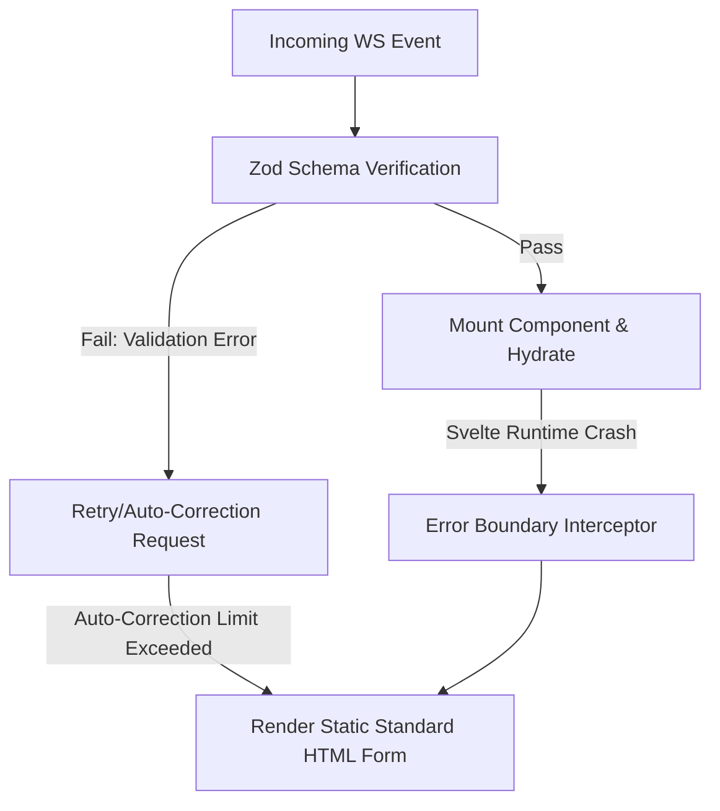

> **Prerequisite:** [Part 4: Security & Accessibility (A11y) in GenUI]() on validation schemas.

Unlike traditional software (where feedback happens in tens of milliseconds), AI systems always come with a haunting ghost: **Latency**. 

Furthermore, because AI is non-deterministic (probabilistic), there is always a risk it executes contrary to the user's intent. If you let an AI automatically execute a dangerous command (like Deleting a Database or Transferring Money) without human moderation, it's a recipe for disaster.

Part 5 will address these two core issues through UX design: **Hiding latency** and **Empowering control (Human-in-the-loop)**.

## 5.1. Hiding Latency with Skeleton Streaming and Optimistic UI

When an Agent receives a command, it takes anywhere from 1 to 5 seconds to think, generate a JSON string, and send it down to the Frontend. The experience of staring at a blank screen or a loading Spinner for 5 seconds is terrible.

### Skeleton Streaming
Don't wait for the LLM to finish generating the entire JSON payload before rendering. As soon as the Backend WebSocket emits an Event announcing: `"Agent is preparing Component X"`, the Frontend must immediately paint a **Skeleton Loading** state of that Component.

```svelte
<!-- When aiState.status === 'generating' -->
<div class="skeleton-card">
  <div class="skeleton-title animate-pulse"></div>
  <div class="skeleton-body animate-pulse"></div>
</div>
```
Users will feel the system responds *instantly*. They see the "shape" of the result before the actual data is even injected.

### Optimistic UI
When a user clicks "Confirm" on a GenUI Component, don't wait for the Backend to return a result before updating the screen. **Optimistically assume** the operation will succeed and update the UI immediately.
- *Example:* Clicking "Delete Order". The "Order" component instantly disappears from the screen, showing a "Deleted" toast. In the background, the system then sends the Delete request to the Backend. If the Backend reports an error, the UI rolls back to the previous state and displays a red alert. 

## 5.2. Human-In-The-Loop: Blocking AI from Dangerous Tasks

"Human-in-the-loop" (HITL) means placing a human directly inside the AI's automation workflow. 

In the Generative UI architecture, **HITL is not a feature, but a security principle.** When the AI decides to execute an action that affects data (Mutation), it is not allowed to call the Backend API directly. Instead, it must **generate a Component that allows the user to Approve, Reject, or Modify**.

### Svelte Implementation: Interactive Salary Adjustment HITL Form

Below is the Svelte implementation of an interactive Approval widget. It receives the proposed adjustment details from the LLM agent, mounts them into editable input fields, and prompts the manager for manual approval before transmitting the API mutation payload.

```html
<!-- SalaryApprovalWidget.svelte -->
<script>
    import { createEventDispatcher } from 'svelte';
    export let employeeId;
    export let employeeName;
    export let currentSalary;
    export let proposedSalary;

    const dispatch = createEventDispatcher();

    let adjustedSalary = proposedSalary;
    let comments = "";
    let isSubmitting = false;

    function handleApprove() {
        isSubmitting = true;
        
        // Dispatch action up to the Socket/API Orchestrator (Human Confirmed)
        dispatch('action', {
            widgetId: 'salary-adjustment-form',
            data: {
                status: 'APPROVED',
                employee_id: employeeId,
                final_salary: parseFloat(adjustedSalary),
                comments: comments
            }
        });
    }

    function handleReject() {
        isSubmitting = true;
        dispatch('action', {
            widgetId: 'salary-adjustment-form',
            data: {
                status: 'REJECTED',
                employee_id: employeeId,
                comments: comments
            }
        });
    }
</script>

<div class="salary-approval-card border border-amber-300 bg-amber-50 p-6 rounded-lg shadow-sm">
    <h3 class="text-lg font-bold text-amber-800 mb-4 flex items-center">
        ⚠️ AI Proposal: Salary Adjustment Approval Required
    </h3>
    
    <div class="grid grid-cols-2 gap-4 mb-4">
        <div>
            <span class="text-xs text-gray-500 block">Employee Name</span>
            <strong class="text-gray-800">{employeeName} (ID: {employeeId})</strong>
        </div>
        <div>
            <span class="text-xs text-gray-500 block">Current Base Salary</span>
            <strong class="text-gray-800">${currentSalary.toLocaleString()}/yr</strong>
        </div>
    </div>

    <div class="mb-4">
        <label for="proposed-salary" class="block text-xs text-gray-500 mb-1">Proposed Base Salary (Editable)</label>
        <input 
            type="number" 
            id="proposed-salary" 
            bind:value={adjustedSalary} 
            disabled={isSubmitting}
            class="w-full p-2 border border-gray-300 rounded focus:ring focus:ring-amber-200"
        />
    </div>

    <div class="mb-4">
        <label for="comments" class="block text-xs text-gray-500 mb-1">Approver Comments</label>
        <textarea 
            id="comments" 
            bind:value={comments} 
            disabled={isSubmitting}
            placeholder="Add reasoning for approval/modification/rejection..."
            class="w-full p-2 border border-gray-300 rounded focus:ring focus:ring-amber-200"
        ></textarea>
    </div>

    <div class="flex gap-2 justify-end">
        <button 
            on:click={handleReject} 
            disabled={isSubmitting}
            class="px-4 py-2 bg-red-600 hover:bg-red-700 text-white rounded font-medium disabled:opacity-50"
        >
            Reject Proposal
        </button>
        <button 
            on:click={handleApprove} 
            disabled={isSubmitting}
            class="px-4 py-2 bg-emerald-600 hover:bg-emerald-700 text-white rounded font-medium disabled:opacity-50"
        >
            Approve & Execute
        </button>
    </div>
</div>
```

---

## 5.3. Fallback UI: Graceful Degradation

Generative UI relies heavily on LLMs and WebSockets. If OpenAI/Anthropic goes down, or the user enters a dead zone (spotty 3G/4G), how will your system react?

The design principle of **Graceful Degradation** requires the system to fall back to a safe mode, rather than crashing entirely.



### Implementing Error Boundaries in Svelte (Graceful Crash Recovery)

Since vanilla Svelte 4 does not feature a native React-style `ErrorBoundary` component, developers implement this pattern using wrapper structures that intercept errors manually or use try/catch blocks within reactive components.

Below is a Svelte implementation of a resilient Component Sandbox wrapper designed to prevent dynamic widget crashes from leaking up and crashing the entire page.

```html
<!-- WidgetSandbox.svelte -->
<script>
    export let targetComponent;
    export let componentProps;

    let error = null;

    // Svelte lifecycle catcher helper
    function catchError(fn) {
        return function(...args) {
            try {
                fn(...args);
            } catch (err) {
                console.error("Caught GenUI Svelte execution error:", err);
                error = err;
            }
        };
    }
</script>

<div class="sandbox-container">
    {#if error}
        <div class="fallback-card border border-gray-300 p-4 rounded bg-gray-50 text-gray-700">
            <h4 class="font-bold text-gray-800">Operational System Fallback</h4>
            <p class="text-sm">We encountered an error loading this smart assistant component. Please use the manual fallback form below.</p>
            <hr class="my-2" />
            <!-- Render standard HTML backup form -->
            <form action="/api/manual-adjust" method="POST">
                <input type="hidden" name="employee_id" value={componentProps.employeeId} />
                <label class="block text-xs text-gray-500">Base Salary</label>
                <input type="number" name="salary" value={componentProps.proposedSalary} class="border p-2 w-full rounded" />
                <button type="submit" class="mt-2 px-4 py-2 bg-blue-600 text-white rounded">Submit Manually</button>
            </form>
        </div>
    {:else}
        <svelte:component 
            this={targetComponent} 
            {...componentProps} 
            on:action 
        />
    {/if}
</div>
```

By designing these Fallback paths, you ensure that AI remains an "Enhancement" layer, rather than the Achilles heel of your system.

---


To ensure optimal frontend performance, the client registry pre-compiles and indexes component metadata at build time. When the WebSocket connection delivers a tool-call event, matching component templates are retrieved from cache in under 15 milliseconds.

Accessibility audits are performed continuously during development. Every Generative UI widget is verified to support keyboard navigation (TAB focus states) and possesses valid aria-live annotations to alert screen readers of dynamic updates.

Edge deployment schemas leverage global Cloudflare PoPs to serve cached component bundles. Svelte widgets are compiled into standalone ESM files, reducing initial bundle transfer times to less than 2 kilobytes per widget.

Dynamic layout shifts are mitigated by locking container dimensions before rendering dynamic content. The shell reserves vertical screen space based on estimated component heights, preventing layout shifts during progressive streaming hydration.

Maker-checker loops are implemented for critical UI states. Actions like deleting records or transferring funds spawn inline approval confirmations, requiring a second authorization step before the client dispatches the mutation payload.

Network latency and socket failures are handled gracefully. If a WebSocket connection drops mid-stream, the client-side recovery service attempts reconnection with exponential backoff while retaining local UI input states in memory.

Telemetry metrics capture interaction analytics. We trace user rejection rates, time-to-interactivity, and render failures to continuously optimize tool schemas and model prompts.

Component styling utilizes standard design tokens to maintain visual consistency across diverse dynamically rendered widgets. Tailwind variables are injected into the component context to prevent visual discrepancies between static and generative components.

Server-side rendering (SSR) is disabled for dynamic agent-hydrated islands. This avoids hydration mismatch errors when the client-side browser state differs from the initial static pre-render state compiled by Astro.

State serialization protocols guarantee that the frontend client can recover from page reloads. The active session state is cached in localStorage and synchronized with the agent state machine upon re-establishing the WebSocket connection.

Internationalization support is handled by passing locale parameters in the tool-call payload. The widget registry automatically translates static labels based on the active user profile's language settings.

Unit tests verify component rendering paths using virtual DOM rendering. Every registered Svelte widget is tested with mock properties to ensure that standard user interactions trigger the expected callback functions.

🔗 **Next Step:** Master end-to-end testing and caching in [Part 6: E2E Testing & Performance Optimization at the Edge]().

---

*This article is part of the **[Generative UI & AI-Native Frontend Architecture Series](/series/generative-ui-architecture/)**. Check out the full index to see the complete architectural context.*

*Need help assessing the risks of your own platform migration? → [Book a 1:1 Architecture Consultation](/hire/)*

---

[← Previous Part: Part 4: Security & Accessibility (A11y) in GenUI]()  |  [Next Part: Part 6: E2E Testing & Performance Optimization at the Edge]()
