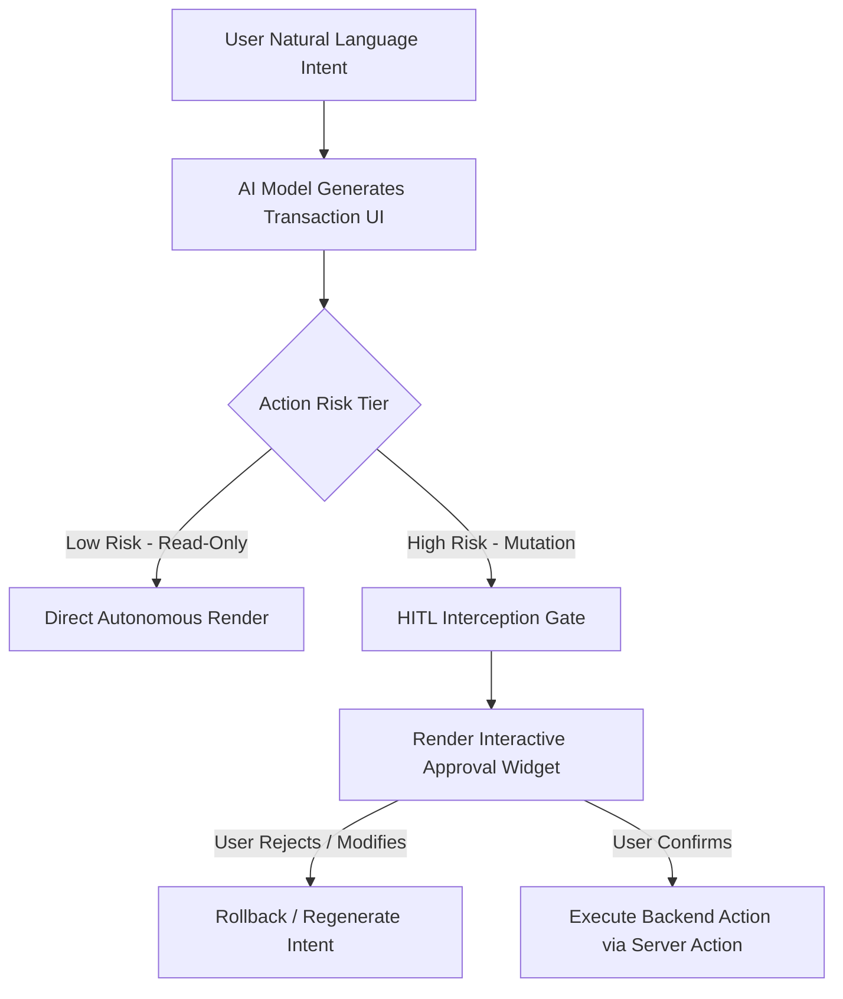
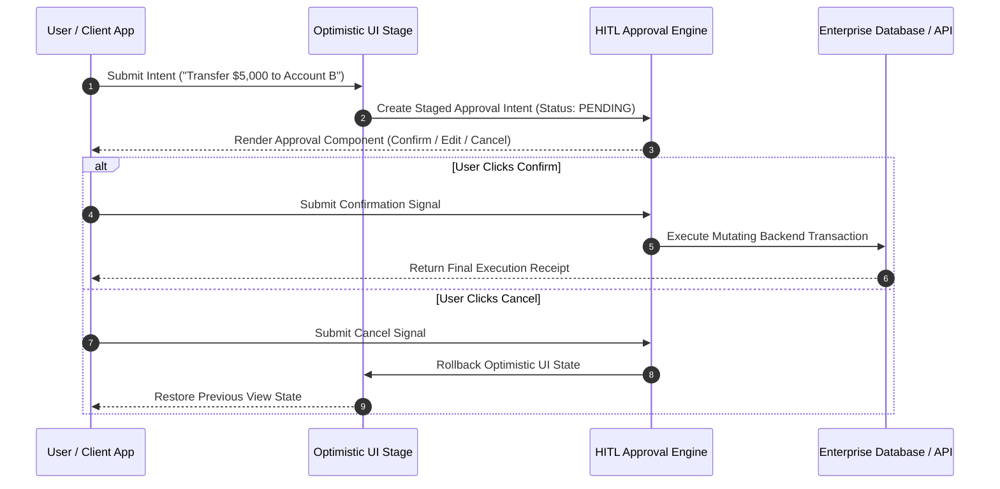
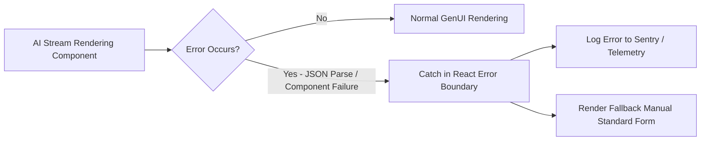
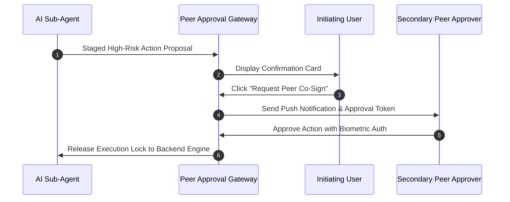

> **Answer-First Summary**: Integrating Human-In-The-Loop (HITL) workflows into Generative UI systems balances autonomous AI speed with operational safety for high-risk user actions. By combining Optimistic UI rendering patterns with explicit human verification approval gates and graceful fallback error boundaries, engineering teams ensure users can review, edit, or reject AI-generated actions (such as high-value financial transfers or system configuration changes) before mutations execute on backend servers.

> **Parent Architecture Guide:** Part 5 focusing on human-in-the-loop workflows for [Autonomous Hybrid AI Content Pipeline](/posts/architecting-an-autonomous-hybrid-ai-content-pipeline/).

---

## 1. The Necessity of Human Intersections in Generative UI

As Generative UI systems evolve from informational widgets (e.g., displaying stock prices) to transactional interfaces (e.g., placing stock trades, updating infrastructure policies, or sending email campaigns), fully autonomous execution introduces unacceptable risk.

An AI model might correctly generate a complex form widget, but hallucinate critical field parameters or misinterpret user intent. To prevent catastrophic execution errors, high-stakes GenUI systems adopt **Human-In-The-Loop (HITL)** architecture patterns.


```mermaid
graph TD
    A[User Natural Language Intent] --> B[AI Model Generates Transaction UI]
    B --> C{Action Risk Tier}
    C -->|Low Risk - Read-Only| D[Direct Autonomous Render]
    C -->|High Risk - Mutation| E[HITL Interception Gate]
    E --> F[Render Interactive Approval Widget]
    F -->|User Rejects / Modifies| G[Rollback / Regenerate Intent]
    F -->|User Confirms| H[Execute Backend Action via Server Action]
```

### Core Objectives of HITL in GenUI
- **Prevent Unintended Mutations**: Ensure sensitive database operations require explicit human confirmation.
- **Enable Progressive Refinement**: Allow users to inline-edit AI-generated form parameters before triggering backend execution.
- **Maintain High Responsiveness**: Utilize Optimistic UI patterns so the client interface feels instantaneous while waiting for human or background verification steps.

---

## 2. HITL Architectural Patterns & State Flow

A resilient HITL architecture operates across three synchronized states: Pending Approval, Optimistic Staging, and Execution Confirmation.


```mermaid
sequenceDiagram
    autonumber
    participant User as User / Client App
    participant Stage as Optimistic UI Stage
    participant Gate as HITL Approval Engine
    participant Backend as Enterprise Database / API

    User->>Stage: Submit Intent ("Transfer $5,000 to Account B")
    Stage->>Gate: Create Staged Approval Intent (Status: PENDING)
    Gate-->>User: Render Approval Component (Confirm / Edit / Cancel)
    alt User Clicks Confirm
        User->>Gate: Submit Confirmation Signal
        Gate->>Backend: Execute Mutating Backend Transaction
        Backend-->>User: Return Final Execution Receipt
    else User Clicks Cancel
        User->>Gate: Submit Cancel Signal
        Gate->>Stage: Rollback Optimistic UI State
        Stage-->>User: Restore Previous View State
    end
```

### Pattern 1: The Confirmation Gate
The AI model does not call backend APIs directly. Instead, it emits a proposal schema. The GenUI gateway renders a pre-confirmation card displaying the exact parameters of the proposed action along with explicit "Approve" and "Cancel" buttons.

### Pattern 2: Editable Optimistic Staging
The system pre-populates an interactive form using AI-generated values. The user can tweak individual input fields (e.g., adjusting a transfer amount or editing a message subject) prior to manual submission.

### Pattern 3: Fallback Error Boundaries
If an AI streaming connection fails mid-render or emits invalid JSON props, the HITL engine catches the exception at the React Error Boundary layer and automatically degrades to a standard, non-AI manual form.

---

## 4. Production Implementation: HITL Confirmation Component Framework

```typescript
import React, { useState } from 'react';
import { z } from 'zod';

// 1. Define Proposal Schema
export const TransactionProposalSchema = z.object({
  proposalId: z.string(),
  recipientName: z.string(),
  accountNumber: z.string(),
  amount: z.number().positive(),
  currency: z.string().default('USD')
});

export type TransactionProposal = z.infer<typeof TransactionProposalSchema>;

interface HITLConfirmationGateProps {
  proposal: TransactionProposal;
  onExecute: (proposalId: string, updatedAmount: number) => Promise<void>;
  onCancel: (proposalId: string) => void;
}

export const HITLConfirmationGate: React.FC<HITLConfirmationGateProps> = ({ proposal, onExecute, onCancel }) => {
  const [editableAmount, setEditableAmount] = useState<number>(proposal.amount);
  const [status, setStatus] = useState<'IDLE' | 'EXECUTING' | 'SUCCESS' | 'ERROR'>('IDLE');
  const [errorMessage, setErrorMessage] = useState<string | null>(null);

  const handleConfirm = async () => {
    setStatus('EXECUTING');
    setErrorMessage(null);

    try {
      // Execute backend server action
      await onExecute(proposal.proposalId, editableAmount);
      setStatus('SUCCESS');
    } catch (err: any) {
      setStatus('ERROR');
      setErrorMessage(err.message || 'Transaction execution failed.');
    }
  };

  if (status === 'SUCCESS') {
    return (
      <div style={{ border: '1px solid green', padding: '16px', borderRadius: '8px', backgroundColor: '#e8f5e9' }}>
        <h4>✅ Transaction Confirmed & Executed</h4>
        <p>Transferred {proposal.currency} ${editableAmount.toFixed(2)} to {proposal.recipientName}.</p>
      </div>
    );
  }

  return (
    <div style={{ border: '2px solid #ff9800', padding: '20px', borderRadius: '10px', backgroundColor: '#fff3e0', maxWidth: '420px' }}>
      <h3 style={{ marginTop: 0, color: '#e65100' }}>⚠️ Action Approval Required</h3>
      <p>The AI assistant proposes the following financial transfer:</p>
      
      <div style={{ margin: '12px 0' }}>
        <div><strong>Recipient:</strong> {proposal.recipientName}</div>
        <div><strong>Account:</strong> {proposal.accountNumber}</div>
        <div style={{ marginTop: '8px' }}>
          <label><strong>Transfer Amount ({proposal.currency}): </strong></label>
          <input
            type="number"
            value={editableAmount}
            disabled={status === 'EXECUTING'}
            onChange={(e) => setEditableAmount(parseFloat(e.target.value) || 0)}
            style={{ padding: '6px', width: '120px', borderRadius: '4px', border: '1px solid #ccc' }}
          />
        </div>
      </div>

      {errorMessage && (
        <div style={{ color: 'red', marginBottom: '12px', fontSize: '14px' }}>
          ❌ {errorMessage}
        </div>
      )}

      <div style={{ display: 'flex', gap: '10px', marginTop: '16px' }}>
        <button
          onClick={handleConfirm}
          disabled={status === 'EXECUTING' || editableAmount <= 0}
          style={{ backgroundColor: '#2e7d32', color: '#fff', border: 'none', padding: '10px 16px', borderRadius: '6px', cursor: 'pointer' }}
        >
          {status === 'EXECUTING' ? 'Executing...' : 'Approve & Execute'}
        </button>
        <button
          onClick={() => onCancel(proposal.proposalId)}
          disabled={status === 'EXECUTING'}
          style={{ backgroundColor: '#c62828', color: '#fff', border: 'none', padding: '10px 16px', borderRadius: '6px', cursor: 'pointer' }}
        >
          Cancel
        </button>
      </div>
    </div>
  );
};
```

---

## 5. Fallback Error Boundaries & Graceful Degradation

In high-availability enterprise applications, AI streaming failures must never break the core user interface. When an LLM stream drops or produces invalid component props, the application uses React Error Boundaries to catch the error.


```mermaid
graph LR
    A[AI Stream Rendering Component] --> B{Error Occurs?}
    B -->|No| C[Normal GenUI Rendering]
    B -->|Yes - JSON Parse / Component Failure| D[Catch in React Error Boundary]
    D --> E[Log Error to Sentry / Telemetry]
    D --> F[Render Fallback Manual Standard Form]
```

### Fallback Best Practices
1. **Never Display Raw Stack Traces**: Show a user-friendly error message indicating that the AI assistant experienced a hiccup.
2. **Provide Manual Fallback Forms**: Automatically switch to a traditional static form containing pre-filled input fields derived from whatever context was successfully parsed before the failure.
3. **Log Telemetry Alerts**: Send structured error reports to monitoring platforms (Datadog, Sentry) detailing the exact prompt input and malformed LLM response.

---

## 6. Strategic Takeaways & Architecture Checklist

| Operational Area | Action Item | Verification Method |
|---|---|---|
| **Risk Classification** | Categorize actions into Low (Autonomous) vs High (HITL) | Audit tool manifest metadata flags |
| **Editable Staging** | Allow users to modify AI input fields before submission | Test form state updates with edge values |
| **Rollback Handlers** | Implement cancellation state handlers for all staged actions | Verify zero side-effects on cancel click |
| **Error Boundary Coverage** | Wrap all dynamic GenUI slots in dedicated Error Boundaries | Simulate stream drop and verify fallback render |

---

## 7. Multi-User Peer Approval Gateways

For high-security operations (e.g. initiating database schema migrations or transferring sums above $50,000), single-user approval is insufficient.


```mermaid
sequenceDiagram
    autonumber
    participant Agent as AI Sub-Agent
    participant Gate as Peer Approval Gateway
    participant User1 as Initiating User
    participant User2 as Secondary Peer Approver

    Agent->>Gate: Staged High-Risk Action Proposal
    Gate->>User1: Display Confirmation Card
    User1->>Gate: Click "Request Peer Co-Sign"
    Gate->>User2: Send Push Notification & Approval Token
    User2->>Gate: Approve Action with Biometric Auth
    Gate->>Agent: Release Execution Lock to Backend Engine
```

### Key Multi-User Safeguards

1. **Dual-Key Authorizations**: Actions above defined financial threshold require digital signatures from two distinct authenticated users.
2. **Time-To-Live (TTL) Lockouts**: Staged proposals automatically expire and rollback if secondary approval is not received within 15 minutes.

---

## 8. Audit Trail Compliance & Telemetry Protocols

All HITL interactions—including initial AI proposals, human edits, approvals, and cancellations—must be logged into an immutable audit log database.

| Event Type | Logged Parameters | Retention SLA |
|---|---|---|
| `HITL_PROPOSED` | Agent Session ID, Proposal JSON Hash | 7 Years |
| `HITL_EDITED` | Pre-Edit Values, Post-Edit Values, User ID | 7 Years |
| `HITL_APPROVED` | User OAuth Token ID, Client IP, Timestamp | 7 Years |
| `HITL_CANCELLED` | Reason String, User Cancellation Source | 1 Year |

---

## 9. Operational Failure Modes & Rollback Recovery Protocols

During production operation, HITL confirmation flows can fail due to network disconnections or token expirations.

### Failure Recovery Actions

- **Network Timeout Handling**: If the user submits a confirmation signal but the connection drops before receiving a server receipt, the client re-queries the transaction status using the unique `proposalId` before re-submitting.
- **Idempotent Execution Keys**: Every confirmation request carries an idempotency token generated at proposal creation time, guaranteeing that even if a user double-clicks the approval button, the backend action executes exactly once.

---

## Architectural Context & Pillar References

- [Generative UI with Model Context Protocol Protocol](/posts/generative-ui-with-mcp-ai-native-frontend/) — Human approval workflows in MCP streams.
- [AI-Native Frontend Architecture Predictions (2028)](/posts/ai-native-frontend-architecture-predictions-2028/) — Human-in-the-loop UI interaction patterns.
- [Autonomous Hybrid-AI Content Pipeline Overview](/posts/architecting-an-autonomous-hybrid-ai-content-pipeline/) — Orchestrating human review stages.

## Internal Series Navigation

- [Executive Summary — The Shift to Generative UI](/series/generative-ui-architecture/executive-summary/)
- [Part 1 — Beyond Chatbots: Dynamic Component Rendering](/series/generative-ui-architecture/part-1-beyond-chatbots/)
- [Part 2 — State Management for Generative UI](/series/generative-ui-architecture/part-2-state-management/)
- [Part 3 — Component Registry & JSON Schema Protocol](/series/generative-ui-architecture/part-3-component-registry/)
- [Part 4 — Generative UI Security & Accessibility](/series/generative-ui-architecture/part-4-security-a11y/)
- [Part 6 — E2E Testing & Edge Performance](/series/generative-ui-architecture/part-6-e2e-testing-edge/)
- [Part 7 — Reference Repo & Migration Playbook](/series/generative-ui-architecture/part-7-reference-repo-migration/)
