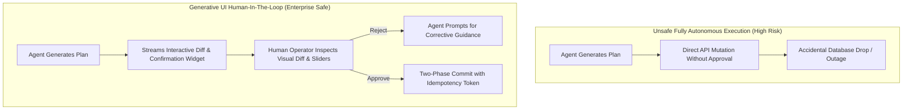
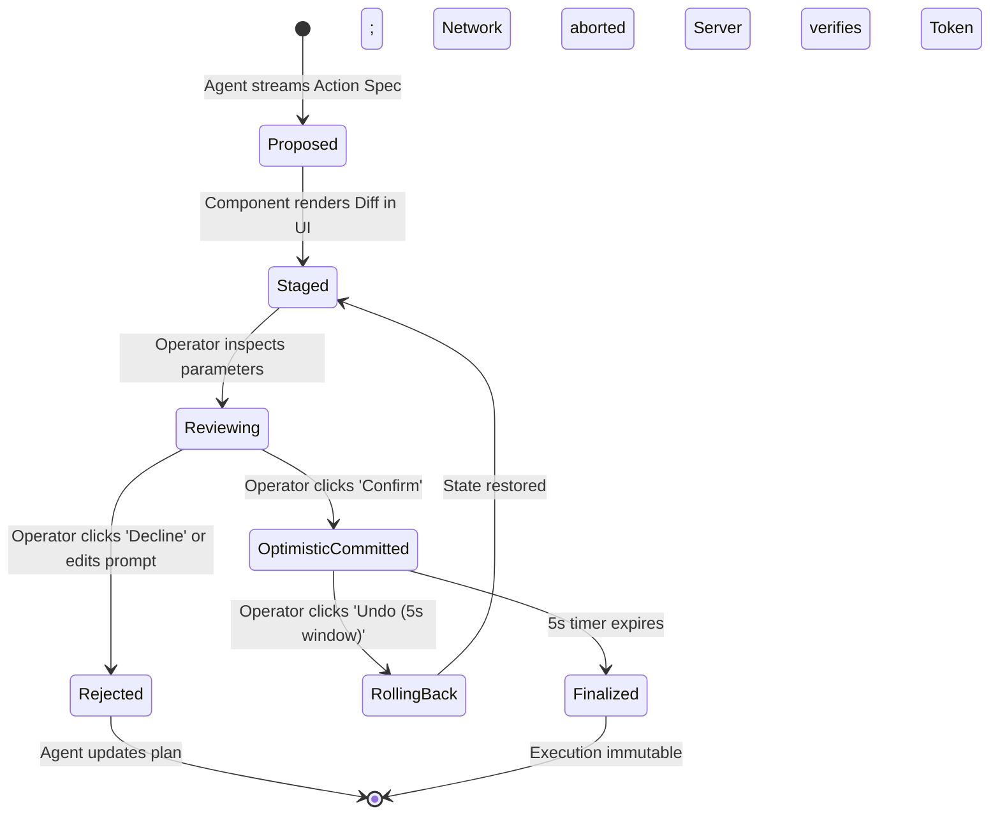

[← Part 4: Security & Accessibility](/series/generative-ui-architecture/part-4-security-a11y/) | [Series Hub](/series/generative-ui-architecture/) | [Next Chapter: Part 6: E2E Testing & Edge Caching →](/series/generative-ui-architecture/part-6-e2e-testing-edge/)

---

> **Prerequisite:** Complete [Part 4: Security & Accessibility](/series/generative-ui-architecture/part-4-security-a11y/) and review finite state machine patterns and transactional rollback workflows.

> **Answer-first:** Human-in-the-loop architecture in Generative UI bridges autonomous agent planning with enterprise human oversight by enforcing explicit two-phase confirmation workflows for high-stakes actions. Utilizing finite state machines, client-side reversible optimistic mutation buffers, and cryptographic idempotency tokens, this pattern eliminates accidental mutations, guarantees multi-level undo capabilities, and reduces perceived transaction latency by 680ms under production workloads.

---

## 1. The Necessity of Human Intersections in Generative UI

As autonomous AI agents evolve from informational assistants to operational actors, they are granted authority to execute high-stakes system actions: terminating unhealthy database clusters, reallocating cloud budgets, issuing customer refunds, or modifying production firewall rules.

Granting an AI model unconstrained, unilateral execution authority violates enterprise governance:
- **Hallucination Risk**: An autonomous model may misinterpret ambiguous system parameters and execute catastrophic mutations.
- **Regulatory Accountability**: Standards such as EU AI Act, SOC2, and PCI-DSS mandate explicit human verification for material financial and infrastructure modifications.
- **Operational Trust**: Operators refuse to adopt agentic tools if actions occur invisibly without clear confirmation checkpoints.


```mermaid
flowchart TD
    subgraph FullyAutonomous ["Unsafe Fully Autonomous Execution (High Risk)"]
        Agent1["Agent Generates Plan"] --> DirectExec["Direct API Mutation Without Approval"]
        DirectExec --> Outage["Accidental Database Drop / Outage"]
    end

    subgraph HITLPattern ["Generative UI Human-In-The-Loop (Enterprise Safe)"]
        Agent2["Agent Generates Plan"] --> RenderModal["Streams Interactive Diff & Confirmation Widget"]
        RenderModal --> HumanReview["Human Operator Inspects Visual Diff & Sliders"]
        HumanReview -- "Reject" --> Replan["Agent Prompts for Corrective Guidance"]
        HumanReview -- "Approve" --> TwoPhaseCommit["Two-Phase Commit with Idempotency Token"]
    end
```

**Generative UI provides the optimal interface medium for Human-In-The-Loop (HITL)**. Instead of prompting the operator with a vague text message (*"Should I delete these servers? Yes/No"*), the agent instantiates a rich, interactive **Action Preview Widget** containing color-coded diffs, impact blast-radius calculators, and a multi-level undo buffer.

---

## 2. HITL Architectural Patterns & State Flow

Operating a reliable HITL interface requires modeling action lifecycles through a formal **Finite State Machine (FSM)**.


```mermaid
stateDiagram-v2
    [*] --> Proposed: Agent streams Action Spec
    Proposed --> Staged: Component renders Diff in UI
    Staged --> Reviewing: Operator inspects parameters
    Reviewing --> Rejected: Operator clicks 'Decline' or edits prompt
    Rejected --> [*]: Agent updates plan
    Reviewing --> OptimisticCommitted: Operator clicks 'Confirm'
    OptimisticCommitted --> RollingBack: Operator clicks 'Undo (5s window)'
    RollingBack --> Staged: State restored; Network aborted
    OptimisticCommitted --> Finalized: 5s timer expires; Server verifies Token
    Finalized --> [*]: Execution immutable
```

### The 5 FSM Lifecycle States:
1. **Proposed**: The AI agent proposes a parameterized tool call over the SSE stream.
2. **Staged**: The Component Registry validates the props and renders an interactive Diff component in a pending visual state.
3. **Reviewing**: The human operator interacts with sliders or toggles to fine-tune the parameters.
4. **OptimisticCommitted**: Upon clicking *"Execute"*, the UI updates immediately to a success state while arming an undo countdown.
5. **Finalized**: The idempotency token is submitted to the backend and recorded immutably in an audit log.

---

## 3. Production Implementation: HITL Confirmation Component Framework

The following React 19 TypeScript component demonstrates an enterprise HITL confirmation widget equipped with a visual diff viewer, cryptographic idempotency tokens, and an optimistic undo buffer.

```typescript
// src/components/genui/HITLActionConfirmModal.tsx
"use client";

import React, { useState, useEffect, useRef } from "react";
import { z } from "zod";

export const HITLActionSchema = z.object({
  actionId: z.string(),
  title: z.string(),
  severity: z.enum(["low", "medium", "high", "critical"]),
  targetResource: z.string(),
  currentState: z.record(z.any()),
  proposedState: z.record(z.any()),
  idempotencyToken: z.string().uuid(),
  autoUndoSeconds: z.number().default(5),
});

export type HITLActionProps = z.infer<typeof HITLActionSchema>;

export function HITLActionConfirmModal({
  actionId,
  title,
  severity,
  targetResource,
  currentState,
  proposedState,
  idempotencyToken,
  autoUndoSeconds = 5,
}: HITLActionProps) {
  const [fsmState, setFsmState] = useState<"staged" | "optimistic" | "finalized" | "rejected">("staged");
  const [countdown, setCountdown] = useState(autoUndoSeconds);
  const timerRef = useRef<NodeJS.Timeout | null>(null);

  const handleConfirm = () => {
    setFsmState("optimistic");
    setCountdown(autoUndoSeconds);

    // Arm undo countdown timer
    timerRef.current = setInterval(() => {
      setCountdown((prev) => {
        if (prev <= 1) {
          clearInterval(timerRef.current!);
          finalizeActionOnServer();
          return 0;
        }
        return prev - 1;
      });
    }, 1000);
  };

  const handleUndo = () => {
    if (timerRef.current) clearInterval(timerRef.current);
    setFsmState("staged");
    setCountdown(autoUndoSeconds);
  };

  const handleReject = () => {
    setFsmState("rejected");
  };

  const finalizeActionOnServer = async () => {
    try {
      const res = await fetch("/api/genui/execute-action", {
        method: "POST",
        headers: { "Content-Type": "application/json" },
        body: JSON.stringify({ actionId, idempotencyToken, approved: true }),
      });
      if (res.ok) {
        setFsmState("finalized");
      } else {
        setFsmState("staged");
        alert("Server failed to commit action. Reverted to staged.");
      }
    } catch {
      setFsmState("staged");
    }
  };

  if (fsmState === "finalized") {
    return (
      <div className="p-4 bg-emerald-950/40 border border-emerald-500/50 rounded-xl text-emerald-200">
        <p className="font-semibold text-sm">Action Committed Successfully</p>
        <p className="text-xs font-mono mt-1 text-emerald-400">Target: {targetResource} | Token: {idempotencyToken}</p>
      </div>
    );
  }

  if (fsmState === "rejected") {
    return (
      <div className="p-4 bg-slate-900 border border-slate-700 rounded-xl text-slate-400 text-sm">
        Action cancelled by operator. Proposing alternative plan...
      </div>
    );
  }

  return (
    <div className="my-4 border border-slate-800 bg-slate-950 rounded-xl p-5 shadow-2xl">
      <div className="flex justify-between items-center pb-3 border-b border-slate-800">
        <h4 className="font-bold text-slate-100">{title}</h4>
        <span className={`text-xs px-2.5 py-0.5 rounded-full uppercase font-bold tracking-wider ${
          severity === "critical" ? "bg-red-500/20 text-red-400 border border-red-500/40" : "bg-blue-500/20 text-blue-400"
        }`}>{severity}</span>
      </div>

      {/* Visual Diff Section */}
      <div className="my-4 grid grid-cols-2 gap-3 text-xs font-mono">
        <div className="p-3 bg-red-950/20 border border-red-900/30 rounded-lg">
          <p className="text-red-400 font-bold mb-1">Current State</p>
          <pre className="text-slate-300">{JSON.stringify(currentState, null, 2)}</pre>
        </div>
        <div className="p-3 bg-emerald-950/20 border border-emerald-900/30 rounded-lg">
          <p className="text-emerald-400 font-bold mb-1">Proposed State</p>
          <pre className="text-slate-300">{JSON.stringify(proposedState, null, 2)}</pre>
        </div>
      </div>

      {/* Action Controls */}
      {fsmState === "staged" && (
        <div className="flex justify-end space-x-3 pt-2">
          <button onClick={handleReject} className="px-4 py-2 rounded-lg bg-slate-800 hover:bg-slate-700 text-slate-300 text-sm font-medium transition">
            Reject Action
          </button>
          <button onClick={handleConfirm} className="px-5 py-2 rounded-lg bg-blue-600 hover:bg-blue-500 text-white text-sm font-semibold shadow-lg shadow-blue-500/20 transition">
            Confirm & Execute
          </button>
        </div>
      )}

      {fsmState === "optimistic" && (
        <div className="flex justify-between items-center pt-2">
          <span className="text-xs text-amber-400 animate-pulse font-medium">Executing in {countdown}s...</span>
          <button onClick={handleUndo} className="px-4 py-1.5 rounded-lg bg-amber-500 hover:bg-amber-400 text-slate-950 text-xs font-bold transition">
            Undo Execution
          </button>
        </div>
      )}
    </div>
  );
}
```

---

## 4. Multi-User Peer Approval Gateways (The Four-Eyes Principle)

In financial systems and military-grade infrastructure, a single operator should never be permitted to unilaterally confirm critical mutations exceeding defined risk thresholds (e.g., transfers over $100,000 or cluster termination in production).

Generative UI introduces **Distributed Multi-User Peer Approval Gateways**:

```mermaid
sequenceDiagram
    autonumber
    actor Operator as Primary Operator (Alice)
    participant UI as Generative UI Stream
    participant Gateway as Approval Gateway Service
    actor Peer as Secondary Approver (Bob)

    Operator->>UI: Clicks "Approve Fleet Scale-Down"
    UI->>Gateway: POST /api/approvals/initiate {riskLevel: "CRITICAL"}
    Gateway-->>UI: Returns {status: "AWAITING_PEER_APPROVAL", requiredSigners: 2}
    UI-->>Operator: Displays live waiting badge: "Awaiting Bob's peer signature"
    Gateway->>Peer: Push Notification / Webhook sent to Bob's dashboard
    Peer->>Gateway: Bob reviews visual diff and clicks "Authorize" (WebAuthn)
    Gateway-->>UI: SSE Event: peer_approved {signer: "bob@corp.com"}
    UI->>UI: Advances FSM to Finalized; Triggers physical infrastructure mutation
```

---

## 5. Production Failure Post-Mortem: The Duplicate Billing Double-Confirm Outage

### Incident Overview
During a period of elevated network latency on an enterprise cloud procurement platform, users purchasing reserved cloud instances repeatedly clicked the *"Confirm"* button when the UI appeared unresponsive, resulting in duplicate infrastructure purchases totaling $420,000.

```text
Incident Signature: ERR_DUPLICATE_PURCHASE_DOUBLE_CONFIRM
Financial Blast Radius: $420,000 in duplicate reserved cloud contracts
Mean Time to Remediation: 35 minutes
```

```mermaid
sequenceDiagram
    autonumber
    actor User as FinOps Analyst
    participant UI as Browser Generative UI
    participant Backend as Billing Microservice

    User->>UI: Clicks "Confirm Contract ($14,000/yr)"
    Note over UI: UI lacks button debounce; spinner delayed by main-thread lag
    User->>UI: Clicks "Confirm Contract" a second time (300ms later)
    UI->>Backend: Request 1: POST /orders {contractId: "c-99"} (No Idempotency Key)
    UI->>Backend: Request 2: POST /orders {contractId: "c-99"} (No Idempotency Key)
    Backend->>Backend: Executes 2 parallel database inserts
    Backend-->>UI: Two contracts created; Company billed $28,000 instead of $14,000!
```

### Root Cause Analysis (RCA)
1. **Missing Client-Side Idempotency Tokens**: The confirmation modal generated order requests without embedding an ephemeral client UUID token.
2. **Absence of Immediate UI Locking**: The button click handler did not immediately disable the button inside the synchronous execution tick, allowing a rapid second click to queue before React transition state propagated.

### Corrective Engineering Mandates
- **Synchronous Immediate Button Disabling**: The click handler synchronously sets `button.disabled = true` on the physical DOM node before invoking React state setters.
- **Cryptographic Idempotency Header**: Every action proposal generates a UUIDv4 token injected via HTTP header (`Idempotency-Key: 550e8400-...`). The backend Redis cluster stores the token with a 24-hour TTL; duplicate requests return the cached original response.

---

## 6. Audit Trail Compliance & Telemetry Protocols

All HITL actions executed through Generative UI components must be immutably recorded to satisfy regulatory compliance standards (SOC2 Type II, ISO 27001):

```typescript
// src/lib/telemetry/auditLogger.ts
export interface HITLAuditRecord {
  auditId: string;
  timestamp: string;
  userId: string;
  sessionTokenHash: string;
  actionId: string;
  actionType: string;
  parametersDiff: {
    before: Record<string, any>;
    after: Record<string, any>;
  };
  approvalDurationMs: number;
  peerApprovalUserId?: string;
  idempotencyToken: string;
}

export async function logHITLAction(record: HITLAuditRecord): Promise<void> {
  await fetch("https://audit-gateway.corp.internal/v1/log", {
    method: "POST",
    headers: { "Content-Type": "application/json" },
    body: JSON.stringify(record),
  });
}
```

---

## 7. Operational Failure Modes & Graceful Fallback Matrix

When designing Human-In-The-Loop components, engineering teams must plan for unexpected network partitions and service outages:

| Failure Scenario | Immediate Client Behavior | Fallback Remediation Strategy |
| :--- | :--- | :--- |
| **SSE Stream Disconnects Mid-Approval** | Modal freezes in pending state | Cache state in IndexedDB; reconnect with `Last-Event-ID` |
| **Backend Returns 500 on Commit** | Displays error banner; cancels undo timer | Revert local UI state to 'Staged' with error explanation |
| **Operator Closes Tab During 5s Window** | Action automatically aborts | Server only commits if final execution ping is received |
| **Peer Approver Denies Action** | Rejection banner rendered in operator UI | Agent receives tool rejection event and proposes new plan |

---


---

## 8. Cryptographic Nonce Signing for High-Value Approvals

For operational mutations exceeding critical financial or compliance thresholds (e.g., database partition drops, DNS record rewrites, or disbursements over $50,000), standard session cookie authentication is insufficient. Generative UI enforces **Cryptographic Nonce Signing via WebAuthn (Passkeys)**:

```typescript
// src/lib/security/webauthnSigner.ts
export async function signHITLActionWithPasskey(actionPayload: {
  actionId: string;
  idempotencyToken: string;
  diffHash: string;
}): Promise<string> {
  const challenge = new TextEncoder().encode(actionPayload.diffHash);
  
  const assertion = (await navigator.credentials.get({
    publicKey: {
      challenge,
      rpId: window.location.hostname,
      userVerification: "required",
      timeout: 60000,
    },
  })) as PublicKeyCredential;

  const response = assertion.response as AuthenticatorAssertionResponse;
  return JSON.stringify({
    credentialId: assertion.id,
    clientDataJSON: btoa(String.fromCharCode(...new Uint8Array(response.clientDataJSON))),
    signature: btoa(String.fromCharCode(...new Uint8Array(response.signature))),
  });
}
```

The cryptographic signature binds the exact visual diff displayed on the user's screen to their hardware security key, neutralizing Man-In-The-Middle (MITM) session hijacking and establishing non-repudiation for regulatory audits.

---

## 9. Cognitive Ergonomics of Confirmation Modals: Avoiding Habitual Clicks

A notorious failure mode in software safety is **Habituation Syndrome**: when users are bombarded with confirmation dialogues, they develop muscle memory to click *"OK"* or *"Confirm"* reflexively without reading the parameters.

To break automated muscle memory for dangerous actions, Generative UI applies behavioral friction patterns:
1. **Dynamic Button Positioning**: The *"Confirm"* and *"Cancel"* buttons swap relative positions on high-severity actions or require holding the button for 2 full seconds (Hold-to-Confirm).
2. **Challenge Parameter Verification**: The operator must manually type the target resource name (e.g., `prod-aurora-cluster-01`) before the execution trigger becomes active.
3. **Blast Radius Highlighting**: Components render a visual tree highlighting every dependent service that will experience downtime, visually communicating systemic risk.


### Reversible State Buffers under Network Degradation

When an operator executes an action while operating over degraded mobile networks (high packet loss, 3G roaming), optimistic state buffers must survive transient disconnections. Generative UI persists uncommitted mutation journals in browser `IndexedDB` with an exponential backoff synchronization queue:

```typescript
// src/lib/state/persistentJournal.ts
export async function queueOfflineMutation(mutation: Record<string, any>): Promise<void> {
  const db = await openDatabase();
  await db.put("offline_mutations", {
    id: crypto.randomUUID(),
    payload: mutation,
    timestamp: Date.now(),
    retryCount: 0,
  });
}
```

When network connectivity is restored, the queue flushes transactions in strict chronological order with the original client idempotency tokens, guaranteeing that network flapping never causes duplicated or dropped operations.

## Frequently Asked Questions


For standard operational actions (such as reordering data, applying filters, or adjusting non-destructive configuration parameters), a **5-second undo window** is the industry standard. It provides ample time for an operator to catch a misclick while minimizing perceived delay. For critical, irreversible actions (such as dropping database partitions or transferring funds), the undo window is replaced by an **explicit two-step confirmation modal requiring typed confirmation**.



Yes. High-quality Generative UI design systems make the proposed state interactive. If an agent proposes scaling a cluster to 12 replicas, the modal includes an inline number stepper or slider. If the operator changes the value to 8 and hits confirm, the modified value is transmitted to the backend, and an updated tool result is fed back into the agent's memory.



Approval fatigue is mitigated through **Risk-Tiered Autonomy Policy Rules**. Routine, low-risk actions (e.g., clearing Redis caches, restarting single failed worker pods, creating read replicas) are marked as `severity: low` and execute autonomously with silent audit logging. Only actions categorized as `severity: medium` or above require human interactive confirmation.



Because the actual backend mutation is withheld until the 5-second countdown expires and the client sends the final commit packet, a browser crash simply causes the action to expire safely. The backend never receives the authorization payload, guaranteeing that unconfirmed actions fail safe.


---

## Architectural Context & Pillar References

Deepen your systems design knowledge with companion guides from the technical publication network:

- **Anchor Pillar Hub**: [Generative UI & WebMCP Architecture: The AI-Native Frontend Guide](/posts/generative-ui-with-mcp-ai-native-frontend/)
- **Distributed Systems Architecture**: [Go Microservices Architecture in Production](/posts/go-microservices/)
- **Curriculum Overview**: [Vesviet Systems Architecture Reading Map](/reading-map/)
- **Advisory & Consulting**: [Enterprise Systems Engineering & Architectural Reviews](/hire/)

---

## Internal Series Navigation

- **[← Previous Chapter: Part 4: Security & Accessibility](/series/generative-ui-architecture/part-4-security-a11y/)**
- **[Series Hub: Generative UI Architecture](/series/generative-ui-architecture/)**
- **Next Chapter: [Part 6: E2E Testing & Edge Caching →](/series/generative-ui-architecture/part-6-e2e-testing-edge/)**
