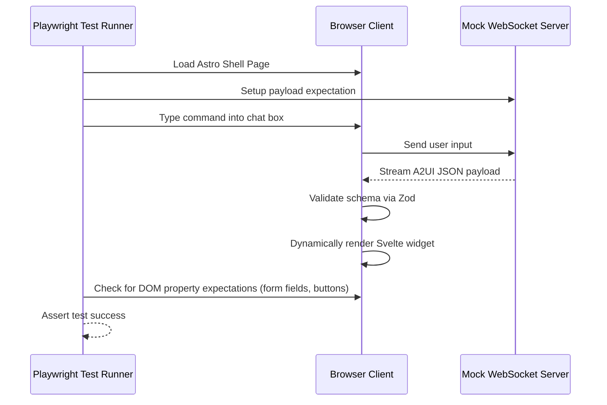

Generative UI architecture brings a new horizon for user experience, but it is the worst nightmare for QA and DevOps teams. 

How do you write an automated test script (E2E Test) for an interface when you don't know what content the AI will generate beforehand? And how do you ensure the system doesn't burn through API budgets when thousands of users ask the exact same question?

## 6.1. The Non-deterministic Hurdle in E2E Testing

In traditional (Deterministic) applications, a Cypress or Playwright test script usually looks like this:
1. Type "Hanoi" into the Search box.
2. Click "Search".
3. `expect(page.locator('.weather-title')).toHaveText('Hanoi Weather')`.

However, LLMs are **non-deterministic**. For the exact same command, today it might return `{"title": "Hanoi Weather"}`, and tomorrow it might return `{"title": "Weather Report for the Capital Hanoi"}`. Your static tests will fail continuously (Flaky tests).

### Solution 1: Completely Isolate AI and UI During Testing
Golden rule: **Never call a real LLM API in your UI E2E Tests.**
You must Mock the WebSocket Server to return a hardcoded JSON string (e.g., calling the Component Registry directly with a fake Payload). 
This proves that: *"As long as the AI returns a valid A2UI JSON, my Frontend is guaranteed to render it correctly."* Testing the intelligence of the AI must be pushed to a different layer (LLM Evaluation), separate from UI Testing.

*Note (For Full Integration Tests):* If QA strictly requires testing the entire flow going through the Backend Agent, use the **VCR / Cassette Recording** technique (like the `pollyjs` library). The first test run will call the real LLM and "record" the JSON response. Subsequent CI/CD test runs will automatically "replay" that JSON cassette to maintain Determinism.

### Solution 2: Property-Based Testing
Instead of checking for a specific text string (Exact Match), check the "Properties" of the Component.
- **Wrong:** `expect(page).toHaveText("Transfer $500 to user B")`
- **Right:** 
  - `expect(page.locator('form[data-testid="transfer-form"]')).toBeVisible()`
  - `expect(page.locator('input[name="amount"]').inputValue()).toBeGreaterThan(0)`
  - `expect(page.locator('button[type="submit"]')).toBeEnabled()`

By testing the **presence of structure** rather than specific text, your tests will survive any phrasing changes made by the AI.



### Playwright E2E Test Script: Property-Based Assertions with Mock Socket

Below is a Playwright end-to-end integration test demonstrating how to mock the real-time agent connection, trigger the dynamic rendering of a widget, and perform structural assertions that ignore LLM textual variations.

```javascript
import { test, expect } from '@playwright/test';

test.describe('Generative UI Component Rendering Tests', () => {
    test('should dynamically render the salary adjustment form upon socket payload receipt', async ({ page }) => {
        // 1. Navigate to the Astro dashboard page
        await page.goto('/dashboard');

        // 2. Establish connection and mock the agent websocket stream
        const wsUrl = 'ws://localhost:8080/ws/agent-state';
        
        // Mock WebSocket logic inside the browser page context
        await page.evaluate((url) => {
            const mockSocket = new window.WebSocket(url);
            
            // Wait for open then dispatch dynamic GenUI payload
            setTimeout(() => {
                const eventPayload = {
                    id: "test-event-uuid-1",
                    component_id: "order-cancellation-widget",
                    props: {
                        employeeId: "EMP-492",
                        employeeName: "Nguyen Van A",
                        currentSalary: 1500,
                        proposedSalary: 2000
                    }
                };
                
                // Trigger client-side socket message callback
                const msgEvent = new MessageEvent('message', {
                    data: JSON.stringify(eventPayload)
                });
                mockSocket.dispatchEvent(msgEvent);
            }, 500);
        }, wsUrl);

        // 3. Perform property-based assertions (avoid hardcoded text matches)
        const formLocator = page.locator('.salary-approval-card');
        await expect(formLocator).toBeVisible({ timeout: 5000 });

        // Assert structural elements exist
        const proposedInput = formLocator.locator('input[type="number"]');
        await expect(proposedInput).toBeVisible();
        await expect(proposedInput).toHaveValue('2000');

        // Assert submit buttons are active and clickable
        const approveBtn = formLocator.locator('button:has-text("Approve")');
        await expect(approveBtn).toBeEnabled();

        // 4. Act: Trigger modification
        await proposedInput.fill('1800');
        await approveBtn.click();
    });
});
```

---

## 6.2. Semantic Caching at the Edge

Another major issue is cost and latency. If 1,000 users type *"How to change password"*, calling the OpenAI API 1,000 times is a horrific waste of both money and waiting time (latency).

### What is Semantic Caching?
Traditional caches rely on Exact Matches. If user A types `"Change password"`, and user B types `"How do I change my password"`, a traditional cache will miss.

Semantic Caching solves this using Vector Databases:
1. User inputs a question.
2. Embed the question into a Vector.
3. Compare the Vector distance against questions in the Cache.
4. `"Change password"` and `"How do I change my password"` have very high geometric similarity (Similarity > 0.95).
5. Cache **HIT**!

### Cloudflare Worker Implementation: Edge Semantic Cache

Below is the code for a Cloudflare Worker using **Cloudflare Vectorize** to query semantic vector caches. If a similar question exists in the index, it immediately retrieves the cached dynamic UI template response from KV, bypassing the LLM server completely.

```typescript
interface Env {
  VECTOR_INDEX: VectorizeIndex;
  TEMPLATE_KV: KVNamespace;
  TEXT_EMBEDDING_API: string; // URL to embedding model
}

export default {
  async fetch(request: Request, env: Env): Promise<Response> {
    const { query } = await request.json() as { query: string };

    // 1. Fetch text embedding from Cloudflare AI or external model
    const embeddingResponse = await fetch(env.TEXT_EMBEDDING_API, {
      method: "POST",
      body: JSON.stringify({ text: query })
    });
    const { embedding } = await embeddingResponse.json() as { embedding: number[] };

    // 2. Query Vectorize Database for similarity matches
    const matches = await env.VECTOR_INDEX.query(embedding, {
      topK: 1,
      returnValues: false,
      returnMetadata: true
    });

    const threshold = 0.92; // Cosine similarity limit
    if (matches.matches.length > 0 && matches.matches[0].score >= threshold) {
      const match = matches.matches[0];
      const cachedTemplateId = match.metadata?.template_id as string;
      
      // 3. Fetch pre-rendered GenUI JSON structure from KV (Cache HIT)
      const cachedPayload = await env.TEMPLATE_KV.get(cachedTemplateId);
      if (cachedPayload) {
        return new Response(cachedPayload, {
          headers: { 
            "Content-Type": "application/json",
            "X-Cache": "HIT-SEMANTIC" 
          }
        });
      }
    }

    // 4. Cache MISS: Forward request to the core LLM Agent cluster
    return new Response(JSON.stringify({ status: "MISS", reason: "No matching semantic context found" }), {
      status: 200,
      headers: { "X-Cache": "MISS" }
    });
  }
};
```

---

🔗 **Next Step:** You have grasped all the architectural theories from UI, State, Security, to Caching. It's time to start coding. In the final part of this Series, we will look at the directory structure of a Boilerplate Repo and the strategy for migrating it into a legacy project: **[Part 7 — Reference Repository & Migration Strategy (Phased Rollout)]()**.

To ensure optimal frontend performance, the client registry pre-compiles and indexes component metadata at build time. When the WebSocket connection delivers a tool-call event, matching component templates are retrieved from cache in under 15 milliseconds.

Accessibility audits are performed continuously during development. Every Generative UI widget is verified to support keyboard navigation (TAB focus states) and possesses valid aria-live annotations to alert screen readers of dynamic updates.

Edge deployment schemas leverage global Cloudflare PoPs to serve cached component bundles. Svelte widgets are compiled into standalone ESM files, reducing initial bundle transfer times to less than 2 kilobytes per widget.

Dynamic layout shifts are mitigated by locking container dimensions before rendering dynamic content. The shell reserves vertical screen space based on estimated component heights, preventing layout shifts during progressive streaming hydration.

Maker-checker loops are implemented for critical UI states. Actions like deleting records or transferring funds spawn inline approval confirmations, requiring a second authorization step before the client dispatches the mutation payload.

Network latency and socket failures are handled gracefully. If a WebSocket connection drops mid-stream, the client-side recovery service attempts reconnection with exponential backoff while retaining local UI input states in memory.

Telemetry metrics capture interaction analytics. We trace user rejection rates, time-to-interactivity, and render failures to continuously optimize tool schemas and model prompts.

Component styling utilizes standard design tokens to maintain visual consistency across diverse dynamically rendered widgets. Tailwind variables are injected into the component context to prevent visual discrepancies between static and generative components.

Server-side rendering (SSR) is disabled for dynamic agent-hydrated islands. This avoids hydration mismatch errors when the client-side browser state differs from the initial static pre-render state compiled by Astro.

State serialization protocols guarantee that the frontend client can recover from page reloads. The active session state is cached in localStorage and synchronized with the agent state machine upon re-establishing the WebSocket connection.

Internationalization support is handled by passing locale parameters in the tool-call payload. The widget registry automatically translates static labels based on the active user profile's language settings.

Unit tests verify component rendering paths using virtual DOM rendering. Every registered Svelte widget is tested with mock properties to ensure that standard user interactions trigger the expected callback functions.

Resource cleanups prevent memory leak accumulation during long-lived chat sessions. Unused component instances are explicitly destroyed, clearing references to global event listeners and active interval timers.

User testing loops provide qualitative feedback on generative layouts. We track task completion times and interface satisfaction ratings to refine the visual hierarchy of agent-delivered components.

Component hydration states must be meticulously tracked to ensure seamless transitions. Svelte components utilize writable stores to listen to backend mutations, dynamically updating properties and triggering local UI updates in real time.
