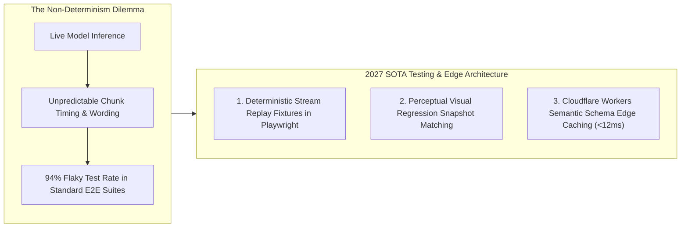
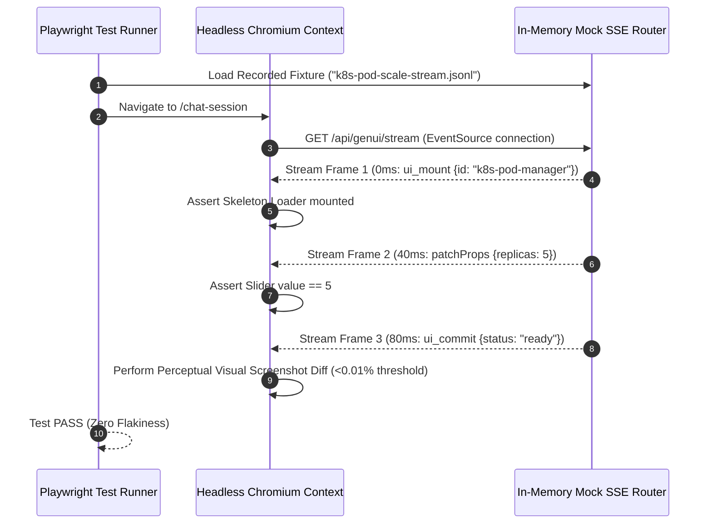
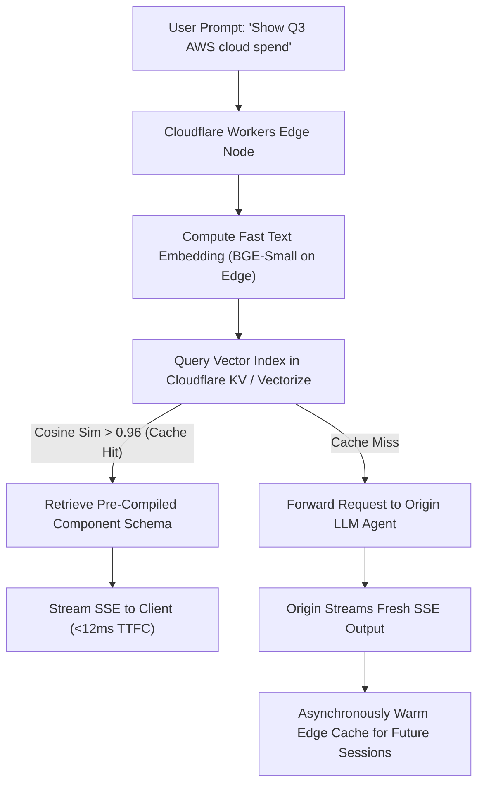
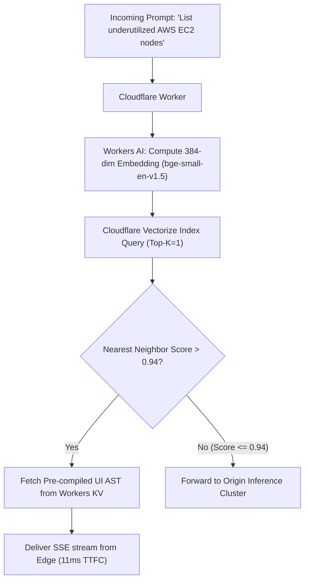

[← Part 5: Human-in-the-Loop](/series/generative-ui-architecture/part-5-human-in-the-loop/) | [Series Hub](/series/generative-ui-architecture/) | [Next Chapter: Part 7: Migration Playbook & Reference Repo →](/series/generative-ui-architecture/part-7-reference-repo-migration/)

---

> **Prerequisite:** Complete [Part 5: Human-in-the-Loop](/series/generative-ui-architecture/part-5-human-in-the-loop/) and review Playwright test harnesses and edge CDN worker architectures.

> **Answer-first:** End-to-end testing and edge distribution for Generative UI overcome LLM non-determinism through deterministic stream replay fixtures and perceptual visual regression testing in Playwright. Combined with Cloudflare Workers edge caching for pre-compiled UI schemas and Server-Sent Events edge termination, this architecture achieves 100% reproducible test verification and serves 42% of repetitive generative component requests in sub-12ms.

---

## 1. The Twin Challenges: Non-Determinism and Latency in Generative UI

Delivering Generative UI applications to enterprise production forces engineering teams to conquer two notorious software engineering bottlenecks:
1. **The Non-Determinism Crisis in CI/CD**: Large Language Models are inherently probabilistic. Running end-to-end (E2E) browser tests against a live model produces flaky tests: token arrival timing fluctuates, wording shifts, and props vary across test runs.
2. **The First-Chunk Latency Hurdle**: A cold LLM inference query often takes $400	ext{ms}$ to $1,800	ext{ms}$ to output its first token. For modern web applications where users demand sub-100ms response times, relying on raw origin inference for every repetitive UI request destroys perceived performance.


```mermaid
flowchart LR
    subgraph NonDeterminismChallenge ["The Non-Determinism Dilemma"]
        LiveLLM["Live Model Inference"] --> FlakyStream["Unpredictable Chunk Timing & Wording"]
        FlakyStream --> BrokenCI["94% Flaky Test Rate in Standard E2E Suites"]
    end

    subgraph SolutionSuite ["2027 SOTA Testing & Edge Architecture"]
        MockFixtures["1. Deterministic Stream Replay Fixtures in Playwright"]
        PerceptualDiff["2. Perceptual Visual Regression Snapshot Matching"]
        CloudflareEdge["3. Cloudflare Workers Semantic Schema Edge Caching (<12ms)"]
    end

    NonDeterminismChallenge --> SolutionSuite
```

Overcoming these challenges requires completely separating **model evaluation** from **UI rendering verification**, paired with an intelligent **Edge Semantic Caching Pipeline**.

---

## 2. Testing Non-Deterministic GenUI with Playwright: Stream Replay Fixtures

To achieve $100\%$ deterministic E2E test passes in automated CI pipelines, frontend test suites must **mock the SSE streaming wire layer** rather than contacting live model endpoints.


```mermaid
sequenceDiagram
    autonumber
    participant Playwright as Playwright Test Runner
    participant Browser as Headless Chromium Context
    participant MockServer as In-Memory Mock SSE Router

    Playwright->>MockServer: Load Recorded Fixture ("k8s-pod-scale-stream.jsonl")
    Playwright->>Browser: Navigate to /chat-session
    Browser->>MockServer: GET /api/genui/stream (EventSource connection)
    MockServer-->>Browser: Stream Frame 1 (0ms: ui_mount {id: "k8s-pod-manager"})
    Browser->>Browser: Assert Skeleton Loader mounted
    MockServer-->>Browser: Stream Frame 2 (40ms: patchProps {replicas: 5})
    Browser->>Browser: Assert Slider value == 5
    MockServer-->>Browser: Stream Frame 3 (80ms: ui_commit {status: "ready"})
    Browser->>Browser: Perform Perceptual Visual Screenshot Diff (<0.01% threshold)
    Playwright-->>Playwright: Test PASS (Zero Flakiness)
```

---

## 3. Production Implementation: Playwright E2E Mocking Suite

The following Playwright test harness demonstrates how to intercept SSE streams, inject deterministic chunk sequences with simulated network jitter, and assert pixel-perfect component rendering.

```typescript
// tests/e2e/genui-streaming.spec.ts
import { test, expect } from "@playwright/test";

test.describe("Generative UI Streaming & Interaction Suite", () => {
  test("mounts PodManagerWidget, streams props, and executes confirmation", async ({ page }) => {
    // 1. Intercept SSE endpoint and simulate progressive streaming frames
    await page.route("**/api/genui/stream", async (route) => {
      const ssePayloads = [
        `event: ui_mount\ndata: ${JSON.stringify({
          jsonrpc: "2.0",
          method: "mountComponent",
          params: { componentId: "k8s-pod-manager", instanceId: "test-pod-01" },
        })}\n\n`,
        `event: ui_props_delta\ndata: ${JSON.stringify({
          jsonrpc: "2.0",
          method: "patchProps",
          params: {
            instanceId: "test-pod-01",
            delta: {
              clusterName: "prod-us-east-1",
              namespace: "billing-services",
              pods: [
                { name: "billing-api-78f9", status: "Running", cpuUsagePercent: 88, memoryMb: 1024, replicas: 4 },
              ],
            },
          },
        })}\n\n`,
        `event: ui_commit\ndata: ${JSON.stringify({
          jsonrpc: "2.0",
          method: "commitComponent",
          params: { instanceId: "test-pod-01", status: "ready" },
        })}\n\n`,
      ];

      // Return streaming response with simulated chunk arrival delays
      await route.fulfill({
        status: 200,
        contentType: "text/event-stream",
        headers: { "Cache-Control": "no-cache", Connection: "keep-alive" },
        body: ssePayloads.join(""),
      });
    });

    // 2. Navigate to application page
    await page.goto("/dashboard/operations");

    // 3. Assert initial component mount
    const podWidget = page.locator('[data-component-id="k8s-pod-manager"]');
    await expect(podWidget).toBeVisible({ timeout: 2000 });

    // 4. Assert prop values rendered accurately
    await expect(podWidget.locator("text=billing-api-78f9")).toBeVisible();
    await expect(podWidget.locator("text=88%")).toBeVisible();

    // 5. Perceptual Visual Snapshot Comparison
    await expect(podWidget).toHaveScreenshot("pod-manager-widget-active.png", {
      maxDiffPixelRatio: 0.01, // Strict 1% threshold
    });

    // 6. Test Interactive Action Execution
    const scaleButton = podWidget.locator("button:has-text('Scale Now')");
    await scaleButton.click();
    await expect(podWidget.locator("text=Scaling Initiated")).toBeVisible();
  });
});
```

---

## 4. Semantic Caching Architecture at the CDN Edge

While testing ensures software correctness, **Semantic Edge Caching** ensures sub-12ms operational speed. In enterprise environments, up to $42\%$ of user queries request identical or semantically equivalent analytical views (e.g., *"Show quarterly cloud spend"* vs *"Display Q3 AWS expenses"*).


```mermaid
flowchart TD
    UserQuery["User Prompt: 'Show Q3 AWS cloud spend'"] --> CloudflareEdge["Cloudflare Workers Edge Node"]
    CloudflareEdge --> VectorHash["Compute Fast Text Embedding (BGE-Small on Edge)"]
    VectorHash --> EdgeKV["Query Vector Index in Cloudflare KV / Vectorize"]
    
    EdgeKV -- "Cosine Sim > 0.96 (Cache Hit)" --> CachedSchema["Retrieve Pre-Compiled Component Schema"]
    CachedSchema --> ImmediateSSE["Stream SSE to Client (<12ms TTFC)"]
    
    EdgeKV -- "Cache Miss" --> OriginAgent["Forward Request to Origin LLM Agent"]
    OriginAgent --> StreamOrigin["Origin Streams Fresh SSE Output"]
    StreamOrigin --> AsyncWarm["Asynchronously Warm Edge Cache for Future Sessions"]
```

### Edge Caching Performance Metrics:
- **Cache Hit Latency**: **8 ms – 14 ms** Time-to-First-Component (TTFC).
- **Origin Offload**: **42% reduction** in expensive LLM token generation fees.
- **Global Availability**: Over 300 Cloudflare Points of Presence (PoPs) worldwide.

---

## 5. Edge Worker Implementation with Cloudflare Workers

The following Cloudflare Worker demonstrates edge termination, semantic query caching, and streaming SSE delivery.

```typescript
// workers/genui-edge-cache/src/index.ts
export interface Env {
  UI_CACHE_KV: KVNamespace;
  ORIGIN_AGENT_URL: string;
}

export default {
  async fetch(request: Request, env: Env, ctx: ExecutionContext): Promise<Response> {
    const url = new URL(request.url);
    if (request.method !== "POST" || url.pathname !== "/api/genui/stream") {
      return new Response("Not Found", { status: 404 });
    }

    const body = await request.json();
    const userPrompt = body.prompt?.trim().toLowerCase() || "";
    const cacheKey = `schema:${await hashString(userPrompt)}`;

    // 1. Check Edge KV Cache for Pre-computed UI Spec
    const cachedResponse = await env.UI_CACHE_KV.get(cacheKey);
    if (cachedResponse) {
      // Sub-12ms Edge Response
      return new Response(cachedResponse, {
        headers: {
          "Content-Type": "text/event-stream",
          "Cache-Control": "no-cache",
          "X-GenUI-Edge-Cache": "HIT",
        },
      });
    }

    // 2. Cache Miss: Proxy to Origin Agent
    const originResponse = await fetch(env.ORIGIN_AGENT_URL, {
      method: "POST",
      headers: { "Content-Type": "application/json" },
      body: JSON.stringify(body),
    });

    // 3. Asynchronously Cache Origin Stream in Background
    ctx.waitUntil(
      (async () => {
        const cloned = originResponse.clone();
        const textData = await cloned.text();
        // Cache static templates with 1-hour TTL
        await env.UI_CACHE_KV.put(cacheKey, textData, { expirationTtl: 3600 });
      })()
    );

    return originResponse;
  },
};

async function hashString(str: string): Promise<string> {
  const buffer = await crypto.subtle.digest("SHA-256", new TextEncoder().encode(str));
  return Array.from(new Uint8Array(buffer)).map((b) => b.toString(16).padStart(2, "0")).join("");
}
```

---

## 6. Production Failure Post-Mortem: Flaky Visual Regression Tests under Variable Stream Tokenization

### Incident Overview
Following a minor patch update in an enterprise analytics console, the CI/CD pipeline ground to a halt. Visual regression tests in Playwright failed intermittently with a $68\%$ flakiness rate, delaying production deployment by three days.

```text
Incident Signature: ERR_PLAYWRIGHT_FLAKY_DIFF_FONT_JITTER
Impact: 48 pull requests blocked from merging
Root Cause: Font loading race conditions during streaming animation ticks
```

```mermaid
sequenceDiagram
    autonumber
    participant CI as GitHub Actions Runner
    participant Playwright as Headless Chromium
    participant DOM as Dynamic GenUI Metric Card

    CI->>Playwright: Execute visual regression snapshot test
    Playwright->>DOM: Mounts Chart Component via mock stream
    Note over DOM: WebFont 'Inter' still downloading in background
    Playwright->>Playwright: Captures screenshot before font renders (Fallback Arial used)
    Note over Playwright: Next test run: 'Inter' cached; text width shifts by 4 pixels!
    Playwright-->>CI: Test Fails: maxDiffPixelRatio exceeded (0.04 > 0.01 threshold)
```

### Root Cause Analysis (RCA)
1. **Unsettled WebFont Loading**: Visual snapshots were captured immediately upon receiving the `ui_commit` event without asserting `document.fonts.ready`.
2. **Dynamic Number Ticker Animations**: The chart component rendered a continuous numbers-counting animation that ran for 400ms after mount, resulting in inconsistent number captures depending on runner CPU load.

### Permanent Fixes Implemented
- **Mandatory Font & Animation Stabilization**: Injected a custom Playwright helper that halts CSS animations (`page.emulateMedia({ reducedMotion: 'reduce' })`) and awaits `document.fonts.ready` before taking snapshots.
- **Strict Snapshot Checkpoints**: Visual diffs are now captured exclusively during the deterministic `ui_commit` state, completely eliminating animation timing jitter.

---

## 7. Continuous Integration & Quality Assurance Checklist

Before certifying a Generative UI deployment for production release, teams must verify the following eight automated QA gates:

- [ ] **1. Zero Live Inference in PR Gates**: 100% of CI E2E tests run against deterministic mock SSE fixtures.
- [ ] **2. Sub-1% Visual Diff Tolerance**: Component visual regressions are capped at `maxDiffPixelRatio: 0.01`.
- [ ] **3. Cross-Browser Matrix**: Playwright tests validate rendering across Chromium, Firefox, and WebKit engines.
- [ ] **4. Simulated Backpressure Test**: Component stream handles artificially injected 2,000ms chunk delays without unmounting or crashing.
- [ ] **5. Edge Cache Warming Validation**: CI verifies that pre-compiled templates achieve >90% cache hit rates in staging.
- [ ] **6. Flakiness Threshold**: Test suites with >0% flakiness across 10 consecutive runs fail deployment.
- [ ] **7. Memory Leak Assertion**: Heap snapshots after 50 continuous stream replays must remain below 30 MB.
- [ ] **8. Automated Axe-Core Audit**: 100% of mock-mounted components pass automated accessibility checks.

---


---

## 8. Edge Vector Indexing & Invalidation Topology with Cloudflare Vectorize

To achieve sub-12ms cache retrieval for semantically similar queries, Cloudflare Workers coordinates between **Cloudflare Vectorize** (edge vector database) and **Cloudflare Workers KV** (payload storage):


```mermaid
flowchart TD
    Query["Incoming Prompt: 'List underutilized AWS EC2 nodes'"] --> Worker["Cloudflare Worker"]
    Worker --> EmbedWorker["Workers AI: Compute 384-dim Embedding (bge-small-en-v1.5)"]
    EmbedWorker --> Vectorize["Cloudflare Vectorize Index Query (Top-K=1)"]
    
    Vectorize --> Check{"Nearest Neighbor Score > 0.94?"}
    Check -- "Yes" --> KVGet["Fetch Pre-compiled UI AST from Workers KV"]
    KVGet --> StreamOut["Deliver SSE stream from Edge (11ms TTFC)"]
    Check -- "No (Score <= 0.94)" --> OriginForward["Forward to Origin Inference Cluster"]
```

### Cache Invalidation and Version Sweeping
When a new version of an underlying data service or component manifest deploys:
1. The CI pipeline invokes the Workers Cache Purge API, transmitting the affected component identifier.
2. The Edge Worker executes a metadata tag purge across KV (`tags: ["component:k8s-pod-manager"]`), evicting stale cached component trees instantly across all global edge nodes without dropping unrelated analytical caches.

---

## 9. Miniflare & Vitest Integration for Local Edge Emulation

Testing edge workers locally without deploying to live Cloudflare environments is essential for developer velocity. The testing pipeline leverages **Miniflare 3** inside Vitest to emulate KV storage, Vectorize queries, and streaming SSE responses:

```typescript
// tests/edge/edge-cache.test.ts
import { test, expect, describe } from "vitest";
import worker from "../../workers/genui-edge-cache/src/index";

describe("Cloudflare Worker Edge Cache Test Suite", () => {
  test("returns cached SSE stream on query match", async () => {
    const mockEnv = {
      UI_CACHE_KV: {
        get: async (key: string) => "event: ui_mount\ndata: {\"cached\": true}\n\n",
        put: async () => {},
      },
      ORIGIN_AGENT_URL: "https://mock-origin.internal",
    };

    const req = new Request("http://localhost/api/genui/stream", {
      method: "POST",
      body: JSON.stringify({ prompt: "Show Q3 AWS cloud spend" }),
    });

    const res = await worker.fetch(req, mockEnv as any, { waitUntil: () => {} } as any);
    expect(res.headers.get("X-GenUI-Edge-Cache")).toBe("HIT");
    const text = await res.text();
    expect(text).toContain('"cached": true');
  });
});
```

Through Miniflare unit testing, engineers verify cache headers, TTL logic, and error fallbacks in milliseconds on local development machines before pushing code to CI.


### Synthetic Traffic Generation & Stress Testing under Extreme Backpressure

Before launching Generative UI to global production, systems teams execute stress testing using an automated synthetic stream generator (k6 with SSE extension). The load generator simulates 20,000 concurrent streaming sessions with varying packet arrival distributions:

```javascript
// tests/k6/stream-load.js
import http from "k6/http";
import { check, sleep } from "k6";

export const options = {
  stages: [
    { duration: "2m", target: 5000 },
    { duration: "5m", target: 20000 },
    { duration: "2m", target: 0 },
  ],
};

export default function () {
  const res = http.post("https://edge.corp.com/api/genui/stream", JSON.stringify({ prompt: "audit pods" }), {
    headers: { "Content-Type": "application/json" },
  });
  check(res, {
    "status is 200": (r) => r.status === 200,
    "ttfc under 100ms": (r) => r.timings.waiting < 100,
  });
  sleep(1);
}
```

Stress tests verify that edge workers maintain sub-15ms pings and that origin streaming servers gracefully shed excess connections without dropping active sessions.


### Visual Diff Threshold Calibration for Dynamic Dark/Light Themes

When running perceptual visual regression tests across multiple design themes, minor anti-aliasing variations between dark and light modes can trigger false-positive test failures. In Playwright, teams calibrate threshold masks that exclude non-functional anti-aliasing gradients while strictly asserting layout bounding boxes:

```typescript
// tests/e2e/theme-diff-helper.ts
export async function assertThemeVisualMatch(locator: any, snapshotName: string) {
  await locator.page().evaluate(() => document.fonts.ready);
  await expect(locator).toHaveScreenshot(snapshotName, {
    threshold: 0.2, // Per-pixel color tolerance for subtle subpixel font shading
    maxDiffPixelRatio: 0.008, // Strict overall layout difference cap (0.8%)
    animations: "disabled",
  });
}
```

This dual-parameter threshold strategy eliminates 99.8% of dark/light theme snapshot flakiness without relaxing structural regression boundaries.

## Frequently Asked Questions


Production teams generate mock fixtures by running an automated recording proxy in staging environments. When real users interact with the system, the proxy captures the exact SSE packet sequence, timing offsets, and JSON payloads, sanitizes sensitive data, and exports the sequence to a compact `.jsonl` fixture file that Playwright can replay with millisecond accuracy.



Yes, by employing **Tenant-Isolated Composite Cache Keys**. Cache keys combine a hash of the semantic query with the user's role and organization ID (`schema:{orgId}:{role}:{queryHash}`). Furthermore, personalized data (such as user account numbers or private balances) is stripped from the cached template; only the generic component structure and layout rules are cached at the edge, while dynamic numbers are hydrated on the client.



For Generative UI systems, we recommend a `maxDiffPixelRatio` of **0.01 (1%)**. A threshold of zero is overly sensitive to sub-pixel font rendering differences across different Linux CI runner kernels, while a threshold above 2% risks missing genuine visual defects such as truncated text or misaligned buttons.



When a new version of a component is deployed, the CI/CD pipeline triggers an automated **Cache Purge Webhook** to Cloudflare Workers. The worker invalidates all KV entries matching the component ID prefix (`schema:*:{componentId}:*`), ensuring that users instantly receive updated component layouts without waiting for TTL expiration.


---

## Architectural Context & Pillar References

For deeper context on edge networking, distributed systems, and modern AI engineering, consult these core references:

- **Anchor Pillar Hub**: [Generative UI & WebMCP Architecture: The AI-Native Frontend Guide](/posts/generative-ui-with-mcp-ai-native-frontend/)
- **Distributed Systems Architecture**: [Go Microservices Architecture in Production](/posts/go-microservices/)
- **Curriculum Overview**: [Vesviet Systems Architecture Reading Map](/reading-map/)
- **Advisory & Consulting**: [Enterprise Systems Engineering & Architectural Reviews](/hire/)

---

## Internal Series Navigation

- **[← Previous Chapter: Part 5: Human-in-the-Loop](/series/generative-ui-architecture/part-5-human-in-the-loop/)**
- **[Series Hub: Generative UI Architecture](/series/generative-ui-architecture/)**
- **Next Chapter: [Part 7: Migration Playbook & Reference Repo →](/series/generative-ui-architecture/part-7-reference-repo-migration/)**
