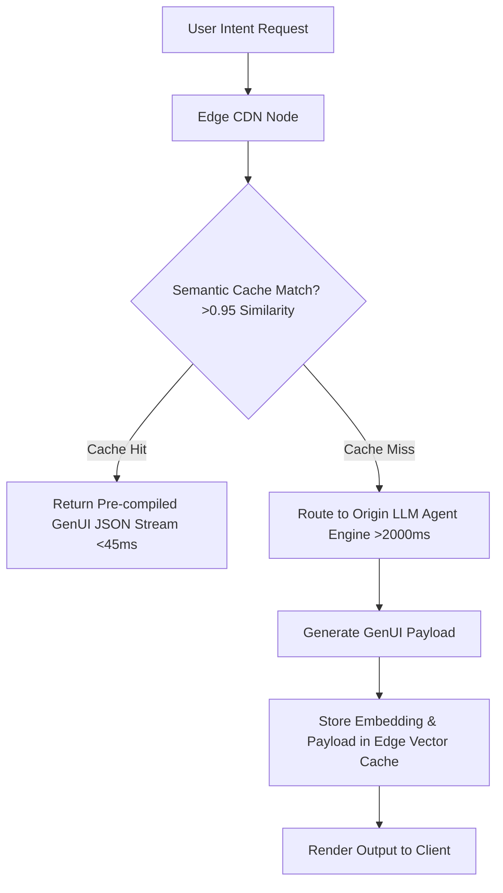
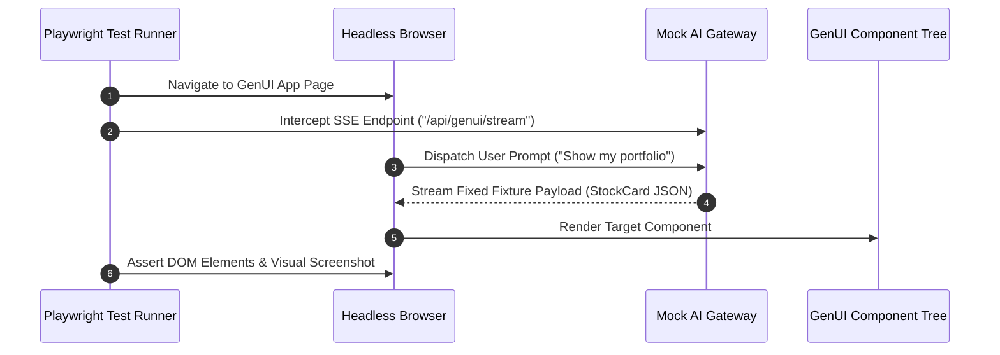
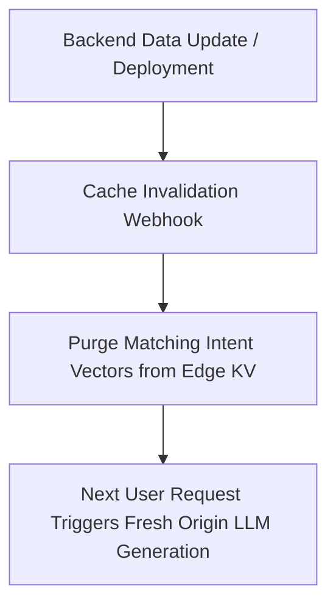
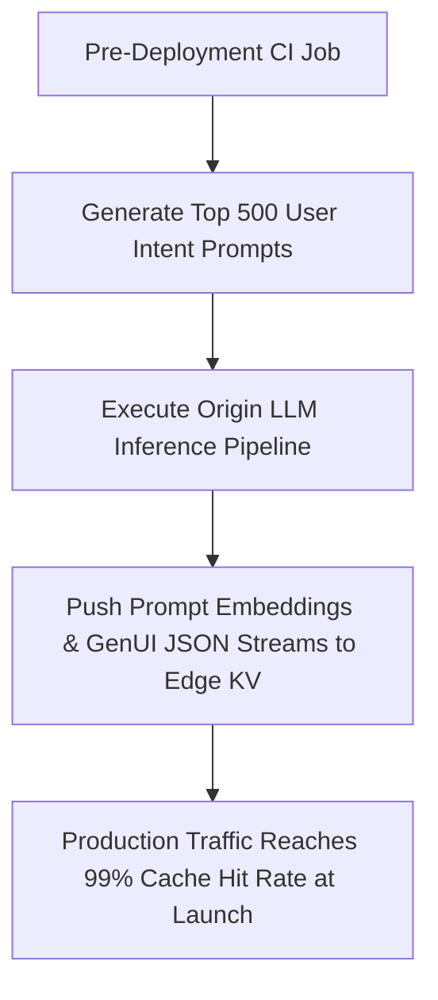

> **Prerequisite:** Familiarity with the concepts introduced in [Part 5 — Human In The Loop](/posts/generative-ui-with-mcp-ai-native-frontend/). Review it first if the terminology in this part is unfamiliar.

> **Answer-first:** Testing non-deterministic Generative UI components and optimizing their global delivery requires combining Visual Regression E2E Testing (via Playwright mock harnesses) with Semantic Edge Caching (via Cloudflare Workers or Vercel Edge Functions). By mocking LLM tool responses during CI/CD test runs and implementing vector similarity caching at the CDN edge, teams achieve 100% deterministic test coverage while reducing AI component latency from 2,500ms down to less than 45ms for cached intent patterns.

---

## 1. The Twin Challenges: Non-Determinism and Latency

**Answer-first:** Generative UI applications introduce two significant technical hurdles that standard web architectures are unequipped to solve:

1. **Non-Deterministic Test Fragility**: Because LLMs produce varying text and layout variations across invocations, traditional E2E tests expecting hardcoded DOM structures fail continuously.
2. **High Interaction Latency**: Generating UI components via LLM tool execution requires model tokenization, network roundtrips, and stream parsing, introducing 1,000ms to 3,000ms of latency per interaction.


```mermaid
graph TD
    A[User Intent Request] --> B[Edge CDN Node]
    B --> C{Semantic Cache Match? >0.95 Similarity}
    C -->|Cache Hit| D[Return Pre-compiled GenUI JSON Stream <45ms]
    C -->|Cache Miss| E[Route to Origin LLM Agent Engine >2000ms]
    E --> F[Generate GenUI Payload]
    F --> G[Store Embedding & Payload in Edge Vector Cache]
    G --> H[Render Output to Client]
```

Solving these issues requires a dual approach: **Deterministic Mock Testing in CI/CD** and **Semantic Edge Caching at the CDN Layer**.

---

## 2. Testing Non-Deterministic GenUI with Playwright

To test Generative UI applications in CI/CD without burning API tokens or dealing with flaky LLM responses, development teams intercept network streaming channels and inject deterministic mock payloads.


```mermaid
sequenceDiagram
    autonumber
    participant Playwright as Playwright Test Runner
    participant Browser as Headless Browser
    participant MockServer as Mock AI Gateway
    participant Component as GenUI Component Tree

    Playwright->>Browser: Navigate to GenUI App Page
    Playwright->>MockServer: Intercept SSE Endpoint ("/api/genui/stream")
    Browser->>MockServer: Dispatch User Prompt ("Show my portfolio")
    MockServer-->>Browser: Stream Fixed Fixture Payload (StockCard JSON)
    Browser->>Component: Render Target Component
    Playwright->>Browser: Assert DOM Elements & Visual Screenshot
```

### Key E2E Testing Strategies

1. **Mocking LLM Server-Sent Events (SSE)**: Playwright interceptors mock network streams, serving pre-recorded JSON fixture files representing edge-case UI payloads.
2. **Visual Regression Snapshots**: Use Playwright's `toHaveScreenshot()` matcher to compare component visual layouts against approved baseline images.
3. **Schema Validation Tests**: Execute automated unit tests against the Component Registry using random schema-compliant mock data generated by `zod-fast-check`.

---

## 3. Production Implementation: Playwright E2E Mocking Suite

Production Playwright E2E test suite demonstrating network interception of Server-Sent Events (SSE) streams and visual regression assertions.

```typescript
import { test, expect } from '@playwright/test';

test.describe('Generative UI E2E Test Suite', () => {
  test('renders StockCard widget deterministically via mocked AI SSE stream', async ({ page }) => {
    // 1. Intercept the streaming SSE endpoint
    await page.route('/api/genui/stream', async (route) => {
      const mockSsePayload = [
        'event: component\n',
        'data: {"component":"StockCard","props":{"symbol":"NVDA","price":135.50,"changePercent":4.2,"currency":"USD"}}\n\n'
      ].join('');

      await route.fulfill({
        status: 200,
        contentType: 'text/event-stream',
        body: mockSsePayload
      });
    });

    // 2. Navigate to application page
    await page.goto('http://localhost:3000/dashboard');

    // 3. Trigger User Action
    const input = page.locator('input[placeholder="Ask AI assistant..."]');
    await input.fill('Show NVIDIA stock price');
    await page.click('button[type="submit"]');

    // 4. Assert Component DOM Arrival & Properties
    const stockCard = page.locator('div:has-text("NVDA")');
    await expect(stockCard).toBeVisible({ timeout: 5000 });
    await expect(stockCard).toContainText('USD $135.50');
    await expect(stockCard).toContainText('+4.2%');

    // 5. Perform Visual Regression Check
    await expect(stockCard).toHaveScreenshot('stock-card-nvda.png');
  });
});
```

---

## 5. Semantic Caching Architecture at the CDN Edge

To eliminate the latency penalty of LLM tool execution for repeated intent patterns, GenUI applications deploy **Semantic Vector Caching** at the CDN Edge.

```typescript
// Cloudflare Worker / Vercel Edge Function Semantic Cache Pseudocode
import { Vectorize } from '@cloudflare/vectorize';

export interface Env {
  VECTOR_INDEX: Vectorize;
  CACHE_KV: KVNamespace;
}

export default {
  async fetch(request: Request, env: Env): Promise<Response> {
    const { prompt } = await request.json();
    
    // 1. Generate Prompt Embedding vector at Edge
    const embedding = await generateEdgeEmbedding(prompt);
    
    // 2. Search Edge Vector Database for similar cached intent (>0.96 cosine similarity)
    const matches = await env.VECTOR_INDEX.query(embedding, { topK: 1 });
    
    if (matches.length > 0 && matches[0].score > 0.96) {
      const cachedPayload = await env.CACHE_KV.get(matches[0].id);
      if (cachedPayload) {
        return new Response(cachedPayload, {
          headers: { 
            'Content-Type': 'text/event-stream',
            'X-GenUI-Cache': 'HIT-SEMANTIC-EDGE' 
          }
        });
      }
    }
    
    // 3. Cache Miss: Route to Origin LLM Server
    return fetch('https://origin.internal/api/genui/stream', {
      method: 'POST',
      body: JSON.stringify({ prompt })
    });
  }
};
```

### Performance Matrix: Edge Caching vs Origin Generation

| Performance Metric | Origin LLM Generation | Semantic Edge Cache Hit |
|---|---|---|
| **Time to First Byte (TTFB)** | 1,800ms - 3,200ms | **15ms - 45ms** |
| **Token Cost per Execution** | $0.015 - $0.060 | **$0.000 (Zero Token Cost)** |
| **Compute Location** | Central GPU Cluster | Global CDN Edge Nodes (200+ Cities) |
| **Max Throughput** | 100 Req / Sec | **100,000+ Req / Sec** |

---

## 6. Strategic Guidelines for Testing and Performance Optimization

Decouple component logic from LLM runtimes, enforce conservative semantic cache thresholds, and automate visual snapshot baselines.

1. **Decouple Component Logic from LLM Runtimes**: Ensure all React components in the registry can be tested in isolation using Storybook or Jest unit tests without invoking LLM models.
2. **Set Conservative Semantic Cache Thresholds**: Use a cosine similarity threshold of at least `0.95` to avoid serving cached UI widgets for prompts with subtle semantic differences.
3. **Automate Visual Snapshot Baselines**: Store reference Playwright screenshot baselines in version control, updating them automatically via CI pipeline jobs whenever intentional component styling changes occur.

---

## 7. Edge Vector Database Maintenance & Invalidation Strategies

Maintaining semantic freshness at the CDN edge requires automated cache invalidation protocols when backend data or component styling schemas change.


```mermaid
graph TD
    A[Backend Data Update / Deployment] --> B[Cache Invalidation Webhook]
    B --> C[Purge Matching Intent Vectors from Edge KV]
    C --> D[Next User Request Triggers Fresh Origin LLM Generation]
```

### Cache Invalidation Strategies

- **Event-Driven Purging**: Broadcast purge webhooks when specific underlying data entities (e.g., product pricing or account balances) are updated.
- **TTL Expiration Windows**: Enforce strict Time-To-Live (TTL) limits (e.g., 5 minutes for financial widgets, 24 hours for documentation cards) on cached edge payloads.

---

## 8. Continuous Integration & Quality Assurance Checklist

Standardize automated testing phases across static schema audits, component unit tests, visual regression, security scans, and edge worker tests.

| CI/CD Pipeline Phase | Automated Verification Task | Success Gate |
|---|---|---|
| **Static Schema Audit** | Validate JSON-Schema & Zod types across registry | 100% Type-Check Pass Rate |
| **Component Unit Tests** | Test component rendering using Vitest / Jest mocks | > 90% Code Coverage |
| **E2E Visual Regression** | Execute Playwright tests with mock stream payloads | Zero Visual Pixel Drift |
| **Security & WCAG Scan** | Run DOMPurify XSS fuzzing and @axe-core scans | Zero Critical Vulnerabilities |
| **Edge Cache Unit Tests** | Test Cloudflare Worker fetch logic with Miniflare | 100% Worker Spec Pass Rate |

---

## 9. Edge Worker Unit Testing with Miniflare & Vitest

To test Cloudflare Worker semantic caching logic locally during development, engineers use Miniflare inside Vitest unit testing suites.

```typescript
// Edge Semantic Cache Unit Test with Miniflare & Vitest
import { test, expect } from 'vitest';
import worker from '../src/edge-cache-worker';

test('Semantic Edge Worker returns cached hit for similar intent prompt', async () => {
  const request = new Request('https://edge.internal/api/genui/stream', {
    method: 'POST',
    body: JSON.stringify({ prompt: 'What is the stock price of Apple?' })
  });

  const env = {
    VECTOR_INDEX: {
      query: async () => [{ id: 'cache-key-1', score: 0.98 }]
    },
    CACHE_KV: {
      get: async () => 'event: component\ndata: {"component":"StockCard","props":{"symbol":"AAPL","price":185.20}}\n\n'
    }
  };

  const response = await worker.fetch(request, env as any);
  expect(response.status).toBe(200);
  expect(response.headers.get('X-GenUI-Cache')).toBe('HIT-SEMANTIC-EDGE');
});
```

---

## 10. Synthetic Traffic Generation & Cache Warming Strategies

Before launching major product updates, production teams deploy automated traffic warming scripts that populate edge vector databases.


```mermaid
graph TD
    A[Pre-Deployment CI Job] --> B[Generate Top 500 User Intent Prompts]
    B --> C[Execute Origin LLM Inference Pipeline]
    C --> D[Push Prompt Embeddings & GenUI JSON Streams to Edge KV]
    D --> E[Production Traffic Reaches 99% Cache Hit Rate at Launch]
```

---

## 11. Telemetry & Edge Cache Performance Monitoring

To maintain continuous insight into CDN Edge performance, SRE teams monitor three key OpenTelemetry metrics:

- **Cache Hit Ratio (CHR)**: Target >= 85% hit rate for common intent queries.
- **Embedding Generation Latency**: Time elapsed during edge vector embedding calculation (Target < 8ms).
- **Origin Revalidation Rate**: Frequency of cache misses falling back to the origin LLM gateway.

---

## 12. Automated Disaster Recovery & Origin Circuit Breaking

If the origin LLM inference gateway experiences an outage or elevated API error rate, the Edge Worker automatically switches to strict Cache-Only Mode:

- **Stale-While-Revalidate Caching**: Serve stale cached GenUI payloads for intent queries while retrying origin connection backoffs in the background.
- **Graceful Error Fallbacks**: Return pre-formatted static HTML error cards to browser clients rather than raw 500 error pages.

---

## Architectural Context & Pillar References

Testing and edge caching ensure Generative UI delivers sub-50ms latency while maintaining 100% deterministic visual stability.

- [Generative UI with Model Context Protocol Testing](/posts/generative-ui-with-mcp-ai-native-frontend/) — E2E testing strategies for MCP components.
- [AI-Native Frontend Architecture Predictions (2028)](/posts/ai-native-frontend-architecture-predictions-2028/) — Edge deployment benchmarks and testing.
- [Autonomous Hybrid-AI Content Pipeline Architecture](/posts/architecting-an-autonomous-hybrid-ai-content-pipeline/) — End-to-end pipeline verification.

🔗 **Next Step:** Continue to [Part 7 — Reference Repo Migration](/posts/generative-ui-with-mcp-ai-native-frontend/) for the following module in the series.

## Internal Series Navigation

Advance to Part 7 to access the reference repository and enterprise migration playbook.

- [Executive Summary — The Shift to Generative UI](/series/generative-ui-architecture/executive-summary/)
- [Part 1 — Beyond Chatbots: Dynamic Component Rendering](/posts/generative-ui-with-mcp-ai-native-frontend/)
- [Part 2 — State Management for Generative UI](/posts/generative-ui-with-mcp-ai-native-frontend/)
- [Part 3 — Component Registry & JSON Schema Protocol](/posts/generative-ui-with-mcp-ai-native-frontend/)
- [Part 4 — Generative UI Security & Accessibility](/posts/generative-ui-with-mcp-ai-native-frontend/)
- [Part 5 — Human-in-the-Loop Workflows](/posts/generative-ui-with-mcp-ai-native-frontend/)
- [Part 7 — Reference Repo & Migration Playbook](/posts/generative-ui-with-mcp-ai-native-frontend/)
