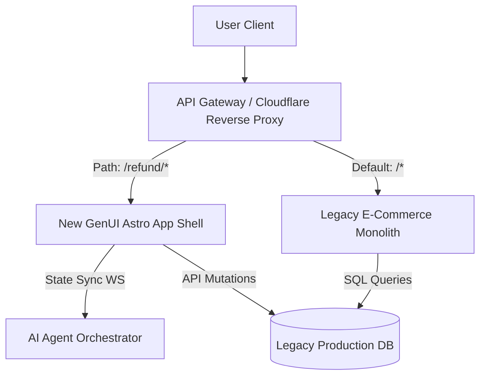

This is the conclusion of the series. The best architectural theories remain merely on paper if we lack a clear execution path.

In this part, we will define a Reference Repository structure and a Migration Strategy to bring Generative UI into actively running systems.

## 7.1. Boilerplate Directory Structure (Astro + Svelte)

To maximize the power of the Framework-Agnostic architecture, we choose Astro as the Orchestrator. Svelte is chosen as the UI framework because it compiles to extremely lightweight Vanilla JS, without the Virtual DOM overhead like React—perfect for highly dynamic UI Components.

Here is the recommended directory structure:

```text
my-genui-app/
├── src/
│   ├── components/
│   │   ├── static/           # Normal static components (Header, Footer)
│   │   ├── registry/         # 🟢 ALL COMPONENTS CALLABLE BY AI LIVE HERE
│   │   │   ├── flight/FlightWidget.svelte
│   │   │   ├── ecom/OrderCancelForm.svelte
│   │   │   └── _registry.ts  # Map file converting strings to Components
│   │   └── DynamicRenderer.svelte # The core component rendering based on JSON
│   ├── lib/
│   │   ├── agent-client.ts   # Manages WebSocket connections & State Recovery
│   │   ├── schema-validators.ts # Zod schemas protecting Component Props
│   │   └── telemetry.ts      # 📊 Logs/Metrics collection for GenUI
│   ├── pages/
│   │   └── index.astro       # Where the entire app is assembled
│   └── stores/
│       └── aiState.ts        # Global State management (e.g., using Nano Stores)
```

**The Importance of Telemetry:** In a GenUI system, the `telemetry.ts` file plays a vital role. You need to fire events to the Analytics Server to answer questions like: *How many users clicked Reject on an AI-generated Form? What is the rate of the system being forced to Fallback to static UI due to WebSocket drops?* This gives Product Managers the data needed to improve UX.

**The Golden Rule:** Any developer wanting to add a new AI feature simply takes 2 steps:
1. Create a `.svelte` Component inside the `registry/` folder.
2. Define a Zod Schema in `schema-validators.ts`.
Absolutely do not touch the core logic of the WebSocket system.

## 7.2. A2UI Contract Schema (Backend ↔ Frontend Communication Standard)

This is a critical agreement that must be finalized between the Backend Lead and the Frontend Lead **before any developer starts coding**. Without this document, the Backend and Frontend will interpret JSON differently, spawning Non-reproducible bugs.

```typescript
// Standard structure of an A2UI Message (Agent-to-User Interface)
type A2UIMessage = {
  tool: string;         // (Required) Component name in Registry. Ex: "RenderOrderCancel"
  args: Record<string, unknown>; // (Required) JSON Payload matching Zod Schema
  session_id: string;   // (Required) So Frontend knows which session to assign State to
  action_type: "render" | "dismiss" | "update"; // (Required) Distinguishes:
                        //   "render" = Spawn new Component on screen
                        //   "update" = Update Props of an existing Component
                        //   "dismiss" = Remove Component from screen
  trace_id?: string;    // (Optional) For debugging and Telemetry integration
};
```

> **Crucial Note:** `session_id` is generated at the **API Gateway** layer (e.g., Cloudflare Worker) when the user first connects. It is passed down to the Frontend via the WebSocket handshake, and Backend Agents use it to namespace all messages. This resolves Race Conditions when multiple Agents run in parallel.

## 7.3. Architecture Decision Records (ADR)

The reasons why we chose these technologies must be documented and protected to prevent new developers from arbitrarily changing the stack, causing Hydration mismatches or bloated bundle sizes.

| Technology | Selection | Rejected Alternatives | Primary Reason |
|---|---|---|---|
| **Frontend Orchestrator** | Astro | Next.js, Remix | No Vendor lock-in to React. Supports Island Architecture: mix Svelte, Vue, React on the same page. Outputs static HTML for non-AI pages. |
| **UI Components** | Svelte | React, Vue | Compiles to Vanilla JS, no Virtual DOM runtime overhead. A Svelte Component bundle is 40% smaller than a React equivalent. Ideal for GenUI which needs to dynamically render many small Components simultaneously. |
| **State Management** | Nano Stores | Zustand, Pinia, Redux | Framework-independent. Works inside both `.astro` and `.svelte` files. Extremely simple API, avoiding Store bloat when tracking multiple Agent States. |
| **Edge Caching** | Cloudflare Workers + Vectorize | Redis, Pinecone | Cheap, sits closest to the user (POP). Integrates natively with Cloudflare Pages currently used for the ICM project. |

## 7.4. Migration Strategy: Strangler Fig Pattern

There is a massive trap that many CTOs/Tech Leads fall into: Deciding to tear down the legacy app and "rewrite from scratch" with AI. The failure rate of Rewrite projects often exceeds 70%.

Instead, use the **Strangler Fig Pattern** — a strategy that slowly strangles the old application with the new one.



### Implementing Strangler Fig API Gateway Routing (Nginx)

To execute Phase 3 and Phase 5 of the rollout plan, Nginx or Cloudflare Workers act as reverse proxies, splitting client traffic based on route patterns and progressive canary weights.

Below is an Nginx configuration snippet demonstrating how to route all general traffic to the legacy monolithic system, while directing 10% of the `/refund` traffic to the new GenUI Astro instance to support a safe canary rollout.

```nginx
# Upstream configuration for Canary distribution
upstream genui_canary {
    server genui-server.internal:3000 weight=10; # GenUI Svelte / Astro App
    server legacy-monolith.internal:8080 weight=90; # Old Monolith App
}

server {
    listen 80;
    server_name shopee.vesviet.com;

    # Default route - handles standard catalog, cart, checkouts
    location / {
        proxy_pass http://legacy-monolith.internal:8080;
        proxy_set_header Host $host;
        proxy_set_header X-Real-IP $remote_addr;
    }

    # Strangled path - return & refunds running GenUI
    location /refund/ {
        # Route through the weight-distributed canary upstream
        proxy_pass http://genui_canary;
        proxy_set_header Host $host;
        proxy_set_header X-Real-IP $remote_addr;
        proxy_next_upstream error timeout invalid_header http_500 http_502 http_503;
    }

    # WebSocket connection upgrade for GenUI real-time agents
    location /ws/agent-state {
        proxy_pass http://agent-orchestrator.internal:8080;
        proxy_http_version 1.1;
        proxy_set_header Upgrade $http_upgrade;
        proxy_set_header Connection "upgrade";
        proxy_set_header Host $host;
        proxy_set_header X-Real-IP $remote_addr;
        proxy_read_timeout 86400; # Keep WS alive
    }
}
```

### Phased Rollout

Suppose you have an old E-commerce system (like Shopee) or an internal ERP.
1. **Phase 1: Coexist:** You spin up an entirely independent new GenUI service (using the Astro Boilerplate above).
2. **Phase 2: API Gateway Routing:** Place an API Gateway/Proxy (like Nginx or Cloudflare) in front. All normal traffic still routes to the legacy App.
3. **Phase 3: Strangling:** Pick a small, isolated but problematic feature, e.g., the *"Return/Refund Process"*. Redirect users clicking the "Refund" button to the new Astro page. Here, users interact with the GenUI Component.
4. **Phase 4: Eliminate:** Once the "Refund" feature using GenUI is running stably, delete the old code in the Legacy App.

Repeat this process until the entire Legacy App is completely replaced by GenUI Modules.

### Sprint Rollout Table (Weekly Execution Plan)

The list below helps Team Leads instantly answer the question: "What are we doing this week?". A standard Sprint is 1-2 weeks.

| Sprint | Deliverable | Risk Level | Rollback Plan |
|---|---|---|---|
| **Sprint 1** | Setup Astro Boilerplate + empty Registry + basic CI pipeline | 🟢 Low | Delete folder, no impact to Legacy App |
| **Sprint 2** | Implement the first Component (OrderCancelForm) + Zod Schema + Unit Tests | 🟡 Medium | Feature Flag OFF, Component not registered in Registry |
| **Sprint 3** | WebSocket Client + State Recovery logic on disconnect + Skeleton UI | 🔴 High | Fallback completely to old REST API |
| **Sprint 4** | Integrate Telemetry + E2E Tests (Property-based) for OrderCancel flow | 🟡 Medium | Rollback test suite, no prod impact |
| **Sprint 5** | Canary Release: route 10% of traffic to GenUI (Nginx weight) | 🔴 High | `nginx weight=0` routes back to 0% in < 5 mins |
| **Sprint 6+** | Gradually increase: 10% → 50% → 100%. Repeat cycle for next feature | 🟡 Adjust accordingly | Monitor Telemetry Reject Rate < 5% |
---

## 7.5. Series Conclusion

We have come a long way from recognizing the weaknesses of Chatbots (**[Part 1]()**), designing an independent Framework-Agnostic architecture (**[Part 2]()**), building a secure Component Registry (**[Part 3]()** & **[Part 4]()**), optimizing UX with Human-in-the-loop (**[Part 5]()**), and finally Testing & Caching (**[Part 6]()**).

Generative UI is not just a technological hype. It is the next evolutionary form of Frontend Architecture in the AI era. By bridging an MCP Server to Astro's Component Registry, you have granted your Agentic system the ability to output visual interfaces, while maintaining absolute control over security and user experience.

Thank you for following along with this series!
