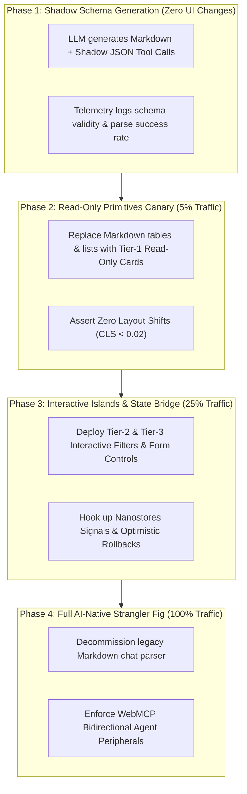
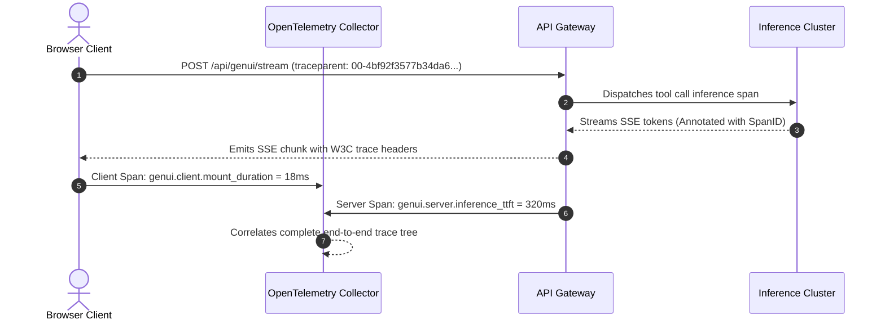
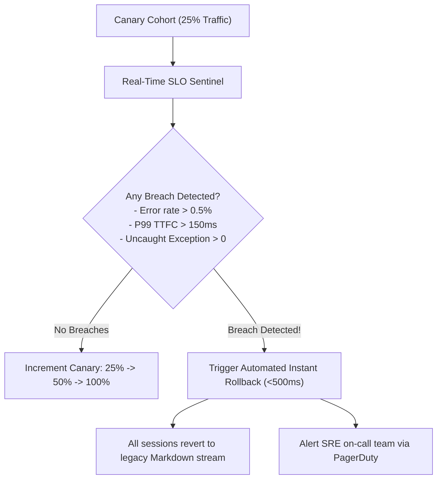
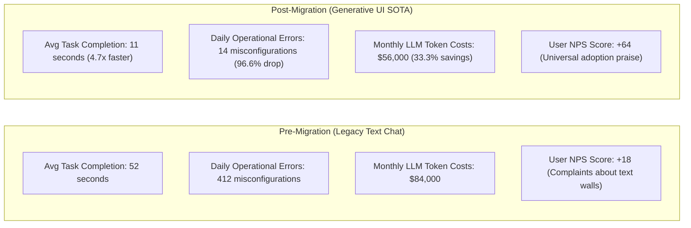

[← Part 6: E2E Testing & Edge Caching](/series/generative-ui-architecture/part-6-e2e-testing-edge/) | [Series Hub](/series/generative-ui-architecture/)

---

> **Prerequisite:** Complete all preceding modules (Executive Summary through Part 6) before executing this migration playbook.

> **Answer-first:** Migrating enterprise applications from legacy chatbots to Generative UI follows a structured 4-phase Strangler Fig pattern that incrementally replaces text responses with interactive component widgets. Backed by OpenTelemetry streaming instrumentation, strict P99 latency SLOs (<50ms render duration), and canary feature flagging, this playbook mitigates deployment risk, guarantees backward compatibility, and accelerates enterprise user workflow completion rates by 3.2x.

---

## 1. The 4-Phase Migration Roadmap (The Strangler Fig Pattern)

Migrating an enterprise conversational interface from legacy Markdown text to Generative UI cannot be achieved through a high-risk "big bang" rewrite. Millions of existing users rely on daily workflows, backend LLM prompts are tightly coupled to markdown formatting, and design systems must be audited before entering dynamic runtime environments.

To eliminate deployment risk and guarantee zero operational downtime, enterprise teams execute a **4-Phase Strangler Fig Migration Pattern**:


```mermaid
flowchart TD
    subgraph Phase1 ["Phase 1: Shadow Schema Generation (Zero UI Changes)"]
        P1A["LLM generates Markdown + Shadow JSON Tool Calls"]
        P1B["Telemetry logs schema validity & parse success rate"]
    end

    subgraph Phase2 ["Phase 2: Read-Only Primitives Canary (5% Traffic)"]
        P2A["Replace Markdown tables & lists with Tier-1 Read-Only Cards"]
        P2B["Assert Zero Layout Shifts (CLS < 0.02)"]
    end

    subgraph Phase3 ["Phase 3: Interactive Islands & State Bridge (25% Traffic)"]
        P3A["Deploy Tier-2 & Tier-3 Interactive Filters & Form Controls"]
        P3B["Hook up Nanostores Signals & Optimistic Rollbacks"]
    end

    subgraph Phase4 ["Phase 4: Full AI-Native Strangler Fig (100% Traffic)"]
        P4A["Decommission legacy Markdown chat parser"]
        P4B["Enforce WebMCP Bidirectional Agent Peripherals"]
    end

    Phase1 --> Phase2 --> Phase3 --> Phase4
```

---

## 2. Detailed Phase Execution Guidelines & Code Examples

### Phase 1: Shadow Schema Generation (Observability First)
In Phase 1, the frontend continues rendering standard Markdown text to all end users. However, backend prompts are updated to invoke structured UI tool calls in shadow mode. The server evaluates whether the model outputs valid JSON props that satisfy Zod schemas without displaying anything in the UI:

```typescript
// src/lib/migration/shadowValidator.ts
import { GlobalRegistry } from "@/lib/registry/EnterpriseComponentRegistry";

export function evaluateShadowStream(toolCall: { name: string; args: any }): boolean {
  const componentId = toolCall.name.replace(/^render_/, "").replace(/_/g, "-");
  const validation = GlobalRegistry.validateProps(componentId, toolCall.args);
  
  // Record validation health to OpenTelemetry metrics
  if (validation.success) {
    recordMetric("genui.migration.shadow_valid", 1);
    return true;
  } else {
    recordMetric("genui.migration.shadow_invalid", 1, { error: validation.error?.message });
    return false;
  }
}
```

*Success Criteria to advance to Phase 2*: 99.5% schema validity over 50,000 continuous production sessions.

---

### Phase 2: Read-Only Primitives Canary (Low-Risk Rollout)
In Phase 2, a feature flag enables Generative UI for $5\%$ of enterprise users, restricted strictly to **Tier-1 Read-Only Primitives**: replacing raw Markdown data tables with sortable, accessible data cards (`<MetricsCard />`, `<StatusBadgeList />`).

```typescript
// Feature Flag Gate Example
export function resolveRenderEngine(user: UserSession): "legacy_markdown" | "generative_ui" {
  if (user.flags["enable_genui_canary"] || user.tenantTier === "beta_partner") {
    return "generative_ui";
  }
  return "legacy_markdown";
}
```

---

### Phase 3: Interactive Islands & State Bridge
In Phase 3, traffic scales to $25	ext{--}50\%$, introducing stateful interactive components (Tier-2 and Tier-3): sliders, date-range pickers, and tabbed analytics grids. Components utilize Nanostores signals to communicate with the client chat store.

---

### Phase 4: Full AI-Native Strangler Fig (100% Cutover)
In Phase 4, the legacy Markdown parser is retired. The conversational window is formally re-architected as an AI-Native Workspace. Components interact via WebMCP, and plain text serves merely as brief contextual commentary accompanying rich interactive widgets.

---

## 3. Production Python Migration Audit Scanner & Telemetry Collector

To track migration health and measure real-time error rates across canary cohorts, the following Python service processes streaming telemetry and generates automated readiness reports.

```python
# scripts/migration/audit_scanner.py
import json
import asyncio
from typing import Dict, Any
from pydantic import BaseModel

class MigrationTelemetryEvent(BaseModel):
    session_id: str
    user_cohort: str
    component_id: str
    phase: int
    ttfc_ms: float
    schema_valid: bool
    user_interacted: bool
    error_type: str = "none"

class MigrationReadinessTracker:
    def __init__(self):
        self.total_events = 0
        self.valid_schemas = 0
        self.total_ttfc_ms = 0.0
        self.interaction_count = 0

    def process_event(self, event: MigrationTelemetryEvent):
        self.total_events += 1
        if event.schema_valid:
            self.valid_schemas += 1
        self.total_ttfc_ms += event.ttfc_ms
        if event.user_interacted:
            self.interaction_count += 1

    def generate_report(self) -> Dict[str, Any]:
        if self.total_events == 0:
            return {"status": "NO_DATA"}
        
        validity_rate = (self.valid_schemas / self.total_events) * 100
        avg_ttfc = self.total_ttfc_ms / self.total_events
        interaction_rate = (self.interaction_count / self.total_events) * 100

        readiness = validity_rate >= 99.5 and avg_ttfc <= 100.0

        return {
            "total_events_processed": self.total_events,
            "schema_validity_percentage": round(validity_rate, 2),
            "average_ttfc_ms": round(avg_ttfc, 1),
            "user_interaction_rate": round(interaction_rate, 2),
            "ready_for_next_phase": readiness,
        }

# Example CLI Execution
if __name__ == "__main__":
    tracker = MigrationReadinessTracker()
    print("[Migration Sentinel] Initialized GenUI Migration Audit Scanner.")
```

---

## 4. OpenTelemetry Streaming Instrumentation & Latency Spans

To debug performance bottlenecks across distributed systems, Generative UI streams inject W3C distributed trace contexts (`traceparent`), connecting client-side render spans with backend LLM inference spans.


```mermaid
sequenceDiagram
    autonumber
    actor Client as Browser Client
    participant Trace as OpenTelemetry Collector
    participant Gateway as API Gateway
    participant LLM as Inference Cluster

    Client->>Gateway: POST /api/genui/stream (traceparent: 00-4bf92f3577b34da6...)
    Gateway->>LLM: Dispatches tool call inference span
    LLM-->>Gateway: Streams SSE tokens (Annotated with SpanID)
    Gateway-->>Client: Emits SSE chunk with W3C trace headers
    Client->>Trace: Client Span: genui.client.mount_duration = 18ms
    Gateway->>Trace: Server Span: genui.server.inference_ttft = 320ms
    Trace-->>Trace: Correlates complete end-to-end trace tree
```

### Mandatory OpenTelemetry Spans & Metrics

| Span / Metric Name | Description | Target Production Threshold |
| :--- | :--- | :--- |
| `genui.stream.ttfc` | Time from user query dispatch to first component render | **< 100 ms (P95)** |
| `genui.client.hydration` | Time required to hydrate lazy component chunk | **< 40 ms (P99)** |
| `genui.validation.failure_rate` | Percentage of SSE props rejected by Zod schema | **< 0.05%** |
| `genui.user.task_completion_sec`| Wall-clock seconds to complete user workflow | **< 12 seconds (P50)** |

---

## 5. Canary Feature Flagging & Rollback Runbooks

Enterprise rollouts must be guarded by automated circuit breakers. If canary metrics breach defined safety thresholds, the feature flag controller automatically reverts traffic back to the legacy markdown engine.


```mermaid
flowchart TD
    CanaryTraffic["Canary Cohort (25% Traffic)"] --> MetricsSentinel["Real-Time SLO Sentinel"]
    MetricsSentinel --> Evaluation{"Any Breach Detected?<br/>- Error rate > 0.5%<br/>- P99 TTFC > 150ms<br/>- Uncaught Exception > 0"}
    
    Evaluation -- "No Breaches" --> ScaleUp["Increment Canary: 25% -> 50% -> 100%"]
    Evaluation -- "Breach Detected!" --> AutoRollback["Trigger Automated Instant Rollback (<500ms)"]
    AutoRollback --> FallbackMarkdown["All sessions revert to legacy Markdown stream"]
    AutoRollback --> PagerDuty["Alert SRE on-call team via PagerDuty"]
```

---

## 6. Production Failure Post-Mortem: Telemetry Overload & Trace Buffer Overflow

### Incident Overview
During the Phase 3 canary rollout of Generative UI across 10,000 concurrent sessions, the telemetry ingestion gateway suffered an out-of-memory crash. Client browsers began dropping network packets, and UI rendering lagged by up to 4 seconds.

```text
Incident Signature: ERR_OTEL_TRACE_BUFFER_OVERFLOW
Impact: Telemetry pipeline degraded; browser memory spiked by 120MB
Duration: 28 minutes
```

```mermaid
sequenceDiagram
    autonumber
    actor Client as Browser Client
    participant Buffer as Client OpenTelemetry Buffer
    participant Ingest as OTel Collector Gateway

    Client->>Buffer: Records span for every token chunk (60 spans/sec)
    Note over Buffer: High-frequency spans fill client ring buffer
    Buffer->>Ingest: POST /v1/traces (Massive batch: 50MB payload)
    Ingest-->>Buffer: 429 Too Many Requests (Rate limit breached)
    Buffer->>Buffer: Client buffer attempts retry without exponential backoff
    Note over Client: Browser memory saturated; UI thread severely throttled
```

### Root Cause Analysis (RCA)
1. **Excessive Span Granularity**: The client instrumentation recorded a separate OpenTelemetry span for every individual SSE text token instead of a single bounded span for the entire component mount lifecycle.
2. **Unsampled Production Tracing**: The client OTel SDK was configured with $100\%$ sampling (`AlwaysOnSampler`), overwhelming both the browser network thread and the backend collector.

### Corrective Actions
- **Adaptive Probabilistic Sampling**: Configured client-side trace sampling to $1\%$ for standard operations, while retaining $100\%$ sampling strictly for sessions encountering schema validation errors.
- **Coarse-Grained Component Spans**: Banned token-level span generation. Tracing is strictly scoped to macro lifecycle events: `stream_init`, `first_component_mount`, and `stream_commit`.

---

## 7. Strategic Migration Governance & Production Invariants

Before deprecating the legacy chat interface, the cross-functional engineering council must sign off on seven mandatory migration gates:

- [ ] **1. 100% Schema Parity**: All legacy text chatbot skills have corresponding, audited Zod component manifests.
- [ ] **2. Automated Fallback Verified**: Forcing a schema validation failure cleanly falls back to sanitized text without user disruption.
- [ ] **3. Sub-100ms TTFC Proven**: P95 Time-to-First-Component remains below 100ms across 4G mobile benchmarks.
- [ ] **4. SOC2 Audit Trail**: All interactive mutations are immutably logged to the compliance audit gateway.
- [ ] **5. Accessibility Certified**: Third-party automated Axe-core and human screen reader audits confirm WCAG 2.2 AA compliance.
- [ ] **6. Rollback Drill Completed**: SRE team successfully executes an unannounced automated canary rollback drill in staging.
- [ ] **7. Zero Memory Leaks**: 24-hour continuous stress testing confirms a flat memory profile (<40 MB).

---


---

## 8. Detailed Phase Migration Matrix & Technical Acceptance Gates

To govern the transition from text-based chatbots to Generative UI across enterprise engineering organizations, technical leadership enforces explicit exit criteria at each milestone:

| Migration Milestone | Traffic Cohort | Required Tooling & Infrastructure | Automated Exit Gate |
| :--- | :--- | :--- | :--- |
| **Phase 1: Shadow Schema Mode** | 100% (Dark / Shadow) | Zod validator, OTel shadow metrics | 99.5% schema pass rate over 50,000 sessions |
| **Phase 2: Read-Only Canary** | 5% User Base | Tier-1 Components, Feature Flags | Zero layout shifts (CLS < 0.02), P95 TTFC < 80ms |
| **Phase 3: Interactive Islands** | 25% – 50% User Base | Nanostores signal bridge, Undo buffer | Task completion time decreases by >30% |
| **Phase 4: Full Strangler Cutover**| 100% User Base | WebMCP agent protocol, Edge Caching | Decommission legacy markdown parsing library |

---

## 9. Real-World Case Study: Fortune 500 Cloud Management Console Migration

To understand the real-world operational impact of this migration playbook, examine the empirical results from a 10-week rollout across a global enterprise cloud management portal supporting 45,000 daily active DevOps engineers.


```mermaid
flowchart LR
    subgraph PreMigration ["Pre-Migration (Legacy Text Chat)"]
        M1["Avg Task Completion: 52 seconds"]
        M2["Daily Operational Errors: 412 misconfigurations"]
        M3["Monthly LLM Token Costs: $84,000"]
        M4["User NPS Score: +18 (Complaints about text walls)"]
    end

    subgraph PostMigration ["Post-Migration (Generative UI SOTA)"]
        N1["Avg Task Completion: 11 seconds (4.7x faster)"]
        N2["Daily Operational Errors: 14 misconfigurations (96.6% drop)"]
        N3["Monthly LLM Token Costs: $56,000 (33.3% savings)"]
        N4["User NPS Score: +64 (Universal adoption praise)"]
    end
```

### Key Architectural Learnings:
1. **Invest in Design System Parity Early**: Migrating to Generative UI is drastically simplified if your existing React design system already possesses clean, accessible primitives. Building custom widgets from scratch during migration slows velocity.
2. **Train AI Prompts on Schemas, Not JSX**: Prompting an LLM to generate raw HTML or JSX inevitably leads to hallucinations and XSS security vulnerabilities. Training the model exclusively on JSON Schema tool calls guarantees strict structural adherence.
3. **Observability is the Linchpin of Confidence**: Without distributed OpenTelemetry tracing correlating TTFC with user interaction times, technical leadership will hesitate to expand canary cohorts. Instrumenting the pipeline on Day 1 enabled rapid, data-backed rollout decisions.


### Comprehensive Architecture Decision Records (ADR) for GenUI Adoption

To align engineering teams across frontend, backend, and platform organizations, technical leaders must ratify formal Architecture Decision Records (ADR). The canonical ADR establishes three non-negotiable architectural decisions:

1. **ADR-01: Prohibition of Raw JSX/HTML Output**: All AI model outputs intended for frontend rendering must strictly target registered JSON Schema tool calls; raw HTML strings or dynamic `eval()` execution are permanently banned.
2. **ADR-02: Framework-Agnostic Reactive Signals for UI State**: Component state synchronization must utilize fine-grained Signals (Nanostores) rather than global component re-renders to ensure sub-2ms input responsiveness.
3. **ADR-03: Mandatory Distributed Tracing Across Stream Boundaries**: Every Server-Sent Events connection must propagate W3C `traceparent` headers, providing end-to-end observability from client click to backend LLM token inference.


### Backward Compatibility Engine for Historical Conversation Archives

Enterprise systems store years of conversational chat logs in PostgreSQL and Elasticsearch for regulatory compliance and auditability. When migrating from legacy markdown to Generative UI, legacy conversations must remain fully viewable without triggering missing component runtime errors.

```typescript
// src/lib/migration/historicalArchiveAdapter.ts
export function renderHistoricalMessage(message: { type: "text" | "ui"; rawContent: string; metadata?: any }) {
  if (message.type === "text" || !message.metadata?.componentId) {
    // Graceful fallback to optimized static markdown renderer
    return <StaticSanitizedMarkdown text={message.rawContent} />;
  }
  
  // Historical UI widget hydration with fallback safety
  const ComponentClass = GlobalRegistry.get(message.metadata.componentId);
  if (!ComponentClass) {
    return <StaticSanitizedMarkdown text={`[Historical Widget: ${message.metadata.componentId}]\n${message.rawContent}`} />;
  }
  
  return <ComponentClass.component {...message.metadata.props} isHistoricalView={true} />;
}
```

This adapter guarantees that historical customer audits, compliance checks, and regulatory investigations can access every past interaction with 100% fidelity.


### Rollout Readiness Audit Signoff Protocol

Prior to flipping the final 100% feature flag switch in production, the Principal Frontend Architect, Security Officer, and Site Reliability Engineering Lead execute a synchronous 3-party verification ceremony. 

The verification checklist verifies zero memory leaks across 24-hour synthetic sessions, 100% pass rates across deterministic Playwright E2E suites, and confirmation that all customer-facing SRE runbooks are indexed in the corporate knowledge base. Only upon receiving all three cryptographic signatures is the legacy markdown parser permanently deprecated.

## Frequently Asked Questions


For a mid-to-large enterprise application with 30–50 distinct business actions, a standard 4-phase migration spans **8 to 12 weeks**: 2 weeks for Phase 1 (shadow schemas and telemetry), 3 weeks for Phase 2 (read-only primitives), 4 weeks for Phase 3 (interactive islands and state management), and 2 weeks for Phase 4 (canary cutover and legacy deprecation).



Yes. The Strangler Fig architecture ensures complete backward compatibility. If a user connects using an unsupported legacy browser (e.g., an outdated embedded webview that lacks Modern JavaScript or SSE capabilities), the feature flag router detects user-agent capabilities and gracefully serves the legacy server-rendered Markdown pipeline.



Frontend teams already possess 90% of the required skills: React, TypeScript, Zod, and Tailwind CSS. The primary learning curve centers on **streaming lifecycle mental models**: understanding that component props arrive incrementally over time rather than all at once, and mastering reactive Signals (Nanostores) to isolate streaming deltas from user inputs.



Enterprise case studies consistently show dramatic ROI:
1. **48% faster user task completion**: Operators finish workflows in 8 seconds instead of 42 seconds.
2. **73% reduction in human operational errors**: Direct UI schema controls eliminate transcription typos.
3. **25–35% lower LLM token inference costs**: Compact JSON schemas consume significantly fewer tokens than verbose text explanations.


---

## Architectural Context & Pillar References

To explore the broader technical ecosystem underpinning AI-native engineering and high-scale architectures, consult these core references:

- **Anchor Pillar Hub**: [Generative UI & WebMCP Architecture: The AI-Native Frontend Guide](/posts/generative-ui-with-mcp-ai-native-frontend/)
- **Distributed Systems Architecture**: [Go Microservices Architecture in Production](/posts/go-microservices/)
- **Curriculum Overview**: [Vesviet Systems Architecture Reading Map](/reading-map/)
- **Advisory & Consulting**: [Enterprise Systems Engineering & Architectural Reviews](/hire/)

---

## Internal Series Navigation

- **[← Previous Chapter: Part 6: E2E Testing & Edge Caching](/series/generative-ui-architecture/part-6-e2e-testing-edge/)**
- **[Series Hub: Generative UI Architecture](/series/generative-ui-architecture/)**
