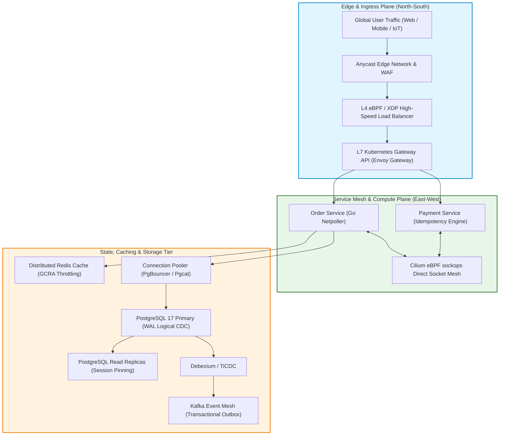
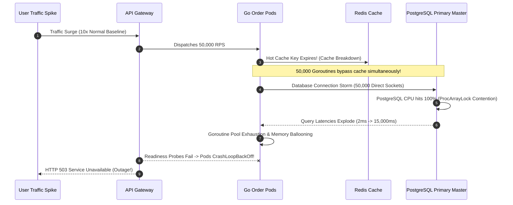

## 1. Executive Overview & The 2027 SOTA Masterclass Vision

High-concurrency distributed engineering is not merely an incremental exercise in buying larger cloud compute instances or spinning up redundant Kubernetes pods. In contemporary enterprise infrastructure, scaling an application from ten thousand daily active users to **twenty-five million monthly transactions** forces systems into unyielding physical bottlenecks: Linux kernel socket buffer saturation, database connection pool exhaustion, cache stampede cascades, B-Tree index memory thrashing, and distributed state corruption.

This Masterclass provides an exhaustive, production-hardened architectural curriculum designed for Principal Engineers, System Architects, and Technical Leads. Across ten deeply researched chapters, we deconstruct every layer of the high-concurrency stack: from low-level Linux kernel I/O primitives (`epoll`, `io_uring`, and eBPF kernel bypass) to application concurrency in Go 1.25+, resilient distributed caching hierarchies, transactional outbox messaging pipelines, sidecarless service meshes, distributed consensus locking, and horizontal database sharding.

For strategic architectural guidance across broader cloud systems, explore our authoritative [Go Microservices Architecture Guide](/posts/go-microservices/), the comprehensive [Alipay Double 11 Architecture Deep-Dive](/posts/alipay-double-11-architecture-tps/), and our curated [Architectural Reading Map](/reading-map/).

---

## 2. Masterclass Curriculum Roadmap & Detailed Chapter Synopsis

The curriculum is partitioned into ten sequential, deeply integrated chapters spanning the entire transaction lifecycle:

```mermaid
flowchart LR
    C0["0. Exec Summary<br/>(C10M Realities)"] --> C1["1. Kernel I/O<br/>(io_uring & Netpoller)"]
    C1 --> C2["2. Cache Defenses<br/>(Singleflight & XFetch)"]
    C2 --> C3["3. Rate Limiting<br/>(Redis GCRA & Lua)"]
    C3 --> C4["4. Dual-Write Fix<br/>(Transactional Outbox)"]
    C4 --> C5["5. DB Connection<br/>(Little's Law & PgBouncer)"]
    C5 --> C6["6. Ingress vs Mesh<br/>(Envoy & Cilium eBPF)"]
    C6 --> C7["7. Idempotency<br/>(Payment Keys & State)"]
    C7 --> C8["8. Locking<br/>(ZooKeeper & Fencing)"]
    C8 --> C9["9. DB Sharding<br/>(Vitess & Snowflake)"]

    classDef core fill:#ede7f6,stroke:#512da8,stroke-width:2px;
    class C0,C1,C2,C3,C4,C5,C6,C7,C8,C9 core;
```

### Comprehensive Chapter Breakdown

#### 0. [The Reality of C10M: Surviving Extreme Traffic — Exec Summary](/series/high-concurrency-systems/executive-summary/)
- **Core Challenge**: Vertical hardware scaling exhibits diminishing economic returns when concurrent network sockets scale past 100,000 active connections.
- **Architectural Solution**: Transitioning to event-driven asynchronous non-blocking runtimes, lock-free memory allocation, and kernel bypass networking.
- **Key Takeaways**: Understand the fundamental math of concurrent state management, hardware memory bus limits, and thread scheduling overhead.

#### 1. [Chapter 1: High Concurrency System Design Architecture in Go](/series/high-concurrency-systems/how-systems-handle-c10m/)
- **Core Challenge**: Operating system kernel context switching and interrupt handling degrade throughput under C10M connection density.
- **Architectural Solution**: Deep dive into Linux `epoll`, asynchronous `io_uring` ring buffers, DPDK user-space drivers, and Go's runtime Netpoller M:N scheduler.
- **Key Takeaways**: Eliminate OS context switching penalties, configure zero-copy socket buffers, and master Go 1.25+ memory pooling to avoid GC pauses.

#### 2. [Chapter 2: The 3 Caching Vulnerabilities & Go Singleflight](/series/high-concurrency-systems/caching-vulnerabilities-penetration-breakdown-avalanche/)
- **Core Challenge**: Cache Penetration, Cache Breakdown, and Cache Avalanche trigger catastrophic database stampedes under heavy traffic spikes.
- **Architectural Solution**: Multi-layered defense pairing counting Bloom filters, probabilistic early expiration (XFetch algorithm), TTL jittering, and Go's `singleflight.Group`.
- **Key Takeaways**: Guarantee that thousands of concurrent cache misses collapse into exactly one database query, protecting downstream data stores.

#### 3. [Chapter 3: Distributed Rate Limiting with Redis & GCRA Algorithm](/series/high-concurrency-systems/distributed-rate-limiting-redis-gcra/)
- **Core Challenge**: Traditional token bucket and sliding window rate limiters suffer from memory bloat and boundary traffic bursting in distributed microservices.
- **Architectural Solution**: The Generic Cell Rate Algorithm (GCRA) implemented via atomic Redis Lua scripts with continuous theoretical arrival time tracking.
- **Key Takeaways**: Enforce sub-millisecond rate limiting with zero race conditions, bounding memory overhead to just 64 bytes per tracked entity.

#### 4. [Chapter 4: Solving the Dual-Write Problem with Transactional Outbox Pattern](/series/high-concurrency-systems/transactional-outbox-pattern-dual-write/)
- **Core Challenge**: Mutating a relational database while publishing messages to Kafka in application code inevitably causes data divergence on network crashes.
- **Architectural Solution**: Transactional Outbox pattern combining local database ACID transactions with Debezium Change Data Capture (CDC) and consumer idempotency.
- **Key Takeaways**: Guarantee at-least-once message delivery to distributed event meshes without distributed locks or slow periodic table polling.

#### 5. [Chapter 5: Optimizing Golang Database Connection Pools](/series/high-concurrency-systems/golang-database-connection-pool-optimization/)
- **Core Challenge**: Unmanaged Go `database/sql` pools exhaust database process capacity, while asymmetric idle pools cause aggressive TCP handshake churn.
- **Architectural Solution**: Apply Little's Law ($L = \lambda W$) for scientific pool sizing, enforce symmetric pool configurations, and multiplex client sockets via PgBouncer or Pgcat.
- **Key Takeaways**: Reduce database CPU overhead by 22%, eliminate AWS NAT 350-second silent drops, and multiplex 25,000 client sockets over 60 backend connections.

#### 6. [Chapter 6: API Gateway vs Service Mesh in High-Concurrency Microservices](/series/high-concurrency-systems/api-gateway-vs-service-mesh/)
- **Core Challenge**: Traditional sidecar-injected service meshes impose severe latency taxes and memory bloat across deep microservice call graphs.
- **Architectural Solution**: Kubernetes Gateway API with Envoy for North-South edge routing, paired with sidecarless Istio Ambient and Cilium eBPF sockops for East-West traffic.
- **Key Takeaways**: Eliminate four TCP stack traversals per RPC, shrinking inter-pod latency from 1.8ms to 40 microseconds while enforcing zero-trust SPIFFE/SPIRE mTLS.

#### 7. [Chapter 7: Idempotency API Design for Mission-Critical Payments](/series/high-concurrency-systems/idempotency-api-design-payments/)
- **Core Challenge**: Network timeouts and retry storms in payment APIs trigger double-debit disasters and financial loss.
- **Architectural Solution**: IETF Idempotency-Key headers, three-phase deterministic state machines, SHA-256 canonical request fingerprinting, and SQL unique constraints.
- **Key Takeaways**: Build an infallible payment gateway that withstands network dropouts, rejects payload tampering (HTTP 422), and guarantees zero duplicate debits.

#### 8. [Chapter 8: Distributed Locking: Redlock vs ZooKeeper Lease Fencing](/series/high-concurrency-systems/distributed-locking-redlock-zookeeper/)
- **Core Challenge**: Stop-the-world GC pauses, clock jumps, and asynchronous network delays violate mutual exclusion in naive Redis distributed locks.
- **Architectural Solution**: Analyze the Kleppmann-Antirez debate, deploy monotonic fencing tokens, and implement ZooKeeper preceding node watchers or etcd Raft leases.
- **Key Takeaways**: Distinguish efficiency locks from correctness locks, eliminate thundering herd storms, and enforce storage-side fencing token validation.

#### 9. [Chapter 9: Database Sharding & Read-Write Splitting at Scale](/series/high-concurrency-systems/database-sharding-read-write-splitting/)
- **Core Challenge**: Relational databases hit write IOPS ceilings and B-Tree index memory bloat, while read replicas suffer from replication lag anomalies.
- **Architectural Solution**: Read/write splitting with session pinning, consistent hashing with virtual nodes, 64-bit Twitter Snowflake IDs, and live zero-downtime resharding.
- **Key Takeaways**: Scale databases horizontally to 100,000+ writes per second without downtime, avoiding B-Tree page splits and modulo N resharding catastrophes.

---

## 3. End-to-End Architectural Patterns & Failure Taxonomies

Throughout this Masterclass, we analyze recurring failure modes that strike high-volume production deployments during peak campaign events. Understanding these failure mechanics is prerequisite to engineering resilient software.

### The Anatomy of Cascading Failures

A cascading failure occurs when a localized impairment in one subsystem triggers a positive feedback loop that degrades adjacent upstream and downstream services:

### The Defensive Engineering Toolkit

To prevent catastrophic failure cascades, our architecture mandates five non-negotiable defensive pillars:

1. **Deterministic Admission Control**: Rate limit and shed load at the network perimeter (Chapter 3) before unauthenticated traffic reaches internal compute pools.
2. **Coalesced Cache Read Multiplexing**: Employ `singleflight.Group` (Chapter 2) so thousands of concurrent cache misses collapse into a single upstream database query.
3. **Bounded Physical Connection Pools**: Multiplex high-volume application sockets over dedicated connection poolers (Chapter 5) sized via Little's Law.
4. **Asynchronous Decoupling via Transactional Outbox**: Eliminate synchronous cross-service RPC mutations by streaming CDC events from outbox tables (Chapter 4).
5. **Zero-Trust Fencing Invariants**: Reject stale distributed writes at the storage layer using monotonically increasing fencing tokens (Chapter 8).

---

## 4. Architectural Scorecard: Technology Selection Matrix

The following matrix consolidates the technology evaluations detailed throughout the series:

| Architectural Tier | Legacy / Anti-Pattern | Intermediate Approach | 2027 SOTA Standard | Key Advantage |
| :--- | :--- | :--- | :--- | :--- |
| **Edge Routing** | NGINX with static reloads | Traefik / Kong Ingress | **Kubernetes Gateway API + Envoy** | Role-oriented routing, zero-downtime xDS stream updates |
| **Service Mesh** | Raw container-to-container IP | Istio with Envoy Sidecars | **Cilium eBPF Mesh + Istio Ambient** | Bypasses TCP stack, 40µs latency, eliminates sidecar RAM bloat |
| **Cache Stampede** | Direct database fallback | Simple Mutex in Redis | **Go Singleflight + Probabilistic XFetch** | 100% stampede prevention with zero lock contention |
| **Rate Limiting** | In-memory token bucket per pod | Fixed window counter in Redis | **Generic Cell Rate Algorithm (GCRA) Lua** | Sub-millisecond continuous rate tracking, zero boundary bursts |
| **Dual-Write Sync** | Dual writes in app logic | Periodic database table polling | **Transactional Outbox + Debezium CDC** | Guaranteed at-least-once delivery with zero polling I/O overhead |
| **Database Pooling** | Unbounded `*sql.DB` conns | Asymmetric `MaxOpen=100, Idle=2` | **Symmetric Pooling + PgBouncer / Pgcat** | Zero TCP handshake churn, multiplexes 25k sockets over 60 backends |
| **Payment Safety** | Naive database insert | In-memory Redis key check | **IETF Idempotency-Key + SHA-256 + SQL UNIQUE** | Infallible double-debit immunity under network partition failover |
| **Distributed Locks** | Unsafe single Redis master | Redlock without fencing | **etcd Raft Mutex / ZooKeeper with Fencing** | Linearizable mutual exclusion immune to GC pauses and NTP jumps |
| **Data Scaling** | Monolithic vertical instance | Modulo N manual database sharding | **Vitess / Citus + Snowflake 64-Bit IDs** | Consistent hash ring, zero B-Tree page splits, online live resharding |

---

## 5. Production Readiness & Deployment Verification Checklist

Before certifying a high-concurrency distributed platform for live production traffic, platform engineering teams must execute the following end-to-end verification checklist:

### 1. Ingress & Traffic Management
- [ ] Kubernetes Gateway API `HTTPRoute` resources configured with explicit request timeouts and circuit breaker outlier detection.
- [ ] Distributed rate limiting active via Redis GCRA Lua scripts, enforcing tiered merchant API quotas.
- [ ] DDoS mitigation and WAF rules configured at the edge Anycast network layer.

### 2. Application & Runtime Layer
- [ ] Go runtime tuned with `GOMAXPROCS` matched to Kubernetes container CPU limits.
- [ ] All database queries bounded by explicit `context.WithTimeout` contexts.
- [ ] Zero unclosed `*sql.Rows` handles verified via `sqlclosecheck` static analysis in CI pipelines.
- [ ] W3C `traceparent` headers injected and propagated across all inter-service HTTP and gRPC calls.

### 3. Database & Caching Tier
- [ ] Go `*sql.DB` configured symmetrically: `SetMaxIdleConns == SetMaxOpenConns`.
- [ ] `SetConnMaxLifetime` set below 300 seconds (with jitter) to prevent AWS NAT Gateway 350-second silent socket drops.
- [ ] PgBouncer or Pgcat deployed in Transaction Pooling mode in front of PostgreSQL.
- [ ] Transactional Outbox pattern implemented with Debezium CDC streaming events to Apache Kafka.
- [ ] Database-level `UNIQUE` constraints active on all idempotency and business transaction primary keys.

### 4. Observability & Chaos Testing
- [ ] Prometheus metrics alerting configured on `go_sql_db_wait_duration_seconds_total` and `go_sql_db_wait_count_total`.
- [ ] Distributed tracing spans exported to OpenTelemetry collectors with 100% error-path tail sampling.
- [ ] Chaos engineering fault injection executed: verified graceful degradation under simulated network latency, pod kills, and Redis node failovers.

---

## 6. Mathematical Capacity Planning & Hardware Sizing Models

To scale a distributed platform to 25 million monthly requests with a 15x peak surge factor, platform architects must ground hardware provisioning in formal queueing theory rather than intuition:

### 1. Little's Law Applied to Database Connection Pools

Under Little's Law ($L = \lambda \cdot W$):
- **Arrival Rate ($\lambda$)**: During a peak campaign surge of 30,000 requests per second across 100 backend services, database query rate hits $\lambda = 15,000\text{ QPS}$.
- **Average Query Service Time ($W$)**: With indexed read queries averaging $W = 0.002\text{ s}$ (2 milliseconds).
- **Required In-Flight Connections ($L$)**:
  $$L = 15,000 \times 0.002 = 30\text{ concurrent physical connections}$$
Attempting to allocate 200 connections per pod across 50 pods creates 10,000 physical connections, triggering `ProcArrayLock` contention in PostgreSQL and degrading throughput by 80%. Multiplexing via PgBouncer with a pool size of $L = 60$ (accommodating variance) achieves maximum saturation without lock thrashing.

### 2. Redis Memory Bounding: GCRA vs Sliding Window Counter

When enforcing rate limits across 5,000,000 registered merchants:
- **Sliding Window Log**: Storing timestamps in a Redis sorted set (`ZADD`) with 100 requests per minute requires:
  $$\text{Memory} = 5,000,000 \times 100 \times (8\text{ B timestamp} + 8\text{ B member} + 48\text{ B jemalloc overhead}) \approx 32\text{ GB}$$
- **Generic Cell Rate Algorithm (GCRA)**: Storing a single 64-bit integer timestamp representing the Theoretical Arrival Time (TAT) in a single key:
  $$\text{Memory} = 5,000,000 \times (8\text{ B TAT} + 48\text{ B Redis object header}) \approx 280\text{ MB}$$
GCRA achieves a **114x memory reduction**, allowing entire distributed throttling states to reside comfortably within L3 cache and Redis RAM.

### 3. Linux Kernel Socket Buffer & TCP Memory Tuning

For high-throughput Go services handling 100,000 concurrent sockets:
- Set `net.core.somaxconn = 65535` and `net.ipv4.tcp_max_syn_backlog = 65535` to eliminate SYN packet dropping during connection storms.
- Configure `net.ipv4.tcp_rmem = 4096 87380 16777216` and `net.ipv4.tcp_wmem = 4096 65536 16777216` to allow dynamic socket buffer sizing while capping total TCP memory via `net.ipv4.tcp_mem`.

---

## 7. The Five Invariant Laws of 2027 SOTA Distributed Architecture

Every chapter in this series enforces five non-negotiable invariant rules:

1. **The Invariant of the Single Transactional Boundary**: Never execute an external network call (HTTP, gRPC, Kafka, Redis) inside a relational database transaction. State mutations and outbox records must commit atomically in the same local ACID transaction.
2. **The Invariant of Symmetric Pool Sizing**: Always configure `SetMaxIdleConns` identically to `SetMaxOpenConns` in Go's `database/sql`. Allowing idle pools to shrink creates continuous TCP connection churn and AWS NAT Gateway silent timeouts.
3. **The Invariant of Monotonic Fencing Tokens**: Never trust a distributed lock lease duration across network partitions or JVM/Go GC pauses. Every state modification must validate a monotonically increasing fencing token at the storage layer.
4. **The Invariant of Coalesced Read Demultiplexing**: Never permit concurrent cache misses on the same key to reach downstream databases independently. Enforce singleflight request collapsing to guarantee exactly one in-flight upstream read.
5. **The Invariant of Zero Kernel-Space Traversals**: Eliminate legacy user-space proxy overhead for high-frequency internal microservice communication by adopting eBPF sockops socket-level bypassing.

---

## 8. Enterprise Case Studies & Architectural Lineage

The patterns detailed in this Masterclass have been battle-tested in world-class financial and e-commerce platforms:

- **Alipay Double 11 Mega Sales**: Handling 610,000 payment transactions per second through idempotent state engines, memory-pinned account balances, and distributed multi-datacenter consensus. Learn more in our [Alipay Double 11 Architecture Deep-Dive](/posts/alipay-double-11-architecture-tps/).
- **Shopee Southeast Asia Campaigns**: Resilient flash-sale inventory allocation using distributed Redis GCRA rate limiters and asynchronous transactional outbox event streams.
- **Enterprise Core Banking**: Orchestrated zero-loss financial transactions combining IETF Idempotency-Key headers and two-phase consensus avoidance. Explore our [Banking Microservices Architecture Guide](/posts/banking-microservices-architecture/).

---

## 9. Frequently Asked Questions


API Gateways specialize in North-South perimeter routing, executing client authentication, edge rate limiting, TLS termination, and external API versioning at the cluster boundary. Service Meshes manage East-West pod-to-pod communication within the cluster, enforcing mutual TLS zero-trust identity, distributed OpenTelemetry tracing, and circuit breaking. Modern high-concurrency systems deploy both: Envoy Gateway at the ingress perimeter and Cilium eBPF mesh for sidecarless internal service communication.



Dual-writing in application code creates an unresolvable distributed consensus dilemma: if the database transaction commits but the Kafka publish times out or fails, data permanently diverges. If Kafka publishes first but the database transaction rolls back, downstream systems process phantom data. The Transactional Outbox pattern writes the business event into an outbox table in the same local ACID transaction as the state change, allowing a dedicated CDC engine (such as Debezium) to stream events with guaranteed at-least-once semantics.



As demonstrated by Martin Kleppmann, Redlock relies on synchrony assumptions regarding physical clock drift, process pauses, and network delays. If a client holding a Redlock encounters a Stop-The-World garbage collection pause or hypervisor deschedule, its lock lease can expire unnoticed. When the paused client resumes, it may write stale state concurrently with a new lock holder unless storage engines validate monotonically increasing fencing tokens (such as ZooKeeper zxid or etcd Raft revision numbers).



Transitioning to database sharding is justified only after exhaustive vertical scaling, read-write splitting, query indexing, and connection pooling (PgBouncer) have been fully leveraged, and write throughput approaches physical NVMe IOPS ceilings (typically 25,000-50,000 sustained writes/second) or table datasets exceed 5 Terabytes where B-Tree maintenance causes catastrophic buffer cache churn. Sharding introduces operational complexity, cross-shard transaction penalties, and resharding overhead, making Vitess or Citus the preferred 2027 standard.


---

## 10. Next Steps & Architectural Consultation

For hands-on enterprise architecture reviews, performance audits, and high-concurrency consulting, explore our full portfolio and advisory engagements:

- [Go Microservices Architecture Guide](/posts/go-microservices/)
- [Alipay Double 11 Architecture Deep-Dive](/posts/alipay-double-11-architecture-tps/)
- [Architecting 21-Service E-Commerce Ecosystem in Go](/posts/architecting-21-service-ecommerce-golang-ddd/)
- [Curated Architectural Reading Map](/reading-map/)
- [Consulting & Advisory Services](/hire/)
