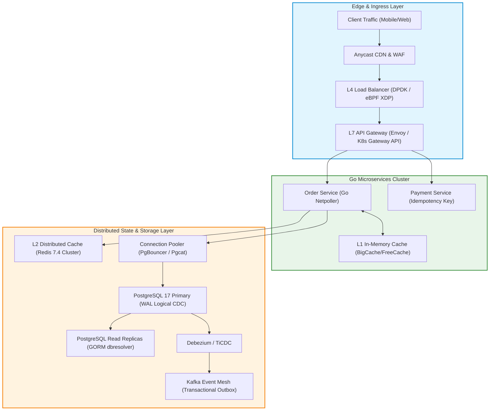

> **Multi-Language Edition:** This Masterclass is also published in Vietnamese at [Học Viện Kỹ Thuật High-Concurrency (learn.tanhdev.com)](https://learn.tanhdev.com/series/high-concurrency-systems/).

## Masterclass: High Concurrency Systems & B2B Commerce

Have you ever experienced a system crash precisely during the most critical moment of a Flash Sale or Mega Campaign? Are your PostgreSQL databases buckling under the weight of row-level lock contention when thousands of concurrent users attempt to place orders simultaneously?

Welcome to the **High Concurrency Systems** Masterclass.

> **About this Masterclass**
>
> This series distills **17+ years of production experience**, drawing directly from the battlefield of building resilient, high-traffic e-commerce systems as an Independent Consultant. It provides practical, battle-tested blueprints for managing 25 million requests per month with Go and Microservices architecture. For framework performance benchmarks, see [High-Throughput Go Framework Benchmarks (Gin vs Fiber vs Kratos)](/posts/high-throughput-go-framework-benchmarks-gin-fiber-kratos/).

---

## Core Curriculum & Chapter Roadmap

```mermaid
flowchart LR
    E0["0. Exec Summary<br/>(C10M Realities)"] --> C1["1. Kernel I/O<br/>(io_uring & Netpoller)"]
    C1 --> C2["2. Cache Defenses<br/>(Singleflight & Bloom)"]
    C2 --> C3["3. Rate Limiting<br/>(GCRA & Lua)"]
    C3 --> C4["4. Dual-Write Fix<br/>(Transactional Outbox)"]
    C4 --> C5["5. DB Connection<br/>(PgBouncer & Sizing)"]
    C5 --> C6["6. Ingress vs Mesh<br/>(API Gateway vs Mesh)"]
    C6 --> C7["7. Idempotency<br/>(Payment Keys)"]
    C7 --> C8["8. Locking<br/>(Redlock vs ZooKeeper)"]
    C8 --> C9["9. DB Sharding<br/>(Vitess & Hashing)"]

    classDef core fill:#ede7f6,stroke:#512da8,stroke-width:2px;
    class E0,C1,C2,C3,C4,C5,C6,C7,C8,C9 core;
```

0. **[The Reality of C10M: Surviving Extreme Traffic — Exec Summary](/series/high-concurrency-systems/executive-summary/)**
   *An overview for Tech Leads & Architects: Why traditional scaling fails at millions of requests and how to build high-concurrency systems using Golang.*

1. **[Chapter 1: High Concurrency System Design Architecture in Go](/series/high-concurrency-systems/how-systems-handle-c10m/)**
   *Deep dive into C10M high-concurrency architecture, epoll, io_uring, DPDK kernel bypass, L4/L7 load balancing, and zero-copy Go memory management.*

2. **[Chapter 2: The 3 Caching Vulnerabilities (Penetration, Breakdown, Avalanche) & Go Singleflight](/series/high-concurrency-systems/caching-vulnerabilities-penetration-breakdown-avalanche/)**
   *Learn how to defend against Cache Penetration, Avalanche, and Breakdown using Bloom Filters, TTL jittering, and Golang singleflight.*

3. **[Chapter 3: Distributed Rate Limiting with Redis & GCRA Algorithm](/series/high-concurrency-systems/distributed-rate-limiting-redis-gcra/)**
   *Discover why local rate limiters fail in Microservices and how Redis Lua scripts powering the GCRA algorithm solve distributed throttling.*

4. **[Chapter 4: Solving the Dual-Write Problem with Transactional Outbox Pattern](/series/high-concurrency-systems/transactional-outbox-pattern-dual-write/)**
   *Master the Transactional Outbox Pattern using GORM and CDC to eliminate Dual-Write data inconsistencies in event-driven systems.*

5. **[Chapter 5: Optimizing Golang Database Connection Pools](/series/high-concurrency-systems/golang-database-connection-pool-optimization/)**
   *Tune your *sql.DB connection pool parameters (MaxOpenConns, MaxIdleConns) and implement PgBouncer to maximize Go database performance.*

6. **[Chapter 6: API Gateway vs Service Mesh in Microservices Architecture](/series/high-concurrency-systems/api-gateway-vs-service-mesh/)**
   *Understand the clear boundaries between North-South traffic (API Gateway) and East-West traffic (Service Mesh) in large Go architectures.*

7. **[Chapter 7: Designing Idempotency APIs for Payment Systems](/series/high-concurrency-systems/idempotency-api-design-payments/)**
   *Prevent double-charging customers by implementing atomic Idempotency Keys and Atomic Redis locks in your HTTP POST transactions.*

8. **[Chapter 8: Distributed Locking — Redlock vs ZooKeeper](/series/high-concurrency-systems/distributed-locking-redlock-zookeeper/)**
   *Master distributed synchronization by comparing Redis Redlock algorithms against strongly consistent Apache ZooKeeper locks.*

9. **[Chapter 9: Database Sharding & Read/Write Splitting](/series/high-concurrency-systems/database-sharding-read-write-splitting/)**
   *Scale your relational database infinitely using GORM dbresolver for Read/Write splitting and Consistent Hashing for massive Sharding.*

---

## Production Profiling & Tooling

Essential tooling for diagnosing and validating high-concurrency systems in production:

- **[Go pprof in Kubernetes: Remote Profiling & Flame Graphs](/posts/go-pprof-kubernetes-remote-profiling/)** — Step-by-step guide to running `go tool pprof` on a live Kubernetes pod, reading Goroutine flame graphs, and identifying CPU/memory hotspots without downtime.
- **[What's New in Argo CD 3.4 & 3.3: Cluster Pause & Upgrades](/posts/argo-cd-updates-2026/)** — Release notes analysis for the GitOps platform used to deploy high-concurrency Go microservices.

---

## Frequently Asked Questions (FAQ)


Use Optimistic Concurrency Control (OCC) or atomic conditional updates at the database layer instead of pessimistic locks. The pattern: `UPDATE inventory SET reserved_stock = reserved_stock + $qty, version = version + 1 WHERE sku_id = $id AND (total_stock - reserved_stock) >= $qty AND version = $current_version`. If `RowsAffected == 0`, another goroutine won the race — retry with exponential backoff or return an out-of-stock response. This eliminates `SELECT FOR UPDATE` contention that serializes concurrent orders on the same row.



The Transactional Outbox Pattern solves the dual-write problem: if your service writes to PostgreSQL and then publishes to Kafka, a crash between those two steps loses the event permanently. The fix: write both the business state change and an outbox event record in the exact same database transaction. A CDC process (Debezium or TiCDC) reads the database WAL and publishes to Kafka. Either both succeed or neither does, guaranteeing zero dual-write risk and At-Least-Once event delivery.



Unbounded goroutine creation is the primary OOM cause in Go microservices. A bounded worker pool limits concurrency using a semaphore channel: `sem := make(chan struct{}, maxWorkers)`. Each goroutine acquires a slot (`sem <- struct{}{}`), processes one item, then releases it (`<-sem`). If all `maxWorkers` slots are taken, incoming requests block or get shed gracefully with HTTP 429/503 rather than spawning tens of thousands of goroutines that exhaust heap memory and trigger GC thrashing.


---

## Related Masterclasses & Architecture Deep Dives

- **[Distributed Core Banking Architecture](/series/core-banking-architecture/)**: Financial-grade ledger schemas, ISO 20022, and FAPI 2.0 security.
- **[Realtime Ride-Hailing Architecture](/series/ride-hailing-realtime-architecture/)**: Geospatial indexing (H3), driver matching, and streaming pricing.
- **[Shopee High-Concurrency Architecture](/series/shopee-architecture/)**: Southeast Asia's mega-sale scaling blueprints.
