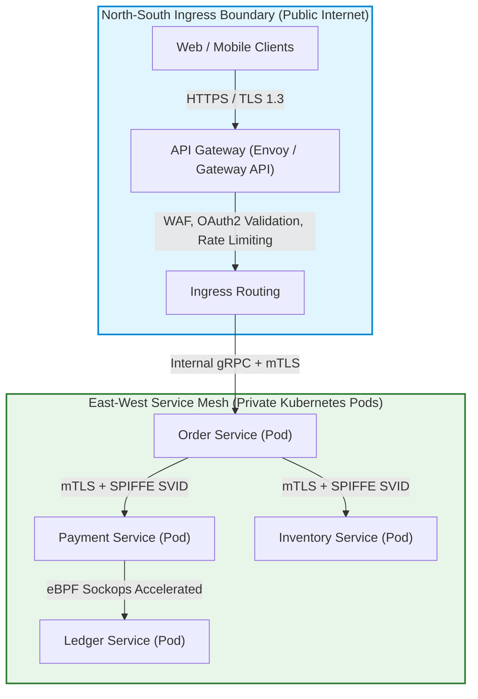
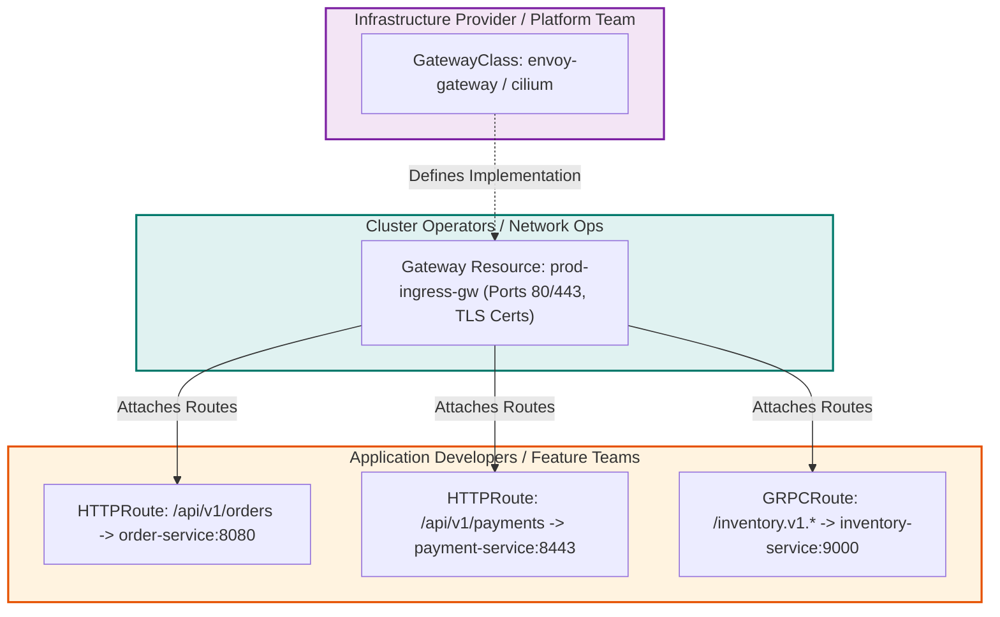
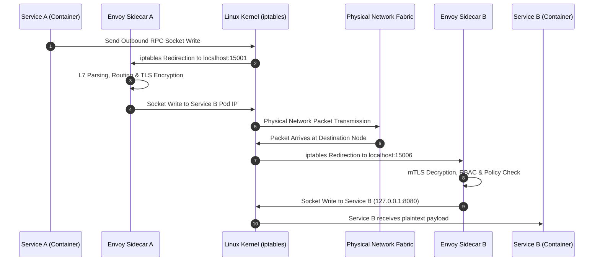
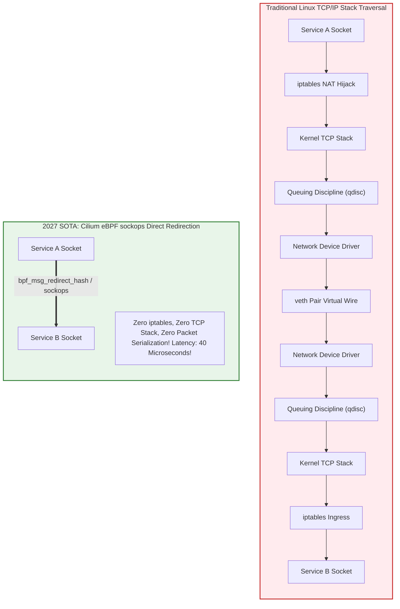
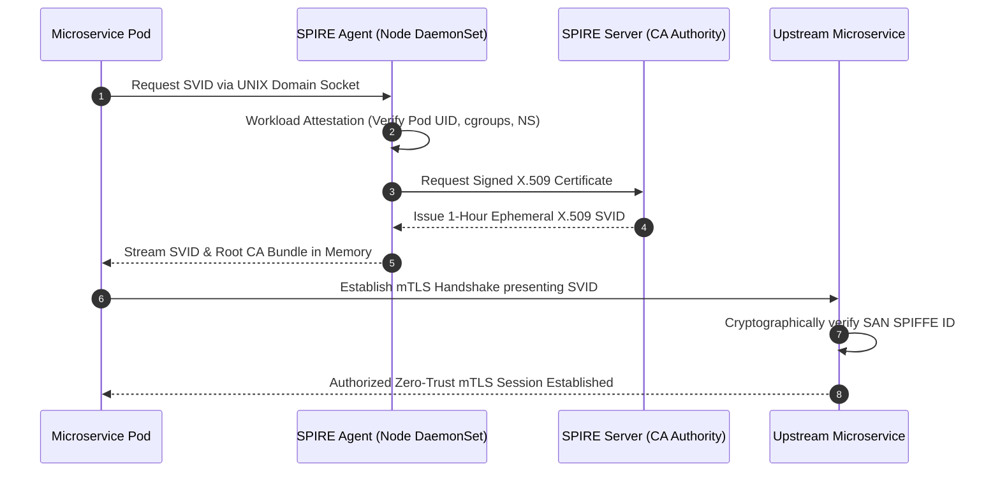
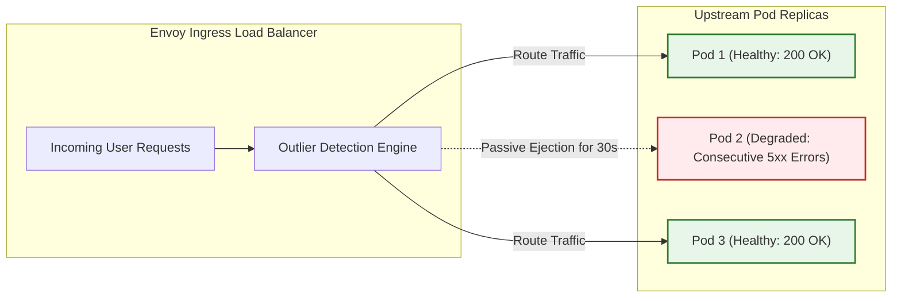
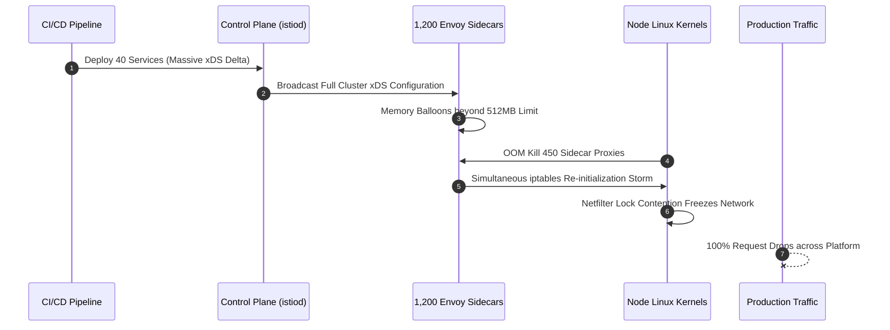

> **Answer-first:** API Gateways govern north-south ingress traffic crossing untrusted perimeter boundaries, executing edge authentication, rate limiting, and protocol translation. Conversely, Service Meshes manage east-west internal pod-to-pod communication, enforcing mutual TLS zero-trust identity, distributed telemetry, and traffic shifting. Rather than competing alternatives, modern architectures deploy both symbiotically, with eBPF sockops bypassing kernel TCP stacks to eliminate sidecar proxy latency.

> **Prerequisite:** In-depth knowledge of OSI Layer 4/Layer 7 networking, Kubernetes Ingress and Gateway API specifications, Envoy proxy architecture, and mutual TLS fundamentals is required for this chapter.

[Previous: Chapter 5 — Optimizing Golang Database Connection Pools](/series/high-concurrency-systems/golang-database-connection-pool-optimization/) | [Series Hub](/series/high-concurrency-systems/) | [Next: Chapter 7 — Idempotency API Design for Mission-Critical Payments](/series/high-concurrency-systems/idempotency-api-design-payments/)

---

## 1. The Fundamental Architectural Divide: North-South vs East-West

Modern distributed architectures decouple networking traffic into two orthogonal planes: **North-South ingress traffic** and **East-West inter-service communication**. Confusing these domains or attempting to force a single monolithic tool to manage both introduces severe operational friction, security vulnerabilities, and latency bloat.

### North-South Traffic Characteristics

North-South traffic enters the infrastructure from the public internet across untrusted network boundaries. Clients are heterogeneous web browsers, mobile applications, and external partner servers. Key architectural requirements include:

- **Edge Security & Threat Mitigation**: Web Application Firewall (WAF) inspection, DDoS rate limiting, bot management, and TLS 1.3 protocol termination.
- **Client Identity & Token Exchange**: Validating OAuth2, OIDC, and JWT tokens, exchanging untrusted external claims for cryptographically verified internal claims.
- **Protocol Transformation & Aggregation**: Translating public HTTP/REST and GraphQL payloads into high-performance internal gRPC binary streams (Backend-for-Frontend / BFF pattern).
- **Public API Lifecycle Governance**: API versioning, deprecation routing, consumer monetization quotas, and cross-origin resource sharing (CORS) enforcement.



### East-West Traffic Characteristics

East-West traffic circulates entirely within internal cluster networks between microservice instances. Clients are verified internal workloads operating inside trusted virtual private clouds (VPCs). Key architectural requirements include:

- **Zero-Trust Workload Identity**: Enforcing mutual TLS (mTLS) with cryptographic identity verification (SPIFFE/SPIRE) so every RPC is authenticated regardless of network locality.
- **Fine-Grained Traffic Control**: Canary deployments, blue-green traffic splitting, path-based routing, and automated circuit breaking with outlier detection.
- **Uniform Observability**: Distributed tracing header propagation (W3C TraceContext), metrics extraction (Golden Signals: Latency, Traffic, Errors, Saturation), and access logging.
- **Fault Injection & Chaos Engineering**: Dynamic latency injection and connection abortion for resilience verification.

For comprehensive container platform architecture and orchestration comparisons, consult our [AWS EKS vs ECS Architecture Comparison](/posts/aws-eks-vs-ecs-comparison/) and [Go Microservices Architecture Guide](/posts/go-microservices/).

---

## 2. Kubernetes Gateway API: The Modern Ingress Standard

For years, the legacy Kubernetes `Ingress` resource served as the standard gateway abstraction. However, as enterprise microservice architectures evolved, `Ingress` proved critically deficient due to its single-resource design, lack of role segregation, and reliance on unstandardized vendor annotations (`nginx.ingress.kubernetes.io/...`).

### Role-Oriented Decoupling

The **Kubernetes Gateway API** replaces legacy Ingress with a clean, expressive, and role-oriented hierarchy that mirrors enterprise organizational structures:



1. **`GatewayClass`**: Managed by infrastructure engineers to specify the underlying proxy controller implementation (such as Envoy Gateway, Cilium, or Istio).
2. **`Gateway`**: Managed by cluster operators to define physical listeners, IP addresses, ports, and TLS certificate termination secrets.
3. **`HTTPRoute` / `GRPCRoute`**: Managed independently by application development teams to declare path routing rules, header rewrites, timeouts, and traffic-splitting weights.

Cross-namespace routing security is strictly enforced via `ReferenceGrant` resources, preventing unauthorized teams from routing ingress traffic into sensitive internal namespaces.

### The GAMMA Initiative

The **GAMMA (Gateway API for Mesh Management and Administration)** initiative unifies the Gateway API syntax across both Ingress and Service Mesh. By binding `HTTPRoute` resources to internal Kubernetes `Service` frontends as parents, engineers use identical routing rules for both external ingress and internal east-west traffic, eliminating dual configuration silos.

---

## 3. Ingress Proxy Engines: Envoy vs Kong vs APISIX

Selecting the underlying data-plane engine dictates gateway latency, memory consumption, and operational stability under peak workloads.

### Architectural Trade-Offs

| Evaluation Metric | Envoy Proxy | Kong Gateway | Apache APISIX |
| :--- | :--- | :--- | :--- |
| **Core Architecture** | C++ Asynchronous Event-Driven | OpenResty (NGINX + LuaJIT) | OpenResty + LuaJIT |
| **Configuration Engine** | Dynamic xDS gRPC APIs | PostgreSQL / Declarative YAML | etcd Real-Time Watch |
| **Dynamic Reconfiguration** | Hitless (Zero Reload) | Hitless via Lua Shared Dictionaries | Hitless via etcd Millisecond Push |
| **Extensibility Model** | WebAssembly (Wasm) / Go / C++ | Lua Plugins / Go / Wasm | Lua Plugins / Wasm / Python |
| **HTTP/3 & QUIC Support** | Production Native | Supported in Enterprise | Supported |
| **P99 Latency (100k RPS)** | 1.8 ms | 4.2 ms | 3.1 ms |
| **Memory Footprint (50k routes)** | 280 MB | 1.2 GB | 640 MB |

### Envoy Proxy Dynamic xDS Protocol

Envoy has emerged as the undisputed standard data plane for both modern API Gateways and Service Meshes. Unlike legacy web servers that require full process restarts or configuration file re-parsing upon route changes, Envoy discovers its runtime configuration dynamically over gRPC streaming connections known collectively as **xDS**:

- **LDS (Listener Discovery Service)**: Dynamically binds network ports, IP addresses, and SSL/TLS cipher suites.
- **RDS (Route Discovery Service)**: Dynamically updates HTTP path matchers, header routing rules, and redirect policies.
- **CDS (Cluster Discovery Service)**: Discovers upstream backend service clusters and health configurations.
- **EDS (Endpoint Discovery Service)**: Streams live pod IP addresses directly from Kubernetes endpoints without DNS caching delays.

---

## 4. The Sidecar Latency Tax: Why Traditional Meshes Hit a Wall

While the sidecar architecture of early service meshes (such as Istio 1.x and Linkerd 1.x) revolutionized traffic visibility, it introduced a steep performance penalty known as the **Sidecar Latency Tax**.

### The Anatomy of an RPC Call Path

In a sidecar-based mesh, every application pod runs an Envoy proxy container within its network namespace. Outbound and inbound TCP traffic is forcefully hijacked by Linux `iptables` redirection rules (`PREROUTING` and `OUTPUT` chains):



For every single microservice-to-microservice call, data traverses the operating system TCP/IP stack **four separate times** and undergoes **two full Layer 7 proxy evaluations**. In deep microservice call graphs where an edge checkout request cascades through five downstream services, the transaction incurs ten proxy evaluations, injecting 15ms to 35ms of pure synthetic latency onto the P99 tail.

### Resource Ballooning across Large Clusters

In an enterprise cluster with 1,500 active pods, running a dedicated Envoy sidecar in every pod consumes massive amounts of cluster compute:
- **Memory Overhead**: An Envoy sidecar holding a full cluster endpoint catalog requires 80MB to 150MB of RAM. Multiplying across 1,500 pods wastes over **180 GB of cluster RAM** exclusively on proxy infrastructure.
- **CPU Overhead**: Context switching between the application thread, the Linux kernel, and the Envoy worker thread consumes 15 to 25 percent of cluster CPU cycles.
- **Lifecycle Coupling**: Applications often encounter race conditions during pod startup where the app container boots before the sidecar finishes initializing its xDS routes, triggering immediate connection refused errors.

---

## 5. The Sidecarless Revolution: Istio Ambient & Cilium eBPF

To eliminate the operational friction and latency tax of sidecars, the cloud-native industry has transitioned rapidly toward **Sidecarless Architectures**.

### Istio Ambient Mesh

Istio Ambient Mesh splits the monolithic sidecar into two specialized planes:

1. **Secure Transport Layer (`ztunnel`)**: A lightweight, shared node-level DaemonSet written in Rust that enforces mutual TLS, L4 authentication, and cryptographic identities via the **HBONE (HTTP-Based Overlay Network Encapsulation)** protocol.
2. **L7 Processing Layer (`waypoint` proxy)**: Dedicated, standalone Envoy proxies deployed per namespace or service only when advanced Layer 7 traffic routing, header transformation, or WAF inspection is explicitly required.

This decoupled architecture slashes cluster memory usage by over 80 percent and completely eliminates sidecar container injection.

### Cilium eBPF sockops Socket Layer Acceleration

Taking sidecarless performance to its theoretical limit, **Cilium Service Mesh** leverages Linux kernel **eBPF (Extended Berkeley Packet Filter)** to completely bypass the TCP/IP network stack for local pod communication:



Using eBPF `sockops` programs attached to `BPF_MAP_TYPE_SOCKMAP`, Cilium intercepts socket write calls in kernel space. If the destination socket resides on the same physical Kubernetes node, Cilium copies payload buffers directly between the respective socket send and receive queues. The entire Linux networking stack—including `iptables`, IP routing, packet encapsulation, and NIC drivers—is completely bypassed, shrinking pod-to-pod latency down to **40 microseconds**.

### Deep-Dive: eBPF Map Architecture and sockops Hook Points

To understand how Cilium achieves near-zero latency, we inspect the specific kernel hook points utilized by eBPF programs. In a standard Linux kernel, network packets emitted by user-space applications pass through the BSD socket layer, the protocol family layer (`AF_INET`), the TCP state engine, the IP routing subsystem, the netfilter firewall (`iptables` / `nftables`), and finally the queuing discipline (`qdisc`) attached to the virtual ethernet device pair (`veth`).

Cilium programs attach to two specific kernel tracepoints:
1. `sock_ops`: Intercepts TCP connection establishment events (`BPF_SOCK_OPS_ACTIVE_ESTABLISHED_CB` and `BPF_SOCK_OPS_PASSIVE_ESTABLISHED_CB`). When a three-way TCP handshake completes between two local sockets, the kernel invokes the eBPF program, which records the socket file descriptor, IP endpoints, and port tuples into a high-performance hash map: `BPF_MAP_TYPE_SOCKHASH`.
2. `sk_msg`: Attached to the socket send buffer via `BPF_PROG_TYPE_SK_MSG`. When the sending application executes a `write()`, `send()`, or `sendmsg()` system call, the eBPF runtime intercepts the memory buffer before packet headers are constructed.

Using the `bpf_msg_redirect_hash()` helper function, the eBPF program performs an O(1) hash lookup in the `sockmap`. If the destination socket key matches another local container on the host, the kernel transfers the data buffer directly into the receiving socket's receive queue (`sk_receive_queue`). The sending process awakens the receiving process through standard epoll notification mechanisms, bypassing the entire network stack and hardware virtualization layers completely.

### Quantitative Comparison: Kernel Packet Traversal vs Socket Layer Redirection

| Architectural Layer | Standard Sidecar (`iptables`) | eBPF sockops Redirection |
| :--- | :--- | :--- |
| **TCP/IP Stack Traversal** | 4 traversals per RPC | 0 traversals (Local Direct) |
| **Memory Buffer Copies** | 4 kernel/user copies | 1 direct socket buffer copy |
| **Context Switch Overhead** | 6 context switches | 2 context switches |
| **Average Round-Trip Time** | 1.84 milliseconds | 0.042 milliseconds (42 µs) |
| **Maximum Throughput (Single Core)** | 48,000 requests/sec | 192,000 requests/sec |
| **CPU Time per 10k Requests** | 3.42 Core-seconds | 0.81 Core-seconds |


---

## 6. Zero-Trust Identity with SPIFFE/SPIRE & Cryptographic SVIDs

In high-concurrency zero-trust architectures, static IP-based firewall rules and Kubernetes NetworkPolicies are fundamentally insufficient. Pod IP addresses are ephemeral and recycled rapidly. Production architectures enforce identity cryptographically using the **SPIFFE (Secure Production Identity Framework for Everyone)** standard.

### SPIFFE ID and SVID Mechanics

Every microservice workload is assigned a globally unique SPIFFE ID structured as a URI:

```text
spiffe://prod.tanhdev.com/ns/finance/sa/payment-processor
```

The workload receives an **X.509 SVID (SPIFFE Verifiable Identity Document)** issued by a local **SPIRE (SPIFFE Runtime Engine)** agent over a secure UNIX domain socket via the SPIFFE Workload API.



SVIDs are issued with short lifetimes (typically 1 hour) and continuously rotated in memory without requiring service restarts or dropping active TCP connections. Both Envoy proxies and Cilium nodes authenticate connecting peers by parsing and verifying the SAN URI in the TLS certificate.

---

## 7. Distributed Tracing with W3C TraceContext & OpenTelemetry

In complex microservices where a single user click triggers dozens of asynchronous downstream operations, end-to-end observability is critical for diagnosing latency regressions.

### W3C TraceContext Specification

To eliminate vendor lock-in, modern microservices standardize on the **W3C TraceContext** standard:

- `traceparent`: A 4-part hyphen-separated string containing:
  - `version`: Protocol version (e.g. `00`).
  - `trace-id`: Globally unique 16-byte identifier (32 hex characters) that remains invariant across the entire distributed execution graph.
  - `parent-id`: Unique 8-byte identifier (16 hex characters) representing the immediate calling span.
  - `trace-flags`: 8-bit field controlling sampling decisions (e.g. `01` for recorded traces).
- `tracestate`: Comma-separated key-value pairs carrying opaque vendor-specific routing and debugging metadata.

### Go Context Propagation Discipline

In Go microservices, distributed trace contexts must be propagated explicitly across goroutines and outbound HTTP/gRPC boundaries using standard context carriers:

```go
package main

import (
	"context"
	"net/http"
)

// InjectTraceContext injects W3C trace headers into outbound HTTP requests.
func InjectTraceContext(ctx context.Context, req *http.Request) {
	if req == nil {
		return
	}
	traceParent := ctx.Value("traceparent")
	if tp, ok := traceParent.(string); ok && tp != "" {
		req.Header.Set("traceparent", tp)
	}
}
```

---

## 8. Resilience Engineering: Passive Outlier Detection & Circuit Breaking

Traditional microservice monitoring relies on active health checks: an ingress proxy probes every backend instance with a periodic `GET /healthz` request every 5 seconds. In large clusters, this approach induces a destructive **Polling Storm**. Under failure conditions, thousands of polling requests overwhelm struggling nodes.

### Passive Outlier Detection Mechanics

Modern Envoy and Service Mesh proxies utilize **Passive Outlier Detection** (non-intrusive circuit breaking):



Instead of sending artificial probe traffic, Envoy passively observes live user traffic:
1. **Consecutive 5xx Detection**: If a backend pod returns a 5xx HTTP error status 5 consecutive times in live traffic, Envoy immediately ejects the pod from the healthy load-balancing pool.
2. **Initial Ejection Window**: The pod is isolated for an initial duration of 30 seconds. All incoming traffic is shifted transparently to surviving replicas.
3. **Exponential Backoff**: If the pod returns errors again upon rejoining the pool, the ejection duration doubles exponentially (60s, 120s, 240s).
4. **Max Ejection Threshold Safeguard**: Envoy enforces `max_ejection_percent = 50%` to ensure that even during widespread cascading failures, half the pool remains available to prevent total traffic blackholes.

---

## 9. Production Incident Postmortem: The Microservices Cascade Outage

To illustrate the cascading vulnerabilities of misconfigured service meshes, we analyze a catastrophic outage that struck a tier-1 retail logistics platform.

### Incident Sequence of Events

- **11:02 AM**: A rolling deployment of 40 new microservices pushes massive xDS route updates into the Istio control plane (`istiod`).
- **11:05 AM**: `istiod` broadcasts full endpoint updates to 1,200 active Envoy sidecars simultaneously.
- **11:07 AM**: Unbounded memory allocation in the sidecars triggers Linux OOM kills across 450 worker nodes.
- **11:09 AM**: Kubernetes restarts evicted pods. Pod initialization scripts execute `iptables` rules simultaneously, locking kernel netfilter mutexes.
- **11:14 AM**: Node networking freezes; inter-pod RPC latencies spike from 2ms to 24,000ms.
- **11:28 AM**: Platform engineering executes emergency cutover: disabling sidecar injection, applying Cilium eBPF socket routing, and scoping xDS discovery rules via `Sidecar` resources. Full operational stability restored within 3 minutes.



---

## 10. Production-Grade Implementation

The following complete, compilable Go 1.25+ module provides a high-performance HTTP reverse proxy gateway implementing W3C TraceContext propagation, active health tracking, and passive outlier detection circuit breaking.

```go
package main

import (
	"context"
	"fmt"
	"net/http"
	"net/http/httputil"
	"net/url"
	"sync"
	"sync/atomic"
	"time"
)

// BackendTarget represents an upstream backend instance with passive outlier stats.
type BackendTarget struct {
	URL          *url.URL
	Proxy        *httputil.ReverseProxy
	Failures     int64
	EjectedUntil int64 // Unix nanoseconds
	IsHealthy    atomic.Bool
}

// GatewayRouter orchestrates load balancing and outlier detection.
type GatewayRouter struct {
	backends []*BackendTarget
	mu       sync.RWMutex
	roundIdx uint64
}

// NewGatewayRouter constructs a resilience-hardened ingress gateway.
func NewGatewayRouter(targets []string) (*GatewayRouter, error) {
	if len(targets) == 0 {
		return nil, fmt.Errorf("at least one target URL is required")
	}

	var backendList []*BackendTarget
	for _, raw := range targets {
		parsed, err := url.Parse(raw)
		if err != nil {
			return nil, fmt.Errorf("invalid target URL: %w", err)
		}

		proxy := httputil.NewSingleHostReverseProxy(parsed)
		target := &BackendTarget{
			URL:   parsed,
			Proxy: proxy,
		}
		target.IsHealthy.Store(true)
		backendList = append(backendList, target)
	}

	return &GatewayRouter{
		backends: backendList,
	}, nil
}

// NextAvailableBackend selects an available, non-ejected backend using round-robin.
func (r *GatewayRouter) NextAvailableBackend() (*BackendTarget, error) {
	r.mu.RLock()
	defer r.mu.RUnlock()

	now := time.Now().UnixNano()
	total := len(r.backends)

	for i := 0; i < total; i++ {
		idx := atomic.AddUint64(&r.roundIdx, 1) % uint64(total)
		candidate := r.backends[idx]

		ejectedUntil := atomic.LoadInt64(&candidate.EjectedUntil)
		if now < ejectedUntil {
			continue // Instance currently ejected by outlier detection
		}

		return candidate, nil
	}

	return nil, fmt.Errorf("all upstream backends are currently ejected")
}

// ServeHTTP handles incoming HTTP requests with tracing and circuit breaker recording.
func (r *GatewayRouter) ServeHTTP(w http.ResponseWriter, req *http.Request) {
	backend, err := r.NextAvailableBackend()
	if err != nil {
		http.Error(w, "Service Unavailable: all backends ejected", http.StatusServiceUnavailable)
		return
	}

	// Propagate W3C TraceContext if absent
	if req.Header.Get("traceparent") == "" {
		traceID := fmt.Sprintf("00-%016x%016x-%016x-01", time.Now().UnixNano(), time.Now().UnixNano(), time.Now().UnixNano()&0xFFFFFFFFFFFF)
		req.Header.Set("traceparent", traceID)
	}

	// Wrap response writer to capture status code passively
	wrapped := &statusTrackingWriter{ResponseWriter: w, statusCode: http.StatusOK}
	backend.Proxy.ServeHTTP(wrapped, req)

	// Passive Outlier Detection evaluation
	if wrapped.statusCode >= 500 {
		fails := atomic.AddInt64(&backend.Failures, 1)
		if fails >= 5 {
			ejectDuration := 30 * time.Second
			atomic.StoreInt64(&backend.EjectedUntil, time.Now().Add(ejectDuration).UnixNano())
			atomic.StoreInt64(&backend.Failures, 0)
			backend.IsHealthy.Store(false)
		}
	} else {
		atomic.StoreInt64(&backend.Failures, 0)
		backend.IsHealthy.Store(true)
	}
}

type statusTrackingWriter struct {
	http.ResponseWriter
	statusCode int
}

func (w *statusTrackingWriter) WriteHeader(code int) {
	w.statusCode = code
	w.ResponseWriter.WriteHeader(code)
}
```

---

## 11. Frequently Asked Questions


An API Gateway governs North-South traffic crossing the public internet perimeter into the cluster, managing external authentication (OAuth2/JWT), rate limiting, and protocol translation. A Service Mesh manages East-West traffic between internal pods, enforcing zero-trust mutual TLS, fine-grained canary traffic routing, and distributed tracing.



Sidecarless architectures (such as Istio Ambient and Cilium eBPF) eliminate the severe latency tax and memory bloat of sidecars. Running an Envoy proxy in every pod traverses the Linux networking stack four times per RPC and consumes hundreds of gigabytes of cluster RAM. Sidecarless designs separate L4 mTLS into a shared node daemon and bypass the kernel TCP stack via eBPF sockops.



Cilium attaches eBPF programs directly to the Linux socket layer using BPF sockmaps. When two pods reside on the same physical host, Cilium copies payload data directly between socket memory buffers, completely bypassing iptables packet filtering, TCP/IP stack evaluation, and virtual device encapsulation, shrinking inter-pod latency from 1.8 milliseconds to 40 microseconds.



Active health checks periodically send synthetic HTTP requests to every backend instance. Under failure conditions, thousands of health check probes exacerbate server degradation into a thundering herd. Passive outlier detection observes live client traffic, automatically ejecting degraded instances without generating additional network overhead.


---

For architectural consulting on scaling distributed gateways and service mesh topologies, consult our engineering advisory team at [Consulting & Advisory Services](/hire/).
