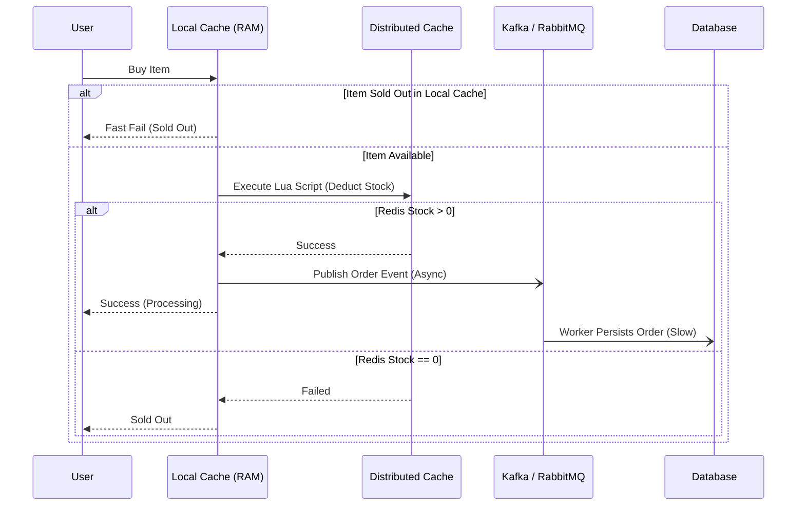

[← Series hub](/series/high-concurrency-systems/)
[Next →](/series/high-concurrency-systems/caching-vulnerabilities-penetration-breakdown-avalanche/)

# Chapter 1: Overcoming the C10M Barrier

To build a system capable of handling millions of Requests Per Second (RPS) — known as the **C10M** problem — vertical scaling is never enough. It requires a meticulously designed Distributed Architecture.

## 1. The Shift from C10K to C10M

**Answer-first:** While C10K was solved by non-blocking I/O (like NGINX), C10M shifts the bottleneck to the OS kernel. Systems must bypass the kernel using DPDK or XDP to handle 10 million connections efficiently.

The **C10K** problem (10,000 connections) haunted engineers in the early 2000s. It was permanently solved by Non-blocking I/O models (`epoll`, `kqueue`) and NGINX. With Golang, its ultra-lightweight `Goroutines` and runtime-integrated I/O multiplexing make C10K trivial.

However, **C10M** (10,000,000 connections) is a fundamentally different beast. The bottleneck is no longer the process memory limit; it is the **Operating System Kernel** (Context Switching, Interrupts). C10M systems often implement "Kernel Bypass" techniques via DPDK (Data Plane Development Kit) to read packets directly from the network interface.

## 2. Stateless APIs & State Management

**Answer-first:** The golden rule of high-concurrency is ensuring the API layer is completely stateless. All session and cart data must be offloaded to external ultra-fast stores like Redis.

Every HTTP Request must be independent. You cannot store user sessions or shopping carts in the application's RAM. Pushing State to an external datastore allows you to scale out thousands of Kubernetes Pods effortlessly. If a Load Balancer redirects traffic, users will never drop sessions.

## 3. Real-World Lessons: [Shopee Flash Sales](/series/shopee-architecture/)

**Answer-first:** Shopee survives Flash Sales using multi-level caching (local + distributed), atomic Lua scripts for inventory deduction, and asynchronous processing via Message Queues.

Flash sales are the ultimate stress test: tens of millions of users competing for an item in milliseconds.

- **Multi-Level Caching:** 
  - **Tier 1 (Local Cache):** Uses the API server's RAM (e.g., `sync.Map` in Go) to store an "Out of Stock" flag. If sold out, requests are blocked instantly without hitting the network.
  - **Tier 2 (Distributed Cache):** Uses Redis for real-time inventory counts.
- **Atomic Operations (Lua Script):** To prevent overselling, Shopee executes Lua scripts within Redis. Because Redis is single-threaded, Lua scripts guarantee absolute atomicity.
- **Asynchronous Processing:** After a successful Redis deduction, the system publishes an event to Kafka. Background workers slowly consume events to persist orders into the Database. This completely eliminates database bottlenecks.

## 4. [Alipay's Double 11 LDC Architecture](/series/alipay-double-11/)

**Answer-first:** Alipay handles 544,000 TPS by replacing monolithic Oracle DBs with OceanBase and utilizing a Logical Data Center (LDC) architecture to shard user traffic geographically.

During the Double 11 shopping festival, Alipay recorded a peak of **544,000 TPS** (Transactions Per Second). They achieved this by abandoning traditional Oracle databases for **OceanBase** — their custom Distributed DB.

Alipay utilizes the **LDC (Logical Data Center)** architecture. User data is sharded by ID and allocated to different logical datacenters. When a user in Hanoi pays, the transaction is routed directly to the datacenter holding their shard, preventing a single central server from collapsing.

## Conclusion
To survive millions of requests, your system must be **Distributed, Asynchronous, and Cache-Protected**. In the next chapter, we explore the 3 deadliest cache vulnerabilities and how Golang neutralizes them with `singleflight`.
