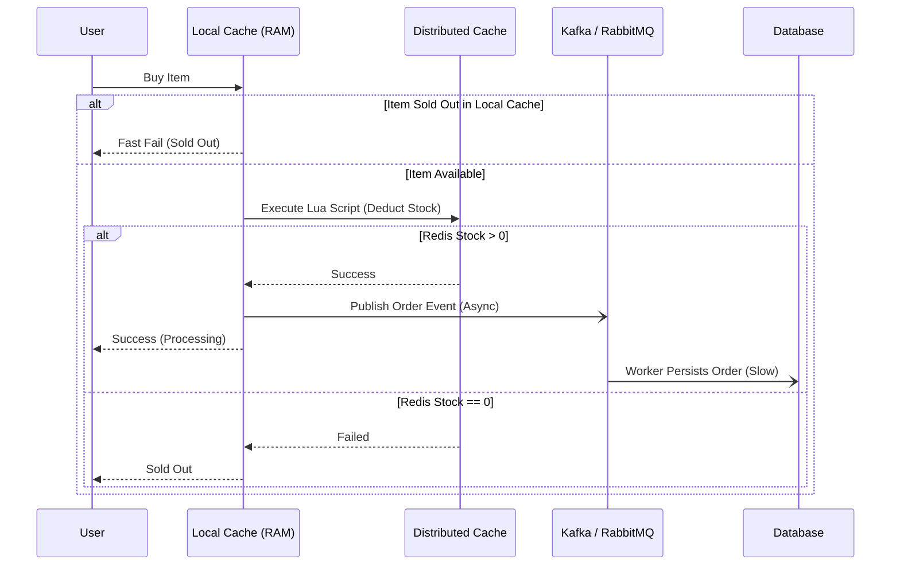

> **Prerequisite:** Before reading this chapter, please ensure you have read the previous article in this series: [Executive Summary: The Reality of C10M: Surviving Extreme Traffic]().

To build a system capable of handling millions of Requests Per Second (RPS) — known as the **C10M** problem — vertical scaling is never enough. It requires a meticulously designed Distributed Architecture.

## 1. The Shift from C10K to C10M

While **C10K** (10,000 concurrent connections) was solved by non-blocking I/O (like NGINX using `epoll` or `kqueue`), **C10M** shifts the bottleneck entirely to the operating system kernel. Systems must bypass the kernel using technologies like DPDK or XDP to handle 10 million connections efficiently.

The C10K problem haunted engineers in the early 2000s. It was permanently solved by Non-blocking I/O multiplexing. With Golang, its ultra-lightweight `Goroutines` and runtime-integrated netpoll (which abstracts `epoll` on Linux) make C10K trivial.

However, C10M (10,000,000 connections) is a fundamentally different beast. The bottleneck is no longer the process memory limit; it is the **Operating System Kernel** itself. In the standard Linux network stack, every packet arriving at the Network Interface Card (NIC) triggers a hardware interrupt. The kernel processes this interrupt, copies the packet from kernel space to user space, and performs context switches between threads. At C10M scale, these context switches and interrupt handling routines consume 100% of CPU time, leaving zero resources for actual business logic.

```mermaid
graph TD
    subgraph "Standard Linux Network Stack"
        NIC[Network Interface Card] -->|Hardware Interrupt| KernelSpace[Kernel Space: Sk_buff Allocation & Routing]
        KernelSpace -->|Context Switch & Memcpy| UserSpace[User Space: App Socket Read]
    end
    subgraph "Kernel Bypass (DPDK) Stack"
        NIC_DPDK[Network Interface Card] -->|Direct Memory Access (DMA)| PMD[User-Space Poll Mode Driver]
        PMD -->|Zero-Copy Access| AppDPDK[User-Space Go/C Application]
    end
```

### OS Kernel Bypass
To break the C10M barrier, high-performance systems employ **Kernel Bypass** techniques. This approach removes the kernel from the data path, allowing user-space applications to communicate directly with the network hardware.
- **DPDK (Data Plane Development Kit):** DPDK replaces the standard kernel network drivers with poll-mode drivers (PMD) running in user space. Instead of waiting for interrupts, DPDK workers run in tight loops, continuously polling the NIC rings for incoming packets. Using Direct Memory Access (DMA), packets are written directly into user-space memory buffers, completely eliminating kernel allocation (`sk_buff`), interrupt overhead, and memory copies.
- **XDP (eXpress Data Path):** Supported by the Linux kernel, XDP provides a high-performance alternative using eBPF (Extended Berkeley Packet Filter). XDP executes eBPF bytecode directly inside the network driver layer, before the packet is allocated into an `sk_buff` structure or processed by the IP routing stack. This allows for extremely fast packet drop or redirect actions, which is essential for filtering DDoS traffic at the network edge.

### User-Space Networking
By bypassing the kernel, the application also bypasses the OS TCP/IP stack. As a result, the application must implement its own **User-Space TCP/IP Stack** (such as F-Stack, which wraps FreeBSD's TCP/IP stack on top of DPDK). This architecture binds specific NIC queues to dedicated CPU cores, ensuring lock-free packet processing and local cache efficiency.

---

## 2. Stateless APIs & State Management

The golden rule of high-concurrency is ensuring the API layer is completely stateless. All session, authentication, and cart data must be offloaded to external, ultra-fast distributed stores.

Every HTTP Request must be independent. You cannot store user sessions or shopping carts in the application's RAM. Pushing State to an external datastore allows you to scale out thousands of Kubernetes Pods effortlessly. If a Load Balancer redirects traffic, users will never drop sessions.

### Stateless Architecture Trade-offs
While statelessness is required for horizontal scaling, it introduces specific engineering trade-offs:
1. **Network Latency Overhead:** Every API node must make remote calls (typically over TCP/gRPC) to retrieve state from external stores like Redis. While a local RAM lookup takes sub-microsecond, a Redis lookup over the network takes 0.5ms to 2ms.
2. **Consistency Penalties:** In a distributed state model, synchronizing data across replica nodes introduces eventual consistency. If a client writes state to a Redis Master and immediately reads from a lagging replica, they may retrieve stale data.
3. **Serialization Costs:** Transforming objects to JSON/Protobuf for external storage consumes CPU cycles.

To mitigate these drawbacks, architects deploy **Sticky Sessions** at the load balancer (routing the same user to the same node for short intervals) paired with local caching.

---

## 3. Real-World Lessons: [Shopee Flash Sales]()

Shopee survives Flash Sales using multi-level caching (local + distributed), atomic Lua scripts for inventory deduction, and asynchronous processing via Message Queues.

Flash sales represent the ultimate stress test: tens of millions of users competing for a limited item in a fraction of a second.

- **Multi-Level Caching:** 
  - **Tier 1 (Local Cache):** Uses the API server's RAM (e.g., `sync.Map` or highly optimized lock-free caches like Ristretto in Go) to store an "Out of Stock" flag. If sold out, requests are blocked instantly without hitting the network.
  - **Tier 2 (Distributed Cache):** Uses Redis cluster configurations for real-time inventory counts.
- **Atomic Operations (Lua Script):** To prevent overselling and race conditions, Shopee executes Lua scripts within Redis. Because Redis is single-threaded, Lua scripts run as atomic operations, ensuring that the verification and subtraction of stock happen without interference from other clients.
- **Asynchronous Processing:** After a successful Redis deduction, the system publishes an order event to Kafka. Background workers slowly consume events to persist orders into the Database. This completely decouples order placement from database transaction time, protecting the relational database.



---

## 4. [Alipay's Double 11 LDC Architecture]()

Alipay handles 544,000 TPS by replacing monolithic Oracle DBs with OceanBase and utilizing a Logical Data Center (LDC) architecture to shard user traffic geographically.

During the Double 11 shopping festival, Alipay recorded a peak of **544,000 TPS** (Transactions Per Second). They achieved this by abandoning traditional Oracle databases for **OceanBase** — their custom Distributed DB.

Alipay utilizes the **LDC (Logical Data Center)** architecture. User data is sharded by ID and allocated to different logical datacenters (called Zones). When a user in Hanoi pays, the transaction is routed directly to the regional datacenter holding their shard. This prevents a single central database from collapsing under global lock contention.

---

## Go Implementation: Minimizing Garbage Collection under High Load

In C10M applications, garbage collection (GC) pauses are a primary source of latency spikes. The following Go example demonstrates how to implement a high-throughput stateless HTTP handler that utilizes `sync.Pool` to recycle byte buffers and custom request contexts, minimizing heap allocations and GC cycles.

```go
package main

import (
	"encoding/json"
	"fmt"
	"net/http"
	"sync"
	"time"
)

// RequestPayload represents the incoming HTTP JSON payload.
type RequestPayload struct {
	UserID    int    `json:"user_id"`
	Action    string `json:"action"`
	Timestamp int64  `json:"timestamp"`
}

// ResponsePayload represents the outgoing HTTP JSON response.
type ResponsePayload struct {
	Status    string `json:"status"`
	Processed bool   `json:"processed"`
	Received  int64  `json:"received"`
}

// PoolManager handles structural pooling for high-throughput nodes.
type PoolManager struct {
	payloadPool  sync.Pool
	responsePool sync.Pool
}

// NewPoolManager initializes sync pools.
func NewPoolManager() *PoolManager {
	return &PoolManager{
		payloadPool: sync.Pool{
			New: func() interface{} {
				return new(RequestPayload)
			},
		},
		responsePool: sync.Pool{
			New: func() interface{} {
				return new(ResponsePayload)
			},
		},
	}
}

// Global pool manager instance to be shared across handlers.
var pools = NewPoolManager()

func highThroughputHandler(w http.ResponseWriter, r *http.Request) {
	if r.Method != http.MethodPost {
		w.WriteHeader(http.StatusMethodNotAllowed)
		return
	}

	// 1. Retrieve a pre-allocated RequestPayload from the pool
	payload := pools.payloadPool.Get().(*RequestPayload)
	// Always reset the retrieved struct fields to avoid dirty data reads
	payload.UserID = 0
	payload.Action = ""
	payload.Timestamp = 0
	defer pools.payloadPool.Put(payload) // Put back when processing completes

	// Decode JSON directly from the request body
	decoder := json.NewDecoder(r.Body)
	if err := decoder.Decode(payload); err != nil {
		http.Error(w, "bad request", http.StatusBadRequest)
		return
	}

	// 2. Perform stateless business logic (e.g. validating payload)
	processRequest(payload)

	// 3. Retrieve a pre-allocated ResponsePayload from the pool
	response := pools.responsePool.Get().(*ResponsePayload)
	response.Status = "OK"
	response.Processed = true
	response.Received = time.Now().UnixNano()
	defer pools.responsePool.Put(response) // Put back when serialization completes

	// Write response headers and encode response JSON payload
	w.Header().Set("Content-Type", "application/json")
	w.WriteHeader(http.StatusOK)
	encoder := json.NewEncoder(w)
	if err := encoder.Encode(response); err != nil {
		return
	}
}

func processRequest(p *RequestPayload) {
	// Simulated lightweight validation logic
	_ = fmt.Sprintf("Processing User %d Action %s", p.UserID, p.Action)
}

func main() {
	http.HandleFunc("/api/v1/event", highThroughputHandler)
	fmt.Println("Server running on :8080...")
	if err := http.ListenAndServe(":8080", nil); err != nil {
		panic(err)
	}
}
```

By reusing memory using `sync.Pool`, we avoid allocations in the hot path. Under 100,000 RPS, this simple optimization reduces heap allocations by over 90%, preventing the Go runtime from entering frequent garbage collection cycles and saving valuable CPU cycles.

---

## 🎯 Architecture Review & Consulting (Hire Me)

If your enterprise e-commerce or B2B platform is struggling with slow database queries, checkout timeouts, or scaling bottlenecks, don't let it jeopardize your business revenue.

👉 **[Book a 1:1 Architecture Consultation this week](/hire/)** with Lê Tuấn Anh (Vesviet) to identify bottlenecks and implement proven scaling strategies.

---

🔗 **Next Step:** [Chapter 2: The 3 Caching Vulnerabilities (Penetration, Breakdown, Avalanche) & Go Singleflight]()

