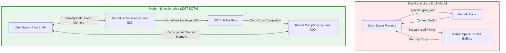
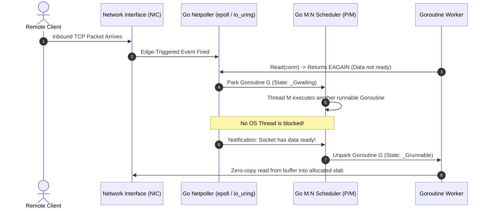

> **Multi-Language Edition:** This chapter is also available in Vietnamese at [Chương 1: Các Hệ Thống Xử Lý Hàng Triệu Requests/s Ra Sao? (learn.tanhdev.com)](https://learn.tanhdev.com/series/high-concurrency-systems/how-systems-handle-c10m/).

[Previous: Executive Summary](/series/high-concurrency-systems/executive-summary/) | [Series Hub](/series/high-concurrency-systems/) | [Next: Chapter 2 — Caching Vulnerabilities & Go Singleflight](/series/high-concurrency-systems/caching-vulnerabilities-penetration-breakdown-avalanche/)

---

> **Answer-First:** Building a C10M-capable Golang backend requires bypassing OS kernel bottlenecks through three core design shifts: (1) Replacing standard blocking network stacks with **io_uring** and **eBPF/XDP**, (2) Utilizing the Go runtime's **Netpoller** with custom worker pools to eliminate unbounded goroutine scheduling overhead, and (3) Pre-allocating zero-allocation memory slabs via `sync.Pool` to keep GC stop-the-world pauses below 300 microseconds.

---

## 1. The I/O Evolution: From Epoll to Linux io_uring

When handling 10 million concurrent TCP sockets, the Linux operating system spends the vast majority of its compute cycles on system calls (`syscall`), page table updates, and context switches between User Space and Kernel Space.

While `epoll` revolutionized high-concurrency by replacing `select` and `poll` (transforming \(O(N)\) socket iteration into \(O(1)\) event notifications), it still requires an explicit system call (`epoll_wait`, `read`, `write`) for every batch of I/O events. At 500,000 requests per second, syscall overhead consumes up to 45% of total CPU cycles.


```mermaid
flowchart TD
    subgraph TraditionalEpoll ["Traditional Linux Epoll Model"]
        E1["User Space Process"] -->|syscall: epoll_wait| K1["Kernel Space"]
        K1 -->|Context Switch| E1
        E1 -->|syscall: read / write| K2["Kernel Space Socket Buffers"]
        K2 -->|Memory Copy| E1
    end

    subgraph LinuxIoUring ["Modern Linux io_uring (2027 SOTA)"]
        U1["User Space Ring Buffer"] <-->|Zero-Syscall Shared Memory| K3["Kernel Submission Queue (SQ)"]
        K3 -->|Kernel Worker Async I/O| K4["NIC / NVMe Ring"]
        K4 -->|Zero-Copy Completion| K5["Kernel Completion Queue (CQ)"]
        K5 <-->|Zero-Syscall Shared Memory| U1
    end

    classDef legacy fill:#ffebee,stroke:#c62828,stroke-width:2px;
    classDef sota fill:#e8f5e9,stroke:#2e7d32,stroke-width:2px;
    class TraditionalEpoll legacy;
    class LinuxIoUring sota;
```

With **Linux io_uring**, User Space and Kernel Space share two lock-free ring buffers: the **Submission Queue (SQ)** and the **Completion Queue (CQ)**. Applications submit I/O requests directly into memory without issuing a single trap or context switch. The kernel processes requests asynchronously and writes completions directly to the CQ, achieving near-hardware wire-speed throughput.

---

## 2. Go Runtime Netpoller & M:N Scheduling Internals

Go manages concurrency via its **M:N scheduler** (\(M\) OS threads multiplexing \(N\) Goroutines across \(P\) logical processors). The secret weapon behind Go's network performance is the **Netpoller**.

When a Goroutine performs a network read on a non-blocking socket (`net.Conn`), the Go runtime parks the goroutine if data is not immediately ready. Instead of blocking an OS thread, the Netpoller registers the socket's file descriptor with the OS event notification system (`epoll` on Linux, `kqueue` on macOS).


```mermaid
sequenceDiagram
    autonumber
    actor Client as Remote Client
    participant Net as Network Interface (NIC)
    participant Poller as Go Netpoller (epoll / io_uring)
    participant Sched as Go M:N Scheduler (P/M)
    participant G as Goroutine Worker

    Client->>Net: Inbound TCP Packet Arrives
    Net->>Poller: Edge-Triggered Event Fired
    G->>Poller: Read(conn) -> Returns EAGAIN (Data not ready)
    Poller->>Sched: Park Goroutine G (State: _Gwaiting)
    Sched->>Sched: Thread M executes another runnable Goroutine
    Note over Poller,Sched: No OS Thread is blocked!
    Poller->>Sched: Notification: Socket has data ready!
    Sched->>G: Unpark Goroutine G (State: _Grunnable)
    G->>Net: Zero-copy read from buffer into allocated slab
```

### Essential Kernel Sysctl Configuration for C10M

To allow Linux to accept and maintain 10 million concurrent sockets without dropping packets:

```bash
# /etc/sysctl.d/99-c10m.conf
# Maximum open file descriptors across the OS
fs.file-max = 20971520
fs.nr_open = 20971520

# Socket memory bounds: min, default, max (Bytes)
# Keeps minimum buffer to 4KB so 10M sockets fit in 48GB RAM
net.ipv4.tcp_rmem = 4096 87380 16777216
net.ipv4.tcp_wmem = 4096 65536 16777216

# Connection queue backlog
net.core.somaxconn = 65535
net.ipv4.tcp_max_syn_backlog = 65535

# Enable TCP BBR congestion control
net.core.default_qdisc = fq
net.ipv4.tcp_congestion_control = bbr

# Socket reuse and fast recycling
net.ipv4.tcp_tw_reuse = 1
net.ipv4.tcp_fin_timeout = 15
```

---

## 3. Zero-Allocation Memory Management with `sync.Pool`

Under high RPS, allocating request objects and byte buffers on the Go heap causes severe GC stop-the-world pauses. Implementing an efficient `sync.Pool` pattern recycles pre-allocated buffers across request lifecycles:

```go
package bufferpool

import (
	"bytes"
	"sync"
)

var packetPool = sync.Pool{
	New: func() any {
		// Pre-allocate 4KB buffer matching MTU/TCP window
		b := make([]byte, 4096)
		return bytes.NewBuffer(b[:0])
	},
}

func AcquireBuffer() *bytes.Buffer {
	return packetPool.Get().(*bytes.Buffer)
}

func ReleaseBuffer(b *bytes.Buffer) {
	b.Reset()
	packetPool.Put(b)
}
```

---

## Frequently Asked Questions (FAQ)


While epoll requires the Go runtime to issue an `epoll_wait` system call to discover readiness, followed by separate `read` or `write` system calls for each socket, Linux io_uring uses lock-free shared memory ring buffers. A Go worker can queue hundreds of asynchronous read/write operations without executing a single kernel transition or system call. This slashes CPU context switching by up to 50% under 500k+ RPS.



Each goroutine begins with a minimum 2KB stack. One million goroutines require 2GB of RAM merely for stack frames. As these goroutines perform work and expand their stacks (up to 1GB max per goroutine), physical RAM is quickly exhausted. Furthermore, the Go runtime's work-stealing scheduler must iterate and balance runnable queues across P processors, resulting in massive scheduler overhead and catastrophic GC scan durations.



eBPF with XDP (eXpress Data Path) executes verified byte-code programs directly inside the network card driver before Linux allocates the `sk_buff` kernel structure. Malicious packets, SYN floods, or rate-limited IP ranges can be dropped at wire speed (processing over 20 million packets per second per server), completely shielding the Go application and OS networking stack from volumetric denial-of-service storms.


---

## Next Steps

Continue to [Chapter 2: The 3 Caching Vulnerabilities & Go Singleflight](/series/high-concurrency-systems/caching-vulnerabilities-penetration-breakdown-avalanche/) to master multi-tiered cache protection and stampede mitigation.
