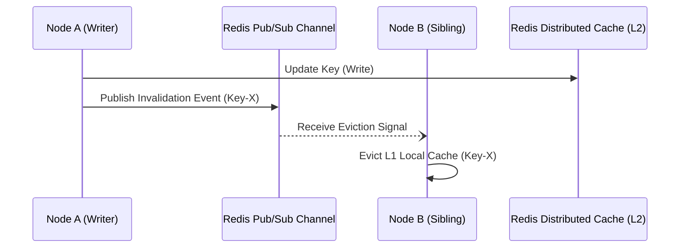

> **Prerequisite:** Before reading this chapter, please ensure you have read the previous article in this series: [Chapter 1: How Systems Handle Millions of Requests/s (C10M)? Lessons from Shopee & Alipay]().

Caching is the ultimate shield for databases in distributed systems. However, poorly implemented caches can become the exact reason your system crashes. In this chapter, we dissect three classic caching phenomenons and how to defend against them using Golang.

---

## 1. Cache Penetration & Bloom Filter Mathematics

Cache penetration occurs when attackers query non-existent IDs, bypassing the cache entirely. Defend against it by caching `NULL` values or utilizing Bloom Filters at the memory level.

An attacker or a logic bug continuously sends requests for IDs that do not exist (e.g., `ID = -1` or random UUIDs). Since the data does not exist in the Database, it is NEVER written to the Cache. Consequently, every malicious request "penetrates" the cache and hits the DB directly. At 10,000 RPS, the Database will exhaust its connection pool and crash.

### Hardening Cache Penetration
- **Cache Null Values:** If the DB query returns empty, force Redis to store a `NULL` or `Not_Found` value with a short TTL (e.g., 60 seconds). Subsequent requests will be blocked at Redis.
- **Bloom Filters:** Use a Bloom Filter to verify if an ID "probably exists" with near-zero memory overhead. If the Bloom Filter says NO, block the request instantly without touching the network.

### Bloom Filter False-Positive Mathematics
A Bloom Filter is a space-efficient probabilistic data structure represented by an array of $m$ bits, all initially set to 0. To insert an element, we run it through $k$ independent hash functions, each mapping the element to one of the $m$ array positions, and set those bits to 1.

To query if an element is present, we hash it using the same $k$ functions and check the corresponding bits. If any bit is 0, the element is definitely not in the filter. If all bits are 1, the element might be in the filter. This introduces a False Positive probability ($p$).

Given $n$ inserted elements, the probability that a specific bit is still 0 after all elements have been hashed is:
$$q = \left(1 - \frac{1}{m}\right)^{kn} \approx e^{-kn/m}$$

The probability that a specific bit is 1 is $1 - q$. Therefore, the probability of a false positive (that all $k$ bits are 1 for an element not in the filter) is:
$$p \approx \left(1 - e^{-kn/m}\right)^k$$

To minimize $p$ for a given bit array size $m$ and number of elements $n$, the optimal number of hash functions $k$ is:
$$k = \frac{m}{n} \ln 2$$

For example, if we allocate 10 bits per element ($m/n = 10$), the optimal number of hash functions is $k \approx 7$, which yields a false-positive rate of:
$$p \approx (1 - e^{-0.693})^7 \approx 0.00819 \approx 0.82\%$$

This mathematical guarantee allows us to block over 99% of invalid requests at the API gateway layer before they consume database or network resources.

---

## 2. Cache Avalanche & TTL Jittering

Cache Avalanche happens when massive amounts of keys expire simultaneously, sending a surge of queries to the DB. Prevent it by adding a random jitter offset to your TTLs.

This phenomenon occurs when a massive batch of Cache Keys expires **at the exact same time**. For example, if you reset loyalty points at midnight and set a 1-hour TTL for 1 million users, exactly at 1:00 AM, 1 million keys will vanish. Every request hitting the system at 1:00:01 AM will bypass the empty cache and form an "avalanche" that crushes the database.

### Hardening Cache Avalanche
- **TTL Jittering:** Never hardcode an exact TTL. Always add a random time offset (Jitter). Instead of exactly 60 minutes, assign a random TTL between `55` and `65` minutes.

---

## 3. Cache Breakdown & Stampede Prevention

Cache Breakdown occurs when a single highly-accessed "Hot Key" expires, causing thousands of concurrent requests to query the DB simultaneously. Go's `singleflight` groups these identical requests into a single DB query.

While an Avalanche involves 1 million normal keys expiring together, Breakdown involves **1 super Hot Key** (e.g., a Flash Sale product) suddenly expiring. At the very millisecond the TTL hits zero, 100,000 users are refreshing the page. Experiencing a Cache Miss, all 100,000 requests stampede toward the database to repopulate the cache. The DB bursts into flames instantly.

### Multi-Level Cache Synchronization
In microservices, architectures deploy a two-tiered caching system:
1. **L1 (Local Cache):** Ultra-fast local memory cache (e.g. FreeCache, Go-Cache) in user process space.
2. **L2 (Distributed Cache):** Centralized Redis cluster shared by all API nodes.

Keeping L1 caches synchronized across scaled-out pods requires an active invalidation channel. When a write operation updates a value, the node publishing the update broadcasts an invalidation event via Redis Pub/Sub to trigger memory eviction on all sibling nodes.



### Cache Stampede Prevention (The XFetch Algorithm)
While `singleflight` protects an individual application process from the Thundering Herd, it does not prevent cache stampedes across separate API servers in a Kubernetes cluster. To solve this, we implement the **XFetch** algorithm (a probabilistic early expiration algorithm).

Instead of waiting for the key to reach its hard expiration time, XFetch periodically triggers an early asynchronous refresh based on a probability threshold as the key nears its TTL. The probability of triggering a refresh is calculated as:
$$\text{refresh} = -\beta \cdot \delta \cdot \ln(\text{rand}())$$

Where:
- $\beta$ is a configuration constant ($>0$). Higher values increase the probability of early background refresh.
- $\delta$ is the computation time (in milliseconds) required to fetch the data from the database.
- $\text{rand}()$ is a random float between 0 and 1.

If the remaining TTL is less than the calculated threshold, the application initiates an asynchronous query to fetch fresh data and update the cache.

---

## Go Implementation: Hardening with Singleflight & XFetch

The following Go code implements a high-performance cache manager that utilizes both `golang.org/x/sync/singleflight` to prevent process-level breakdown and the probabilistic XFetch algorithm to eliminate cluster-level cache stampedes.

```go
package main

import (
	"context"
	"fmt"
	"math"
	"math/rand"
	"sync"
	"time"

	"golang.org/x/sync/singleflight"
)

// CacheItem wraps the cached value with tracking metadata.
type CacheItem struct {
	Value      interface{}
	TTL        time.Duration
	ExpiresAt  time.Time
	DeltaMs    float64 // Time taken to compute (fetch) the value in milliseconds
}

// CacheManager manages L1 memory caching, L2 calls, and singleflight groups.
type CacheManager struct {
	mu           sync.RWMutex
	l1Cache      map[string]*CacheItem
	sfGroup      singleflight.Group
	beta         float64 // XFetch parameter
	fetchCounter int64
}

// NewCacheManager initializes the cache store.
func NewCacheManager(beta float64) *CacheManager {
	return &CacheManager{
		l1Cache: make(map[string]*CacheItem),
		beta:    beta,
	}
}

// Fetch retrieves the item. If missing or early expired, triggers singleflight db read.
func (cm *CacheManager) Fetch(ctx context.Context, key string, fetchFunc func() (interface{}, time.Duration, error)) (interface{}, error) {
	cm.mu.RLock()
	item, exists := cm.l1Cache[key]
	cm.mu.RUnlock()

	// 1. Probabilistic Early Expiration (XFetch Check)
	if exists {
		remainingTTL := time.Until(item.ExpiresAt).Seconds()
		// XFetch algorithm logic: -beta * delta * ln(rand())
		randVal := rand.Float64()
		if randVal == 0 {
			randVal = 0.0001 // Avoid log(0)
		}
		
		threshold := -cm.beta * (item.DeltaMs / 1000.0) * math.Log(randVal)
		
		// If remaining TTL is less than calculated threshold, trigger early fetch
		if remainingTTL <= threshold {
			fmt.Printf("[XFetch Triggered] Key: %s, Remaining TTL: %.2fs, Threshold: %.2fs\n", key, remainingTTL, threshold)
			go func() {
				_, _, _ = cm.doSingleflightFetch(key, fetchFunc)
			}()
		}
		return item.Value, nil
	}

	// 2. Direct Cache Miss - execute singleflight
	val, err, _ := cm.doSingleflightFetch(key, fetchFunc)
	return val, err
}

func (cm *CacheManager) doSingleflightFetch(key string, fetchFunc func() (interface{}, time.Duration, error)) (interface{}, error, bool) {
	v, err, shared := cm.sfGroup.Do(key, func() (interface{}, error) {
		start := time.Now()
		
		// Fetch fresh data from DB
		dbVal, ttl, err := fetchFunc()
		if err != nil {
			return nil, err
		}
		
		delta := float64(time.Since(start).Milliseconds())

		cm.mu.Lock()
		cm.l1Cache[key] = &CacheItem{
			Value:     dbVal,
			TTL:       ttl,
			ExpiresAt: time.Now().Add(ttl),
			DeltaMs:   delta,
		}
		cm.mu.Unlock()

		return dbVal, nil
	})

	return v, err, shared
}

// Simulated database call.
func fetchProductFromDB() (interface{}, time.Duration, error) {
	time.Sleep(150 * time.Millisecond) // Simulate slow DB query
	return "Product Details JSON Payload", 10 * time.Second, nil
}

func main() {
	// Initialize manager with beta = 1.0
	cache := NewCacheManager(1.0)
	
	// First fetch (Cache Miss)
	val, err := cache.Fetch(context.Background(), "product_123", fetchProductFromDB)
	if err != nil {
		fmt.Printf("Error: %v\n", err)
	} else {
		fmt.Printf("Fetched Value: %s\n", val)
	}

	// Wait 8 seconds to get close to the 10s TTL
	time.Sleep(8 * time.Second)

	// Second fetch (Likely triggers XFetch early refresh asynchronously)
	val, err = cache.Fetch(context.Background(), "product_123", fetchProductFromDB)
	if err != nil {
		fmt.Printf("Error: %v\n", err)
	} else {
		fmt.Printf("Fetched Value (Cached): %s\n", val)
	}

	// Wait for background routine
	time.Sleep(500 * time.Millisecond)
}
```

By combining `singleflight` (node-level protection) and XFetch (cluster-level protection), you create an impenetrable caching layer, shielding the database from peak traffic stampedes.

---

## 🎯 Architecture Review & Consulting (Hire Me)

If your enterprise e-commerce or B2B platform is struggling with slow database queries, checkout timeouts, or scaling bottlenecks, don't let it jeopardize your business revenue.

👉 **[Book a 1:1 Architecture Consultation this week](/hire/)** with Lê Tuấn Anh (Vesviet) to identify bottlenecks and implement proven scaling strategies.

---

[← Previous]() | [Series hub]() | [Next →]()

