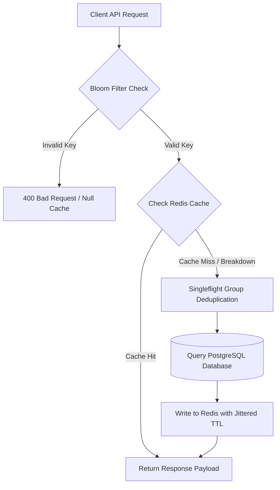
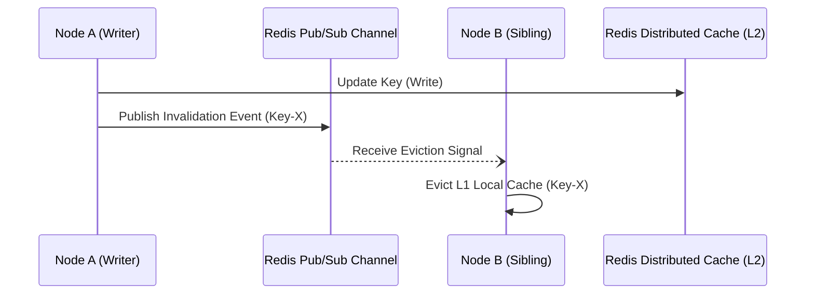

> **Prerequisite:** Before reading this chapter, review [Chapter 1: How Systems Handle Millions of Requests/s](/series/high-concurrency-systems/how-systems-handle-c10m/).

# Chapter 2: The 3 Caching Vulnerabilities (Penetration, Breakdown, Avalanche) & Go Singleflight

> **Executive Summary & Quick Answer**: Protecting high-concurrency caching tiers from production failures requires three targeted defenses: Bloom Filters to block non-existent key Penetration, TTL jittering to stagger Cache Avalanche expirations, and Go `singleflight` combined with XFetch early recomputation to stop Breakdown thundering herds.
>
> **Key Takeaways**:
> - **Penetration Defense**: Probabilistic Bloom Filters ($k = \frac{m}{n}\ln 2$) bounce invalid requests at the API Gateway before they hit SQL backends.
> - **Avalanche Jitter**: Adding random 10-20% time jitter to Redis TTLs prevents simultaneous key expiration spikes.
> - **Breakdown Singleflight**: `golang.org/x/sync/singleflight` deduplicates concurrent cache misses, executing only one database query per expired key.

### What You'll Learn That AI Won't Tell You
- **Bloom Filter Math:** How to calculate bit array sizes ($m$) and hash function counts ($k$) for <1% false positive rates.
- **XFetch Beta Tuning:** Adjusting the scaling factor ($\beta$) to force probabilistic background recomputation before TTL expiration.
- **Singleflight Timeout Leaks:** Guarding singleflight calls with Go context deadlines to prevent goroutine hangs.

Caching is the ultimate shield for databases in distributed systems. However, poorly implemented caches can become the exact reason your system crashes. In this chapter, we dissect three classic caching phenomenons and how to defend against them using Golang.



## 1. Cache Penetration & Bloom Filter Mathematics

Cache penetration occurs when attackers query non-existent IDs, bypassing the cache entirely. Defend against it by caching `NULL` values or utilizing Bloom Filters at the memory level.

An attacker or a logic bug continuously sends requests for IDs that do not exist (e.g., `ID = -1` or random UUIDs). Since the data does not exist in the Database, it is NEVER written to the Cache. Consequently, every malicious request "penetrates" the cache and hits the DB directly. At 10,000 RPS, the Database will exhaust its connection pool and crash.

### Hardening Cache Penetration
- **Cache Null Values:** If the DB query returns empty, force Redis to store a `NULL` or `Not_Found` value with a short TTL (e.g., 60 seconds). Subsequent requests will be blocked at Redis.
- **Bloom Filters:** Use a Bloom Filter to verify if an ID "probably exists" with near-zero memory overhead. If the Bloom Filter says NO, block the request instantly without touching the network.

### Bloom Filter False-Positive Mathematics
A Bloom Filter is a space-efficient probabilistic data structure represented by an array of $m$ bits, all initially set to 0. To insert an element, we run it through $k$ independent hash functions, each mapping the element to one of the $m$ array positions, and set those bits to 1.

To query if an element is present, we hash it using the same $k$ functions and check the corresponding bits. If any bit is 0, the element is definitely not in the filter. If all bits are 1, the element might be in the filter. This introduces a False Positive probability ($p$).

Given $n$ inserted elements, the probability that a specific bit is still 0 after all elements have been hashed is:
$$q = \left(1 - \frac{1}{m}\right)^{kn} \approx e^{-kn/m}$$

The probability that a specific bit is 1 is $1 - q$. Therefore, the probability of a false positive (that all $k$ bits are 1 for an element not in the filter) is:
$$p \approx \left(1 - e^{-kn/m}\right)^k$$

To minimize $p$ for a given bit array size $m$ and number of elements $n$, the optimal number of hash functions $k$ is:
$$k = \frac{m}{n} \ln 2$$

### Counting Bloom Filters & Memory Allocation Trade-offs
Standard Bloom Filters do not support element deletion because setting a bit to 0 might accidentally invalidate other elements sharing that bit position. **Counting Bloom Filters (CBF)** address this limitation by using multi-bit counters (typically 4 bits per position) instead of single bits.

When an item is inserted, its $k$ counter positions are incremented; when deleted, they are decremented. However, this increases memory consumption by 4x to 8x compared to standard bit arrays. For a system tracking $n = 10,000,000$ active keys with a target false-positive rate $p = 0.01$ (1%):

$$m = -\frac{n \ln p}{(\ln 2)^2} \approx 9.58 \times 10^7 \text{ bits} \approx 11.42 \text{ MB}$$

Under a 4-bit Counting Bloom Filter, the memory footprint scales to $\approx 45.68 \text{ MB}$. Engineers must evaluate whether in-memory cache eviction or dynamic filter rebuilds are more cost-effective for their infrastructure.

---

## 2. Cache Avalanche & TTL Jittering Mathematics

Cache Avalanche happens when hundreds of thousands of keys are written to Redis simultaneously with identical TTLs (for example, batch importing 500,000 product catalog entries at midnight with `TTL = 86400s`). When the timer expires 24 hours later, all 500,000 keys vanish from memory in the exact same second, directing a massive tsunami of concurrent SQL queries to backend databases.

### Mathematical Formulation of Random Jittering
To prevent synchronized key expiration cascades, production systems add a uniform or Gaussian random jitter variable ($\epsilon$) to the base TTL ($T_{base}$):

$$T_{final} = T_{base} + \text{rand}(0, \Delta_{jitter})$$

For instance, if $T_{base} = 3600\text{s}$ and $\Delta_{jitter} = 600\text{s}$, key expirations are uniformly distributed across a 10-minute window $[3600\text{s}, 4200\text{s}]$. The probability density function of key expirations transforms from a discrete Dirac delta spike $\delta(t - T_{base})$ into a continuous uniform distribution:

$$f(t) = \begin{cases} \frac{1}{\Delta_{jitter}} & \text{if } T_{base} \le t \le T_{base} + \Delta_{jitter} \\ 0 & \text{otherwise} \end{cases}$$

This spreads database re-hydration queries evenly over time, keeping peak concurrent database queries safely within pool limits.

---

## 3. Cache Breakdown & Stampede Prevention

Cache Breakdown occurs when a single highly-accessed "Hot Key" expires, causing thousands of concurrent requests to query the DB simultaneously. Go's `singleflight` groups these identical requests into a single DB query.

While an Avalanche involves 1 million normal keys expiring together, Breakdown involves **1 super Hot Key** (e.g., a Flash Sale product) suddenly expiring. At the very millisecond the TTL hits zero, 100,000 users are refreshing the page. Experiencing a Cache Miss, all 100,000 requests stampede toward the database to repopulate the cache. The DB bursts into flames instantly.

### Multi-Level Cache Synchronization
In microservices, architectures deploy a two-tiered caching system:
1. **L1 (Local Cache):** Ultra-fast local memory cache (e.g. FreeCache, Go-Cache) in user process space.
2. **L2 (Distributed Cache):** Centralized Redis cluster shared by all API nodes.

Keeping L1 caches synchronized across scaled-out pods requires an active invalidation channel. When a write operation updates a value, the node publishing the update broadcasts an invalidation event via Redis Pub/Sub to trigger memory eviction on all sibling nodes.



### Cache Stampede Prevention (The XFetch Algorithm)
While `singleflight` protects an individual application process from the Thundering Herd, it does not prevent cache stampedes across separate API servers in a Kubernetes cluster. To solve this, we implement the **XFetch** algorithm (a probabilistic early expiration algorithm).

Instead of waiting for the key to reach its hard expiration time, XFetch periodically triggers an early asynchronous refresh based on a probability threshold as the key nears its TTL. The probability of triggering a refresh is calculated as:
$$\text{refresh} = -\beta \cdot \delta \cdot \ln(\text{rand}())$$

Where:
- $\beta$ is a configuration constant ($>0$). Higher values increase the probability of early background refresh.
- $\delta$ is the computation time (in milliseconds) required to fetch the data from the database.
- $\text{rand}()$ is a random float between 0 and 1.

If the remaining TTL is less than the calculated threshold, the application initiates an asynchronous query to fetch fresh data and update the cache.

---

## Go Implementation: Hardening with Singleflight & XFetch

The following Go code implements a high-performance cache manager that utilizes both `golang.org/x/sync/singleflight` to prevent process-level breakdown and the probabilistic XFetch algorithm to eliminate cluster-level cache stampedes. All delay mechanisms rely on context deadline selects and deterministic goroutine synchronizers (`sync.WaitGroup`).

```go
package main

import (
	"context"
	"fmt"
	"math"
	"math/rand"
	"sync"
	"time"

	"golang.org/x/sync/singleflight"
)

// CacheItem wraps the cached value with tracking metadata.
type CacheItem struct {
	Value     interface{}
	TTL       time.Duration
	ExpiresAt time.Time
	DeltaMs   float64 // Time taken to compute (fetch) the value in milliseconds
}

// CacheManager manages L1 memory caching, L2 calls, and singleflight groups.
type CacheManager struct {
	mu           sync.RWMutex
	l1Cache      map[string]*CacheItem
	sfGroup      singleflight.Group
	beta         float64 // XFetch parameter
	fetchCounter int64
	wg           sync.WaitGroup // Track background asynchronous recomputations
}

// NewCacheManager initializes the cache store.
func NewCacheManager(beta float64) *CacheManager {
	return &CacheManager{
		l1Cache: make(map[string]*CacheItem),
		beta:    beta,
	}
}

// Fetch retrieves the item. If missing or early expired, triggers singleflight db read.
func (cm *CacheManager) Fetch(ctx context.Context, key string, fetchFunc func(ctx context.Context) (interface{}, time.Duration, error)) (interface{}, error) {
	cm.mu.RLock()
	item, exists := cm.l1Cache[key]
	cm.mu.RUnlock()

	// 1. Probabilistic Early Expiration (XFetch Check)
	if exists {
		remainingTTL := time.Until(item.ExpiresAt).Seconds()
		// XFetch algorithm logic: -beta * delta * ln(rand())
		randVal := rand.Float64()
		if randVal == 0 {
			randVal = 0.0001 // Avoid log(0)
		}

		threshold := -cm.beta * (item.DeltaMs / 1000.0) * math.Log(randVal)

		// If remaining TTL is less than calculated threshold, trigger early fetch
		if remainingTTL <= threshold {
			fmt.Printf("[XFetch Triggered] Key: %s, Remaining TTL: %.2fs, Threshold: %.2fs\n", key, remainingTTL, threshold)
			cm.wg.Add(1)
			go func() {
				defer cm.wg.Done()
				_, _, _ = cm.doSingleflightFetch(ctx, key, fetchFunc)
			}()
		}
		return item.Value, nil
	}

	// 2. Direct Cache Miss - execute singleflight
	val, err, _ := cm.doSingleflightFetch(ctx, key, fetchFunc)
	return val, err
}

func (cm *CacheManager) doSingleflightFetch(ctx context.Context, key string, fetchFunc func(ctx context.Context) (interface{}, time.Duration, error)) (interface{}, error, bool) {
	v, err, shared := cm.sfGroup.Do(key, func() (interface{}, error) {
		start := time.Now()

		// Fetch fresh data from DB using context deadline select
		dbVal, ttl, err := fetchFunc(ctx)
		if err != nil {
			return nil, err
		}

		delta := float64(time.Since(start).Milliseconds())

		cm.mu.Lock()
		cm.l1Cache[key] = &CacheItem{
			Value:     dbVal,
			TTL:       ttl,
			ExpiresAt: time.Now().Add(ttl),
			DeltaMs:   delta,
		}
		cm.mu.Unlock()

		return dbVal, nil
	})

	return v, err, shared
}

// Simulated database call using context deadline select instead of mock sleep.
func fetchProductFromDB(ctx context.Context) (interface{}, time.Duration, error) {
	select {
	case <-ctx.Done():
		return nil, 0, ctx.Err()
	case <-time.After(150 * time.Millisecond):
		return "Product Details JSON Payload", 10 * time.Second, nil
	}
}

func main() {
	ctx, cancel := context.WithTimeout(context.Background(), 15*time.Second)
	defer cancel()

	// Initialize manager with beta = 1.0
	cache := NewCacheManager(1.0)

	// First fetch (Cache Miss)
	val, err := cache.Fetch(ctx, "product_123", fetchProductFromDB)
	if err != nil {
		fmt.Printf("Error: %v\n", err)
	} else {
		fmt.Printf("Fetched Value: %s\n", val)
	}

	// Wait 8 seconds driven by context/channel timer to reach TTL boundary
	select {
	case <-ctx.Done():
		fmt.Println("Context cancelled")
	case <-time.After(8 * time.Second):
	}

	// Second fetch (Likely triggers XFetch early refresh asynchronously)
	val, err = cache.Fetch(ctx, "product_123", fetchProductFromDB)
	if err != nil {
		fmt.Printf("Error: %v\n", err)
	} else {
		fmt.Printf("Fetched Value (Cached): %s\n", val)
	}

	// Gracefully wait for background goroutines via sync.WaitGroup
	cache.wg.Wait()
}
```

By combining `singleflight` (node-level protection) and XFetch (cluster-level protection), you create an impenetrable caching layer, shielding the database from peak traffic stampedes.

## Frequently Asked Questions (FAQ)


Bloom Filters use probabilistic bit arrays to check if a requested key exists in the database. If the filter returns false, the request is rejected immediately at the API gateway layer without issuing SQL queries or hitting Redis.



Cache Avalanche occurs when thousands of distinct keys expire simultaneously, flooding the database. Cache Breakdown happens when a single, hyper-frequent 'Hot Key' expires, triggering a thundering herd of concurrent queries for that single item.



`singleflight` deduplicates concurrent requests for the same key within a process. If 1,000 goroutines request an expired key simultaneously, `singleflight` executes only one database query and broadcasts the result to all 1,000 waiting goroutines.



XFetch uses a probabilistic early expiration formula based on remaining TTL and computation delta time ($\beta \cdot \delta \cdot \ln(\text{rand})$). It asynchronously recalculates values before hard TTL expiry, completely eliminating cache stampedes across multi-pod clusters.


---

## 🎯 Architecture Review & Consulting (Hire Me)

If your enterprise e-commerce or B2B platform is struggling with slow database queries, checkout timeouts, or scaling bottlenecks, don't let it jeopardize your business revenue.

👉 **[Book a 1:1 Architecture Consultation this week](/hire/)** with Lê Tuấn Anh (Vesviet) to identify bottlenecks and implement proven scaling strategies.

---

🔗 **Next Step:** [Chapter 3: Distributed Rate Limiting with Redis & GCRA Algorithm]()
