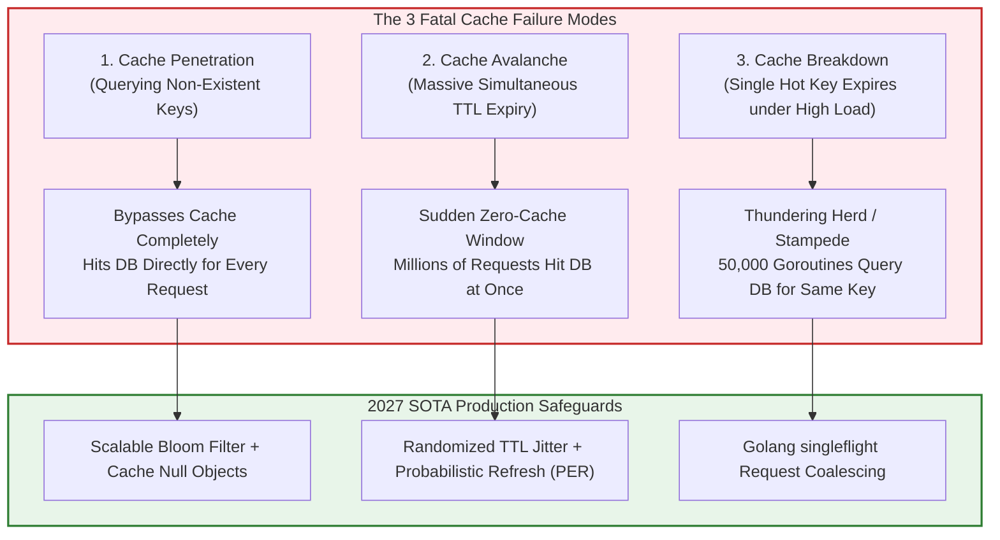
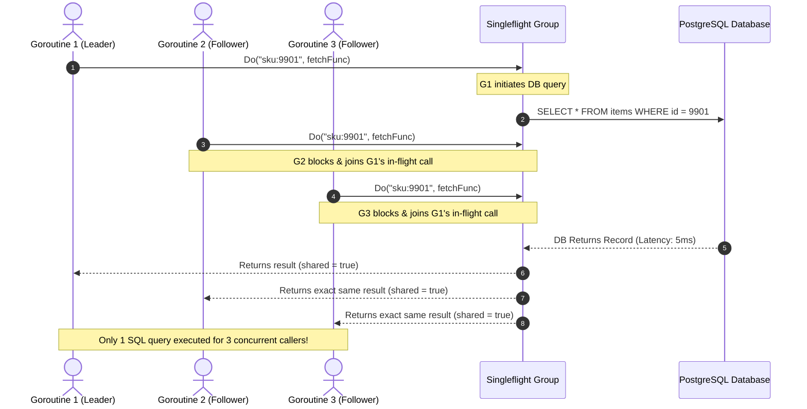

> **Multi-Language Edition:** This chapter is also available in Vietnamese at [Chương 2: 3 Điểm Yếu Của Caching & Kỹ Thuật Go Singleflight (learn.tanhdev.com)](https://learn.tanhdev.com/series/high-concurrency-systems/caching-vulnerabilities-penetration-breakdown-avalanche/).

[Previous: Chapter 1 — High Concurrency System Design in Go](/series/high-concurrency-systems/how-systems-handle-c10m/) | [Series Hub](/series/high-concurrency-systems/) | [Next: Chapter 3 — Distributed Rate Limiting with Redis & GCRA](/series/high-concurrency-systems/distributed-rate-limiting-redis-gcra/)

---

> **Answer-First:** Caching at C10M scale requires a multi-layered defense against three fatal production failure modes: (1) **Cache Penetration** (non-existent keys bypassing cache) is eliminated using in-memory **Scalable Bloom/Cuckoo Filters** and null-object caching; (2) **Cache Avalanche** (simultaneous expiration of millions of keys) is prevented by adding randomized **TTL Jitter** (e.g., \(\text{base} \pm 15\%\)) and asynchronous background re-warming; and (3) **Cache Breakdown / Stampede** (a single hot key expiring under massive concurrency) is completely solved using Go's \`golang.org/x/sync/singleflight\` to coalesce thousands of concurrent requests into a single database query.

---

## 1. Anatomy of the 3 Caching Catastrophes

In distributed architectures, caching is not merely a performance enhancement—it is the primary shield that protects fragile relational databases from catastrophic overload. If this shield cracks, database connection pools exhaust in seconds, causing total system blackout.


```mermaid
flowchart TD
    subgraph Attacks ["The 3 Fatal Cache Failure Modes"]
        A1["1. Cache Penetration<br/>(Querying Non-Existent Keys)"] --> D1["Bypasses Cache Completely<br/>Hits DB Directly for Every Request"]
        A2["2. Cache Avalanche<br/>(Massive Simultaneous TTL Expiry)"] --> D2["Sudden Zero-Cache Window<br/>Millions of Requests Hit DB at Once"]
        A3["3. Cache Breakdown<br/>(Single Hot Key Expires under High Load)"] --> D3["Thundering Herd / Stampede<br/>50,000 Goroutines Query DB for Same Key"]
    end

    subgraph Defenses ["2027 SOTA Production Safeguards"]
        D1 --> S1["Scalable Bloom Filter + Cache Null Objects"]
        D2 --> S2["Randomized TTL Jitter + Probabilistic Refresh (PER)"]
        D3 --> S3["Golang singleflight Request Coalescing"]
    end

    classDef danger fill:#ffebee,stroke:#c62828,stroke-width:2px;
    classDef safe fill:#e8f5e9,stroke:#2e7d32,stroke-width:2px;
    class Attacks danger;
    class Defenses safe;
```

---

## 2. Solving Cache Breakdown with `golang.org/x/sync/singleflight`

When an ultra-popular flash-sale item's cache key expires, 50,000 goroutines querying the database at the exact same millisecond will trigger a **Thundering Herd**.

Go's official `singleflight.Group` provides a lock-free deduplication mechanism: concurrent goroutines requesting the exact same key share the execution of a single leader goroutine.


```mermaid
sequenceDiagram
    autonumber
    actor G1 as Goroutine 1 (Leader)
    actor G2 as Goroutine 2 (Follower)
    actor G3 as Goroutine 3 (Follower)
    participant SF as Singleflight Group
    participant DB as PostgreSQL Database

    G1->>SF: Do("sku:9901", fetchFunc)
    Note over SF: G1 initiates DB query
    SF->>DB: SELECT * FROM items WHERE id = 9901
    G2->>SF: Do("sku:9901", fetchFunc)
    Note over G2,SF: G2 blocks & joins G1's in-flight call
    G3->>SF: Do("sku:9901", fetchFunc)
    Note over G3,SF: G3 blocks & joins G1's in-flight call
    DB-->>SF: DB Returns Record (Latency: 5ms)
    SF-->>G1: Returns result (shared = true)
    SF-->>G2: Returns exact same result (shared = true)
    SF-->>G3: Returns exact same result (shared = true)
    Note over G1,G3: Only 1 SQL query executed for 3 concurrent callers!
```

### Production Implementation in Go

```go
package cache

import (
	"context"
	"encoding/json"
	"fmt"
	"time"

	"github.com/redis/go-redis/v9"
	"golang.org/x/sync/singleflight"
)

type CacheService struct {
	rdb redis.UniversalClient
	sf  singleflight.Group
}

func (s *CacheService) GetItem(ctx context.Context, itemID int64) (*Item, error) {
	key := fmt.Sprintf("item:%d", itemID)

	// 1. Check L2 Redis Cache
	val, err := s.rdb.Get(ctx, key).Bytes()
	if err == nil {
		var item Item
		_ = json.Unmarshal(val, &item)
		return &item, nil
	}

	// 2. Cache Miss: Coalesce concurrent DB lookups via Singleflight
	res, err, _ := s.sf.Do(key, func() (any, error) {
		// Double-check cache inside leader in case another thread just populated it
		if val, err := s.rdb.Get(ctx, key).Bytes(); err == nil {
			var item Item
			_ = json.Unmarshal(val, &item)
			return &item, nil
		}

		// Query Database directly (executed by only 1 goroutine)
		item, err := queryDBForItem(ctx, itemID)
		if err != nil {
			return nil, err
		}

		// Asynchronously populate cache with TTL jitter
		go func() {
			data, _ := json.Marshal(item)
			ttl := 10*time.Minute + time.Duration(time.Now().UnixNano()%60)*time.Second
			_ = s.rdb.Set(context.Background(), key, data, ttl).Err()
		}()

		return item, nil
	})

	if err != nil {
		return nil, err
	}
	return res.(*Item), nil
}
```

---

## 3. Probabilistic Early Refresh: The XFetch Algorithm

Rather than waiting for a cache key to expire and risking a stampede, the **Probabilistic Early Refresh (PER / XFetch)** algorithm computes whether a read operation should proactively refresh the cache in the background:

$$\text{Refresh Condition: } -\beta \cdot \delta \cdot \ln(\text{rand}()) > \text{remaining\_TTL}$$

Where:
- $\beta > 0$ is an aggressiveness constant (typically set to 1.0).
- $\delta$ is the delta computation time required to query the database and serialize the record.
- $\text{rand}() \in (0, 1)$ is a uniform random variable.

As the remaining TTL approaches zero and read traffic increases, the probability of a background reader triggering an asynchronous refresh approaches 100%, guaranteeing that hot keys **never experience a cache miss in production**.

---

## Frequently Asked Questions (FAQ)


A Bloom Filter is a space-efficient probabilistic data structure that tests whether an element is definitely NOT in a set, or PROBABLY in a set. By loading all valid IDs into an in-memory Bloom filter (or Redis RedisBloom), any request with an invalid or malicious ID is rejected immediately in memory with zero database queries. If the filter returns false, the record definitely does not exist in PostgreSQL.



\`singleflight.Do\` blocks the calling goroutine until the leader operation finishes. If the leader query hangs due to a slow database lock, all waiting goroutines remain blocked. In contrast, \`singleflight.DoChan\` returns a Go channel immediately, allowing callers to use a \`select\` statement with a \`context.WithTimeout\`. If the DB query takes too long, follower goroutines can abort and return fallback data or an HTTP 504 Gateway Timeout without leaking memory.



Fixed TTL offsets (e.g., always adding 30 seconds) simply shift the exact moment of the stampede by 30 seconds into the future. A continuous random distribution (e.g., \(TTL_{\text{actual}} = TTL_{\text{base}} + \text{rand}(-15\%, +15\%)\)) spreads the expiration timestamps of 100,000 keys uniformly across a broad time window, transforming a sharp spike of database load into a negligible, flat background trickle.


---

## Next Steps

Proceed to [Chapter 3: Distributed Rate Limiting with Redis & GCRA](/series/high-concurrency-systems/distributed-rate-limiting-redis-gcra/) to master distributed traffic throttling and the Generic Cell Rate Algorithm.
