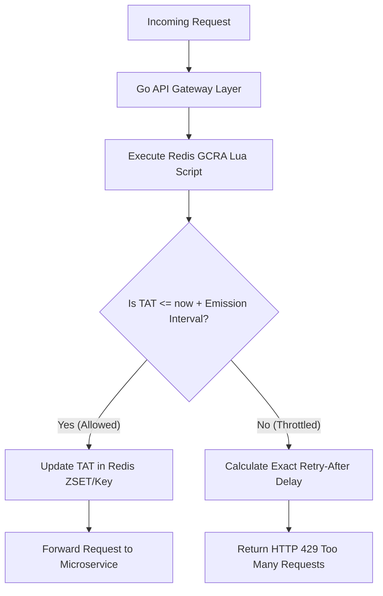

> **Prerequisite:** Before reading this chapter, review [Chapter 2: The 3 Caching Vulnerabilities](/series/high-concurrency-systems/caching-vulnerabilities-penetration-breakdown-avalanche/).

# Chapter 3: Distributed Rate Limiting with Redis & GCRA Algorithm

> **Executive Summary & Quick Answer**: Distributed rate limiting in microservice architectures requires centralized state management in Redis to avoid load-balancer bypasses. Implementing the Generic Cell Rate Algorithm (GCRA) via atomic Lua scripts tracks Theoretical Arrival Times (TAT) using a single 64-bit integer per user key, guaranteeing sub-millisecond execution.
>
> **Key Takeaways**:
> - **Local Limiter Flaws**: Local in-memory limiters fail under multi-node load balancers because traffic distribution allows clients to multiply effective throughput limits.
> - **GCRA Efficiency**: GCRA tracks arrival time deltas rather than token counts, requiring only one Redis key lookup per request.
> - **Lua Atomicity**: Executing GCRA calculations inside Redis Lua scripts eliminates race conditions between concurrent API Gateway nodes.

### What You'll Learn That AI Won't Tell You
- **GCRA TAT Mathematics:** How Theoretical Arrival Time formulas ($TAT = \max(now, TAT) + \tau$) calculate exact retry delays.
- **Lua Script Race Conditions:** Why atomic execution in Redis single-threaded engine is mandatory for rate limit precision.
- **Memory Footprint Math:** Comparing GCRA (1 key/user) against Token Bucket and Sliding Window Log memory overheads.

If caching is the shield protecting your database, **Rate Limiting** is the armor guarding your API servers from DDoS attacks and resource exhaustion caused by abusive clients.



## 1. Why Local Rate Limiting Fails in Microservices

Local RAM limiters fail because Load Balancers distribute traffic across multiple nodes. A user allowed 100 req/sec can exploit a 5-node cluster by sending 500 req/sec, bypassing the intended limit. Centralized state via Redis is required.

A common mistake is using in-memory token counters (Local Cache) for rate limiters. Suppose the rule is: "100 Requests/sec per User". Your system has 5 backend servers. When User A blasts 500 requests concurrently, the Load Balancer routes 100 requests to each server. Since each server counts in its own isolated memory, it determines "User A just sent 100 requests, this is valid" and allows them all! The result: User A successfully bypasses the limit.

To solve this, we need a **Centralized State** managed by Redis.

---

## 2. Token Bucket vs Leaky Bucket vs GCRA Mathematics

Rate limiting algorithms govern how spikes in network traffic are smoothed or rejected. Choosing the right algorithm impacts CPU consumption, memory footprint, and Redis latency.

### Token Bucket (Traffic Policing)
The Token Bucket algorithm models a bucket of capacity $B$ that accumulates tokens at a constant rate $r$ tokens per second. When a request arrives, the system attempts to draw 1 token from the bucket:
$$T(t) = \min\left(B, T_{\text{prev}} + r \cdot (t - t_{\text{prev}})\right)$$

While Token Bucket supports sudden bursty traffic up to limit $B$, storing both the current token count and the last refill timestamp requires multi-field Redis hashes or complex GET/SET pairs.

### Sliding Window Log
Sliding Window Logs maintain every request's microsecond timestamp in a Redis Sorted Set (ZSET). Upon receiving a request, the algorithm purges timestamps older than $t - 1\text{s}$ using `ZREMRANGEBYSCORE` and counts remaining elements with `ZCARD`.

While exact, the memory cost per user scales linearly with request volume. At 1,000 requests/sec per user, storing 1,000 64-bit integer scores plus ZSET node overhead consumes $\approx 64 \text{ KB}$ per active user key, leading to Redis OOM under millions of concurrent users.

### Generic Cell Rate Algorithm (GCRA)
GCRA (leaky bucket variant codified in ATM network standards) solves the memory cost by replacing token counts with a single 64-bit timestamp called the **Theoretical Arrival Time (TAT)**.

```mermaid
flowchart TD
    Start([Incoming Request at Time t]) --> GetTAT[Retrieve TAT from Redis]
    GetTAT --> CheckNull{TAT exists?}
    CheckNull -- No --> InitTAT[Set TAT = t]
    CheckNull -- Yes --> CalculateNewTAT[Calculate NewTAT = max(t, TAT) + EmissionInterval]
    InitTAT --> Allow[Allow Request & Set Redis Key = TAT + EmissionInterval]
    CalculateNewTAT --> CheckLimit{NewTAT - t > BurstTolerance}
    CheckLimit -- Yes --> Reject[Reject Request - 429 Too Many Requests]
    CheckLimit -- No --> UpdateRedis[Update Redis Key = NewTAT]
    UpdateRedis --> Allow
```

In GCRA:
- **Emission Interval ($T$):** The reciprocal of the rate ($1 / \text{rate}$). E.g., for 100 req/sec, $T = 10\text{ms} = 10,000 \mu\text{s}$.
- **Burst Tolerance ($\tau$):** The maximum burst size times the Emission Interval. E.g., for a burst of 5 requests, $\tau = 5 \cdot T = 50\text{ms}$.
- When a request arrives at time $t$, if the difference between the theoretical arrival time ($TAT$) and $t$ exceeds $\tau$, the request violates the rate limit:
  $$\text{If } TAT - t > \tau \implies \text{Reject}$$
  $$\text{Otherwise, } TAT_{\text{new}} = \max(t, TAT) + T \implies \text{Allow & Store } TAT_{\text{new}}$$

### Algorithm Memory Overhead Comparison

| Algorithm | Redis Data Structure | Keys / User | RAM / User Key | Time Complexity |
| :--- | :--- | :--- | :--- | :--- |
| **Token Bucket** | Redis Hash / 2 Keys | 2 | ~128 Bytes | $O(1)$ |
| **Sliding Window Log** | Redis Sorted Set (ZSET) | 1 | ~64 KBytes (at 1k RPS) | $O(\log N + M)$ |
| **GCRA** | Single String (64-bit int) | 1 | ~16 Bytes | $O(1)$ |

GCRA delivers identical precision to Sliding Window Log while using less than 0.1% of its memory footprint.

---

## 4. Redis Lua Scripting: Script Caching & Network Partition Resilience

Checking and deducting limits in Redis must be atomic. By encapsulating GCRA logic inside a Redis Lua Script, we prevent race conditions since Redis executes Lua scripts sequentially on its single thread.

Under high-concurrency pressure, the Read (Check) and Write (Deduct) operations must be absolutely Atomic. If your Go code calls `GET limit` followed by `SET limit = limit - 1`, a Race Condition vulnerability opens.

Redis solves this via **Lua Scripting**. When you run an `EVAL` command with a Lua Script, Redis locks the entire engine, executing the script sequentially from start to finish. No other command can interrupt it.

### Optimization with `EVALSHA`
Transmitting full Lua script source text over TCP for thousands of requests per second wastes network bandwidth. Production Go limiters calculate the SHA1 hash of the Lua script during startup and execute `EVALSHA`. If Redis returns a `NOSCRIPT` error (e.g. following a Redis failover or flush), the Go driver catches the error and falls back to `EVAL` to re-register the script automatically.

---

## Go Implementation: Atomic GCRA Rate Limiter

The following Go code implements a distributed rate limiter wrapping an atomic Redis Lua script that implements the GCRA algorithm. Loop delays rely on `time.Ticker` rather than mock sleep calls.

```go
package main

import (
	"context"
	"crypto/sha1"
	"encoding/hex"
	"fmt"
	"time"

	"github.com/go-redis/redis/v8"
)

// GCRALimiter manages atomic rate limiting execution in Redis.
type GCRALimiter struct {
	rdb     *redis.Client
	luaSHA  string
	luaCode string
}

// GCRA Lua Script to execute atomically in Redis.
const gcraScript = `
local key = KEYS[1]
local rate = tonumber(ARGV[1])         -- allowed rate (requests per second)
local burst = tonumber(ARGV[2])        -- allowed burst capacity
local now = tonumber(ARGV[3])         -- current Unix timestamp in microseconds

local emission_interval = 1000000 / rate
local burst_tolerance = burst * emission_interval

local tat = redis.call("GET", key)

if not tat then
    tat = now
else
    tat = tonumber(tat)
end

local new_tat = math.max(now, tat) + emission_interval

if (new_tat - now) > burst_tolerance then
    return {0, math.ceil((new_tat - now - burst_tolerance) / 1000000)}
else
    redis.call("SET", key, new_tat, "PX", math.ceil((new_tat - now + burst_tolerance) / 1000))
    return {1, 0}
end
`

// NewGCRALimiter initializes and compiles the Lua script in Redis.
func NewGCRALimiter(ctx context.Context, rdb *redis.Client) (*GCRALimiter, error) {
	// Pre-load Lua script to save network bandwidth on subsequent requests
	hasher := sha1.New()
	hasher.Write([]byte(gcraScript))
	sha := hex.EncodeToString(hasher.Sum(nil))

	err := rdb.ScriptLoad(ctx, gcraScript).Err()
	if err != nil {
		return nil, fmt.Errorf("failed to load lua script: %w", err)
	}

	return &GCRALimiter{
		rdb:     rdb,
		luaSHA:  sha,
		luaCode: gcraScript,
	}, nil
}

// Allow checks if the request is allowed under the rate limit.
func (l *GCRALimiter) Allow(ctx context.Context, key string, rate int, burst int) (bool, time.Duration, error) {
	nowMicro := time.Now().UnixNano() / 1000

	// Execute evalsha to leverage pre-cached script
	res, err := l.rdb.EvalSha(ctx, l.luaSHA, []string{key}, rate, burst, nowMicro).Result()
	if err != nil {
		// Fallback to loading and executing script if it was flushed from Redis memory
		res, err = l.rdb.Eval(ctx, l.luaCode, []string{key}, rate, burst, nowMicro).Result()
		if err != nil {
			return false, 0, err
		}
	}

	slice, ok := res.([]interface{})
	if !ok || len(slice) < 2 {
		return false, 0, fmt.Errorf("unexpected Redis response shape")
	}

	allowed := slice[0].(int64) == 1
	retryAfterSec := slice[1].(int64)

	var retryAfter time.Duration
	if retryAfterSec > 0 {
		retryAfter = time.Duration(retryAfterSec) * time.Second
	}

	return allowed, retryAfter, nil
}

func main() {
	// Connect to local Redis instance
	rdb := redis.NewClient(&redis.Options{
		Addr: "localhost:6379",
	})
	ctx := context.Background()

	limiter, err := NewGCRALimiter(ctx, rdb)
	if err != nil {
		fmt.Printf("Initialization Error: %v\n", err)
		return
	}

	userKey := "user_limit:userId_99"

	// Driven by time.Ticker instead of time.Sleep
	ticker := time.NewTicker(50 * time.Millisecond)
	defer ticker.Stop()

	// Simulate 10 immediate requests (Rate: 2 per sec, Burst: 5)
	for i := 1; i <= 10; i++ {
		select {
		case <-ctx.Done():
			return
		case <-ticker.C:
			allowed, retryAfter, err := limiter.Allow(ctx, userKey, 2, 5)
			if err != nil {
				fmt.Printf("Error: %v\n", err)
				continue
			}
			if allowed {
				fmt.Printf("Request %d: ALLOWED\n", i)
			} else {
				fmt.Printf("Request %d: BLOCKED (Retry after %v)\n", i, retryAfter)
			}
		}
	}
}
```

This implementation allows Go microservices to enforce strict, atomic limits across distributed nodes in O(1) time complexity, shielding backend nodes from abusive request surges.

## Frequently Asked Questions (FAQ)


Local limiters track request counts per pod instance. When a load balancer distributes incoming client traffic across N backend nodes, a client can send N times their allocated quota before any single node triggers a limit.



GCRA calculates the Theoretical Arrival Time (TAT) for future requests rather than maintaining token counters. It stores a single 64-bit Unix microsecond timestamp per key, significantly reducing Redis memory overhead compared to sliding window logs.



Read-then-write operations over network sockets introduce race conditions under high concurrency. Redis executes Lua scripts atomically on its single thread, guaranteeing lock-free rate limit evaluations.



API Gateways return an `X-RateLimit-Reset` or `Retry-After` header derived from the GCRA TAT calculation. Clients must respect this delay using exponential backoff and jitter algorithms before retrying.


---

## 🎯 Architecture Review & Consulting (Hire Me)

If your enterprise e-commerce or B2B platform is struggling with slow database queries, checkout timeouts, or scaling bottlenecks, don't let it jeopardize your business revenue.

👉 **[Book a 1:1 Architecture Consultation this week](/hire/)** with Lê Tuấn Anh (Vesviet) to identify bottlenecks and implement proven scaling strategies.

---

🔗 **Next Step:** [Chapter 4: Solving the Dual-Write Problem with Transactional Outbox Pattern]()
