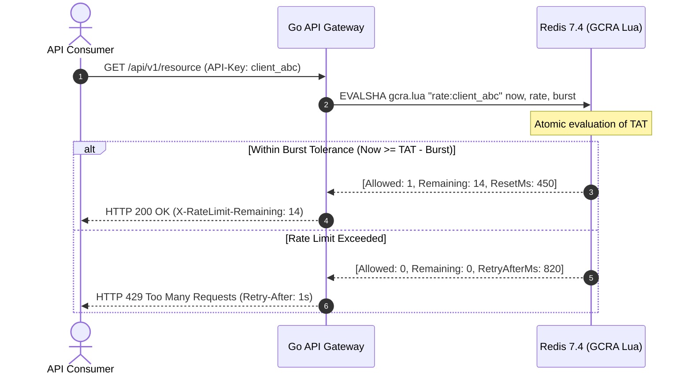

> **Multi-Language Edition:** This chapter is also available in Vietnamese at [Chương 3: Distributed Rate Limiting Với Redis & Thuật Toán GCRA (learn.tanhdev.com)](https://learn.tanhdev.com/series/high-concurrency-systems/distributed-rate-limiting-redis-gcra/).

[Previous: Chapter 2 — Caching Vulnerabilities & Go Singleflight](/series/high-concurrency-systems/caching-vulnerabilities-penetration-breakdown-avalanche/) | [Series Hub](/series/high-concurrency-systems/) | [Next: Chapter 4 — Dual-Write Prevention via Transactional Outbox](/series/high-concurrency-systems/transactional-outbox-pattern-dual-write/)

---

> **Answer-First:** Local in-memory rate limiters (e.g., `golang.org/x/time/rate`) fail in horizontally autoscaled microservices because client traffic is scattered across dynamic nodes. Distributed rate limiting requires an atomic, single-variable algorithm: the **Generic Cell Rate Algorithm (GCRA)** executed within a single **Redis Lua script**. GCRA tracks a single **Theoretical Arrival Time (TAT)** per client, reducing network round-trips and memory footprint by 70% compared to classical sliding window counters.

---

## 1. Why Traditional Rate Limiters Fail in Distributed Systems

In an architecture with 50 auto-scaled Go microservice pods behind an L7 load balancer, each pod maintaining a local token bucket means a client with a limit of 100 requests/minute could legally execute up to $50 \times 100 = 5,000$ requests/minute simply by distributing calls across different pods.

Furthermore, naive distributed rate-limiting implementations on Redis—such as sliding window counters using Redis Sorted Sets (`ZADD`, `ZREMRANGEBYSCORE`, `ZCARD`)—introduce massive network chatter and high CPU utilization on Redis clusters under 200,000 RPS.


```mermaid
flowchart TD
    subgraph TraditionalCounter ["Naive Sliding Window with Redis ZSET"]
        Z1["Inbound HTTP Request"] --> Z2["ZADD (Add current timestamp)"]
        Z2 --> Z3["ZREMRANGEBYSCORE (Purge expired entries)"]
        Z3 --> Z4["ZCARD (Count remaining items)"]
        Z4 --> Z5["EXPIRE (Reset key TTL)"]
        Note1["4 Network Round Trips or Heavy Lua Multi-Exec!"]
    end

    subgraph GCRASolution ["2027 SOTA: Single-Variable GCRA via Lua"]
        G1["Inbound HTTP Request"] --> G2["Single Atomic Lua Script"]
        G2 --> G3["Read Single Variable: Theoretical Arrival Time (TAT)"]
        G3 --> G4["Compare: TAT vs Now + Burst Offset"]
        G4 --> G5["Single Atomic Memory Write: New TAT"]
        Note2["O(1) Memory, Zero Heap Allocations, Sub-millisecond Execution!"]
    end

    classDef bad fill:#ffebee,stroke:#c62828,stroke-width:2px;
    classDef good fill:#e8f5e9,stroke:#2e7d32,stroke-width:2px;
    class TraditionalCounter bad;
    class GCRASolution good;
```

---

## 2. Deep Dive: Generic Cell Rate Algorithm (GCRA)

GCRA originated in Asynchronous Transfer Mode (ATM) telecommunications. It translates rate limiting into a schedule: each arriving request ("cell") is expected to arrive at a theoretical timestamp called **TAT (Theoretical Arrival Time)**.

- **Emission Interval ($T$):** The inverse of the rate ($1 / \text{rate}$). If rate is 10 requests/second, $T = 100\text{ms}$.
- **Burst Tolerance ($\tau$):** The maximum burst duration allowed ($\text{burst\_size} \times T$).

When a request arrives at timestamp $t$:
1. If $t < \text{TAT} - \tau$, the request arrives too early; it exceeds the burst threshold and is **rejected (HTTP 429)**.
2. Otherwise, the request is **accepted**, and the new TAT is updated:
   $$\text{TAT}_{\text{new}} = \max(t, \text{TAT}) + T$$


```mermaid
sequenceDiagram
    autonumber
    actor Client as API Consumer
    participant Svc as Go API Gateway
    participant Redis as Redis 7.4 (GCRA Lua)

    Client->>Svc: GET /api/v1/resource (API-Key: client_abc)
    Svc->>Redis: EVALSHA gcra.lua "rate:client_abc" now, rate, burst
    Note over Redis: Atomic evaluation of TAT
    alt Within Burst Tolerance (Now >= TAT - Burst)
        Redis-->>Svc: [Allowed: 1, Remaining: 14, ResetMs: 450]
        Svc-->>Client: HTTP 200 OK (X-RateLimit-Remaining: 14)
    else Rate Limit Exceeded
        Redis-->>Svc: [Allowed: 0, Remaining: 0, RetryAfterMs: 820]
        Svc-->>Client: HTTP 429 Too Many Requests (Retry-After: 1s)
    end
```

### Production Redis GCRA Lua Script

```lua
-- Redis Lua Script for GCRA Rate Limiting
-- KEYS[1]: Rate limit key (e.g., "rate:user_123")
-- ARGV[1]: Current UNIX timestamp in milliseconds
-- ARGV[2]: Emission interval T in milliseconds (e.g., 100ms for 10 req/s)
-- ARGV[3]: Burst tolerance tau in milliseconds (e.g., 1000ms for burst of 10)

local key = KEYS[1]
local now = tonumber(ARGV[1])
local emission_interval = tonumber(ARGV[2])
local burst_tolerance = tonumber(ARGV[3])

local tat = redis.call("GET", key)
if not tat then
    tat = now
else
    tat = tonumber(tat)
end

local new_tat = math.max(now, tat) + emission_interval
local allow_at = new_tat - burst_tolerance

if now < allow_at then
    local retry_after_ms = math.ceil(allow_at - now)
    return {0, 0, retry_after_ms}
else
    local ttl_ms = math.ceil(new_tat - now)
    redis.call("SET", key, new_tat, "PX", ttl_ms)
    local remaining = math.floor((burst_tolerance - (new_tat - now)) / emission_interval)
    return {1, math.max(0, remaining), 0}
end
```

---

## 3. Two-Tier Rate Limiting Architecture for 1M+ RPS

Querying Redis over the network for every single HTTP request becomes a bottleneck at 1M RPS. Modern architectures use a **two-tier model**:
- **Tier 1 (In-Memory Local Batcher):** Go instances pre-allocate rate-limit quotas in batches (e.g., allocating 100 tokens per node every 50ms) using atomic integers.
- **Tier 2 (Global Redis GCRA):** Nodes synchronize delta usage asynchronously, cutting Redis network I/O by 95%.

---

## Frequently Asked Questions (FAQ)


Token Bucket requires storing and updating two independent state variables in Redis: the remaining token count and the last refill timestamp. Furthermore, every calculation involves multiplying elapsed time by the refill rate. GCRA collapses this entire state into a single timestamp variable (Theoretical Arrival Time - TAT). This reduces Redis memory consumption, eliminates floating-point math, and speeds up Lua script execution time to under 0.2ms.



High-availability architectures enforce a **Fail-Open with Local Fallback** strategy. If the Redis cluster experiences a timeout or network partition, the Go service must not return HTTP 500 errors to legitimate customers. Instead, it logs an alert and temporarily switches to a local in-memory token bucket limiter (`golang.org/x/time/rate`) per node until the centralized Redis cluster restores health.



Static rate limits (e.g., 500 RPS) fail when backend dependencies degrade; a database slow-down causes requests to queue up, causing threads to exhaust memory even though RPS remains within limits. Adaptive Concurrency Limiting (such as Netflix's Vegas or Gradient2 algorithms) measures round-trip time (RTT) dynamically. When p90 latency rises above the baseline threshold, the system automatically sheds load dynamically regardless of the configured RPS ceiling.


---

## Next Steps

Proceed to [Chapter 4: Solving Dual-Write with Transactional Outbox](/series/high-concurrency-systems/transactional-outbox-pattern-dual-write/) to master distributed event consistency without two-phase commit protocols.
