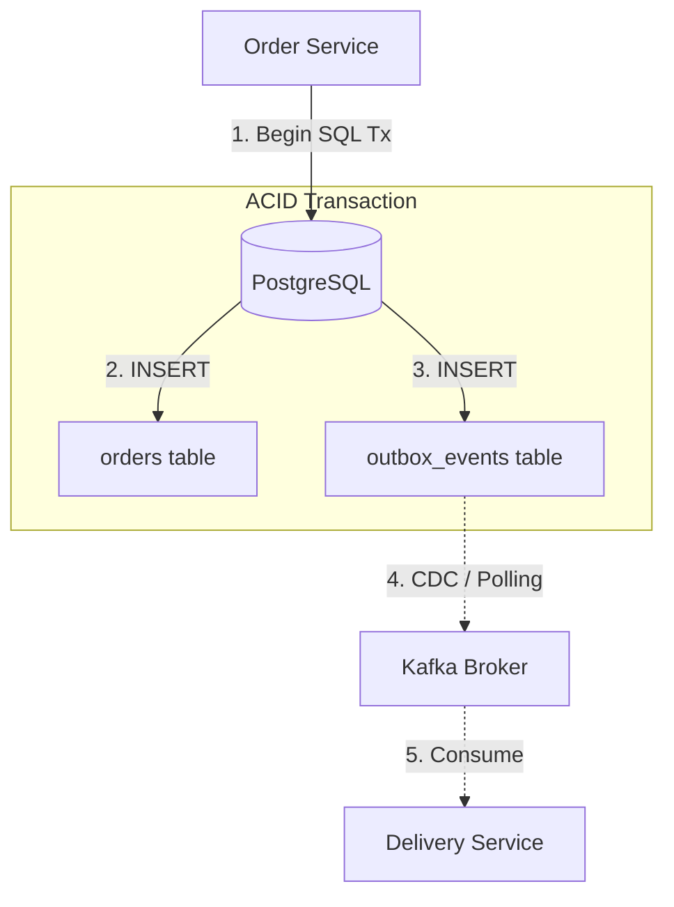

[← Previous](/series/high-concurrency-systems/distributed-rate-limiting-redis-gcra/) | [Series hub](/series/high-concurrency-systems/) | [Next →](/series/high-concurrency-systems/golang-database-connection-pool-optimization/)

# Chapter 4: Eliminating the Dual-Write Nightmare

When your Golang application migrates from a Monolith to [Event-Driven Microservices](/posts/mastering-event-driven-architecture-dapr/), you will immediately face an architectural nightmare: the **Dual-Write Problem**.

## 1. What is the Dual-Write Problem?

**Answer-first:** Dual-Write occurs when an app attempts to write to a Database and publish to a Message Broker (Kafka) simultaneously. Without a distributed transaction, network failures will cause the two systems to fall out of sync.

Consider a familiar checkout flow:
```go
// Step 1: Save order to DB
db.Save(&order)

// Step 2: Publish "OrderCreated" to Kafka for the Delivery service
kafka.Publish("order_events", orderEvent)
```

This looks fine, but what happens if:
- **Scenario A:** The DB saves successfully, but Kafka crashes or the network drops. The current service reports success, but the Delivery service never receives the event to ship the product.
- **Scenario B (Reversed code):** You publish to Kafka first, then save to the DB. If the DB save violates a Unique constraint and rolls back, the Delivery service will attempt to ship a "Ghost Order" that doesn't exist in the DB.

Because writing to PostgreSQL and publishing to Kafka do not share an ACID Transaction, you cannot guarantee they will either both succeed or both fail.

## 2. Rescue via Transactional Outbox Pattern

**Answer-first:** The Outbox Pattern turns "publishing an event" into a local Database insert. By storing the business entity and the event within the same SQL transaction, atomicity is guaranteed.

The **Transactional Outbox** places an "Outbox table" directly inside the primary database. 

**The Writer Flow:**
Instead of publishing to Kafka, we open an SQL Transaction (`sql.Tx`). Inside this transaction, we `INSERT` the order into the `orders` table and simultaneously `INSERT` the event into the `outbox_events` table. Since both tables reside in the same DB, the `tx.Commit()` command guarantees atomicity: if the order exists, the event is guaranteed to be in the Outbox.

```go
tx := db.Begin()
// 1. Save the primary Order
tx.Create(&order)

// 2. Save the Event to the Outbox table
outboxEvent := OutboxEvent{
    AggregateID: order.ID,
    Type: "OrderCreated",
    Payload: jsonPayload,
    Status: "PENDING",
}
tx.Create(&outboxEvent)

tx.Commit() // Absolutely safe
```



## 3. The Relay Engine: Moving Mail from Outbox to Kafka

At this stage, the event only exists in the DB. We need a "Relay" mechanism to fetch them and publish to the Message Queue. There are two popular approaches:

- **Approach 1: Polling Worker (For Startups/Small Scale).** A background Goroutine runs every second executing: `SELECT * FROM outbox_events WHERE status='PENDING'`. It publishes fetched events to Kafka, then updates the status to `SENT`. (Easy to implement, but places continuous query pressure on the DB).
- **Approach 2: Change Data Capture (CDC - For Large Scale).** Utilize tools like **Debezium**. It hooks directly into the DB's Transaction Log (Postgres WAL or MySQL Binlog), sniffing binary changes on the `outbox_events` table and streaming them directly to Kafka. This provides near real-time delivery with zero query overhead on the DB.

## Warning: At-Least-Once Delivery

The Outbox Pattern brilliantly solves Dual-Write, but it only guarantees **"At-least-once"** delivery. If a Polling Worker successfully publishes to Kafka but crashes before executing the `UPDATE status='SENT'` command, it will re-publish the same event upon reboot.

Consequently, the downstream Consumer service must implement **Idempotency** to ensure that processing duplicate events yields the exact same business outcome. We will explore Idempotency API Design deeply in Chapter 7!
