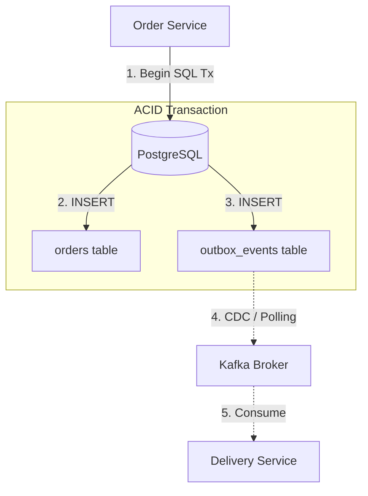

> **Prerequisite:** Before reading this chapter, please ensure you have read the previous article in this series: [Chapter 3: Distributed Rate Limiting with Redis & GCRA Algorithm]().

When your Golang application migrates from a Monolith to event-driven Microservices, you will immediately face an architectural nightmare: the **Dual-Write Problem**.

---

## 1. What is the Dual-Write Problem?

Dual-Write occurs when an app attempts to write to a Database and publish to a Message Broker (Kafka) simultaneously. Without a distributed transaction, network failures will cause the two systems to fall out of sync.

Consider a familiar checkout flow:
```go
// Step 1: Save order to DB
db.Save(&order)

// Step 2: Publish "OrderCreated" to Kafka for the Delivery service
kafka.Publish("order_events", orderEvent)
```

This looks fine, but what happens if:
- **Scenario A:** The DB saves successfully, but Kafka crashes or the network drops. The current service reports success, but the Delivery service never receives the event to ship the product.
- **Scenario B (Reversed code):** You publish to Kafka first, then save to the DB. If the DB save violates a Unique constraint and rolls back, the Delivery service will attempt to ship a "Ghost Order" that doesn't exist in the DB.

Because writing to PostgreSQL and publishing to Kafka do not share an ACID Transaction, you cannot guarantee they will either both succeed or both fail.

---

## 2. Rescue via Transactional Outbox Pattern

The Outbox Pattern turns \"publishing an event\" into a local Database insert. By storing the business entity and the event within the same SQL transaction, atomicity is guaranteed.

The **Transactional Outbox** places an "Outbox table" directly inside the primary database. 

**The Writer Flow:**
Instead of publishing to Kafka, we open an SQL Transaction (`sql.Tx`). Inside this transaction, we `INSERT` the order into the `orders` table and simultaneously `INSERT` the event into the `outbox_events` table. Since both tables reside in the same DB, the `tx.Commit()` command guarantees atomicity: if the order exists, the event is guaranteed to be in the Outbox.

```go
tx := db.Begin()
// 1. Save the primary Order
tx.Create(&order)

// 2. Save the Event to the Outbox table
outboxEvent := OutboxEvent{
    AggregateID: order.ID,
    Type: "OrderCreated",
    Payload: jsonPayload,
    Status: "PENDING",
}
tx.Create(&outboxEvent)

tx.Commit() // Absolutely safe
```



---

## 3. PostgreSQL Write-Ahead Log (WAL) Configurations

Change Data Capture (CDC) requires hooking into PostgreSQL's internal Write-Ahead Log (WAL). To enable logical decoding (which allows external tools like Debezium to read database modifications as structured change events), you must customize the following parameters in your `postgresql.conf` file:

```ini
# postgresql.conf

# 1. Set the WAL level to logical (default is replica)
wal_level = logical

# 2. Configure replication slots to match the number of CDC consumers
max_replication_slots = 10

# 3. Configure the max number of replication senders
max_wal_senders = 10

# 4. Prevent Postgres from recycling WAL files too early
wal_keep_size = 1024MB
```

Setting `wal_level = logical` instructs PostgreSQL to write additional metadata to the WAL logs, which is necessary for reconstructing SQL transactions from binary changes. A **Replication Slot** must be created in PostgreSQL for each CDC listener. The replication slot tracks the Log Sequence Number (LSN) read by the listener, preventing PostgreSQL from purging WAL files that have not yet been consumed by the CDC relay engine.

---

## 4. Debezium CDC Connector Setup

Once the database WAL is configured, we deploy **Debezium** running on Kafka Connect to stream the outbox records. Below is a production-grade connector configuration payload registered via the Kafka Connect REST API:

```json
{
  "name": "postgresql-outbox-connector",
  "config": {
    "connector.class": "io.debezium.connector.postgresql.PostgresConnector",
    "tasks.max": "1",
    "plugin.name": "pgoutput",
    "database.hostname": "postgres-primary",
    "database.port": "5432",
    "database.user": "debezium_user",
    "database.password": "secure_password",
    "database.dbname": "order_db",
    "database.server.name": "order_service_db",
    
    "table.include.list": "public.outbox_events",
    "tombstones.on.delete": "false",
    
    "slot.name": "debezium_outbox_slot",
    "publication.name": "debezium_outbox_publication",
    
    "key.converter": "org.apache.kafka.connect.json.JsonConverter",
    "key.converter.schemas.enable": "false",
    "value.converter": "org.apache.kafka.connect.json.JsonConverter",
    "value.converter.schemas.enable": "false"
  }
}
```

Key configuration rationale:
- **`plugin.name`: `pgoutput`**: Uses PostgreSQL's native logical replication output plugin introduced in version 10+.
- **`table.include.list`**: Limits Debezium's scope to ONLY watch the `outbox_events` table, preventing unnecessary WAL serialization overhead.
- **`tombstones.on.delete`: `false`**: Prevents Kafka from publishing a deletion tombstone event (a key with a null value) when an event row is deleted from the database table.

---

## 5. Offset Commit Models

To ensure high reliability, you must design a robust **Offset Commit Model** at the consumer tier. Under the Hood, Kafka maintains consumer positions in an internal topic named `__consumer_offsets`.

There are three common delivery semantics:
1. **At-Least-Once Delivery (Recommended for FinTech):** The consumer commits offsets to Kafka **ONLY after** the local business processing completes successfully. If the consumer crashes midway, the unprocessed messages are re-delivered on restart. This introduces potential duplicate events, which must be handled using idempotency.
2. **At-Most-Once Delivery:** The consumer auto-commits offsets immediately upon pulling messages from the broker, before executing the business logic. If processing fails or the pod crashes, that event is lost forever.
3. **Exactly-Once Processing:** Achieved via transactional producers and consumers, requiring coordinated transactions between Kafka and the application. This setup introduces significant latency overhead.

---

## Go Implementation: Bounded Consumer with Manual Offset Commit

The following Go code implements a resilient Kafka consumer designed for "At-Least-Once" delivery. It disables automatic offset commits (`enable.auto.commit = false`) and manually commits offsets synchronously only after processing completes successfully.

```go
package main

import (
	"context"
	"encoding/json"
	"fmt"
	"os"
	"os/signal"
	"syscall"
	"time"

	"github.com/confluentinc/confluent-kafka-go/kafka"
)

// OrderEvent represents the schema of the deserialized event payload.
type OrderEvent struct {
	OrderID   string    `json:"order_id"`
	Amount    float64   `json:"amount"`
	CreatedAt time.Time `json:"created_at"`
}

// EventConsumer manages the lifecycle of the manual commit Kafka consumer.
type EventConsumer struct {
	consumer *kafka.Consumer
	topic    string
}

// NewEventConsumer configures and instantiates the consumer group.
func NewEventConsumer(brokers string, groupID string, topic string) (*EventConsumer, error) {
	c, err := kafka.NewConsumer(&kafka.ConfigMap{
		"bootstrap.servers":  brokers,
		"group.id":           groupID,
		"auto.offset.reset":  "earliest",
		"enable.auto.commit": false, // Disable automatic commits
	})
	if err != nil {
		return nil, err
	}

	return &EventConsumer{
		consumer: c,
		topic:    topic,
	}, nil
}

// Start listens for incoming events and handles manual offset commits.
func (ec *EventConsumer) Start(ctx context.Context) {
	err := ec.consumer.Subscribe(ec.topic, nil)
	if err != nil {
		fmt.Printf("Subscription Error: %v\n", err)
		return
	}

	fmt.Println("Resilient Consumer Group Started. Waiting for events...")

	for {
		select {
		case <-ctx.Done():
			fmt.Println("Context cancelled. Shutting down consumer...")
			return
		default:
			// Poll the Kafka broker for a single message.
			msg, err := ec.consumer.ReadMessage(100 * time.Millisecond)
			if err != nil {
				// Handle timeout (transient) vs partition boundaries
				if err.(kafka.Error).Code() == kafka.ErrTimedOut {
					continue
				}
				fmt.Printf("Consumer error: %v\n", err)
				continue
			}

			// Process the event
			err = ec.processEvent(msg)
			if err != nil {
				// Log the error and back off. Do NOT commit the offset!
				fmt.Printf("Skipping commit. Processing failed for partition %d, offset %s: %v\n", 
					msg.TopicPartition.Partition, msg.TopicPartition.Offset.String(), err)
				time.Sleep(1 * time.Second) // Simple backoff before retrying
				continue
			}

			// Processing succeeded. Manually commit the offset.
			_, err = ec.consumer.CommitMessage(msg)
			if err != nil {
				fmt.Printf("Manual Commit Error: %v\n", err)
			} else {
				fmt.Printf("Successfully committed offset %s on partition %d\n", 
					msg.TopicPartition.Offset.String(), msg.TopicPartition.Partition)
			}
		}
	}
}

// processEvent executes the business logic for the event.
func (ec *EventConsumer) processEvent(msg *kafka.Message) error {
	var event OrderEvent
	err := json.Unmarshal(msg.Value, &event)
	if err != nil {
		return fmt.Errorf("failed to deserialize payload: %w", err)
	}

	// Simulate inventory reservation logic
	fmt.Printf("[Processing] Reserving inventory for Order ID: %s, Amount: $%.2f\n", event.OrderID, event.Amount)
	time.Sleep(100 * time.Millisecond) // Simulate DB processing overhead
	
	return nil
}

// Close gracefully terminates the connection.
func (ec *EventConsumer) Close() {
	_ = ec.consumer.Close()
}

func main() {
	sigChan := make(chan os.Signal, 1)
	signal.Notify(sigChan, syscall.SIGINT, syscall.SIGTERM)

	ctx, cancel := context.WithCancel(context.Background())

	consumer, err := NewEventConsumer("localhost:9092", "delivery-group", "order_events")
	if err != nil {
		fmt.Printf("Failed to create consumer: %v\n", err)
		return
	}
	defer consumer.Close()

	go consumer.Start(ctx)

	// Wait for OS shutdown signal
	<-sigChan
	cancel()
	time.Sleep(500 * time.Millisecond) // Allow cleanup
}
```

Disabling automatic commits ensures that if the system crashes midway, the offset is not advanced in Kafka. This guarantees that no message is lost, preserving system integrity.

---

## 🎯 Architecture Review & Consulting (Hire Me)

If your enterprise e-commerce or B2B platform is struggling with slow database queries, checkout timeouts, or scaling bottlenecks, don't let it jeopardize your business revenue.

👉 **[Book a 1:1 Architecture Consultation this week](/hire/)** with Lê Tuấn Anh (Vesviet) to identify bottlenecks and implement proven scaling strategies.

---

[← Previous]() | [Series hub]() | [Next →]()

