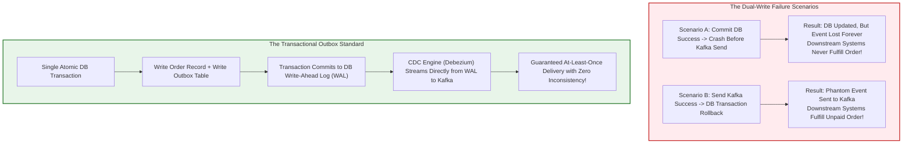
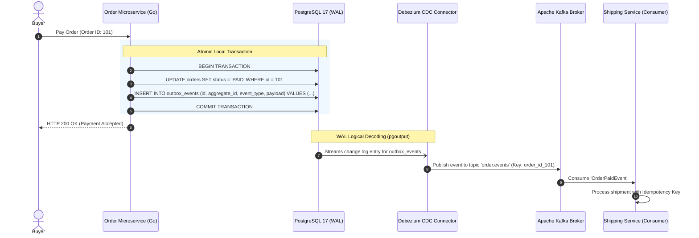

> **Multi-Language Edition:** This chapter is also available in Vietnamese at [Chương 4: Gỡ Rối Bài Toán Dual-Write Với Transactional Outbox Pattern (learn.tanhdev.com)](https://learn.tanhdev.com/series/high-concurrency-systems/transactional-outbox-pattern-dual-write/).

[Previous: Chapter 3 — Distributed Rate Limiting with Redis & GCRA](/series/high-concurrency-systems/distributed-rate-limiting-redis-gcra/) | [Series Hub](/series/high-concurrency-systems/) | [Next: Chapter 5 — Optimizing Golang Database Connection Pools](/series/high-concurrency-systems/golang-database-connection-pool-optimization/)

---

> **Answer-First:** Updating a relational database and publishing a message to Apache Kafka sequentially without a distributed two-phase commit protocol is mathematically guaranteed to suffer from the **Dual-Write Problem**. Network timeouts, process crashes, or broker rebalances inevitably leave the database and the message broker in inconsistent states. The definitive, cloud-native standard is the **Transactional Outbox Pattern** powered by **Log-based Change Data Capture (CDC)**: business records and event payloads are committed atomically into an `outbox` table within the same database transaction, and a background CDC engine (Debezium, TiCDC, or pgoutput) streams events directly from the DB Write-Ahead Log (WAL) to Kafka with zero query polling overhead.

---

## 1. The Anatomy of the Dual-Write Trap

Consider the standard microservice approach:
1. Begin SQL Transaction.
2. `UPDATE orders SET status = 'PAID' WHERE id = 101`.
3. Commit SQL Transaction.
4. `kafkaProducer.Send(ctx, "OrderPaidEvent", payload)`.


```mermaid
flowchart TD
    subgraph AntiPattern ["The Dual-Write Failure Scenarios"]
        S1["Scenario A: Commit DB Success -> Crash Before Kafka Send"] --> F1["Result: DB Updated, But Event Lost Forever<br/>Downstream Systems Never Fulfill Order!"]
        S2["Scenario B: Send Kafka Success -> DB Transaction Rollback"] --> F2["Result: Phantom Event Sent to Kafka<br/>Downstream Systems Fulfill Unpaid Order!"]
    end

    subgraph OutboxSolution ["The Transactional Outbox Standard"]
        O1["Single Atomic DB Transaction"] --> O2["Write Order Record + Write Outbox Table"]
        O2 --> O3["Transaction Commits to DB Write-Ahead Log (WAL)"]
        O3 --> O4["CDC Engine (Debezium) Streams Directly from WAL to Kafka"]
        O4 --> O5["Guaranteed At-Least-Once Delivery with Zero Inconsistency!"]
    end

    classDef danger fill:#ffebee,stroke:#c62828,stroke-width:2px;
    classDef safe fill:#e8f5e9,stroke:#2e7d32,stroke-width:2px;
    class AntiPattern danger;
    class OutboxSolution safe;
```

If the service crashes at step 4 (or Kafka experiences transient network jitter), the order is marked as paid in the database, but downstream inventory, shipping, and email services **never receive the event**. Conversely, reversing the order (publishing to Kafka before committing the DB transaction) creates "phantom events" if the SQL transaction later rolls back due to a constraint violation.

---

## 2. End-to-End Transactional Outbox Architecture

Instead of publishing to Kafka in application memory, the application persists the outgoing event inside the **exact same database transaction** as the business mutation:


```mermaid
sequenceDiagram
    autonumber
    actor User as Buyer
    participant OrderSvc as Order Microservice (Go)
    participant DB as PostgreSQL 17 (WAL)
    participant Debezium as Debezium CDC Connector
    participant Kafka as Apache Kafka Broker
    participant Shipping as Shipping Service (Consumer)

    User->>OrderSvc: Pay Order (Order ID: 101)
    rect rgb(240, 248, 255)
        Note over OrderSvc,DB: Atomic Local Transaction
        OrderSvc->>DB: BEGIN TRANSACTION
        OrderSvc->>DB: UPDATE orders SET status = 'PAID' WHERE id = 101
        OrderSvc->>DB: INSERT INTO outbox_events (id, aggregate_id, event_type, payload) VALUES (...)
        OrderSvc->>DB: COMMIT TRANSACTION
    end
    OrderSvc-->>User: HTTP 200 OK (Payment Accepted)
    Note over DB,Debezium: WAL Logical Decoding (pgoutput)
    DB-)Debezium: Streams change log entry for outbox_events
    Debezium->>Kafka: Publish event to topic 'order.events' (Key: order_id_101)
    Kafka->>Shipping: Consume 'OrderPaidEvent'
    Shipping->>Shipping: Process shipment with Idempotency Key
```

### Outbox Table Schema & Go Implementation

```sql
CREATE TABLE outbox_events (
    id UUID PRIMARY KEY DEFAULT gen_random_uuid(),
    aggregate_type VARCHAR(64) NOT NULL,
    aggregate_id VARCHAR(128) NOT NULL,
    event_type VARCHAR(128) NOT NULL,
    payload JSONB NOT NULL,
    created_at TIMESTAMPTZ NOT NULL DEFAULT NOW()
) PARTITION BY RANGE (created_at);
```

```go
package outbox

import (
	"context"
	"encoding/json"
	"gorm.io/gorm"
)

type OutboxEvent struct {
	ID            string          `gorm:"primaryKey;type:uuid;default:gen_random_uuid()"`
	AggregateType string          `gorm:"type:varchar(64);not null"`
	AggregateID   string          `gorm:"type:varchar(128);not null;index"`
	EventType     string          `gorm:"type:varchar(128);not null"`
	Payload       json.RawMessage `gorm:"type:jsonb;not null"`
}

func CompleteOrderPayment(ctx context.Context, db *gorm.DB, orderID string) error {
	return db.WithContext(ctx).Transaction(func(tx *gorm.DB) error {
		// 1. Update business entity
		if err := tx.Model(&Order{}).Where("id = ?", orderID).Update("status", "PAID").Error; err != nil {
			return err
		}

		// 2. Prepare domain event
		payload, _ := json.Marshal(map[string]any{
			"order_id": orderID,
			"status":   "PAID",
		})

		event := OutboxEvent{
			AggregateType: "Order",
			AggregateID:   orderID,
			EventType:     "OrderPaidEvent",
			Payload:       payload,
		}

		// 3. Persist outbox event within the exact same transaction
		if err := tx.Create(&event).Error; err != nil {
			return err
		}

		return nil
	})
}
```

---

## 3. Log-Based CDC vs Table Polling

Old implementations used a background goroutine executing:
```sql
SELECT * FROM outbox_events WHERE published = FALSE ORDER BY created_at LIMIT 100 FOR UPDATE SKIP LOCKED;
```
Under 20,000 transactions per second, polling the outbox table creates massive disk I/O thrashing, index bloat, and table-level locking conflicts.

**Log-based CDC (2027 Standard):** Debezium connects to PostgreSQL via **Logical Replication Slots** (`pgoutput`). Changes committed to the database are streamed directly from the sequential Write-Ahead Log (WAL) on disk. PostgreSQL does not execute a single SQL query, resulting in **zero application performance degradation** and sub-10ms replication latency.

---

## Frequently Asked Questions (FAQ)


Polling queries (`SELECT ... FOR UPDATE SKIP LOCKED`) repeatedly scan database indexes and dirty disk pages, competing with business transactions for CPU, memory, and connection pool capacity. Under high load, table bloat explodes. In contrast, Log-based CDC (Debezium) reads directly from the Write-Ahead Log (WAL) sequentially using the database's native replication stream. It introduces zero query overhead on PostgreSQL execution engines.



By setting Kafka's message key to the business aggregate identifier (e.g., `AggregateID: order_101`), Kafka's default murmur2 hashing algorithm guarantees that all state transitions for a specific order route to the exact same Kafka partition. Because Kafka maintains strict FIFO order within an individual partition, consumers are guaranteed to receive `OrderCreated`, `OrderPaid`, and `OrderFulfilled` in their exact chronological sequence.



Because CDC replication operates under **At-Least-Once** delivery semantics (a network crash between Kafka and Debezium can cause redelivery), downstream consumers must implement the **Idempotent Consumer / Inbox Pattern**. Consumers record the incoming event's unique `event_id` in a local database table or Redis cache. If an event with the same ID arrives again, the consumer acknowledges the message immediately without re-executing business logic.


---

## Next Steps

Proceed to [Chapter 5: Optimizing Golang Database Connection Pools](/series/high-concurrency-systems/golang-database-connection-pool-optimization/) to eliminate database connection leaks and saturation.
