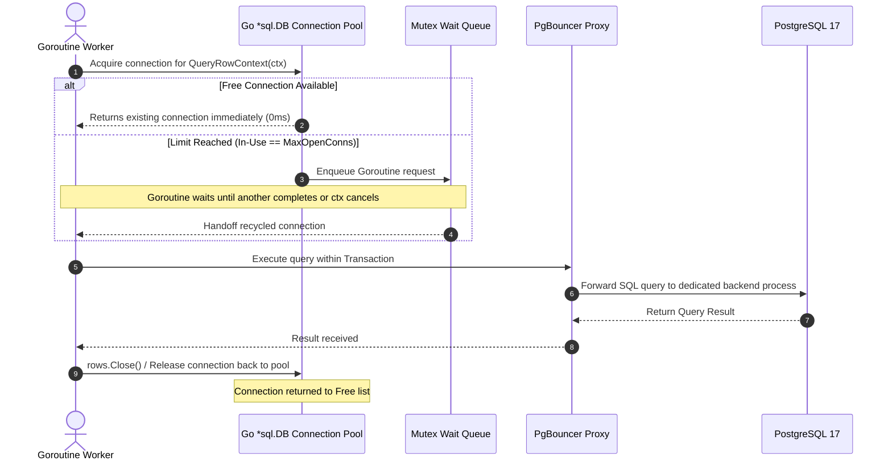

> **Multi-Language Edition:** This chapter is also available in Vietnamese at [Chương 5: Tối Ưu Connection Pools Của Database Trong Golang (learn.tanhdev.com)](https://learn.tanhdev.com/series/high-concurrency-systems/golang-database-connection-pool-optimization/).

[Previous: Chapter 4 — Dual-Write Prevention via Transactional Outbox](/series/high-concurrency-systems/transactional-outbox-pattern-dual-write/) | [Series Hub](/series/high-concurrency-systems/) | [Next: Chapter 6 — API Gateway vs Service Mesh in Microservices](/series/high-concurrency-systems/api-gateway-vs-service-mesh/)

---

> **Answer-First:** Unbounded database connection pools in Go microservices quickly exhaust PostgreSQL's process-per-connection architecture, triggering severe CPU context switching and memory exhaustion. The battle-tested production formula: (1) In Go's `*sql.DB`, set `SetMaxOpenConns` dynamically based on **Little's Law** ($C = \lambda \times W$), set `SetMaxIdleConns == SetMaxOpenConns` to eliminate constant TCP three-way handshakes, and set `SetConnMaxLifetime` below cloud NAT idle timeouts; (2) In front of PostgreSQL, place a dedicated connection pooler (**PgBouncer** or **Pgcat**) in **Transaction Pooling** mode to multiplex 20,000 application sockets over just 50 to 100 backend database connections.

---

## 1. The Hidden Bottleneck in Go's `database/sql`

Go's standard library `database/sql` provides a thread-safe connection pool out of the box. However, its default configuration is dangerously unsuited for high-concurrency production:
- `MaxOpenConns`: Default is **0 (unlimited)**. A traffic surge will open thousands of concurrent TCP sockets to the database.
- `MaxIdleConns`: Default is **2**. When high-volume queries complete, Go immediately closes all connections exceeding 2, causing aggressive TCP teardown and handshake churn.


```mermaid
flowchart TD
    subgraph DirectDB ["Direct Go Connections (Unpooled Anti-Pattern)"]
        G1["50 Go Pods (200 conns each)"] -->|10,000 Direct Connections| PG1["PostgreSQL Master"]
        PG1 -->|Forks 10,000 OS Processes| RAM1["10,000 x 10MB = 100GB RAM Wasted!"]
        RAM1 -->|CPU Context Switch Thrashing| S1["Query Latencies Explode from 2ms to 4,000ms!"]
    end

    subgraph PooledDB ["2027 SOTA: PgBouncer / Pgcat Multiplexing"]
        G2["50 Go Pods (200 conns each)"] -->|10,000 Lightweight Client Sockets| PGB["PgBouncer / Pgcat (Transaction Mode)"]
        PGB -->|Multiplexed over 80 Physical Connections| PG2["PostgreSQL Master"]
        PG2 -->|80 Dedicated Processes| RAM2["Only 800MB RAM Used"]
        RAM2 -->|100% CPU on Query Execution| S2["Steady Sub-2ms Latencies under 50,000 QPS!"]
    end

    classDef bad fill:#ffebee,stroke:#c62828,stroke-width:2px;
    classDef good fill:#e8f5e9,stroke:#2e7d32,stroke-width:2px;
    class DirectDB bad;
    class PooledDB good;
```

---

## 2. Go Connection Pool State Machine Internals

Inside `*sql.DB`, connections reside in one of two states: **Free** or **In-Use**. When a goroutine calls `db.QueryContext()`, it attempts to pop a free connection. If none are available and `MaxOpenConns` has not been reached, it opens a new physical connection. If the limit is reached, the goroutine blocks on a wait queue.


```mermaid
sequenceDiagram
    autonumber
    actor G as Goroutine Worker
    participant Pool as Go *sql.DB Connection Pool
    participant WaitQ as Mutex Wait Queue
    participant PgB as PgBouncer Proxy
    participant DB as PostgreSQL 17

    G->>Pool: Acquire connection for QueryRowContext(ctx)
    alt Free Connection Available
        Pool-->>G: Returns existing connection immediately (0ms)
    else Limit Reached (In-Use == MaxOpenConns)
        Pool->>WaitQ: Enqueue Goroutine request
        Note over G,WaitQ: Goroutine waits until another completes or ctx cancels
        WaitQ-->>G: Handoff recycled connection
    end
    G->>PgB: Execute query within Transaction
    PgB->>DB: Forward SQL query to dedicated backend process
    DB-->>PgB: Return Query Result
    PgB-->>G: Result received
    G->>Pool: rows.Close() / Release connection back to pool
    Note over Pool: Connection returned to Free list
```

### Production Tuning Code for Go

```go
package db

import (
	"context"
	"database/sql"
	"time"

	_ "github.com/jackc/pgx/v5/stdlib"
)

func InitDatabase(dsn string) (*sql.DB, error) {
	db, err := sql.Open("pgx", dsn)
	if err != nil {
		return nil, err
	}

	// 1. Max open connections: Sized according to Little's Law
	db.SetMaxOpenConns(50)

	// 2. Max idle connections: Keep equal to MaxOpenConns to avoid TCP churn
	db.SetMaxIdleConns(50)

	// 3. Max lifetime: Slightly below cloud NAT timeout (e.g., AWS NAT drops at 350s)
	db.SetConnMaxLifetime(5 * time.Minute)

	// 4. Max idle time: Reclaim connections idle for more than 1 minute
	db.SetConnMaxIdleTime(1 * time.Minute)

	ctx, cancel := context.WithTimeout(context.Background(), 3*time.Second)
	defer cancel()

	if err := db.PingContext(ctx); err != nil {
		return nil, err
	}

	return db, nil
}
```

---

## 3. Sizing Pools Dynamically with Little's Law

The optimal pool size is not a guessing game; it is governed by **Little's Law**:

$$L = \lambda \times W$$

Where:
- $L$: Concurrency (Number of active connections required).
- $\lambda$: Target throughput (Queries per second, QPS).
- $W$: Average query duration (Latency in seconds).

For a Go service handling **10,000 QPS** with an average database query latency of **2ms (0.002s)**:
$$L = 10,000 \times 0.002 = 20 \text{ connections}$$

Setting `MaxOpenConns` higher than 30 in this scenario provides zero throughput benefit; it only consumes memory and increases mutex contention within Go's connection pool lock.

---

## Frequently Asked Questions (FAQ)


PostgreSQL employs a process-per-connection architecture (unlike MySQL or SQL Server, which use multi-threaded models). Every single client connection spawns a dedicated OS process consuming 2MB to 10MB of private RAM and requiring kernel scheduler attention. When thousands of connections compete for CPU cores, the OS spends more time on context switching than executing query operations, leading to exponential throughput collapse.



In Session Pooling mode, PgBouncer assigns a physical server connection to a client for the entire duration of the client's session (until disconnect), which prevents multiplexing when applications maintain persistent connections. In **Transaction Pooling mode**, PgBouncer assigns a physical database connection only for the duration of a single database transaction (`BEGIN` to `COMMIT/ROLLBACK`), releasing the connection back to the shared pool immediately. This enables thousands of concurrent clients to share a few dozen database backends.



In Transaction Pooling mode, subsequent queries in an application may execute on different physical PostgreSQL backend connections where the prepared statement has not been prepared. In 2027, modern drivers like `pgx/v5` and modern poolers like **Pgcat** natively support automatic protocol-level prepared statement pooling and named statement caches, allowing developers to enjoy both statement optimization and transaction pooling.


---

## Next Steps

Proceed to [Chapter 6: API Gateway vs Service Mesh in Microservices](/series/high-concurrency-systems/api-gateway-vs-service-mesh/) to master traffic boundaries and ingress routing.
