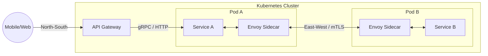

> **Prerequisite:** Before reading this chapter, please ensure you have read the previous article in this series: [Chapter 5: Unlocking Database Performance via Connection Pooling]().

When your Golang application scales from dozens to hundreds of Microservices, managing communication becomes a macro-level challenge. You will constantly encounter two tightly coupled concepts: **API Gateway** and **Service Mesh**.

Many engineers ask: "If I already deploy Istio (Service Mesh), do I still need Kong (API Gateway)?" The answer lies in the fundamental difference between North-South and East-West traffic.

---

## 1. API Gateway: The North-South Gatekeeper

The API Gateway manages North-South traffic (external to internal) focusing heavily on Business Logic, Authentication, and Rate Limiting to protect the cluster perimeter.

**North-South Traffic** represents the flow of data originating from the outside world (Mobile apps, Web browsers) entering your internal private network.

The **API Gateway** sits at the absolute edge of your system. It acts as the singular "Gatekeeper". The core features of an API Gateway skew entirely toward **Business Logic and Client Experience**:
- **Authentication/Authorization:** Validating tokens (JWT, OAuth2) before allowing requests inside.
- **Rate Limiting / Throttling:** Blocking spam or throttling features based on user billing tiers.
- **Protocol Translation:** Internal microservices may communicate via gRPC (fast but web-unfriendly). The API Gateway translates external REST HTTP requests into internal gRPC calls.
- *Prime Examples:* Kong Gateway, KrakenD (written in Go), AWS API Gateway.

### Kong and OpenResty Lua Hooks
Many modern API Gateways (like Kong) are built on top of **NGINX** and **OpenResty**. OpenResty allows developers to inject custom Lua scripts directly into NGINX's event-driven request lifecycle phases.

The diagram below outlines the execution phases of OpenResty:

```mermaid
flowcall OpenRestyRequestLifecycle
    init_by_lua[init_by_lua: Master Config Load] --> init_worker_by_lua[init_worker_by_lua: Worker Startup]
    init_worker_by_lua --> ssl_certificate_by_lua[ssl_certificate_by_lua: TLS Handshake]
    ssl_certificate_by_lua --> rewrite_by_lua[rewrite_by_lua: URL Rewrite]
    rewrite_by_lua --> access_by_lua[access_by_lua: Authentication & Rate Limiting]
    access_by_lua --> balancer_by_lua[balancer_by_lua: Upstream Load Balancing]
    balancer_by_lua --> header_filter_by_lua[header_filter_by_lua: Modify Response Headers]
    header_filter_by_lua --> body_filter_by_lua[body_filter_by_lua: Modify Response Body]
    body_filter_by_lua --> log_by_lua[log_by_lua: Write Metrics & Access Log]
```

Understanding these hooks allows engineers to optimize performance:
- **`access_by_lua`**: The ideal phase to execute security checks, JWT decoding, and Redis-based rate limiting. If a request is blocked here, it returns an HTTP 401 or 429 immediately, avoiding the overhead of proxying downstream.
- **`header_filter_by_lua` & `body_filter_by_lua`**: Used to manipulate response payloads, inject security headers, or stream response transformations.

---

## 2. Service Mesh: The East-West Traffic Grid

Service Mesh manages East-West traffic (internal service-to-service) handling pure infrastructure concerns like mTLS, Circuit Breaking, and Tracing via a Sidecar proxy architecture.

**East-West Traffic** is the horizontal flow of data inside the internal network, moving from one Microservice to another.

A **Service Mesh** is purely an Infrastructure Layer. It cares nothing about business logic (e.g., how much money a user deposited). It solves complex internal networking challenges:
- **mTLS (Mutual TLS):** Encrypting internal transit. If hackers breach your Kubernetes cluster, they cannot eavesdrop on data flowing between Service A and Service B.
- **Circuit Breaking & Retries:** If Service B is failing, the Service Mesh automatically trips the circuit to prevent Service A from bottlenecking, and silently handles retries during network blips.
- **Observability:** Automatically capturing distributed traces (Jaeger, Zipkin) to reveal latency bottlenecks across a 10-service request chain.
- *Prime Examples:* Istio, Linkerd.

### The Sidecar Proxy Architecture
A Service Mesh operates by injecting a **Sidecar Proxy** (usually Envoy) into the same Kubernetes Pod as your Golang application. Your Go code sends a simple HTTP request to `localhost`. Envoy intercepts it, wraps it in mTLS, selects the optimal routing path, and delivers it to the destination Envoy. The application code remains completely oblivious to Envoy's existence.



### Envoy Filter Configurations
Envoy is structured as a pipeline of filters. Every network packet or HTTP request flows through a chain of filters. Below is a YAML configuration showing how to add a custom Lua filter to Envoy's HTTP Connection Manager:

```yaml
# Envoy Filter Configuration Snippet
static_resources:
  listeners:
  - name: ingress_listener
    address:
      socket_address:
        address: 0.0.0.0
        port_value: 10000
    filter_chains:
    - filters:
      - name: envoy.filters.network.http_connection_manager
        typed_config:
          "@type": type.googleapis.com/envoy.extensions.filters.network.http_connection_manager.v3.HttpConnectionManager
          stat_prefix: ingress_http
          route_config:
            name: local_route
            virtual_hosts:
            - name: local_service
              domains: ["*"]
              routes:
              - match:
                  prefix: "/"
                route:
                  cluster: local_backend_service
          http_filters:
          - name: envoy.filters.http.lua
            typed_config:
              "@type": type.googleapis.com/envoy.extensions.filters.http.lua.v3.Lua
              inline_code: |
                function envoy_on_request(request_handle)
                  -- Inspect and add trace header to upstream request
                  local request_id = request_handle:headers():get("x-request-id")
                  if not request_id then
                    request_handle:headers():add("x-custom-generated-trace", "envoy-lua-generated-key")
                  end
                end
          - name: envoy.filters.http.router
            typed_config:
              "@type": type.googleapis.com/envoy.extensions.filters.http.router.v3.Router
```

---

## 3. Dynamic Configurations: The xDS API Suite

In dynamic environments (like Kubernetes where pods spin up and down constantly), statically configuring proxy routing is impossible. Envoy solves this by implementing the **xDS APIs** — a suite of discovery services that pull configurations dynamically from a central control plane (like Istio's Pilot) over gRPC streams.

The xDS suite includes:
- **LDS (Listener Discovery Service):** Dynamically configures IP, port, and TLS certificates that Envoy listens on.
- **RDS (Route Discovery Service):** Dynamically updates HTTP routing tables, rewrite rules, and headers.
- **CDS (Cluster Discovery Service):** Dynamically configures upstream clusters (groups of target microservices).
- **EDS (Endpoint Discovery Service):** Dynamically discovers the individual IP addresses and ports of the pods inside each cluster.
- **SDS (Secret Discovery Service):** Dynamically distributes cryptographic keys and certificates for mTLS.

This architecture enables zero-downtime reconfiguration: when a pod scales out, EDS updates the Envoy sidecars across the cluster in milliseconds without restarting a single proxy process.

---

## Go Implementation: Simple gRPC Discovery Control Plane

The following Go code implements a simplified gRPC endpoint discovery service (EDS) endpoint. This mimics how a custom xDS control plane pushes IP endpoints to Envoy sidecar proxies.

```go
package main

import (
	"context"
	"fmt"
	"net"
	"sync"
	"time"

	"google.golang.org/grpc"
	"google.golang.org/grpc/codes"
	"google.golang.org/grpc/status"

	// Mocking Envoy xDS proto structures
	v3 "github.com/envoyproxy/go-control-plane/envoy/service/endpoint/v3"
	discovery "github.com/envoyproxy/go-control-plane/envoy/service/discovery/v3"
)

type ControlPlaneServer struct {
	mu        sync.RWMutex
	endpoints []string
}

func NewControlPlaneServer() *ControlPlaneServer {
	return &ControlPlaneServer{
		endpoints: []string{"10.244.0.15:8080", "10.244.0.16:8080"},
	}
}

// StreamEndpoints implements Envoy's EDS gRPC streaming protocol.
func (s *ControlPlaneServer) StreamEndpoints(stream v3.EndpointDiscoveryService_StreamEndpointsServer) error {
	ctx := stream.Context()
	
	// Keep track of the last sent endpoints to avoid redundant writes
	var lastSent []string

	for {
		select {
		case <-ctx.Done():
			return ctx.Err()
		case <-time.After(2 * time.Second): // Poll internal state or watch system events
			s.mu.RLock()
			currentEndpoints := s.endpoints
			s.mu.RUnlock()

			if s.isEqual(lastSent, currentEndpoints) {
				continue
			}

			// Build and send the DiscoveryResponse payload to the Envoy client
			resp, err := s.buildDiscoveryResponse(currentEndpoints)
			if err != nil {
				return status.Errorf(codes.Internal, "failed to build discovery response: %v", err)
			}

			if err := stream.Send(resp); err != nil {
				return err
			}
			lastSent = currentEndpoints
			fmt.Printf("[xDS Control Plane] Pushed %d endpoints to Envoy client\n", len(currentEndpoints))
		}
	}
}

func (s *ControlPlaneServer) buildDiscoveryResponse(endpoints []string) (*discovery.DiscoveryResponse, error) {
	// Normally, we serialize envoy configuration protobufs (ClusterLoadAssignment) here.
	// For this example, we mock a basic DiscoveryResponse.
	return &discovery.DiscoveryResponse{
		VersionInfo: "1.0",
		TypeUrl:     "type.googleapis.com/envoy.config.endpoint.v3.ClusterLoadAssignment",
		Nonce:       fmt.Sprintf("%d", time.Now().UnixNano()),
	}, nil
}

func (s *ControlPlaneServer) isEqual(a, b []string) bool {
	if len(a) != len(b) {
		return false
	}
	for i := range a {
		if a[i] != b[i] {
			return false
		}
	}
	return true
}

// FetchEndpoints implements the unary request/response variant of EDS.
func (s *ControlPlaneServer) FetchEndpoints(ctx context.Context, req *discovery.DiscoveryRequest) (*discovery.DiscoveryResponse, error) {
	s.mu.RLock()
	currentEndpoints := s.endpoints
	s.mu.RUnlock()
	return s.buildDiscoveryResponse(currentEndpoints)
}

func (s *ControlPlaneServer) DeltaEndpoints(stream v3.EndpointDiscoveryService_DeltaEndpointsServer) error {
	return status.Errorf(codes.Unimplemented, "method DeltaEndpoints not implemented")
}

func main() {
	lis, err := net.Listen("tcp", ":18000")
	if err != nil {
		panic(err)
	}

	grpcServer := grpc.NewServer()
	server := NewControlPlaneServer()

	// Register EDS service implementation with gRPC server
	v3.RegisterEndpointDiscoveryServiceServer(grpcServer, server)

	fmt.Println("xDS Control Plane listening on :18000...")
	if err := grpcServer.Serve(lis); err != nil {
		panic(err)
	}
}
```

This dynamic control plane structure enables microservices architectures to scale dynamic endpoints securely and reliably, avoiding hard configurations in production.

---

## 🎯 Architecture Review & Consulting (Hire Me)

If your enterprise e-commerce or B2B platform is struggling with slow database queries, checkout timeouts, or scaling bottlenecks, don't let it jeopardize your business revenue.

👉 **[Book a 1:1 Architecture Consultation this week](/hire/)** with Lê Tuấn Anh (Vesviet) to identify bottlenecks and implement proven scaling strategies.

---

🔗 **Next Step:** [Chapter 7: Designing Idempotency APIs for Payment Systems]()

