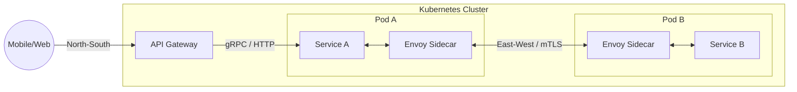

[← Previous](/series/high-concurrency-systems/golang-database-connection-pool-optimization/) | [Series hub](/series/high-concurrency-systems/) | [Next →](/series/high-concurrency-systems/idempotency-api-design-payments/)

# Chapter 6: Clarifying the Boundaries: API Gateway vs Service Mesh

When your Golang application scales from dozens to hundreds of Microservices, managing communication becomes a macro-level challenge. You will constantly encounter two tightly coupled concepts: **API Gateway** and **Service Mesh**.

Many engineers ask: "If I already deploy Istio (Service Mesh), do I still need Kong (API Gateway)?" The answer lies in the fundamental difference between North-South and East-West traffic.

## 1. API Gateway: The North-South Gatekeeper

**Answer-first:** The API Gateway manages North-South traffic (external to internal) focusing heavily on Business Logic, Authentication, and Rate Limiting to protect the cluster perimeter.

**North-South Traffic** represents the flow of data originating from the outside world (Mobile apps, Web browsers) entering your internal private network.

The **API Gateway** sits at the absolute edge of your system. It acts as the singular "Gatekeeper". The core features of an API Gateway skew entirely toward **Business Logic and Client Experience**:
- **Authentication/Authorization:** Validating tokens (JWT, OAuth2) before allowing requests inside.
- **Rate Limiting / Throttling:** Blocking spam or throttling features based on user billing tiers.
- **Protocol Translation:** Internal microservices may communicate via gRPC (fast but web-unfriendly). The API Gateway translates external REST HTTP requests into internal gRPC calls.
- *Prime Examples:* Kong Gateway, KrakenD (written in Go), AWS API Gateway.

## 2. Service Mesh: The East-West Traffic Grid

**Answer-first:** Service Mesh manages East-West traffic (internal service-to-service) handling pure infrastructure concerns like mTLS, Circuit Breaking, and Tracing via a Sidecar proxy architecture.

**East-West Traffic** is the horizontal flow of data inside the internal network, moving from one Microservice to another.

A **Service Mesh** is purely an Infrastructure Layer. It cares nothing about business logic (e.g., how much money a user deposited). It solves complex internal networking challenges:
- **mTLS (Mutual TLS):** Encrypting internal transit. If hackers breach your Kubernetes cluster, they cannot eavesdrop on data flowing between Service A and Service B.
- **Circuit Breaking & Retries:** If Service B is failing, the Service Mesh automatically trips the circuit to prevent Service A from bottlenecking, and silently handles retries during network blips.
- **Observability:** Automatically capturing distributed traces (Jaeger, Zipkin) to reveal latency bottlenecks across a 10-service request chain.
- *Prime Examples:* Istio, Linkerd.

### The Sidecar Proxy Architecture
A Service Mesh operates by injecting a **Sidecar Proxy** (usually Envoy) into the same Kubernetes Pod as your Golang application. Your Go code sends a simple HTTP request to `localhost`. Envoy intercepts it, wraps it in mTLS, selects the optimal routing path, and delivers it to the destination Envoy. The application code remains completely oblivious to Envoy's existence.

## 3. Why Use Both in Production?

**Answer-first:** High-concurrency systems utilize Kong/KrakenD at the perimeter for user validation and DDoS protection, while deploying Istio/Linkerd internally for mTLS and circuit breaking.

Although the boundaries occasionally blur (e.g., *Istio Ingress Gateway* mimics basic Gateway features), the best practice for high-concurrency systems is strict separation:

1. **Kong/KrakenD on the perimeter:** Dedicated to user authentication, client routing, and DDoS prevention.
2. **Istio/Linkerd on the interior:** Dedicated to internal security, circuit breaking, and tracing across hundreds of Go services.

This explicit separation allows the Product team to configure the Gateway safely, while the DevOps/SRE team manages the Service Mesh without stepping on each other's toes.
