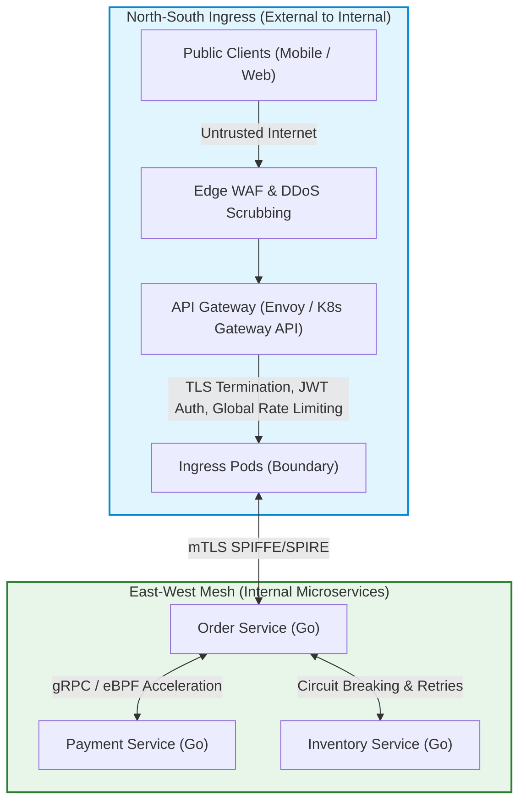
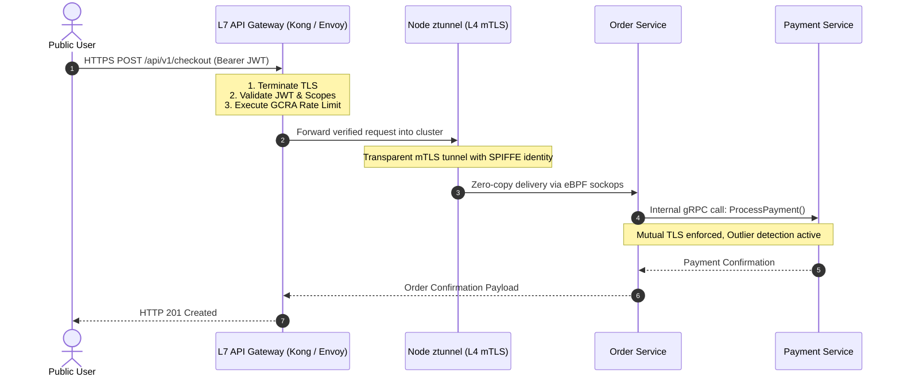

> **Multi-Language Edition:** This chapter is also available in Vietnamese at [Chương 6: API Gateway Đấu Với Service Mesh Trong Kiến Trúc Microservices (learn.tanhdev.com)](https://learn.tanhdev.com/series/high-concurrency-systems/api-gateway-vs-service-mesh/).

[Previous: Chapter 5 — Optimizing Golang Database Connection Pools](/series/high-concurrency-systems/golang-database-connection-pool-optimization/) | [Series Hub](/series/high-concurrency-systems/) | [Next: Chapter 7 — Designing Idempotency APIs for Payment Systems](/series/high-concurrency-systems/idempotency-api-design-payments/)

---

> **Answer-First:** The long-standing debate of "API Gateway vs. Service Mesh" is resolved by strict traffic topology boundaries: **North-South Traffic** (external untrusted clients entering the cluster) is exclusively governed by an **API Gateway** (Envoy, Kong, or K8s Gateway API) focusing on edge SSL termination, WAF scrubbing, OAuth2/OIDC token exchange, and API monetization. In contrast, **East-West Traffic** (inter-service communication within the private cluster) is handled by a **Service Mesh** (Istio Ambient Mesh or Cilium eBPF) delivering zero-trust mTLS via SPIFFE/SPIRE, dynamic circuit breaking, outlier detection, and distributed tracing without application code changes.

---

## 1. Demarcating North-South vs East-West Traffic

When scaling Go microservices from 10 to 200 services, managing communication complexity becomes a critical architectural challenge. Attempting to force an API Gateway to handle internal RPC calls or forcing a Service Mesh to act as an external public gateway leads to unmaintainable configurations and performance bottlenecks.


```mermaid
flowchart TD
    subgraph NorthSouthZone ["North-South Ingress (External to Internal)"]
        PublicClient["Public Clients (Mobile / Web)"] -->|Untrusted Internet| WAF["Edge WAF & DDoS Scrubbing"]
        WAF --> APIGW["API Gateway (Envoy / K8s Gateway API)"]
        APIGW -->|TLS Termination, JWT Auth, Global Rate Limiting| IngressPod["Ingress Pods (Boundary)"]
    end

    subgraph EastWestZone ["East-West Mesh (Internal Microservices)"]
        IngressPod <-->|mTLS SPIFFE/SPIRE| ServiceA["Order Service (Go)"]
        ServiceA <-->|gRPC / eBPF Acceleration| ServiceB["Payment Service (Go)"]
        ServiceA <-->|Circuit Breaking & Retries| ServiceC["Inventory Service (Go)"]
    end

    classDef ns fill:#e1f5fe,stroke:#0288d1,stroke-width:2px;
    classDef ew fill:#e8f5e9,stroke:#2e7d32,stroke-width:2px;
    class NorthSouthZone ns;
    class EastWestZone ew;
```

---

## 2. Sidecar vs Sidecarless: The eBPF & Ambient Mesh Revolution

Early Service Mesh architectures (Istio 1.x) deployed an Envoy proxy as a **sidecar container** inside every application Kubernetes Pod. While functionally sound, sidecars introduced two severe production bottlenecks under high-concurrency:
1. **Memory & CPU Bloat:** 500 pods running 500 sidecar proxies consumed over 60GB of idle RAM and doubled network hops (Pod -> Sidecar -> Kernel -> Sidecar -> Pod).
2. **Hop Latency:** User-space loopback context switching added 2ms to 4ms per inter-service RPC.

In 2027, the industry has standardized on **Sidecarless Architectures**: **Istio Ambient Mesh** (separating L4 transport encryption via ztunnel from L7 waypoint proxies) and **Cilium eBPF Socket Acceleration** (`sockops`), bypassing the TCP/IP stack entirely for co-located pods.


```mermaid
sequenceDiagram
    autonumber
    actor ExternalUser as Public User
    participant Gateway as L7 API Gateway (Kong / Envoy)
    participant MeshZT as Node ztunnel (L4 mTLS)
    participant SvcA as Order Service
    participant SvcB as Payment Service

    ExternalUser->>Gateway: HTTPS POST /api/v1/checkout (Bearer JWT)
    Note over Gateway: 1. Terminate TLS<br/>2. Validate JWT & Scopes<br/>3. Execute GCRA Rate Limit
    Gateway->>MeshZT: Forward verified request into cluster
    Note over MeshZT: Transparent mTLS tunnel with SPIFFE identity
    MeshZT->>SvcA: Zero-copy delivery via eBPF sockops
    SvcA->>SvcB: Internal gRPC call: ProcessPayment()
    Note over SvcA,SvcB: Mutual TLS enforced, Outlier detection active
    SvcB-->>SvcA: Payment Confirmation
    SvcA-->>Gateway: Order Confirmation Payload
    Gateway-->>ExternalUser: HTTP 201 Created
```

---

## 3. Kubernetes Gateway API v1.5 Specification

Modern Kubernetes clusters replace the legacy `Ingress` resource with the expressive, role-oriented **Gateway API**:

```yaml
apiVersion: gateway.networking.k8s.io/v1
kind: HTTPRoute
metadata:
  name: order-service-route
  namespace: production
spec:
  parentRefs:
    - name: external-gateway
  hostnames:
    - "api.tanhdev.com"
  rules:
    - matches:
        - path:
            type: PathPrefix
            value: /api/v1/orders
      filters:
        - type: RequestHeaderModifier
          requestHeaderModifier:
            add:
              - name: X-Forwarded-Cluster
                value: production-sg-01
      backendRefs:
        - name: order-service
          port: 8080
          weight: 90
        - name: order-service-canary
          port: 8080
          weight: 10
```

---

## Frequently Asked Questions (FAQ)


No. While a Service Mesh excels at internal routing, mTLS identity verification, and telemetry, it lacks essential edge capabilities: public SSL certificate lifecycle management (ACME/Let's Encrypt), complex consumer authentication (OAuth2/OIDC tokens, API keys, HMAC signatures), Web Application Firewall (WAF) rule sets, and client billing/monetization rate limiting. Deploying an API Gateway at the edge and a Service Mesh inside the cluster provides the optimal separation of concerns.



In standard Linux networking, a TCP packet between two pods on the same physical host traverses the full TCP/IP stack twice: IP lookup, routing table evaluation, iptables filtering, and packet framing. Cilium eBPF \`sockops\` programs intercept communication directly at the socket level (\`sock_hash\`). Packets are transferred directly between socket buffers in kernel memory, bypassing TCP/IP framing completely and cutting internal RPC latency by up to 50%.



Outlier Detection is passive health checking: Envoy monitors consecutive 5xx errors or connection timeouts returned by each pod in an upstream cluster. If a specific pod fails 5 consecutive requests, Envoy ejects that pod from the load-balancing rotation for 30 seconds. This immediately isolates degraded pods without waiting for active health check probes, preventing broken instances from infecting upstream request streams.


---

## Next Steps

Proceed to [Chapter 7: Designing Idempotency APIs for Payment Systems](/series/high-concurrency-systems/idempotency-api-design-payments/) to safeguard high-scale financial transactions against duplicate execution.
